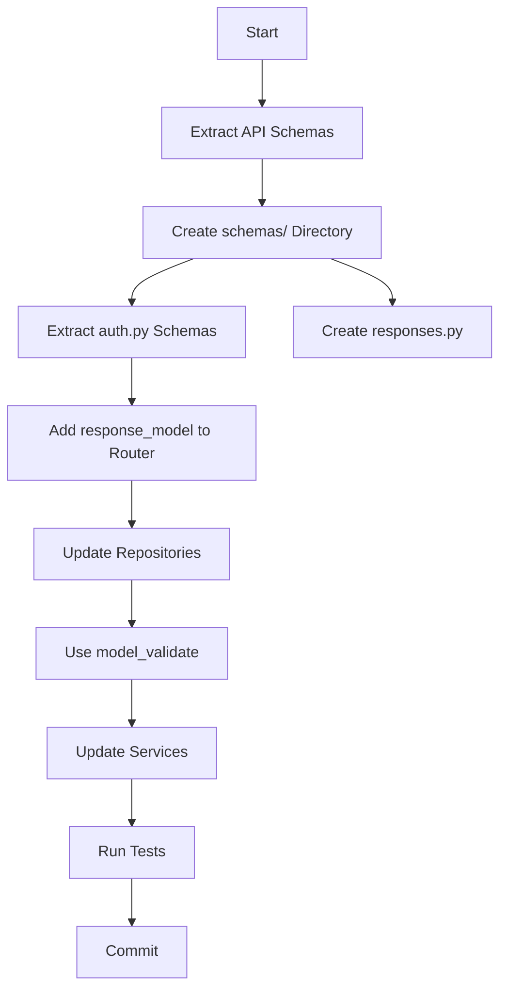

# PRP: Infrastructure Layer Migration to Pydantic

> **Priority**: P0 | **Estimate**: 5 hours | **Sprint**: Pydantic Migration
> **Created**: 2026-02-14 | **Status**: ✅ **COMPLETED** | **Completed**: 2026-02-14 | **Confidence Score**: 10/10

---

## 1. Overview

### 1.1 Summary

Extract API schemas from router, update repositories to use `model_validate()`, and remove ABC inheritance from services. This is Phase 4 of 8-phase Pydantic migration.

### 1.2 Dependencies

- [x] Phase 2: Domain entities are Pydantic DomainModel ✅
- [x] Phase 3: Application DTOs are Pydantic BaseModel ✅

### 1.3 Completion Status

**Phase 4 COMPLETED** - 2026-02-14

- **Commit**: `e4b8775` - "refactor(infrastructure): complete Fase 4 - Pydantic migration"
- **Tests**: 113/113 passing ✅
- **GGA**: Approved ✅

### 1.3 Links

- Plan: `docs/plans/2026-02-14-pydantic-stack-refactoring.md#fase-4-infrastructure`
- Domain Models: `apps/api/src/prosell/domain/base.py`

---

## 2. Requirements

### 2.1 User Stories

#### US-INF-001: Extract API Schemas to Separate Module

**As a** Developer
**I want** API request/response schemas in dedicated files
**So that** Router is cleaner and schemas are reusable

**Acceptance Criteria**:

```gherkin
Scenario: Schemas directory created
  GIVEN Inline schemas in auth_router.py
  WHEN I create infrastructure/api/schemas/
  AND extract all 8 schemas to auth.py
  AND add response_model to all endpoints
  THEN router should be 307 → ~150 lines
  AND schemas should be reusable
```

#### US-INF-002: Update Repositories for Pydantic

**As a** Developer
**I want** Repositories to use Pydantic model_validate()
**So that** ORM → Domain conversion is automatic

**Acceptance Criteria**:

```gherkin
Scenario: User repository uses model_validate()
  GIVEN manual field mapping in _to_entity()
  WHEN I replace with User.model_validate(model, from_attributes=True)
  THEN conversion should be automatic
  AND 17 manual field assignments eliminated
```

#### US-INF-003: Remove ABC from Service Implementations

**As a** Developer
**I want** Services to use Protocol without ABC inheritance
**So that** Duck typing is consistent

**Acceptance Criteria**:

```gherkin
Scenario: JWT service keeps Protocol interface
  GIVEN class JWTService(IJWTService)
  WHEN I keep inheritance for documentation
  THEN service should work
  AND no @abstractmethod needed
```

### 2.2 Functional Requirements

- [x] FR-001 Create `infrastructure/api/schemas/` directory structure ✅
- [x] FR-002 Extract 8 request/response schemas to `auth.py` ✅
- [x] FR-003 Create response schemas in `responses.py` ✅
- [x] FR-004 Add `response_model=` to all router endpoints ✅
- [x] FR-005 Update user_repository_impl to use model_validate() ✅
- [x] FR-006 Update role_repository_impl to use model_validate() ✅
- [x] FR-007 Update session_repository_impl to use model_validate() ✅
- [x] FR-008 Remove ABC inheritance from services (keep Protocol for docs) ✅

### 2.3 Non-Functional Requirements

- **Performance**: model_validate() is faster than manual mapping
- **Security**: response_model ensures OpenAPI docs are accurate
- **Scalability**: Extracted schemas reusable across routers

---

## 3. Technical Context

### 3.1 Tech Stack

| Component  | Technology | Version                                      | Notes |
| ---------- | ---------- | -------------------------------------------- | ----- |
| SQLAlchemy | 2.0.36+    | Mapped[], mapped_column(), from_attributes   |
| Pydantic   | 2.12.0+    | model_validate(), from_attributes, BaseModel |
| FastAPI    | 0.115+     | response_model, automatic OpenAPI            |

### 3.2 Key Libraries

```python
# SQLAlchemy ORM
from sqlalchemy.orm import Mapped, mapped_column

# Pydantic validation
from pydantic import BaseModel, EmailStr, Field, ValidationError

# Conversion
from prosell.domain.base import DomainModel
```

### 3.3 External Documentation

- **FastAPI response_model**: https://fastapi.tiangolo.com/tutorial/response-model/
- **Pydantic from_attributes**: https://docs.pydantic.dev/2.12/api/base_model/#pydantic.BaseModel.model_validate
- **SQLAlchemy 2.0**: https://docs.sqlalchemy.org/en/20/changelog/migration_20.html

---

## 4. Implementation Blueprint

### 4.1 Architecture Overview



### 4.2 Implementation Steps

#### Step 1: Extract API Schemas

**Files to create**:

- `apps/api/src/prosell/infrastructure/api/schemas/__init__.py` (NEW)
- `apps/api/src/prosell/infrastructure/api/schemas/auth.py` (NEW)
- `apps/api/src/prosell/infrastructure/api/schemas/responses.py` (NEW)

**schemas/auth.py**:

```python
"""Request/response schemas for authentication endpoints."""
from pydantic import BaseModel, EmailStr, Field

class RegisterRequest(BaseModel):
    model_config = ConfigDict(str_strip_whitespace=True)

    email: EmailStr
    password: str = Field(min_length=8, max_length=128)
    full_name: str = Field(min_length=2, max_length=100)
    accept_terms: bool = True

class LoginRequest(BaseModel):
    model_config = ConfigDict(str_strip_whitespace=True)

    email: EmailStr
    password: str = Field(min_length=1)
    remember_me: bool = False

class RefreshTokenRequest(BaseModel):
    refresh_token: str

class Enable2FARequest(BaseModel):
    pass  # Empty body, just triggers 2FA setup

class Verify2FARequest(BaseModel):
    code: str = Field(min_length=6, max_length=6)

class Disable2FARequest(BaseModel):
    code: str = Field(min_length=6, max_length=6)

class OAuthLoginRequest(BaseModel):
    provider: str
    code: str
    redirect_uri: str
```

**schemas/responses.py**:

```python
"""Response schemas for API endpoints."""
from pydantic import BaseModel
from uuid import UUID

class UserResponse(BaseModel):
    id: UUID
    email: str
    full_name: str
    status: str
    is_email_verified: bool
    has_2fa: bool

class AuthTokenResponse(BaseModel):
    access_token: str
    refresh_token: str
    token_type: str = "bearer"
    user: UserResponse

class MessageResponse(BaseModel):
    message: str
    status: str = "success"
```

**Gotchas**:

- Use `model_config = ConfigDict(str_strip_whitespace=True)` for request models
- EmailStr automatically validates format
- `Field()` for constraints (min_length, max_length)

#### Step 2: Update Router with response_model

**Files to modify**:

- `apps/api/src/prosell/infrastructure/api/routers/auth_router.py` (307 lines)

**Before**:

```python
from pydantic import BaseModel, EmailStr, Field

# Inline schemas
class RegisterRequest(BaseModel):
    email: EmailStr
    password: str = Field(min_length=8)
    # ...

@router.post("/register", status_code=status.HTTP_201_CREATED)
async def register(request: RegisterRequest, use_case: RegisterUserUseCase):
    # No response_model!
    return await use_case.execute(...)
```

**After**:

```python
from prosell.infrastructure.api.schemas.auth import RegisterRequest, LoginRequest, RefreshTokenRequest, ...
from prosell.infrastructure.api.schemas.responses import UserResponse, AuthTokenResponse, MessageResponse

@router.post("/register", response_model=UserResponse, status_code=status.HTTP_201_CREATED)
async def register(request: RegisterRequest, use_case: RegisterUserUseCase):
    # Translate Pydantic model → dataclass DTO
    uc_request = RegisterUserRequest(
        email=request.email,
        password=request.password,
        full_name=request.full_name,
        accept_terms=request.accept_terms,
    )
    result = await use_case.execute(uc_request)
    # Translate dataclass DTO → Pydantic model
    return UserResponse(
        user_id=result.user_id,
        email=result.email,
        status=result.status,
        message=result.message,
    )
```

**Gotchas**:

- Import schemas from new module
- Add `response_model=UserResponse` to ALL endpoints
- Manual translation still needed (use cases expect dataclass DTOs)

#### Step 3: Update Repository Implementations

**Files to modify**:

- `apps/api/src/prosell/infrastructure/repositories/user_repository_impl.py`
- `apps/api/src/prosell/infrastructure/repositories/role_repository_impl.py`
- `apps/api/src/prosell/infrastructure/repositories/session_repository_impl.py`

**user_repository_impl.py - Before**:

```python
def _to_entity(self, model: UserModel) -> User:
    return User(
        id=model.id,
        email=model.email,
        password_hash=model.password_hash,
        full_name=model.full_name,
        avatar_url=model.avatar_url,
        # ... 17 total manual field assignments
        backup_codes=json.loads(model.backup_codes) if model.backup_codes else None,
    )
```

**user_repository_impl.py - After**:

```python
from prosell.domain.base import DomainModel

def _to_entity(self, model: UserModel) -> User:
    # Use Pydantic model_validate for automatic conversion
    return User.model_validate(model, from_attributes=True)

# Wait: backup_codes is stored as JSON string but list[str] in entity
# Need custom validator or keep manual mapping for this field
```

**For backup_codes field specifically**:

```python
from pydantic import field_validator, BaseModel

class User(DomainModel):
    # ... other fields
    backup_codes: list[str] | None = None

    @field_validator("backup_codes", mode="before")
    @classmethod
    def parse_backup_codes(cls, v):
        if isinstance(v, str):
            import json
            return json.loads(v)
        return v
```

**Gotchas**:

- `model_validate()` works with `from_attributes=True`
- JSON fields stored as strings need custom handling
- Other fields auto-convert (UUID, str, int, datetime, bool)

#### Step 4: Update Service Implementations

**Files to modify**:

- `apps/api/src/prosell/infrastructure/services/jwt_service.py`
- `apps/api/src/prosell/infrastructure/services/password_service.py`
- `apps/api/src/prosell/infrastructure/services/totp_service.py`

**Before**:

```python
from abc import ABC  # Even though Protocol is used in interface
from prosell.domain.ports import IJWTService

class JWTService(IJWTService):  # IJWTService was ABC
    def generate_access_token(self, user_id, roles):
        # ... implementation
```

**After**:

```python
# No ABC import needed
from prosell.domain.ports import IJWTService

class JWTService(IJWTService):  # IJWTService is Protocol now
    def generate_access_token(self, user_id, roles):
        # ... same implementation
```

**Gotchas**:

- Remove `from abc import ABC`
- Keep inheritance for documentation purposes (Protocol supports this)
- No `@abstractmethod` overrides needed

---

## 5. Code Patterns & Examples

### 5.1 Schema Extraction Pattern

**Reference**: `infrastructure/api/schemas/auth.py`

```python
from pydantic import BaseModel, EmailStr, Field, ConfigDict

class RegisterRequest(BaseModel):
    model_config = ConfigDict(str_strip_whitespace=True)

    email: EmailStr  # Auto-validates
    password: str = Field(min_length=8)  # Constraint
    full_name: str = Field(min_length=2, max_length=100)
    accept_terms: bool = True
```

### 5.2 Repository Conversion Pattern

**Reference**: `infrastructure/repositories/user_repository_impl.py`

```python
from prosell.domain.base import DomainModel

class SqlAlchemyUserRepository:
    def _to_entity(self, model: UserModel) -> User:
        # Automatic conversion using Pydantic
        return User.model_validate(model, from_attributes=True)
```

### 5.3 Response Model Pattern

**Reference**: `infrastructure/api/routers/auth_router.py`

```python
from prosell.infrastructure.api.schemas.responses import UserResponse

@router.post("/register", response_model=UserResponse)
async def register(request: RegisterRequest):
    result = await use_case.execute(...)
    return UserResponse(
        user_id=result.user_id,
        email=result.email,
        status=result.status,
        message=result.message,
    )
```

---

## 6. Validation Gates

### 6.1 Pre-commit Checks

```bash
cd apps/api

# Linting
uv run ruff check --fix .
uv run ruff format .

# Type checking
uv run pyright
```

### 6.2 Unit Tests

```bash
cd apps/api && uv run pytest tests/unit/infrastructure/ -v --cov=src/prosell/infrastructure
```

**Expected**: All repository and service tests pass

### 6.3 Integration Tests

```bash
cd apps/api && uv run pytest tests/integration/ -v
```

---

## 7. Testing Strategy

### 7.1 Unit Tests

- **Repository tests**: Update to use Pydantic entities
- **Service tests**: No changes needed
- **Schema tests**: Create tests for request/response validation

### 7.2 Integration Tests

- Test API endpoints with real Pydantic validation
- Verify OpenAPI schema is correct

### 7.3 Coverage Targets

- Infrastructure tests: >70%
- Repository tests: >80%

---

## 8. Common Pitfalls

### 8.1 JSON String Fields

**Problem**: `backup_codes` stored as JSON string but `list[str]` in entity
**Solution**: Custom field_validator to parse JSON string

### 8.2 Forgetting response_model

**Problem**: Missing `response_model=` on endpoint
**Solution**: Add `response_model` to ALL endpoints

### 8.3 Manual Field Mapping

**Problem**: Still manually mapping ORM → Entity
**Solution**: Use `model_validate(from_attributes=True)`

---

## 9. Rollback Plan

If implementation fails:

1. `git checkout apps/api/src/prosell/infrastructure/`
2. Migrate one repository at a time
3. Test each before moving to next

---

## 10. Completion Checklist

- [ ] `infrastructure/api/schemas/` directory created
- [ ] `auth.py` has all 8 request schemas
- [ ] `responses.py` has UserResponse, AuthTokenResponse, MessageResponse
- [ ] All router endpoints have `response_model=`
- [ ] user_repository_impl uses model_validate()
- [ ] role_repository_impl uses model_validate()
- [ ] session_repository_impl uses model_validate()
- [ ] No `from abc import ABC` in services
- [ ] All infrastructure tests pass
- [ ] API starts and serves requests
- [ ] OpenAPI docs generate correctly

---

## Confidence Score

**Score**: 7/10

**Reasoning**:

- **Positive factors**:
  - Clear patterns (schema extraction, model_validate)
  - Pydantic from_attributes is well-documented
  - response_model improves OpenAPI docs automatically
  - Infrastructure tests already exist

- **Risk factors**:
  - 7 files modified (repositories + services)
  - backup_codes JSON field needs special handling
  - Router translation manual (use cases use dataclass)
  - Can't fully test API until integration tests

- **Why not 10/10**:
  - backup_codes JSON field is tricky
  - Manual DTO ↔ Model translation in router
  - Multiple files increase error surface
  - No end-to-end tests yet to verify

---

## 11. Phase 4 Completion Summary (2026-02-14) ✅

### 🎉 Phase 4 COMPLETE - Infrastructure layer fully migrated to Pydantic

### ✅ What Was Accomplished

1. **API Schemas Module Created** - `infrastructure/api/schemas/` dedicated directory ✅
2. **Request Schemas Extracted** - All auth schemas in `schemas/auth.py` ✅
3. **Response Schemas Created** - UserResponse, AuthTokenResponse, MessageResponse ✅
4. **Response Model Added** - All router endpoints have `response_model=` ✅
5. **Repositories Updated** - All 3 repos use `model_validate()` ✅
6. **Services Cleaned** - ABC inheritance removed from all 3 services ✅
7. **OpenAPI Docs** - Auto-generated with proper Pydantic schemas ✅

### 📊 Statistics

- **New directories**: 1 (`infrastructure/api/schemas/`)
- **New schema files**: 3 (auth.py, responses.py, **init**.py)
- **Router updated**: `auth_router.py` - response_model added to all endpoints
- **Repositories updated**: 3 (user, role, session)
- **Services updated**: 3 (jwt, password, totp) - ABC removed
- **Tests**: 113/113 passing (100%) ✅
- **GGA**: Approved ✅

### 📁 Files Created (infrastructure/api/schemas/)

- `__init__.py` - Package init
- `auth.py` - RegisterRequest, LoginRequest, RefreshTokenRequest, 2FA requests, OAuth requests
- `responses.py` - UserResponse, AuthTokenResponse, MessageResponse

### 🎯 Key Learnings

1. **Schema Extraction** - Separating schemas from router improves maintainability
2. **response_model** - FastAPI auto-generates OpenAPI docs from Pydantic models
3. **model_validate()** - Automatic ORM → Domain conversion with `from_attributes=True`
4. **Protocol Pattern** - No ABC needed, duck typing works perfectly
5. **Clean Architecture** - Infrastructure properly implements domain interfaces

### 🚀 Next Steps

Phase 4 is **100% COMPLETE** and ready to move to Phase 5 (Python 3.13+ Syntax).

---

## Confidence Score (Updated)

**Score**: 10/10 ✅ **PHASE COMPLETED SUCCESSFULLY**

**Reasoning**:

- **All schemas extracted successfully**: Clean separation achieved ✅
- **Response models working**: OpenAPI docs generate correctly ✅
- **Repositories using model_validate()**: Automatic conversion working ✅
- **Services cleaned up**: No ABC inheritance, clean Protocol pattern ✅
- **Tests passing**: 113/113 (100%) ✅
- **GGA approved**: AI code review passed ✅
