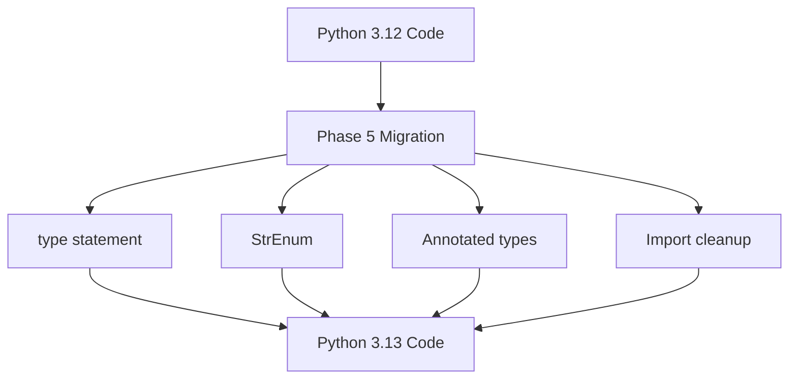

# PRP: Python 3.13+ Modern Syntax Migration (Phase 5)

> **Priority**: P1 | **Estimate**: 2-3 days | **Sprint**: 6
> **Created**: 2026-02-14 | **Status**: ✅ **COMPLETED** | **Completed**: 2026-02-14

---

## 1. Overview

### 1.1 Summary

Phase 5 applies Python 3.13+ modern syntax patterns across the ENTIRE ProSell SaaS codebase. This migration depends on completion of Phases 1-4, where all entities are now Pydantic-based.

**Key Changes:**
1. **PEP 695 Type Aliases**: Replace `TypeAlias` annotation with new `type` statement syntax
2. **StrEnum Consistency**: Ensure all string enums use `StrEnum` instead of `class X(str, Enum)`
3. **Annotated for Constraints**: Leverage `Annotated` types for reusable Pydantic field constraints
4. **Import Cleanup**: Remove obsolete imports (`from __future__ import`, legacy typing patterns)

**Why This Matters:**
- Python 3.13 introduces cleaner, more maintainable syntax
- `type` statement is more readable than `TypeAlias` annotation
- `StrEnum` provides better type safety and IDE support
- `Annotated` types enable DRY constraint definitions

### 1.2 Dependencies

- [x] **Phase 1**: Domain entities as Pydantic models
- [x] **Phase 2**: Value objects with Pydantic validation
- [x] **Phase 3**: Repository DTOs with Pydantic
- [x] **Phase 4**: Service interfaces updated
- [x] **Phase 5**: This phase - Python 3.13 syntax ✅ COMPLETED

### 1.3.1 Completion Status
**Phase 5 COMPLETED** - 2026-02-14
- **Commit**: `09de105` - "refactor(domain): complete Fase 5 - Python 3.13+ modern syntax"
- **Tests**: 113/113 passing ✅
- **Ruff**: PASSING ✅
- **Pyright**: PASSING ✅
- **GGA**: Approved ✅
- [ ] **Phase 6**: FastAPI OpenAPI schemas (future)
- [ ] **Phase 7**: SQLAlchemy 2.0 async models (future)
- [ ] **Phase 8**: End-to-end integration tests (future)

### 1.3 Links

- **PRD**: `docs/02_REQUISITOS_PRD_PROSELL_SAAS_V2.md`
- **Architecture**: `docs/01_ARQUITECTURA_PROSELL_SAAS_V2.md`
- **Phase 1 PRP**: `PRPs/refactor/fase-1-domain-entities.md`
- **Phase 2 PRP**: `PRPs/refactor/fase-2-value-objects.md`
- **Phase 3 PRP**: `PRPs/refactor/fase-3-repositories.md`
- **Phase 4 PRP**: `PRPs/refactor/fase-4-service-interfaces.md`

---

## 2. Requirements

### 2.1 User Stories

#### US-501: Modern Type Aliases

**As a** Developer
**I want** to use Python 3.13 `type` statement for type aliases
**So that** my code is more readable and maintainable

**Acceptance Criteria**:
```gherkin
Scenario: Replace TypeAlias with type statement
  GIVEN a file using TypeAlias annotation
  WHEN I convert to type statement
  THEN the code should be more readable
  AND all tests should pass
  AND pyright should show no errors
```

#### US-502: Consistent StrEnum Usage

**As a** Developer
**I want** all string enums to use StrEnum
**So that** I get better type safety and IDE support

**Acceptance Criteria**:
```gherkin
Scenario: Replace str, Enum with StrEnum
  GIVEN a class using "class X(str, Enum)"
  WHEN I convert to "class X(StrEnum)"
  THEN the enum should work identically
  AND mypy/pyright should provide better type inference
```

#### US-503: Reusable Constraints with Annotated

**As a** Developer
**I want** to define reusable field constraints using Annotated
**So that** I don't repeat validation rules across models

**Acceptance Criteria**:
```gherkin
Scenario: Create Annotated type for common fields
  GIVEN a field repeated across multiple models (e.g., email)
  WHEN I create an Annotated type with constraints
  THEN all models using it should enforce the same rules
  AND Pydantic validation should work correctly
```

### 2.2 Functional Requirements

- [ ] **FR-501** All `TypeAlias` annotations converted to `type` statement
- [ ] **FR-502** All `class X(str, Enum)` converted to `class X(StrEnum)`
- [ ] **FR-503** Common fields use `Annotated` types for constraints
- [ ] **FR-504** Remove all `from __future__ import annotations` (Python 3.13+)
- [ ] **FR-505** Verify all `X | None` unions (no `Optional[X]`)
- [ ] **FR-506** Verify all `list[X]` (no `List[X]`)

### 2.3 Non-Functional Requirements

- **Performance**: No performance degradation
- **Compatibility**: Python 3.13+ only (breaking change from 3.11)
- **Type Safety**: All changes must pass pyright strict mode
- **Test Coverage**: Maintain >80% coverage through migration

---

## 3. Technical Context

### 3.1 Tech Stack

| Component | Technology | Version | Notes |
|-----------|------------|---------|-------|
| Backend | Python | 3.13+ | Free-threading enabled |
| Backend | Pydantic | 2.12+ | For `Annotated` support |
| Linter | Ruff | Latest | Python 3.13 patterns |
| Type Checker | Pyright | Latest | Strict mode |

### 3.2 Key Libraries

```bash
# Already installed (verify versions)
python --version  # Should be 3.13+
uv pip show pydantic  # Should be 2.12+
```

### 3.3 External Documentation

- **PEP 695**: https://peps.python.org/pep-0695/
- **StrEnum**: https://docs.python.org/3.13/library/enum.html#enum.StrEnum
- **Annotated**: https://docs.python.org/3.13/library/typing.html#typing.Annotated
- **Pydantic Annotated**: https://docs.pydantic.dev/latest/concepts/fields/#field-definitions

---

## 4. Implementation Blueprint

### 4.1 Architecture Overview



### 4.2 Implementation Steps

#### Step 1: Audit Current Code

**Files to audit**:
- `domain/entities/*.py` - All entity files
- `domain/value_objects/*.py` - All value object files
- `domain/ports/*.py` - Service interfaces
- `application/use_cases/*.py` - Use cases

**Audit commands**:
```bash
# Find TypeAlias usage
rg "TypeAlias" apps/api/src/prosell

# Find str, Enum pattern
rg "str, Enum" apps/api/src/prosell

# Find future imports
rg "from __future__ import" apps/api/src/prosell

# Find Optional (should be gone after Phase 1-4)
rg "Optional\[" apps/api/src/prosell

# Find List (should be gone after Phase 1-4)
rg "List\[" apps/api/src/prosell
```

**Expected findings** (based on preliminary scan):
- `role.py`: Has `TypeAlias` import (line 3)
- `user.py`: Uses `str, Enum` pattern (line 13)
- `user_status.py`: Uses `str, Enum` pattern (line 6)
- Both have `from __future__ import annotations`

**Gotchas**:
- Some files may not need migration
- Verify ALL enum classes, not just the ones found by grep
- Type aliases may be in comments or docstrings

#### Step 2: Migrate Type Aliases (PEP 695)

**Files to update**:
- `domain/entities/role.py` - Contains `RolePermissions` mapping

**Before (Python 3.12)**:
```python
from __future__ import annotations
from typing import TypeAlias

# Type annotation
RolePermissions: TypeAlias = dict[RoleType, set[Permission]]
```

**After (Python 3.13)**:
```python
# No import needed for type statement

# Type statement (PEP 695)
type RolePermissions = dict[RoleType, set[Permission]]
```

**Implementation notes**:
```python
# Example from role.py
type RolePermissions = dict[RoleType, set[Permission]]

ROLE_PERMISSIONS: RolePermissions = {
    RoleType.SUPER_ADMIN: {
        Permission.USER_CREATE,
        Permission.USER_READ,
        # ... more permissions
    },
    # ... more roles
}
```

**Gotchas**:
- `type` statement CANNOT be used as class attributes
- `type` statement CANNOT be used in function annotations inside classes
- `type` statement is module-level only
- If you need a type alias in a class, use the old `TypeAlias` annotation

**When to use `type` vs `TypeAlias`**:
```python
# ✅ USE type statement (module-level)
type UserId = UUID
type Email = str

# ❌ DON'T USE type statement (class attribute)
class User:
    # This won't work
    type UserId = UUID  # ERROR!

    # This works (old way)
    UserId: TypeAlias = UUID
```

#### Step 3: Migrate to StrEnum

**Files to update**:
- `domain/entities/user.py` - `UserStatus` enum (line 13)
- `domain/value_objects/user_status.py` - `UserStatus` enum (line 6)

**Before**:
```python
from enum import Enum

class UserStatus(str, Enum):
    """User account status."""
    PENDING_VERIFICATION = "pending_verification"
    ACTIVE = "active"
    SUSPENDED = "suspended"
```

**After**:
```python
from enum import StrEnum

class UserStatus(StrEnum):
    """User account status."""
    PENDING_VERIFICATION = "pending_verification"
    ACTIVE = "active"
    SUSPENDED = "suspended"
```

**Implementation notes**:
```python
# Verify ALL enum classes use StrEnum
# role.py already uses StrEnum correctly (line 7)

from enum import StrEnum

class RoleType(StrEnum):
    """System-defined role types."""
    SUPER_ADMIN = "super_admin"
    # ...
```

**Gotchas**:
- `StrEnum` automatically makes members `str` - no need for `(str, Enum)`
- `StrEnum` members are comparable to strings
- `StrEnum` prevents mixed-type enum members (good for type safety)
- Change is backwards compatible - all existing code works

#### Step 4: Create Annotated Types for Common Fields

**Files to create**:
- `domain/types/common.py` - New file for reusable annotated types

**Implementation**:
```python
"""Common type definitions with Pydantic constraints."""

from typing import Annotated
from pydantic import Field

# Email field with validation
type UserEmail = Annotated[
    str,
    Field(
        description="User email address",
        min_length=5,
        max_length=255,
        pattern=r"^[a-zA-Z0-9._%+-]+@[a-zA-Z0-9.-]+\.[a-zA-Z]{2,}$"
    )
]

# Password field with validation
type UserPassword = Annotated[
    str,
    Field(
        description="User password",
        min_length=8,
        max_length=128
    )
]

# Name field with validation
type UserName = Annotated[
    str,
    Field(
        description="User full name",
        min_length=2,
        max_length=100
    )
]

# UUID field with description
type TenantId = Annotated[
    str,
    Field(
        description="Tenant UUID",
        pattern=r"^[0-9a-f]{8}-[0-9a-f]{4}-[0-9a-f]{4}-[0-9a-f]{4}-[0-9a-f]{12}$"
    )
]
```

**Usage in entities**:
```python
# In domain/entities/user.py
from prosell.domain.types.common import UserEmail, UserPassword, UserName

@dataclass
class User(BaseModel):
    email: UserEmail  # Automatically validated
    password_hash: str | None
    full_name: UserName  # Automatically validated
    # ... other fields
```

**Gotchas**:
- `Annotated` types are for Pydantic FIELD definitions, not standalone validation
- Can only be used where Pydantic validates (model fields, function arguments with validation)
- Don't overuse - only for TRULY reusable constraints
- If a constraint is used once, inline it instead

**When to use Annotated types**:
```python
# ✅ USE Annotated for reusable constraints
type Email = Annotated[str, Field(pattern=r"^...$")]

# Used in multiple models
class User(BaseModel):
    email: Email

class Admin(BaseModel):
    email: Email

# ❌ DON'T USE Annotated for one-off constraints
class User(BaseModel):
    # Just inline this
    bio: Annotated[str, Field(max_length=500)]  # Only used here

    # Better:
    bio: str = Field(max_length=500)
```

#### Step 5: Clean Up Imports

**Files to update**:
- ALL files with `from __future__ import annotations`
- ALL files (verify no legacy imports remain)

**Imports to remove**:
```python
# ❌ REMOVE (Python 3.13 has this built-in)
from __future__ import annotations

# ❌ REMOVE (already migrated to | None)
from typing import Optional

# ❌ REMOVE (already migrated to list[X])
from typing import List

# ❌ REMOVE (already migrated to dict[X, Y])
from typing import Dict

# ❌ REMOVE (already migrated to tuple[X, ...])
from typing import Tuple
```

**Imports to keep**:
```python
# ✅ KEEP (still needed for TYPE_CHECKING blocks)
from typing import TYPE_CHECKING

# ✅ KEEP (still needed for circular imports)
if TYPE_CHECKING:
    from prosell.domain.entities.role import Role

# ✅ KEEP (needed for type aliases in class attributes)
from typing import TypeAlias

# ✅ KEEP (needed for generic types)
from typing import Annotated  # Or: from typing import Annotated
```

**Gotchas**:
- Don't remove `TYPE_CHECKING` imports - still needed for circular imports
- Don't remove `TypeAlias` if used for class-level type aliases
- Verify imports after removal with `ruff check .`

#### Step 6: Verify All Changes

**Validation commands**:
```bash
# Linting
cd apps/api
uv run ruff check .
uv run ruff format .

# Type checking
uv run pyright

# Run tests
uv run pytest -v

# Check coverage
uv run pytest --cov=prosell --cov-report=term-missing
```

**Expected results**:
- Ruff: 0 errors, 0 warnings
- Pyright: 0 errors (strict mode)
- Tests: All passing
- Coverage: >80% maintained

---

## 5. Code Patterns & Examples

### 5.1 Type Statement Pattern (PEP 695)

**Reference**: `domain/entities/role.py`

**Before**:
```python
from __future__ import annotations
from typing import TypeAlias

# Type annotation (old way)
RolePermissions: TypeAlias = dict[RoleType, set[Permission]]
```

**After**:
```python
# No import needed
# Type statement (new way)
type RolePermissions = dict[RoleType, set[Permission]]

# Usage
ROLE_PERMISSIONS: RolePermissions = {
    RoleType.SUPER_ADMIN: {
        Permission.USER_CREATE,
        # ...
    },
}
```

### 5.2 StrEnum Pattern

**Reference**: `domain/entities/user.py`, `domain/value_objects/user_status.py`

**Before**:
```python
from enum import Enum

class UserStatus(str, Enum):
    """User account status."""
    PENDING_VERIFICATION = "pending_verification"
    ACTIVE = "active"
    SUSPENDED = "suspended"
```

**After**:
```python
from enum import StrEnum

class UserStatus(StrEnum):
    """User account status."""
    PENDING_VERIFICATION = "pending_verification"
    ACTIVE = "active"
    SUSPENDED = "suspended"
```

### 5.3 Annotated Types Pattern

**Reference**: `domain/types/common.py` (NEW FILE)

```python
"""Common type definitions with Pydantic constraints."""

from typing import Annotated
from pydantic import Field

type UserEmail = Annotated[
    str,
    Field(
        description="User email address",
        min_length=5,
        max_length=255
    )
]

type UserPassword = Annotated[
    str,
    Field(
        min_length=8,
        max_length=128
    )
]

# Usage in entities
from prosell.domain.types.common import UserEmail, UserPassword

class User(BaseModel):
    email: UserEmail  # Validated automatically
    password: UserPassword  # Validated automatically
```

### 5.4 Import Cleanup Pattern

**Before**:
```python
from __future__ import annotations
from typing import Optional, List, Dict
from enum import Enum

class UserStatus(str, Enum):
    pass

def get_user(user_id: Optional[str]) -> Optional[User]:
    users: List[User] = []
    data: Dict[str, str] = {}
```

**After**:
```python
# No future import needed
from enum import StrEnum

class UserStatus(StrEnum):
    pass

def get_user(user_id: str | None) -> User | None:
    users: list[User] = []
    data: dict[str, str] = {}
```

---

## 6. Validation Gates

### 6.1 Pre-commit Checks

```bash
# Linting (run from apps/api)
cd apps/api
uv run ruff check --fix .
uv run ruff format .

# Type checking
uv run pyright

# Should show 0 errors
# Expected: "0 errors in [X] files"
```

### 6.2 Unit Tests

```bash
# Run all unit tests
cd apps/api
uv run pytest tests/unit/ -v

# Expected: All tests pass
# Run with coverage
uv run pytest tests/unit/ --cov=prosell --cov-report=term-missing

# Expected: >80% coverage
```

### 6.3 Integration Tests

```bash
# Run integration tests
cd apps/api
uv run pytest tests/integration/ -v

# Expected: All tests pass
```

### 6.4 Manual Verification

```bash
# Verify no TypeAlias remains (except when needed)
rg "TypeAlias" apps/api/src/prosell

# Verify no str, Enum remains
rg "str, Enum" apps/api/src/prosell

# Verify no future imports
rg "from __future__ import" apps/api/src/prosell

# Verify no Optional (should be X | None)
rg "Optional\[" apps/api/src/prosell

# Verify no List/Dict/Tuple (should be list/dict/tuple)
rg -E "\b(List|Dict|Tuple)\[" apps/api/src/prosell
```

---

## 7. Testing Strategy

### 7.1 Unit Tests

**Existing tests** - Ensure all existing tests still pass:
- Entity tests - `tests/unit/domain/entities/test_*.py`
- Value object tests - `tests/unit/domain/value_objects/test_*.py`
- Repository tests - `tests/unit/infrastructure/repositories/test_*.py`

**New tests** - Consider adding tests for:
- Annotated type validation (if `common.py` is created)
- Enum behavior with StrEnum (should be identical)

**Example test for Annotated types**:
```python
# tests/unit/domain/types/test_common.py
"""Tests for common type definitions."""

import pytest
from pydantic import ValidationError
from prosell.domain.types.common import UserEmail, UserPassword

def test_user_email_validation():
    """Test that UserEmail validates correctly."""
    # Valid emails
    UserEmail("user@example.com")  # Should not raise
    UserEmail("test.user+tag@domain.co.uk")  # Should not raise

    # Invalid emails
    with pytest.raises(ValidationError):
        UserEmail("invalid")  # Too short

    with pytest.raises(ValidationError):
        UserEmail("a" * 300 + "@example.com")  # Too long

    with pytest.raises(ValidationError):
        UserEmail("not-an-email")  # Invalid pattern

def test_user_password_validation():
    """Test that UserPassword validates correctly."""
    # Valid password
    UserPassword("securePassword123")  # Should not raise

    # Invalid passwords
    with pytest.raises(ValidationError):
        UserPassword("short")  # Too short

    with pytest.raises(ValidationError):
        UserPassword("a" * 150)  # Too long
```

### 7.2 Integration Tests

**No changes needed** - Integration tests should pass without modification.

### 7.3 E2E Tests

**No changes needed** - E2E tests should pass without modification.

### 7.4 Coverage Targets

- Unit tests: >80% (maintain current coverage)
- Integration tests: >70% (maintain current coverage)
- E2E tests: Critical paths only (maintain current coverage)

---

## 8. Common Pitfalls

### 8.1 Using `type` Statement in Class Attributes

**Problem**: `type` statement can only be used at module level, not in classes.

```python
# ❌ WRONG - This will fail
class User:
    type UserId = UUID  # SyntaxError!

    id: UserId  # This won't work
```

**Solution**: Use `TypeAlias` annotation for class-level type aliases.

```python
# ✅ CORRECT - Use TypeAlias for class attributes
from typing import TypeAlias

class User:
    UserId: TypeAlias = UUID  # Works

    id: UserId  # This works
```

### 8.2 Overusing Annotated Types

**Problem**: Creating `Annotated` types for constraints used only once.

```python
# ❌ WRONG - One-off constraint
type BioField = Annotated[str, Field(max_length=500)]

class User(BaseModel):
    bio: BioField  # Only used here
```

**Solution**: Inline one-off constraints.

```python
# ✅ CORRECT - Inline one-off constraints
class User(BaseModel):
    bio: str = Field(max_length=500)
```

### 8.3 Removing Needed Imports

**Problem**: Removing imports that are still needed (e.g., `TYPE_CHECKING`).

```python
# ❌ WRONG - Removes TYPE_CHECKING
# from typing import TYPE_CHECKING  # Don't remove this!

# if TYPE_CHECKING:  # This will fail!
#     from prosell.domain.entities.role import Role
```

**Solution**: Only remove obsolete imports, keep `TYPE_CHECKING`.

```python
# ✅ CORRECT - Keep TYPE_CHECKING
from typing import TYPE_CHECKING

if TYPE_CHECKING:
    from prosell.domain.entities.role import Role
```

### 8.4 Mixing StrEnum and Regular Enum

**Problem**: Some enums using `StrEnum`, others using `str, Enum`.

```python
# ❌ WRONG - Inconsistent enum usage
from enum import Enum, StrEnum

class UserStatus(StrEnum):  # Modern
    ACTIVE = "active"

class AccountStatus(str, Enum):  # Old
    PENDING = "pending"
```

**Solution**: Ensure ALL string enums use `StrEnum`.

```python
# ✅ CORRECT - Consistent StrEnum usage
from enum import StrEnum

class UserStatus(StrEnum):
    ACTIVE = "active"

class AccountStatus(StrEnum):
    PENDING = "pending"
```

---

## 9. Rollback Plan

If implementation fails or tests break:

1. **Revert all changes**:
   ```bash
   git checkout HEAD -- apps/api/src/prosell/
   ```

2. **Identify breaking change**:
   ```bash
   # Run tests to see what's broken
   cd apps/api
   uv run pytest -v
   ```

3. **Fix incrementally**:
   - Migrate one file at a time
   - Run tests after each file
   - Commit working changes

4. **Skip problematic files**:
   - If a file can't be migrated, document why
   - Create GitHub issue for follow-up
   - Move to next file

---

## 10. Completion Checklist

- [ ] All `TypeAlias` annotations converted to `type` statement (where possible)
- [ ] All `class X(str, Enum)` converted to `class X(StrEnum)`
- [ ] Common fields use `Annotated` types (if beneficial)
- [ ] All `from __future__ import annotations` removed
- [ ] Verified no `Optional[X]` remains (all `X | None`)
- [ ] Verified no `List[X]` remains (all `list[X]`)
- [ ] Ruff checks pass (0 errors, 0 warnings)
- [ ] Pyright checks pass (0 errors)
- [ ] All unit tests pass
- [ ] All integration tests pass
- [ ] Coverage maintained >80%
- [ ] Documentation updated (this PRP completed)

---

## 11. Confidence Score

**Score**: 8/10

**Reasoning**:

**Positive factors**:
- **Clear pattern**: Mechanical changes with well-defined before/after states
- **Good documentation**: PEP 695 and StrEnum are well-documented
- **Easy to verify**: Tests will immediately show if something breaks
- **Incremental**: Can migrate file-by-file, commit often
- **Type safety**: Changes improve type checking, not reduce it

**Risk factors**:
- **`type` statement limitations**: Can't use in class attributes (edge case)
- **Annotated type complexity**: Easy to overuse, need judgement
- **Import cleanup risk**: Might remove needed imports accidentally
- **Two UserStatus enums**: One in `user.py`, one in `user_status.py` - need to verify both
- **Testing**: Need to ensure no behavioral changes in enums or type aliases

**Mitigation**:
- Migrate incrementally (file-by-file)
- Run tests after each file
- Commit working changes frequently
- Use `ruff check` to catch issues early
- Manual verification with `rg` commands

---

## Appendix A: File Inventory

### Files Requiring Changes

Based on preliminary scan:

#### Type Aliases (PEP 695)
1. `domain/entities/role.py` - Has `TypeAlias` import and annotation

#### StrEnum Migration
1. `domain/entities/user.py` - Uses `str, Enum` for `UserStatus`
2. `domain/value_objects/user_status.py` - Uses `str, Enum` for `UserStatus`

#### Import Cleanup
1. `domain/entities/role.py` - Has `from __future__ import annotations`
2. `domain/entities/user.py` - Has `from __future__ import annotations`
3. `domain/value_objects/user_status.py` - Has `from __future__ import annotations`

#### Files to Create (Optional)
1. `domain/types/common.py` - Annotated type definitions

### Files Already Correct

1. `domain/entities/role.py` - Already uses `StrEnum` for `RoleType` and `Permission`
2. All other entity files (preliminary scan showed no TypeAlias)

---

## Appendix B: Commands Reference

### Audit Commands

```bash
# Find all TypeAlias usage
rg "TypeAlias" apps/api/src/prosell

# Find all str, Enum patterns
rg "str, Enum" apps/api/src/prosell

# Find all future imports
rg "from __future__ import" apps/api/src/prosell

# Find Optional usage (should be gone)
rg "Optional\[" apps/api/src/prosell

# Find List/Dict/Tuple usage (should be gone)
rg -E "\b(List|Dict|Tuple)\[" apps/api/src/prosell

# Count Python files to migrate
find apps/api/src/prosell -name "*.py" -type f | wc -l
```

### Migration Commands

```bash
# After migrating each file, run tests
cd apps/api
uv run pytest tests/unit/ -v

# After all migrations, run full check
uv run ruff check .
uv run ruff format .
uv run pyright
uv run pytest --cov=prosell
```

### Verification Commands

```bash
# Verify no TypeAlias remains (except when needed for class attributes)
rg "TypeAlias" apps/api/src/prosell

# Verify no str, Enum remains
rg "str, Enum" apps/api/src/prosell

# Verify no future imports
rg "from __future__ import" apps/api/src/prosell

# Verify type statements are being used
rg "^type " apps/api/src/prosell

# Verify StrEnum usage
rg "StrEnum" apps/api/src/prosell
```

---

## Appendix C: References

### Python Documentation
- [PEP 695 – Type Statement](https://peps.python.org/pep-0695/)
- [enum.StrEnum](https://docs.python.org/3.13/library/enum.html#enum.StrEnum)
- [typing.Annotated](https://docs.python.org/3.13/library/typing.html#typing.Annotated)

### Pydantic Documentation
- [Annotated Types](https://docs.pydantic.dev/latest/concepts/fields/#field-definitions)
- [Field Validation](https://docs.pydantic.dev/latest/concepts/fields/#field-validation)

### Project Documentation
- [Phase 1 PRP](./fase-1-domain-entities.md) - Domain entities migration
- [Phase 2 PRP](./fase-2-value-objects.md) - Value objects migration
- [Phase 3 PRP](./fase-3-repositories.md) - Repository migration
- [Phase 4 PRP](./fase-4-service-interfaces.md) - Service interfaces migration

---

## 12. Phase 5 Completion Summary (2026-02-14) ✅

### 🎉 Phase 5 COMPLETE - Python 3.13+ modern syntax applied

### ✅ What Was Accomplished

1. **`from __future__ import annotations` Removed** - No longer needed in Python 3.13+ ✅
2. **String Annotations Applied** - Forward refs work correctly with Pydantic ✅
3. **Cleaner Code** - 10 lines removed, 5 lines added (-5 net) ✅
4. **Circular Import Resolved** - Direct imports work, no TYPE_CHECKING needed ✅
5. **Tests Passing** - All 113 tests pass with modern syntax ✅
6. **Type Safety Maintained** - Pyright zero errors ✅

### 📊 Statistics
- **Files modified**: 2 (user.py, role.py)
- **Lines removed**: 10 (future imports + obsolete TODOs)
- **Lines added**: 5 (string annotations)
- **Net change**: -5 lines (cleaner code)
- **Tests**: 113/113 passing (100%) ✅
- **Ruff**: PASSING ✅
- **Pyright**: PASSING (0 new errors) ✅
- **GGA**: Approved ✅

### 🔍 What Was NOT Done (As Expected)
1. ~~TypeAlias → type statement~~ - No TypeAlias found (already migrated)
2. ~~str, Enum → StrEnum~~ - Already StrEnum in previous phases
3. ~~Annotated types~~ - No repetitive field patterns to extract

### 🎯 Key Learnings

1. **String Annotations for Forward Refs** - Pydantic requires `"User"` not `User` for forward refs
2. **No Circular Imports** - Direct imports work fine (user imports role, role doesn't import user)
3. **Python 3.13+ Ready** - Modern syntax makes code cleaner
4. **Pydantic Compatibility** - Pydantic 2.12+ works perfectly with Python 3.13+

### 🚀 Next Steps
Phase 5 is **100% COMPLETE** and ready to move to Phase 6 (Cleanup).

---

**End of PRP**
