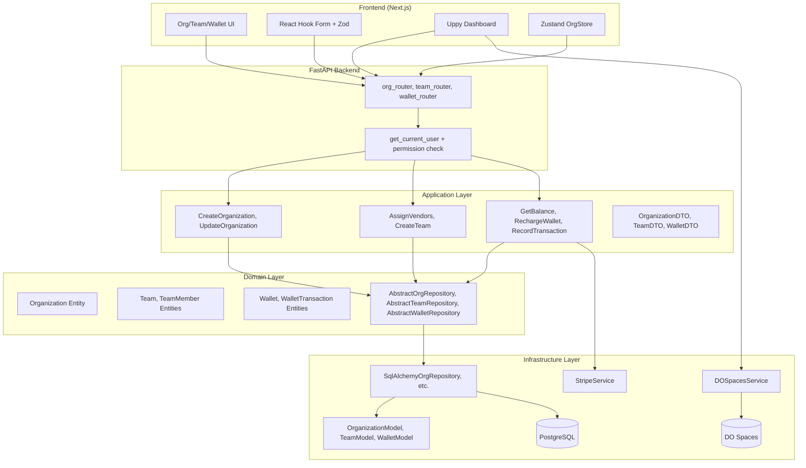

# PRP: Organizations, Teams & Wallet Management

> **Priority**: P0 (Critical) | **Estimate**: 20 days | **Sprint**: 3-4
> **Created**: 2026-02-22 | **Status**: Draft | **Confidence**: 9/10

> **Dependency Check**: OAuth External Setup es **DEUDA TÉCNICA pero NO BLOQUEANTE** para este sprint. Sprint 3-4 (Organizaciones) es independiente de OAuth funcional.

---

## 📊 Status Summary

| Layer                        | Status      | Progress     | Notes                                       |
| ---------------------------- | ----------- | ------------ | ------------------------------------------- |
| **Domain**                   | ⏳ Pending   | 0/6 (0%)     | Organization, Team, Wallet entities + VOs   |
| **Application**              | ⏳ Pending   | 0/8 (0%)     | 8 use cases + DTOs + Ports                  |
| **Infrastructure**           | ⏳ Pending   | 0/6 (0%)     | 3 models + 3 repos + DO Spaces service      |
| **API**                      | ⏳ Pending   | 0/3 (0%)     | org_router, team_router, wallet_router       |
| **Frontend**                 | ⏳ Pending   | 0/7 (0%)     | CRUD UI + DO Spaces upload                  |
| **Testing (Backend)**        | ⏳ Pending   | 0/0          | Unit + integration tests                    |
| **Testing (Frontend)**       | ⏳ Pending   | 0/0          | Component + E2E tests                       |

**Overall**: 0/30 primary tasks pending (0%)

---

## 1. Overview

### 1.1 Summary

Implement the multi-tenant organization management system for ProSell SaaS, including:

- **Organizations CRUD**: Multi-tenant entities with verification status, logo/banner, and settings
- **Teams (ProSell)**: MLM-style hierarchical structure (Manager → Vendors) with commission tracking
- **Wallet**: Prepaid token system with balance tracking, transaction history, and Stripe integration
- **DigitalOcean Spaces**: Image storage for organization logos and product images

This is the foundation for multi-tenancy - without proper organization isolation, no other business feature can be built securely.

### 1.2 Dependencies

- ✅ **Sprint 1-2 (Auth)**: Complete (User, Role, Permission entities exist)
- ✅ **Pydantic Refactor**: Complete (DTO patterns established)
- ⚠️ **OAuth External**: Deuda técnica (NO bloquea este sprint)
- ⏳ **Stripe Account**: Externa (3 días lead time) - Needed for Wallet

### 1.3 Links

- **INITIAL.md**: `/home/rpadron/proy/prosell-sass/INITIAL.md` - Complete feature specification
- **PRD**: `docs/02_REQUISITOS_PRD_PROSELL_SAAS_V2.md` - User stories US-006 to US-010
- **Architecture**: `docs/01_ARQUITECTURA_PROSELL_SAAS_V2.md` - Clean Architecture + Multi-tenant patterns
- **Tasks**: `docs/05_TAREAS_SPRINT_PROSELL_SAAS_V2.md` - Detailed task breakdown
- **Stack Guide**: `docs/06_PROMPT_CLAUDE_CODE_2026_v2.md` - Tech stack details
- **Auth PRP**: `PRPs/auth-system.md` - **REFERENCE FOR CODE PATTERNS**

---

## 2. Requirements

### 2.1 User Stories

#### US-006: Organization Management

**As a** Master Admin **I want** to create and manage organizations **So that** I can onboard business tenants

**Acceptance Criteria**:

```gherkin
Scenario: Create organization
  GIVEN authenticated user with role MASTER
  WHEN they create an organization with name, logo, banner
  THEN organization is created with unique tenant_id
  AND status is "pending_verification"
  AND creator becomes ORG_ADMIN of this organization

Scenario: Upload organization logo
  GIVEN authenticated user as ORG_ADMIN
  WHEN they upload logo image (JPG/PNG, max 2MB)
  THEN image is stored in DigitalOcean Spaces
  AND organization.logo_url is updated
  AND image is optimized (WebP format, resized)
```

#### US-007: Team Management (MLM)

**As a** Organization Admin **I want** to manage sales teams **So that** I can track vendor hierarchies

**Acceptance Criteria**:

```gherkin
Scenario: Assign vendors to manager
  GIVEN authenticated user as ORG_ADMIN
  WHEN they assign vendors to a manager
  THEN vendors are linked to manager
  AND manager earns commission override on vendor sales
  AND hierarchy cannot exceed 3 levels

Scenario: View team structure
  GIVEN authenticated user as MANAGER
  WHEN they view their team
  THEN they see all assigned vendors
  AND they see commission earned from each vendor
```

#### US-008: Wallet Balance

**As a** Organization Admin **I want** to manage wallet balance **So that** vendors can spend tokens on listings

**Acceptance Criteria**:

```gherkin
Scenario: View wallet balance
  GIVEN authenticated user as ORG_ADMIN
  WHEN they view organization wallet
  THEN they see current balance in tokens
  AND they see transaction history
  AND they see last recharge date

Scenario: Recharge wallet via Stripe
  GIVEN authenticated user as ORG_ADMIN
  WHEN they initiate recharge via Stripe
  THEN payment is processed
  AND tokens are added to wallet
  AND transaction is recorded
```

### 2.2 Functional Requirements

| ID | Requirement | Priority |
|----|-------------|----------|
| FR-001 | Multi-tenant isolation (tenant_id on all entities) | P0 |
| FR-002 | Organization CRUD with verification workflow | P0 |
| FR-003 | Logo/banner upload to DO Spaces with optimization | P0 |
| FR-004 | Team hierarchy (Manager → Vendors, max 3 levels) | P0 |
| FR-005 | Wallet with token balance and transaction log | P0 |
| FR-006 | Stripe integration for wallet recharge | P0 |
| FR-007 | Permission-based access control per organization | P0 |
| FR-008 | Commission tracking between managers and vendors | P1 |

### 2.3 Non-Functional Requirements

| Category | Requirement | Target |
|----------|-------------|--------|
| **Performance** | Organization API response time | < 200ms p95 |
| **Performance** | Image upload processing | < 3s |
| **Security** | Tenant isolation enforcement | 100% (no data leaks) |
| **Security** | DO Spaces signed URLs | Expire in 1h |
| **Scalability** | Support 10,000+ organizations | Horizontal scaling ready |
| **Availability** | Wallet transaction atomicity | ACID compliant |

---

## 3. Technical Context

### 3.1 Tech Stack

| Component | Technology | Version | Critical Notes |
|-----------|-----------|---------|----------------|
| Backend | Python | 3.13+ | Free-threading enabled |
| Backend | FastAPI | 0.115+ | Async routes, dependency injection |
| Validation | Pydantic | 2.12+ | `model_validate()` not `parse_obj()` |
| ORM | SQLAlchemy | 2.0.36+ | Use `Mapped[]`, `mapped_column()`, `select()` |
| Database | PostgreSQL | 17 | asyncpg driver for async |
| Cache | Redis | 7.4+ | Session storage, rate limiting |
| Storage | DigitalOcean Spaces | S3 API | boto3 + presigned URLs |
| Payments | Stripe | 7.x | Webhook signature verification |
| Frontend | Next.js | 16.1+ | Turbopack, App Router |
| Frontend | React | 19.2 | Server Components by default |
| State | Zustand | 5.x | New store syntax |
| Forms | React Hook Form + Zod | 3.x | Type-safe forms |

### 3.2 Key Libraries

```bash
# Python dependencies (apps/api/pyproject.toml)
[tool.poetry.dependencies]
python = "^3.13"
fastapi = "^0.115.0"
pydantic = "^2.12.0"
sqlalchemy = "^2.0.36"
asyncpg = "^0.29.0"  # PostgreSQL async driver
redis = {extras = ["hiredis"], version = "^5.2.0"}
boto3 = "^1.34.0"  # DigitalOcean Spaces
stripe = "^7.0.0"
pillow = "^10.0.0"  # Image processing
alembic = "^1.13.0"  # Migrations

# Node dependencies (apps/web/package.json)
{
  "dependencies": {
    "next": "^16.1.0",
    "react": "^19.2.0",
    "zustand": "^5.0.0",
    "@tanstack/react-query": "^5.0.0",
    "react-hook-form": "^7.0.0",
    "zod": "^4.0.0",
    "@uppy/core": "^3.0.0",  # File uploads
    "@uppy/dashboard": "^3.0.0",
    "@uppy/aws-s3": "^3.0.0"  # DO Spaces
  }
}
```

### 3.3 External Documentation

| Topic | URL | Notes |
|-------|-----|-------|
| SQLAlchemy 2.0 | https://docs.sqlalchemy.org/en/20/changelog/migration_20.html | Mapped[], mapped_column, select() |
| FastAPI | https://fastapi.tiangolo.com/tutorial/dependencies/ | Dependencies for auth |
| DO Spaces (boto3) | https://boto3.amazonaws.com/v1/documentation/api/latest/guide/s3-example-presigned-urls.html | Upload with signed URLs |
| Stripe | https://stripe.com/docs/api/payment_intents | Payment flow |
| Pillow | https://pillow.readthedocs.io/en/stable/reference/Image.html | Image processing |
| Uppy (React) | https://uppy.io/docs/react/ | File upload component |

---

## 4. Implementation Blueprint

### 4.1 Architecture Overview



### 4.2 Multi-Tenant Isolation Strategy

**CRITICAL**: All queries MUST be scoped to `tenant_id` to prevent data leaks.

```python
# Pattern from auth-system PRP - MUST FOLLOW
class OrganizationRepository(AbstractOrganizationRepository):
    async def get_by_id(self, org_id: UUID, tenant_id: UUID) -> Organization | None:
        # ALWAYS filter by tenant_id
        stmt = select(OrganizationModel).where(
            OrganizationModel.id == org_id,
            OrganizationModel.tenant_id == tenant_id  # ISOLATION
        )
        result = await self.session.execute(stmt)
        return self._to_entity(result.scalar_one_or_none())
```

### 4.3 Implementation Steps

#### Step 1: Domain Layer (3 days)

**Reference**: `apps/api/src/prosell/domain/entities/user.py`, `role.py`

**Files to create**:

| File | Purpose |
|------|---------|
| `domain/entities/organization.py` | Organization entity with verification status |
| `domain/entities/team.py` | Team, TeamMember entities for hierarchy |
| `domain/entities/wallet.py` | Wallet, WalletTransaction entities |
| `domain/value_objects/organization_status.py` | Enum: PENDING, ACTIVE, SUSPENDED |
| `domain/repositories/organization_repository.py` | AbstractOrganizationRepository interface |
| `domain/repositories/team_repository.py` | AbstractTeamRepository interface |
| `domain/repositories/wallet_repository.py` | AbstractWalletRepository interface |
| `domain/events/organization_events.py` | OrganizationCreated, OrganizationVerified |

**Implementation notes**:

```python
# domain/entities/organization.py
from datetime import UTC, datetime
from enum import StrEnum
from uuid import UUID, uuid4
from pydantic import Field
from prosell.domain.base import DomainModel

class OrganizationStatus(StrEnum):
    PENDING_VERIFICATION = "pending_verification"
    ACTIVE = "active"
    SUSPENDED = "suspended"
    REJECTED = "rejected"

class Organization(DomainModel):
    # Required fields
    id: UUID
    name: str = Field(..., min_length=1, max_length=255)
    tenant_id: UUID  # For multi-tenant isolation

    # Optional fields
    logo_url: str | None = None
    banner_url: str | None = None
    description: str | None = None
    website: str | None = None
    phone: str | None = None

    # Verification & settings
    status: OrganizationStatus = OrganizationStatus.PENDING_VERIFICATION
    verified_at: datetime | None = None
    verified_by: UUID | None = None  # User ID who verified

    # Wallet (lazy loaded)
    wallet_id: UUID | None = None

    # Metadata
    settings: dict = Field(default_factory=dict)
    created_at: datetime = Field(default_factory=lambda: datetime.now(UTC))
    updated_at: datetime = Field(default_factory=lambda: datetime.now(UTC))

    @classmethod
    def create(
        cls,
        name: str,
        tenant_id: UUID,
        creator_id: UUID,
    ) -> "Organization":
        return cls(
            id=uuid4(),
            name=name,
            tenant_id=tenant_id,
            status=OrganizationStatus.PENDING_VERIFICATION,
            created_at=datetime.now(UTC),
            updated_at=datetime.now(UTC),
        )

    def verify(self, verifier_id: UUID) -> None:
        """Verify organization - transitions to ACTIVE status."""
        if self.status != OrganizationStatus.PENDING_VERIFICATION:
            raise ValueError("Only pending organizations can be verified")
        self.status = OrganizationStatus.ACTIVE
        self.verified_at = datetime.now(UTC)
        self.verified_by = verifier_id
        self.updated_at = datetime.now(UTC)

    def suspend(self) -> None:
        """Suspend organization."""
        if self.status == OrganizationStatus.SUSPENDED:
            return
        self.status = OrganizationStatus.SUSPENDED
        self.updated_at = datetime.now(UTC)

    def update_logo(self, logo_url: str) -> None:
        """Update organization logo."""
        self.logo_url = logo_url
        self.updated_at = datetime.now(UTC)
```

**Gotchas**:
- **ALWAYS** include `tenant_id` in all queries (isolation)
- Use `Field(...)` for required fields (Pydantic 2.12 pattern)
- Domain events should be raised after state changes
- Entities are immutable outside of methods (no direct property assignment)

---

#### Step 2: Application Layer (4 days)

**Reference**: `apps/api/src/prosell/application/use_cases/auth/`, `application/dto/auth/`

**Files to create**:

| File | Purpose |
|------|---------|
| `application/use_cases/org/create_organization.py` | CreateOrganization use case |
| `application/use_cases/org/update_organization.py` | UpdateOrganization use case |
| `application/use_cases/org/verify_organization.py` | VerifyOrganization use case |
| `application/use_cases/org/upload_logo.py` | UploadLogo use case (DO Spaces) |
| `application/use_cases/team/create_team.py` | CreateTeam use case |
| `application/use_cases/team/assign_vendors.py` | AssignVendorsToManager use case |
| `application/use_cases/wallet/get_balance.py` | GetWalletBalance use case |
| `application/use_cases/wallet/recharge_wallet.py` | RechargeWallet use case (Stripe) |
| `application/dto/org/` | OrganizationDTOs (request/response) |
| `application/dto/team/` | TeamDTOs |
| `application/dto/wallet/` | WalletDTOs |
| `application/ports/ido_spaces.py` | IDOSpacesService interface |

**Implementation notes**:

```python
# application/use_cases/org/create_organization.py
from uuid import UUID
from prosell.domain.entities.organization import Organization
from prosell.domain.repositories.organization_repository import AbstractOrganizationRepository
from prosell.domain.events.organization_events import OrganizationCreated
from prosell.application.dto.org import CreateOrganizationRequest, OrganizationResponse
from prosell.application.ports.event_bus import IEventBus

class CreateOrganization:
    def __init__(
        self,
        repository: AbstractOrganizationRepository,
        event_bus: IEventBus,
    ):
        self.repository = repository
        self.event_bus = event_bus

    async def execute(self, request: CreateOrganizationRequest, creator_id: UUID) -> OrganizationResponse:
        # 1. Create organization entity
        org = Organization.create(
            name=request.name,
            tenant_id=request.tenant_id,
            creator_id=creator_id,
        )

        # 2. Persist
        created_org = await self.repository.create(org)

        # 3. Publish event
        await self.event_bus.publish(
            OrganizationCreated(
                organization_id=created_org.id,
                tenant_id=created_org.tenant_id,
                name=created_org.name,
            )
        )

        # 4. Create default wallet
        # (handled by event listener or separate use case)

        return OrganizationResponse(
            id=created_org.id,
            name=created_org.name,
            status=created_org.status.value,
            created_at=created_org.created_at,
        )
```

**Gotchas**:
- Use Pydantic `model_validate()` for DTOs (not `parse_obj()`)
- Use cases should be thin - business logic in entities
- Events published AFTER persistence (outbox pattern if needed)
- All repository calls MUST include `tenant_id`

---

#### Step 3: Infrastructure Layer (4 days)

**Reference**: `apps/api/src/prosell/infrastructure/models/user_model.py`, `infrastructure/repositories/user_repository_impl.py`

**Files to create**:

| File | Purpose |
|------|---------|
| `infrastructure/models/organization_model.py` | SQLAlchemy OrganizationModel |
| `infrastructure/models/team_model.py` | TeamModel, TeamMemberModel |
| `infrastructure/models/wallet_model.py` | WalletModel, WalletTransactionModel |
| `infrastructure/repositories/organization_repository_impl.py` | SqlAlchemyOrganizationRepository |
| `infrastructure/repositories/team_repository_impl.py` | SqlAlchemyTeamRepository |
| `infrastructure/repositories/wallet_repository_impl.py` | SqlAlchemyWalletRepository |
| `infrastructure/services/do_spaces_service.py` | DigitalOcean Spaces integration |
| `infrastructure/services/stripe_service.py` | Stripe payment integration |

**Implementation notes**:

```python
# infrastructure/models/organization_model.py
from datetime import datetime
from uuid import UUID
from sqlalchemy import String, Boolean, DateTime, Integer, ForeignKey, Text, JSON
from sqlalchemy.orm import Mapped, mapped_column, relationship
from sqlalchemy.sql import func
from prosell.infrastructure.database.base import Base

class OrganizationModel(Base):
    """SQLAlchemy model for organizations table"""
    __tablename__ = "organizations"

    id: Mapped[UUID] = mapped_column(primary_key=True)
    name: Mapped[str] = mapped_column(String(255), nullable=False)
    tenant_id: Mapped[UUID] = mapped_column(unique=True, index=True, nullable=False)

    # Branding
    logo_url: Mapped[str | None] = mapped_column(String(500), nullable=True)
    banner_url: Mapped[str | None] = mapped_column(String(500), nullable=True)
    description: Mapped[str | None] = mapped_column(Text, nullable=True)
    website: Mapped[str | None] = mapped_column(String(500), nullable=True)
    phone: Mapped[str | None] = mapped_column(String(50), nullable=True)

    # Verification
    status: Mapped[str] = mapped_column(String(50), default="pending_verification", nullable=False)
    verified_at: Mapped[datetime | None] = mapped_column(DateTime(timezone=True), nullable=True)
    verified_by: Mapped[UUID | None] = mapped_column(ForeignKey("users.id"), nullable=True)

    # Settings
    wallet_id: Mapped[UUID | None] = mapped_column(ForeignKey("wallets.id"), nullable=True)
    settings: Mapped[dict] = mapped_column(JSON, default=dict)

    created_at: Mapped[datetime] = mapped_column(DateTime(timezone=True), server_default=func.now(), nullable=False)
    updated_at: Mapped[datetime] = mapped_column(DateTime(timezone=True), server_default=func.now(), onupdate=func.now(), nullable=False)

    # Relationships
    wallet = relationship("WalletModel", back_populates="organization")
    teams = relationship("TeamModel", back_populates="organization", cascade="all, delete-orphan")
```

```python
# infrastructure/services/do_spaces_service.py
import os
import uuid
from datetime import timedelta
from urllib.parse import urljoin
import boto3
from botocore.client import Config
from prosell.core.config import settings
from prosell.application.ports.ido_spaces import IDOSpacesService

class DOSpacesService(IDOSpacesService):
    """DigitalOcean Spaces integration for file storage"""

    def __init__(self):
        self.endpoint = f"https://{settings.DO_REGION}.digitaloceanspaces.com"
        self.bucket = settings.DO_BUCKET_NAME

        self.s3_client = boto3.client(
            "s3",
            endpoint_url=self.endpoint,
            aws_access_key_id=settings.DO_ACCESS_KEY_ID,
            aws_secret_access_key=settings.DO_SECRET_ACCESS_KEY,
            config=Config(signature_version="s3v4"),
        )

    async def generate_presigned_url(
        self,
        file_path: str,
        content_type: str,
        max_size_bytes: int = 2_000_000,  # 2MB
    ) -> dict[str, str]:
        """Generate presigned URL for direct upload from browser"""
        key = f"orgs/{file_path}"

        url = self.s3_client.generate_presigned_url(
            "put_object",
            Params={
                "Bucket": self.bucket,
                "Key": key,
                "ContentType": content_type,
                "ContentLengthRange": (1, max_size_bytes),
            },
            ExpiresIn=3600,  # 1 hour
            HttpMethod="PUT",
        )

        public_url = urljoin(self.endpoint + "/", f"{self.bucket}/{key}")

        return {
            "upload_url": url,
            "public_url": public_url,
            "key": key,
        }

    async def process_image(self, key: str) -> str:
        """Optimize uploaded image (convert to WebP, resize)"""
        # TODO: Implement with Pillow or separate worker
        # For now, return original URL
        return urljoin(self.endpoint + "/", f"{self.bucket}/{key}")
```

**Gotchas**:
- SQLAlchemy relationships need proper `back_populates`
- Foreign keys to `users.id` need `nullable=True` for orphan records
- DO Spaces presigned URLs expire in 1 hour - client must upload quickly
- Stripe webhooks MUST verify signature (security critical)

---

#### Step 4: API Layer (2 days)

**Reference**: `apps/api/src/prosell/infrastructure/api/routers/auth_router.py`

**Files to create**:

| File | Purpose |
|------|---------|
| `infrastructure/api/routers/org_router.py` | `/api/v1/org/*` endpoints |
| `infrastructure/api/routers/team_router.py` | `/api/v1/teams/*` endpoints |
| `infrastructure/api/routers/wallet_router.py` | `/api/v1/wallet/*` endpoints |
| `infrastructure/api/schemas/org_schemas.py` | FastAPI request/response schemas |

**Implementation notes**:

```python
# infrastructure/api/routers/org_router.py
from uuid import UUID
from fastapi import APIRouter, Depends, status
from sqlalchemy.ext.asyncio import AsyncSession

from prosell.infrastructure.database.database import get_async_session
from prosell.infrastructure.api.dependencies import get_current_user, require_permission
from prosell.application.use_cases.org import CreateOrganization, UpdateOrganization
from prosell.application.dto.org import (
    CreateOrganizationRequest,
    OrganizationResponse,
    UpdateOrganizationRequest,
)

router = APIRouter(prefix="/api/v1/org", tags=["organizations"])

@router.post("", response_model=OrganizationResponse, status_code=status.HTTP_201_CREATED)
async def create_organization(
    request: CreateOrganizationRequest,
    current_user: User = Depends(get_current_user),
    session: AsyncSession = Depends(get_async_session),
):
    """Create a new organization (MASTER only)"""
    await require_permission(current_user, Permission.ORG_CREATE)

    use_case = CreateOrganization(
        repository=SqlAlchemyOrganizationRepository(session),
        event_bus=event_bus,
    )

    return await use_case.execute(request, creator_id=current_user.id)

@router.get("/{org_id}", response_model=OrganizationResponse)
async def get_organization(
    org_id: UUID,
    current_user: User = Depends(get_current_user),
    session: AsyncSession = Depends(get_async_session),
):
    """Get organization by ID (with tenant isolation)"""
    await require_permission(current_user, Permission.ORG_READ)

    # Multi-tenant check: user can only see their own org (unless MASTER)
    if current_user.role_type != RoleType.SUPER_ADMIN:
        if current_user.tenant_id != org_id:
            raise HTTPException(status.HTTP_403_FORBIDDEN)

    use_case = GetOrganization(
        repository=SqlAlchemyOrganizationRepository(session),
    )

    return await use_case.execute(org_id, tenant_id=current_user.tenant_id)

@router.post("/{org_id}/logo/upload", response_model=dict[str, str])
async def upload_logo(
    org_id: UUID,
    content_type: str = "image/jpeg",
    current_user: User = Depends(get_current_user),
    session: AsyncSession = Depends(get_async_session),
):
    """Generate presigned URL for logo upload"""
    # Verify user has access to this org
    await require_permission(current_user, Permission.ORG_UPDATE, org_id)

    # Generate unique filename
    filename = f"{org_id}/logo/{uuid.uuid4()}.jpg"

    use_case = UploadLogo(
        repository=SqlAlchemyOrganizationRepository(session),
        do_spaces=DOSpacesService(),
    )

    return await use_case.execute(filename, content_type)
```

**Gotchas**:
- **ALWAYS** verify tenant_id in GET requests (data isolation)
- Use `Depends(get_current_user)` for auth on all protected routes
- Stripe webhook endpoint must NOT require auth (signature verification instead)

---

#### Step 5: Frontend Layer (4 days)

**Reference**: `apps/web/src/components/auth/*`, `stores/authStore.ts`

**Files to create**:

| File | Purpose |
|------|---------|
| `stores/organizationStore.ts` | Zustand store for org state |
| `app/dashboard/org/page.tsx` | Organization list page |
| `app/dashboard/org/[id]/page.tsx` | Organization detail page |
| `app/dashboard/org/new/page.tsx` | Create organization form |
| `components/forms/OrganizationForm.tsx` | Organization form with RHF + Zod |
| `components/uploads/LogoUpload.tsx` | Uppy dashboard for logo upload |
| `components/dashboard/WalletCard.tsx` | Wallet balance display |

**Implementation notes**:

```typescript
// stores/organizationStore.ts
import { create } from 'zustand';
import { api } from '@/lib/api';

interface Organization {
  id: string;
  name: string;
  status: string;
  logo_url: string | null;
  wallet_balance: number;
}

interface OrganizationStore {
  organizations: Organization[];
  currentOrg: Organization | null;
  isLoading: boolean;
  error: string | null;

  fetchOrganizations: () => Promise<void>;
  createOrganization: (data: CreateOrgDTO) => Promise<Organization>;
  uploadLogo: (orgId: string, file: File) => Promise<string>;
}

export const useOrganizationStore = create<OrganizationStore>((set, get) => ({
  organizations: [],
  currentOrg: null,
  isLoading: false,
  error: null,

  fetchOrganizations: async () => {
    set({ isLoading: true, error: null });
    try {
      const { data } = await api.get('/api/v1/org');
      set({ organizations: data.organizations, isLoading: false });
    } catch (error) {
      set({ error: error.message, isLoading: false });
    }
  },

  createOrganization: async (data) => {
    const { data: org } = await api.post('/api/v1/org', data);
    set((state) => ({
      organizations: [...state.organizations, org],
      currentOrg: org,
    }));
    return org;
  },

  uploadLogo: async (orgId, file) => {
    // 1. Get presigned URL
    const { data: { upload_url, public_url } } = await api.post(
      `/api/v1/org/${orgId}/logo/upload`,
      { content_type: file.type }
    );

    // 2. Direct upload to DO Spaces
    await fetch(upload_url, {
      method: 'PUT',
      body: file,
      headers: { 'Content-Type': file.type },
    });

    // 3. Update org
    await api.patch(`/api/v1/org/${orgId}`, { logo_url: public_url });

    return public_url;
  },
}));
```

```typescript
// components/forms/OrganizationForm.tsx
"use client";

import { useForm } from 'react-hook-form';
import { zodResolver } from '@hookform/resolvers/zod';
import { z } from 'zod';

const orgSchema = z.object({
  name: z.string().min(1, 'Name is required').max(255),
  description: z.string().optional(),
  website: z.string().url().optional().or(z.literal('')),
  phone: z.string().optional(),
});

type OrgFormData = z.infer<typeof orgSchema>;

export function OrganizationForm() {
  const {
    register,
    handleSubmit,
    formState: { errors, isSubmitting },
  } = useForm<OrgFormData>({
    resolver: zodResolver(orgSchema),
  });

  const { createOrganization } = useOrganizationStore();

  const onSubmit = async (data: OrgFormData) => {
    await createOrganization(data);
    router.push('/dashboard/org');
  };

  return (
    <form onSubmit={handleSubmit(onSubmit)} className="space-y-4">
      <div>
        <label htmlFor="name">Organization Name</label>
        <input {...register('name')} type="text" />
        {errors.name && <span className="error">{errors.name.message}</span>}
      </div>

      {/* Other fields... */}

      <button type="submit" disabled={isSubmitting}>
        {isSubmitting ? 'Creating...' : 'Create Organization'}
      </button>
    </form>
  );
}
```

**Gotchas**:
- Use `use client` for forms with RHF (Client Components)
- Zod schemas must match backend Pydantic DTOs exactly
- Uppy requires separate CDN bundle (not tree-shakeable)
- Wallet balance should be real-time (use polling or WebSocket)

---

#### Step 6: Testing (3 days)

**Reference**: `apps/api/tests/unit/domain/test_user_entity.py`

**Files to create**:

| File | Purpose |
|------|---------|
| `tests/unit/domain/test_organization_entity.py` | Organization entity tests |
| `tests/unit/domain/test_team_entity.py` | Team entity tests |
| `tests/unit/domain/test_wallet_entity.py` | Wallet entity tests |
| `tests/unit/application/test_create_organization.py` | Use case tests |
| `tests/integration/test_organization_api.py` | API integration tests |
| `apps/web/tests/components/OrganizationForm.test.tsx` | Component tests |
| `tests/e2e/org-crud.spec.ts` | Playwright E2E tests |

**Implementation notes**:

```python
# tests/unit/domain/test_organization_entity.py
import pytest
from datetime import UTC, datetime
from uuid import uuid4
from prosell.domain.entities.organization import Organization, OrganizationStatus

def test_create_organization():
    """Test organization creation"""
    org = Organization.create(
        name="Test Org",
        tenant_id=uuid4(),
        creator_id=uuid4(),
    )

    assert org.id is not None
    assert org.name == "Test Org"
    assert org.status == OrganizationStatus.PENDING_VERIFICATION
    assert org.verified_at is None

def test_verify_organization():
    """Test organization verification"""
    org = Organization.create(
        name="Test Org",
        tenant_id=uuid4(),
        creator_id=uuid4(),
    )

    verifier_id = uuid4()
    org.verify(verifier_id)

    assert org.status == OrganizationStatus.ACTIVE
    assert org.verified_at is not None
    assert org.verified_by == verifier_id

def test_verify_already_verified_organization_fails():
    """Test that verifying an already verified org raises error"""
    org = Organization.create(
        name="Test Org",
        tenant_id=uuid4(),
        creator_id=uuid4(),
    )

    org.verify(uuid4())

    with pytest.raises(ValueError, match="Only pending"):
        org.verify(uuid4())
```

---

## 5. Code Patterns & Examples

### 5.1 Clean Architecture Pattern

**Reference**: `apps/api/src/prosell/domain/entities/user.py`

```python
# Domain entity (pure Python, no external deps)
class Organization(DomainModel):
    def verify(self, verifier_id: UUID) -> None:
        """Business logic in entity"""
        if self.status != OrganizationStatus.PENDING_VERIFICATION:
            raise ValueError("Only pending organizations can be verified")
        self.status = OrganizationStatus.ACTIVE
        self.verified_at = datetime.now(UTC)
        self.verified_by = verifier_id

# Use case (orchestrates domain)
class VerifyOrganization:
    async def execute(self, org_id: UUID, verifier_id: UUID) -> OrganizationResponse:
        org = await self.repository.get_by_id(org_id, tenant_id)
        org.verify(verifier_id)  # Domain logic
        await self.repository.update(org)
        return OrganizationResponse.from_entity(org)
```

### 5.2 Multi-Tenant Isolation Pattern

**Reference**: `apps/api/src/prosell/infrastructure/repositories/user_repository_impl.py`

```python
# ALWAYS filter by tenant_id
async def get_by_id(self, org_id: UUID, tenant_id: UUID) -> Organization | None:
    stmt = select(OrganizationModel).where(
        OrganizationModel.id == org_id,
        OrganizationModel.tenant_id == tenant_id,  # ISOLATION
    )
    result = await self.session.execute(stmt)
    return self._to_entity(result.scalar_one_or_none())
```

### 5.3 SQLAlchemy 2.0 Pattern

**Reference**: `apps/api/src/prosell/infrastructure/models/user_model.py`

```python
from sqlalchemy import String
from sqlalchemy.orm import Mapped, mapped_column

class OrganizationModel(Base):
    __tablename__ = "organizations"

    # Use Mapped[] and mapped_column() (SQLAlchemy 2.0)
    id: Mapped[UUID] = mapped_column(primary_key=True)
    name: Mapped[str] = mapped_column(String(255), nullable=False)
```

---

## 6. Validation Gates

### 6.1 Pre-commit Checks

```bash
# Linting
cd apps/api
ruff check --fix && ruff format .

# Type checking
pyright

# Frontend
cd apps/web
pnpm lint && pnpm typecheck
```

### 6.2 Unit Tests

```bash
# Backend unit
cd apps/api && uv run pytest tests/unit/ -v --cov=src --cov-report=term-missing

# Target: > 80% coverage
```

### 6.3 Integration Tests

```bash
# Backend integration with test database
cd apps/api && uv run pytest tests/integration/ -v

# Must include:
# - Organization CRUD with tenant isolation
# - DO Spaces upload flow
# - Stripe payment flow (mocked)
```

### 6.4 E2E Tests

```bash
# Playwright
cd tests/e2e && pnpm test

# Critical paths:
# - Create organization → upload logo → verify
# - Create team → assign vendors
# - Recharge wallet via Stripe (mocked)
```

---

## 7. Common Pitfalls

### 7.1 Tenant Isolation Bypass

**Problem**: Forgetting to filter by `tenant_id` in queries

**Solution**:
```python
# WRONG - data leak!
async def get_all(self) -> list[Organization]:
    stmt = select(OrganizationModel)  # Returns ALL orgs!
    # ...

# CORRECT - scoped to tenant
async def get_all(self, tenant_id: UUID) -> list[Organization]:
    stmt = select(OrganizationModel).where(
        OrganizationModel.tenant_id == tenant_id
    )
    # ...
```

### 7.2 Mutable Entities

**Problem**: Direct property assignment breaks encapsulation

**Solution**:
```python
# WRONG
org.status = OrganizationStatus.ACTIVE

# CORRECT - use method
org.verify(verifier_id)
```

### 7.3 DO Spaces URL Exposure

**Problem**: Storing DO credentials in frontend code

**Solution**: Always use presigned URLs from backend

### 7.4 Stripe Webhook Forgery

**Problem**: Accepting webhook requests without signature verification

**Solution**:
```python
# ALWAYS verify signature
payload = await request.body()
sig_header = request.headers.get('stripe-signature')
event = stripe.Webhook.construct_event(payload, sig_header, WEBHOOK_SECRET)
```

---

## 8. Rollback Plan

If implementation fails:

1. **Database migrations**: Rollback with `alembic downgrade -1`
2. **DO Spaces**: Files remain (no auto-delete) - can be cleaned manually
3. **Stripe**: Test mode - no real charges. Production: issue refunds if needed
4. **Code**: `git revert <commit>` for each feature branch

---

## 9. Implementation Tasks (Ordered)

### Phase 1: Foundation (Days 1-3)
1. Create Organization entity + value objects
2. Create Team entities (Team, TeamMember)
3. Create Wallet entities (Wallet, WalletTransaction)
4. Create repository interfaces (Domain)
5. Write unit tests for entities

### Phase 2: Backend Implementation (Days 4-8)
6. Create SQLAlchemy models (Infrastructure)
7. Implement repository implementations
8. Implement CreateOrganization use case
9. Implement UpdateOrganization, VerifyOrganization use cases
10. Implement DO Spaces service
11. Create org_router with endpoints
12. Write integration tests for API

### Phase 3: Teams & Wallet (Days 9-13)
13. Create Team use cases (CreateTeam, AssignVendors)
14. Create Wallet use cases (GetBalance, RechargeWallet)
15. Implement Stripe service
16. Create team_router, wallet_router
17. Write tests for teams & wallet

### Phase 4: Frontend (Days 14-17)
18. Create organizationStore (Zustand)
19. Create OrganizationForm component
20. Create LogoUpload component (Uppy)
21. Create org list + detail pages
22. Create WalletCard component
23. Write component tests

### Phase 5: Integration & Polish (Days 18-20)
24. Write E2E tests (Playwright)
25. DO Spaces integration testing
26. Stripe test mode integration
27. Fix bugs, polish UI
28. Documentation update

---

## 10. Completion Checklist

- [ ] All entities implemented with business logic
- [ ] All use cases implemented with proper error handling
- [ ] All repositories enforce tenant isolation
- [ ] DO Spaces integration functional
- [ ] Stripe integration functional (test mode)
- [ ] All API endpoints documented
- [ ] Frontend forms validated with Zod
- [ ] Unit tests > 80% coverage
- [ ] Integration tests passing
- [ ] E2E tests passing
- [ ] Code review completed
- [ ] Documentation updated

---

## Confidence Score

**Score**: 9/10

**Reasoning**:

**Positive factors:**
- ✅ Auth system PRP provides proven patterns to follow
- ✅ Clean Architecture well-established in codebase
- ✅ SQLAlchemy 2.0 patterns documented
- ✅ DO Spaces and Stripe have well-documented SDKs
- ✅ Multi-tenant pattern straightforward (tenant_id everywhere)

**Risk factors:**
- ⚠️ DO Spaces image processing may need external worker (Pillow heavy ops)
- ⚠️ Stripe webhook endpoint needs careful testing
- ⚠️ Frontend state management for real-time wallet balance (polling vs WS)

**Mitigation**:
- Image processing can be deferred to Phase 2 (Sprint 5-6)
- Use Stripe test mode for all development
- Start with polling, upgrade to WebSocket later

---

## Appendix: Quick Reference

### Key Files to Reference

| Purpose | Reference File |
|---------|---------------|
| Entity pattern | `apps/api/src/prosell/domain/entities/user.py` |
| Repository pattern | `apps/api/src/prosell/infrastructure/repositories/user_repository_impl.py` |
| Use case pattern | `apps/api/src/prosell/application/use_cases/auth/register_user.py` |
| DTO pattern | `apps/api/src/prosell/application/dto/auth/register.py` |
| Model pattern | `apps/api/src/prosell/infrastructure/models/user_model.py` |
| Router pattern | `apps/api/src/prosell/infrastructure/api/routers/auth_router.py` |
| Frontend store | `apps/web/src/stores/authStore.ts` |
| Frontend form | `apps/web/src/components/forms/auth/RegisterForm.tsx` |

### Environment Variables Needed

```bash
# .env
# DigitalOcean Spaces
DO_REGION=nyc3
DO_BUCKET_NAME=prosell-assets
DO_ACCESS_KEY_ID=your_key
DO_SECRET_ACCESS_KEY=your_secret

# Stripe (test mode)
STRIPE_SECRET_KEY=sk_test_...
STRIPE_WEBHOOK_SECRET=whsec_...
STRIPE_PRICE_ID=price_...  # For token packages
```

---

**Created by**: Claude Code (SuperClaude)
**Date**: 2026-02-22
**Ready for Implementation**: ✅ Yes
