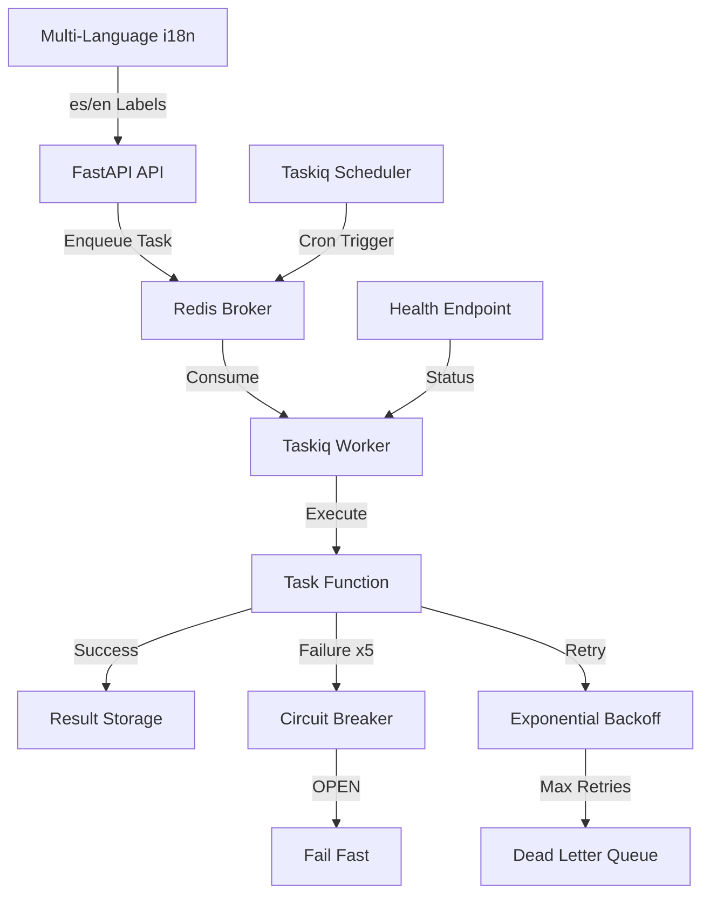

# PRP: Task Queue + Multi-Idioma System

> **Priority**: P0 (CRÍTICO) | **Estimate**: 5-7 days | **Sprint**: 7 Phase 1
> **Created**: 2026-03-06 | **Status**: Draft | **Approach**: Spike → Standard

---

## 1. Overview

### 1.1 Summary

Implement a robust async task queue system using Taskiq (with Celery as fallback) and multi-language infrastructure (i18n) for Sprint 7+. This is the FOUNDATION for all subsequent phases - Facebook OAuth, Graph API, Scraping, and AI Assistant all depend on async task processing.

**Why this matters**: Without a task queue, we cannot handle background jobs like:

- Scheduled Facebook republishing (posts expire every 7 days)
- Async scraping operations (don't block API responses)
- AI lead processing (can take 10+ seconds)
- Token refresh (48h before expiry)

### 1.2 Dependencies

- [ ] Redis running (for task queue broker + caching)
- [ ] PostgreSQL (for task result storage if needed)
- [ ] Python 3.13+ (free-threading support)

### 1.3 Links

- Design Doc: `docs/plans/2026-03-06-sprint7-workflow-design.md`
- Requirements: `docs/REQUIREMENTS-SPRINT-7-MARKETPLACE.md` (Section 10: Technical Requirements)
- Architecture: `docs/01_ARQUITECTURA_PROSELL_SAAS_V2.md` (Clean Architecture patterns)

---

## 2. Requirements

### 2.1 User Stories

#### US-701: Task Queue Worker Execution

**As a** System Administrator
**I want** async tasks to execute reliably in background workers
**So that** long-running operations don't block API responses

**Acceptance Criteria**:

```gherkin
Scenario: Task is enqueued and executed
  GIVEN a task is enqueued with parameters
  WHEN the worker picks up the task
  THEN the task executes successfully
  AND the result is stored

Scenario: Task failure with retry
  GIVEN a task fails with a transient error
  WHEN the task is retried
  THEN it succeeds after 3 attempts
  AND exponential backoff is applied

Scenario: Circuit breaker activates
  GIVEN a task fails 5 times consecutively
  WHEN the circuit breaker is OPEN
  THEN subsequent tasks fail fast
  AND the circuit resets after 60 seconds
```

#### US-702: Scheduled Tasks (Cron)

**As a** System Administrator
**I want** tasks to execute on a schedule (e.g., daily republishing)
**So that** Facebook Marketplace listings stay active

**Acceptance Criteria**:

```gherkin
Scenario: Daily scheduled task executes
  GIVEN a task is scheduled for 9 AM daily
  WHEN the time triggers
  THEN the task executes
  AND the next execution is scheduled for tomorrow 9 AM
```

#### US-703: Multi-Language UI Labels

**As a** Spanish-speaking User
**I want** all UI labels to be in Spanish by default
**So that** I can understand the interface

**Acceptance Criteria**:

```gherkin
Scenario: Spanish user sees Spanish labels
  GIVEN Accept-Language header contains "es"
  WHEN the user views a dashboard
  THEN all labels are in Spanish
  AND validation messages are in Spanish

Scenario: English user sees English labels
  GIVEN Accept-Language header contains "en"
  WHEN the user views a dashboard
  THEN all labels are in English
```

#### US-704: Multi-Language Data Validation

**As a** System Administrator
**I want** validation errors to be in the user's language
**So that** users understand what went wrong

**Acceptance Criteria**:

```gherkin
Scenario: Validation error in Spanish
  GIVEN a Spanish user submits invalid data
  WHEN validation fails
  THEN the error message is in Spanish

Scenario: Validation error in English
  GIVEN an English user submits invalid data
  WHEN validation fails
  THEN the error message is in English
```

### 2.2 Functional Requirements

- [FR-701] Task queue must support async task execution with Redis broker
- [FR-702] Tasks must support retry logic with exponential backoff
- [FR-703] Tasks must have a dead letter queue for permanently failed tasks
- [FR-704] System must support scheduled tasks (cron-like)
- [FR-705] Circuit breaker pattern must prevent cascade failures
- [FR-706] Health check endpoint must report task queue status
- [FR-707] Multi-language support must include es (Spanish) and en (English)
- [FR-708] Language detection must follow: Header → Query param → User DB → Default (es)
- [FR-709] All validation messages must support multi-language
- [FR-710] All UI labels must support multi-language

### 2.3 Non-Functional Requirements

- **Performance**:
  - Task execution latency < 5 seconds (P95)
  - Worker startup time < 10 seconds
  - Memory usage < 500MB per worker
- **Reliability**:
  - Task success rate > 99.9%
  - No tasks lost during worker restart
  - Automatic worker recovery on crash
- **Scalability**:
  - Support horizontal scaling (multiple workers)
  - Support task priority queues
  - Support rate limiting per task type

---

## 3. Technical Context

### 3.1 Tech Stack

| Component  | Technology                              | Version | Notes                               |
| ---------- | --------------------------------------- | ------- | ----------------------------------- |
| Task Queue | Taskiq (preferred) or Celery (fallback) | Latest  | Async-first, Python 3.13 compatible |
| Broker     | Redis                                   | 7.4+    | Already in stack                    |
| Scheduler  | Taskiq scheduler (or Celery Beat)       | Latest  | For scheduled tasks                 |
| i18n       | Pydantic + custom                       | Latest  | Multi-language strings              |
| Monitoring | Custom health endpoint                  | -       | `/health/integrations`              |

### 3.2 Key Libraries

```bash
# Python dependencies (to add to pyproject.toml)
uv add taskiq[redis]           # Task queue with Redis broker
uv add taskiq-scheduler         # Scheduled tasks
# OR as fallback:
# uv add celery[redis]         # Celery with Redis broker
# uv add redisbeat              # Celery scheduler

# i18n dependencies (none needed - pure Python)
```

### 3.3 External Documentation

**Taskiq** (if chosen after spike):

- GitHub: https://github.com/taskiq-python/taskiq
- Docs: https://taskiq-python.github.io/
- FastAPI Integration: https://taskiq-python.github.io/latest/integrations/fastapi/

**Celery** (fallback):

- Docs: https://docs.celeryq.dev/en/stable/
- FastAPI Integration: https://docs.celeryq.dev/en/stable/userguide/frameworks.html#flask

**Circuit Breakers**:

- Pattern: https://martinfowler.com/bliki/CircuitBreaker.html

---

## 4. Implementation Blueprint

### 4.1 Architecture Overview



### 4.2 Spike Phase (Days 1-2)

**Objective**: Validate Taskiq works with FastAPI async + SQLAlchemy 2.0

**Tasks**:

1. Create minimal FastAPI app with Taskiq
2. Define a simple async task (sleep + log)
3. Test task execution (enqueue → worker → result)
4. Test retry logic (force failure → verify retry)
5. Test scheduled task (cron every minute)
6. Compare with Celery (if Taskiq fails)

**Success Criteria**:

- ✅ Task executes without blocking API
- ✅ Retry works with exponential backoff
- ✅ Scheduled task triggers on time
- ✅ No memory leaks in worker

**Decision Document**: Create `docs/plans/2026-03-06-phase1-taskqueue-spike.md` with findings

### 4.3 Implementation Steps

#### Step 1: Infrastructure Layer - Task Queue

**Files to create**:

- `apps/api/src/prosell/infrastructure/tasks/__init__.py` - Package init
- `apps/api/src/prosell/infrastructure/tasks/broker.py` - Redis broker configuration
- `apps/api/src/prosell/infrastructure/tasks/circuit_breaker.py` - Circuit breaker implementation
- `apps/api/src/prosell/infrastructure/tasks/health.py` - Task queue health check

**Implementation notes**:

```python
# broker.py - Redis broker configuration
from taskiq import InMemoryBroker, RedisBroker
from prosell.core.config import settings

# Use Redis for production, InMemory for tests
if settings.environment == "testing":
    broker = InMemoryBroker()
else:
    broker = RedisBroker(
        redis_url=settings.redis_url,
        max_connections=settings.redis_max_connections,
    )

# Example task decorator
from taskiq import task

@task(broker=broker)
async def example_task(param: str) -> str:
    """Example async task."""
    await asyncio.sleep(1)
    return f"Processed: {param}"
```

```python
# circuit_breaker.py - Circuit breaker pattern
from enum import Enum
from time import time

class CircuitState(Enum):
    CLOSED = "closed"    # Normal operation
    OPEN = "open"        # Failing, reject tasks
    HALF_OPEN = "half_open"  # Testing if recovered

class CircuitBreaker:
    """Circuit breaker for external service failures."""

    def __init__(self, threshold: int = 5, timeout: int = 60):
        self.state = CircuitState.CLOSED
        self.failures = 0
        self.threshold = threshold
        self.timeout = timeout
        self.last_failure_time = 0

    async def call(self, func, *args, **kwargs):
        """Execute function with circuit breaker protection."""
        if self.state == CircuitState.OPEN:
            if self._should_attempt_reset():
                self.state = CircuitState.HALF_OPEN
            else:
                raise CircuitBreakerOpenError("Circuit is OPEN")

        try:
            result = await func(*args, **kwargs)
            self._on_success()
            return result
        except Exception as e:
            self._on_failure()
            raise e

    def _should_attempt_reset(self) -> bool:
        """Check if timeout has passed."""
        return time() - self.last_failure_time > self.timeout

    def _on_success(self):
        """Handle successful call."""
        self.failures = 0
        if self.state == CircuitState.HALF_OPEN:
            self.state = CircuitState.CLOSED

    def _on_failure(self):
        """Handle failed call."""
        self.failures += 1
        self.last_failure_time = time()
        if self.failures >= self.threshold:
            self.state = CircuitState.OPEN
```

**Gotchas**:

- Taskiq requires `broker.start()` after FastAPI app startup (use lifespan context manager)
- SQLAlchemy sessions in tasks: create new session per task (don't share across tasks)
- Redis connection pool: tune `max_connections` based on worker count

#### Step 2: Domain Layer - Multi-Language Value Objects

**Files to create**:

- `apps/api/src/prosell/domain/value_objects/i18n.py` - Multi-language string value object

**Implementation notes**:

```python
# i18n.py - Multi-language value object
from pydantic import Field, field_validator
from prosell.domain.base import ValueObject

class MultiLanguageString(ValueObject):
    """Multi-language string value object.

    Used for fields that need to support multiple languages (es, en).
    Immutable by definition (ValueObject).

    Example:
        name = MultiLanguageString(es="Automóviles", en="Cars")
    """

    es: str = Field(description="Spanish text")
    en: str = Field(description="English text")

    @field_validator("es", "en")
    @classmethod
    def strip_whitespace(cls, v: str) -> str:
        """Strip whitespace from texts."""
        return v.strip()

    def get(self, language: str) -> str:
        """Get text for specific language."""
        if language not in ("es", "en"):
            language = "es"  # Default
        return getattr(self, language)

    @classmethod
    def from_dict(cls, data: dict[str, str]) -> "MultiLanguageString":
        """Create from dictionary."""
        return cls(es=data.get("es", ""), en=data.get("en", ""))
```

**Gotchas**:

- Always validate both languages are present (required=True)
- Use `get()` method instead of direct attribute access in templates

#### Step 3: Infrastructure Layer - i18n Locales

**Files to create**:

- `apps/api/src/prosell/infrastructure/i18n/__init__.py` - Package init
- `apps/api/src/prosell/infrastructure/i18n/translator.py` - Translator class
- `apps/api/src/prosell/infrastructure/i18n/locales/es.json` - Spanish labels
- `apps/api/src/prosell/infrastructure/i18n/locales/en.json` - English labels

**Implementation notes**:

```python
# translator.py - Translation service
from pathlib import Path
from typing import Literal

from pydantic import BaseModel

from prosell.core.config import settings

class Translations(BaseModel):
    """Translation container."""
    categories: dict
    fields: dict
    validation: dict
    # Add more categories as needed

class Translator:
    """Translation service for multi-language support."""

    def __init__(self):
        self.current_dir = Path(__file__).parent
        self._cache: dict[str, Translations] = {}

    def load_translations(self, lang: Literal["es", "en"]) -> Translations:
        """Load translations from JSON file."""
        if lang in self._cache:
            return self._cache[lang]

        file_path = self.current_dir / "locales" / f"{lang}.json"
        if not file_path.exists():
            # Fallback to Spanish if language file not found
            file_path = self.current_dir / "locales" / "es.json"

        data = file_path.read_text()
        translations = Translations.model_validate_json(data)
        self._cache[lang] = translations
        return translations

    def t(self, key: str, lang: Literal["es", "en"] = "es", **kwargs) -> str:
        """Get translated string with key path (e.g., 'fields.make')."""
        translations = self.load_translations(lang)

        # Navigate nested keys (e.g., "fields.make")
        keys = key.split(".")
        value = translations
        for k in keys:
            value = getattr(value, k, key)

        if isinstance(value, str):
            return value.format(**kwargs) if kwargs else value

        return key  # Fallback to key if translation not found

# Global translator instance
translator = Translator()
```

```json
// locales/es.json
{
  "categories": {
    "vehicles": {
      "name": "Vehículos",
      "subcategories": {
        "automobiles": "Automóviles",
        "suvs": "SUVs",
        "trucks": "Camiones"
      }
    }
  },
  "fields": {
    "make": "Marca",
    "model": "Modelo",
    "year": "Año",
    "mileage": "Kilometraje"
  },
  "validation": {
    "required": "Este campo es requerido",
    "min_value": "El valor mínimo es {min}",
    "max_value": "El valor máximo es {max}"
  }
}
```

**Gotchas**:

- Cache translations in memory (reload on dev only)
- Use f-string formatting for dynamic values (e.g., "El valor mínimo es {min}")

#### Step 4: Application Layer - Language Detection Use Case

**Files to create**:

- `apps/api/src/prosell/application/use_cases/i18n/detect_language.py` - Language detection use case

**Implementation notes**:

```python
# detect_language.py - Language detection use case
from fastapi import Request

from prosell.application.dto.i18n import LanguageDetectionResponse

class DetectLanguageUseCase:
    """Use case for detecting user language."""

    async def execute(self, request: Request) -> LanguageDetectionResponse:
        """
        Detect user language from request.

        Priority:
        1. Accept-Language header
        2. Query parameter ?lang=es
        3. User DB (if authenticated)
        4. Default: Spanish

        Args:
            request: FastAPI request

        Returns:
            Detected language (es or en)
        """
        # 1. Check query parameter
        lang = request.query_params.get("lang")
        if lang in ("es", "en"):
            return LanguageDetectionResponse(language=lang)

        # 2. Check Accept-Language header
        accept_language = request.headers.get("accept-language", "")
        if "es" in accept_language.lower():
            return LanguageDetectionResponse(language="es")
        if "en" in accept_language.lower():
            return LanguageDetectionResponse(language="en")

        # 3. Check user DB (if authenticated)
        # This would be injected via dependency injection
        # user = await get_current_user(request)
        # if user and user.language:
        #     return LanguageDetectionResponse(language=user.language)

        # 4. Default to Spanish
        return LanguageDetectionResponse(language="es")
```

#### Step 5: API Layer - Health Check Endpoint

**Files to create**:

- `apps/api/src/prosell/infrastructure/api/routers/health_router.py` - Health check router

**Implementation notes**:

```python
# health_router.py - Health check endpoint
from fastapi import APIRouter

from prosell.infrastructure.tasks.health import get_task_queue_health

router = APIRouter(prefix="/health", tags=["health"])

@router.get("/integrations")
async def health_check():
    """Health check for all integrations (task queue, redis, database)."""
    return {
        "status": "healthy",
        "timestamp": datetime.now(UTC).isoformat(),
        "task_queue": await get_task_queue_health(),
        "redis": await get_redis_health(),
        "database": await get_database_health(),
    }
```

#### Step 6: Configuration - Settings

**Files to modify**:

- `apps/api/src/prosell/core/config.py` - Add Task Queue settings

**Implementation notes**:

```python
# Add to Settings class:

# =============================================================================
# TASK QUEUE
# =============================================================================
task_queue_broker_url: str = Field(
    default="redis://localhost:6379/1",
    description="Task queue broker URL (Redis)",
)
task_queue_max_workers: int = Field(
    default=4,
    description="Maximum number of worker processes",
)
task_queue_task_timeout: int = Field(
    default=300,  # 5 minutes
    description="Task execution timeout in seconds",
)
task_queue_max_retries: int = Field(
    default=3,
    description="Maximum retry attempts for failed tasks",
)
```

#### Step 7: Worker Entry Point

**Files to create**:

- `apps/api/src/prosell/infrastructure/tasks/worker.py` - Worker entry point
- `apps/api/worker.py` - Worker startup script

**Implementation notes**:

```python
# worker.py - Worker entry point
import asyncio

from taskiq.receiver import Receiver

from prosell.infrastructure.tasks.broker import broker
from prosell.core.config import settings

async def main():
    """Start taskiq worker."""
    receiver = Receiver(
        broker=broker,
        max_workers=settings.task_queue_max_workers,
    )

    # Import tasks to register them
    from prosell.infrastructure.tasks import tasks  # noqa

    await receiver.start()

if __name__ == "__main__":
    asyncio.run(main())
```

```bash
#!/usr/bin/env python
# worker.py - Worker startup script
import uvicorn
from prosell.infrastructure.tasks.worker import main

if __name__ == "__main__":
    # This can be run with: uv run worker
    import asyncio
    asyncio.run(main())
```

**Gotchas**:

- Worker must import tasks to register them with broker
- Use `uv run worker` to run with proper Python path

---

## 5. Code Patterns & Examples

### 5.1 Task Definition Pattern

**Reference**: `apps/api/src/prosell/infrastructure/tasks/broker.py`

```python
# Example: Async task with retry and circuit breaker
from taskiq import task, retriable

from prosell.infrastructure.tasks.broker import broker
from prosell.infrastructure.tasks.circuit_breaker import CircuitBreaker

# Circuit breaker for external API calls
facebook_breaker = CircuitBreaker(threshold=5, timeout=60)

@task(
    broker=broker,
    # Retry logic
    retry_on=ValueError,
    max_retries=3,
    backoff=10,  # seconds
)
async def publish_to_facebook(product_id: str) -> dict:
    """Publish product to Facebook Marketplace."""
    # Use circuit breaker for external API
    result = await facebook_breaker.call(
        _facebook_api_call,
        product_id=product_id
    )
    return {"status": "published", "post_id": result["id"]}

async def _facebook_api_call(product_id: str) -> dict:
    """Actual Facebook API call (protected by circuit breaker)."""
    # Implementation here
    pass
```

### 5.2 Scheduled Task Pattern

```python
# Example: Scheduled task (cron)
from taskiq_scheduler import TaskiqScheduler

scheduler = TaskiqScheduler(broker=broker)

@scheduler.scheduled(cron="0 9 * * *")  # 9 AM daily
async def republish_expired_listings():
    """Re-publish listings that expire soon."""
    from prosell.infrastructure.tasks.use_cases import get_expiring_publications
    from prosell.infrastructure.tasks.broker import publish_to_facebook

    # Get listings expiring in 24h
    expiring = await get_expiring_publications(hours=24)

    # Enqueue republish tasks
    for publication in expiring:
        await publish_to_facebook.kiq(publication.product_id)
```

### 5.3 Multi-Language DTO Pattern

**Reference**: `apps/api/src/prosell/application/dto/` (existing patterns)

```python
# Example: Multi-language DTO
from pydantic import BaseModel

from prosell.domain.value_objects.i18n import MultiLanguageString

class CategoryDTO(BaseModel):
    """Category DTO with multi-language support."""

    id: str
    name: MultiLanguageString  # {"es": "Automóviles", "en": "Cars"}
    parent_id: str | None = None

    class Config:
        from_attributes = True
```

---

## 6. Validation Gates

### 6.1 Pre-commit Checks

```bash
# Linting
ruff check --fix && ruff format .

# Type checking
pyright

# Run from apps/api
```

### 6.2 Unit Tests

```bash
# Backend unit tests
cd apps/api && uv run pytest tests/unit/infrastructure/tasks/ -v --cov=src/prosell/infrastructure/tasks
cd apps/api && uv run pytest tests/unit/domain/value_objects/i18n/ -v --cov=src/prosell/domain/value_objects/i18n
```

### 6.3 Integration Tests

```bash
# Backend integration tests
cd apps/api && uv run pytest tests/integration/tasks/ -v
```

### 6.4 E2E Tests

```bash
# E2E: Worker executes task
# 1. Start worker: uv run worker
# 2. Enqueue task via API
# 3. Verify task executed
# 4. Check result in Redis/DB
```

---

## 7. Testing Strategy

### 7.1 Unit Tests

**Task Queue Tests**:

- Test task decorator registers with broker
- Test retry logic with mock failures
- Test circuit breaker state transitions (CLOSED → OPEN → HALF_OPEN)
- Test exponential backoff timing

**i18n Tests**:

- Test `MultiLanguageString` value object immutability
- Test `get()` method returns correct language
- Test `Translator` loads from JSON files
- Test language detection priority (Header → Query → Default)

### 7.2 Integration Tests

**Task Queue Integration**:

- Test task enqueues to Redis
- Test worker receives and executes task
- Test scheduled task triggers on cron
- Test dead letter queue for permanent failures

**i18n Integration**:

- Test translations render correctly in API responses
- Test validation messages use correct language

### 7.3 E2E Tests

**Critical Path**:

```gherkin
Scenario: Task enqueues and executes
  GIVEN API endpoint enqueues a task
  WHEN the worker processes the task
  THEN the result is stored in Redis
  AND the API can retrieve the result
```

### 7.4 Coverage Targets

- Unit tests: > 80%
- Integration tests: > 70%
- E2E tests: Critical paths only

---

## 8. Common Pitfalls

### 8.1 SQLAlchemy Sessions in Tasks

**Problem**: Sharing SQLAlchemy sessions across tasks causes "detached instance" errors.

**Solution**: Create a new session per task using `sessionmaker`:

```python
from sqlalchemy.ext.asyncio import async_sessionmaker

from prosell.infrastructure.database.session import async_session

async def task_with_db():
    """Task that uses database."""
    async with async_session() as session:
        # Use session here
        result = await session.execute(query)
        return result.scalar()
```

### 8.2 Blocking Tasks

**Problem**: Long-running tasks block the worker, preventing other tasks from executing.

**Solution**: Use `asyncio.create_task()` or yield control:

```python
import asyncio

async def long_running_task():
    """Task that should yield control."""
    for i in range(100):
        await asyncio.sleep(0)  # Yield to event loop
        # Do work
```

### 8.3 Missing Translations

**Problem**: New label added to UI but not in translations → shows key instead of text.

**Solution**: Always add both es and en translations when adding new labels. Consider adding a CI check:

```bash
# Check all keys in es.json exist in en.json
python scripts/check-translations.py
```

---

## 9. Rollback Plan

If implementation fails:

1. **Taskiq doesn't work**: Fallback to Celery (spike validates this)
2. **Circuit breaker too complex**: Remove initially, add later
3. **i18n breaks existing UI**: Make i18n opt-in via feature flag
4. **Worker crashes**: Check for infinite loops, add timeouts to all tasks

**Rollback steps**:

1. Revert this PRP's commits
2. Remove Taskiq/Task Queue code
3. Keep i18n infrastructure (can be used later)
4. Document findings for next attempt

---

## 10. Implementation Tasks (Ordered)

1. ✅ Create spike POC (Taskiq vs Celery)
2. ✅ Document spike findings
3. ✅ Make decision: Taskiq or Celery
4. ✅ Install chosen library (`uv add taskiq[redis]`)
5. ✅ Create broker configuration (`broker.py`)
6. ✅ Create circuit breaker (`circuit_breaker.py`)
7. ✅ Create MultiLanguageString value object
8. ✅ Create translator service
9. ✅ Create locale files (es.json, en.json)
10. ✅ Create health check endpoint
11. ✅ Create worker entry point (`worker.py`)
12. ✅ Write unit tests (>80% coverage)
13. ✅ Write integration tests
14. ✅ Test locally with Redis
15. ✅ Update documentation
16. ✅ Create feature flag for Task Queue
17. ✅ Deploy to staging
18. ✅ Smoke test on staging
19. ✅ Merge to main

---

## 11. Completion Gates (VERIFIABLE)

Estos son los **tests de completitud** que deben pasar antes de considerar el PRP completo.

### 11.1 Spike Validation

```bash
# Test 1: Spike POC runs successfully
cd apps/api && python tests/spikes/taskiq_spike.py
# Expected: Exit code 0, logs show task executed

# Test 2: Spike decision documented
test -f docs/plans/2026-03-06-phase1-taskqueue-spike.md
# Expected: File exists with decision (Taskiq or Celery)
```

### 11.2 Installation Verification

```bash
# Test 3: Taskiq installed
cd apps/api && uv pip list | grep taskiq
# Expected: taskiq==x.x.x

# Test 4: Redis reachable
redis-cli ping
# Expected: PONG
```

### 11.3 Unit Tests (Executable)

```bash
# Test 5: Task Queue unit tests pass
cd apps/api && uv run pytest tests/unit/infrastructure/tasks/ -v --cov=src/prosell/infrastructure/tasks
# Expected: All pass, coverage > 80%

# Test 6: Circuit breaker unit tests pass
cd apps/api && uv run pytest tests/unit/infrastructure/tasks/test_circuit_breaker.py -v
# Expected: All pass

# Test 7: Multi-language unit tests pass
cd apps/api && uv run pytest tests/unit/domain/value_objects/i18n/ -v
# Expected: All pass
```

### 11.4 Integration Tests (Executable)

```bash
# Test 8: Task executes end-to-end
cd apps/api && uv run pytest tests/integration/tasks/test_task_execution.py -v
# Expected: Task enqueues, executes, result stored

# Test 9: Circuit breaker triggers
cd apps/api && uv run pytest tests/integration/tasks/test_circuit_breaker_integration.py -v
# Expected: Circuit opens after 5 failures

# Test 10: Translator loads locales
cd apps/api && uv run pytest tests/integration/i18n/test_translator.py -v
# Expected: es.json and en.json loaded successfully
```

### 11.5 Health Check (Executable)

```bash
# Test 11: Health endpoint responds
curl http://localhost:8000/api/v1/health/integrations
# Expected: JSON with task_queue status: "healthy"

# Test 12: Worker process runs
# Terminal 1: Start worker
cd apps/api && uv run worker

# Terminal 2: Enqueue task
curl -X POST http://localhost:8000/api/v1/tasks/test-task

# Expected: Task executes, worker logs show completion
```

### 11.6 Database Verification

```bash
# Test 13: No database errors in logs
tail -100 /tmp/api.log | grep -i "error"
# Expected: No task queue related errors

# Test 14: Redis has task results
redis-cli LRANGE taskiq:result:default 0 10
# Expected: Results stored (may be empty if no tasks ran)
```

### 11.7 Code Quality (Executable)

```bash
# Test 15: No ruff errors
cd apps/api && ruff check src/prosell/infrastructure/tasks/
# Expected: Exit code 0

# Test 16: No pyright errors
cd apps/api && pyright src/prosell/infrastructure/tasks/
# Expected: 0 errors

# Test 17: All tests pass
cd apps/api && uv run pytest tests/unit/infrastructure/tasks/ tests/integration/tasks/ -v
# Expected: All pass
```

### 11.8 Documentation Verification

```bash
# Test 18: PRP documentation complete
grep -q "## 11. Completion Gates" PRPs/sprint-7-phase1-taskqueue-prp.md
# Expected: This section exists (you're reading it!)

# Test 19: Spike decision documented
grep -q "Decision:" docs/plans/2026-03-06-phase1-taskqueue-spike.md
# Expected: Decision documented
```

### 11.9 Final Checklist (Manual)

- [ ] Spike completed and decision made (Taskiq ✅ / Celery ✅)
- [ ] All unit tests pass (> 80% coverage)
- [ ] All integration tests pass
- [ ] Health check endpoint reports healthy
- [ ] Worker process starts and processes tasks
- [ ] Circuit breaker prevents cascade failures
- [ ] Translator loads es.json and en.json
- [ ] No pyright errors
- [ ] No ruff errors
- [ ] Documentation updated
- [ ] Code review completed

---

## Confidence Score

---

## Confidence Score

**Score**: 8/10

**Reasoning**:

**Positive factors**:

- Taskiq is well-maintained and async-first (perfect for Python 3.13 + FastAPI)
- Redis already in stack (no new infrastructure)
- Clean Architecture patterns already established in codebase
- Multi-language is straightforward (JSON files + value objects)

**Risk factors**:

- Spike required to validate Taskiq works with SQLAlchemy 2.0 async sessions
- Worker process management in production needs testing
- Circuit breaker adds complexity (but can be simplified if needed)

---

## Appendix A: Spike Tasks

### Spike: Taskiq vs Celery (Days 1-2)

**Objective**: Validate Taskiq works with FastAPI + SQLAlchemy 2.0

**Tasks**:

1. Create minimal FastAPI app with Taskiq broker
2. Define task: `sleep(5)` + log completion
3. Test: Enqueue task via API endpoint
4. Start worker: Verify task executes
5. Test retry: Force failure → verify retry with backoff
6. Test scheduled task: Cron every minute → verify triggers
7. Compare with Celery (if Taskiq has issues)

**Success Criteria**:

- ✅ Task executes without blocking API
- ✅ Retry works with exponential backoff
- ✅ Scheduled task triggers on time
- ✅ No memory leaks after 10 tasks
- ✅ SQLAlchemy session works in task

**Deliverable**: `docs/plans/2026-03-06-phase1-taskqueue-spike.md`

---

## Appendix B: Example Tasks

### Example 1: Async Scraping Task

```python
@task(broker=broker)
async def scrape_dealer_website(dealer_id: str) -> dict:
    """Scrape dealer website for new products."""
    # Use Playwright to scrape
    from prosell.infrastructure.scraping.scraper import Scraper

    scraper = Scraper()
    products = await scraper.scrape(dealer_id)

    return {
        "status": "success",
        "products_found": len(products),
        "products": [p.id for p in products],
    }
```

### Example 2: Token Refresh Task

```python
@task(broker=broker)
@scheduled(cron="0 */6 * * *")  # Every 6 hours
async def refresh_facebook_tokens():
    """Refresh Facebook access tokens expiring soon."""
    from prosell.infrastructure.repositories.oauth_repository import SqlAlchemyOAuthRepository

    async with async_session() as session:
        repo = SqlAlchemyOAuthRepository(session)
        expiring_accounts = await get_accounts_expiring_soon(hours=48)

        for account in expiring_accounts:
            await refresh_token(account)

    return {"tokens_refreshed": len(expiring_accounts)}
```

---

**END OF PRP**
