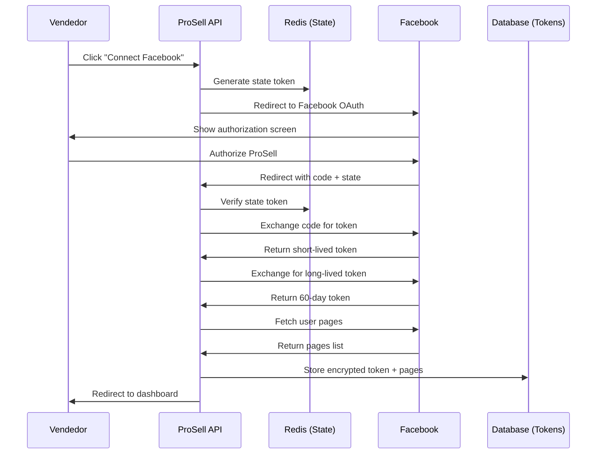

# PRP: Facebook OAuth Integration

> **Priority**: P0 (CRÍTICO) | **Estimate**: 5-7 days | **Sprint**: 7 Phase 2
> **Created**: 2026-03-06 | **Status**: Draft | **Approach**: Spike → Standard

---

## 1. Overview

### 1.1 Summary

Implement Facebook OAuth 2.0 integration to allow ProSell vendedores to connect their Facebook accounts. This enables the system to publish Marketplace listings on behalf of vendedores using their own Facebook pages.

**Why this matters**: Without OAuth, we cannot publish to Facebook Marketplace programmatically. The OAuth flow allows vendedores to authorize ProSell to act on their behalf.

### 1.2 Dependencies

- [ ] **PRP 1** (Task Queue) - For async token refresh tasks
- [ ] **Redis** - For OAuth state token storage
- [ ] **Facebook App** - Created in Facebook Developers Console
- [ ] **PostgreSQL** - For storing account tokens

### 1.3 Links

- Design Doc: `docs/plans/2026-03-06-sprint7-workflow-design.md` (Section: Facebook Integration)
- Requirements: `docs/REQUIREMENTS-SPRINT-7-MARKETPLACE.md` (Section 5: Integración Facebook)
- Facebook OAuth Docs: https://developers.facebook.com/docs/facebook-login/guides/advanced/manual-flow
- Facebook Graph API: https://developers.facebook.com/docs/graph-api/

---

## 2. Requirements

### 2.1 User Stories

#### US-701: Facebook Account Connection

**As a** Vendedor ProSell
**I want** to connect my Facebook account to ProSell
**So that** I can publish Marketplace listings automatically

**Acceptance Criteria**:
```gherkin
Scenario: Vendedor connects Facebook account
  GIVEN the vendedor is logged in
  WHEN they click "Connect Facebook"
  THEN they are redirected to Facebook OAuth
  AND they authorize ProSell
  AND they are redirected back to ProSell
  AND their account is connected

Scenario: Connection persists across sessions
  GIVEN a vendedor has connected their Facebook account
  WHEN they log in again
  THEN their Facebook connection is still active
```

#### US-702: Token Auto-Refresh

**As a** System Administrator
**I want** access tokens to refresh automatically before expiry
**So that** vendedores don't need to re-authorize

**Acceptance Criteria**:
```gherkin
Scenario: Token refreshes 48h before expiry
  GIVEN a token expires in less than 48 hours
  WHEN the scheduled task runs
  THEN the token is refreshed
  AND the new token is stored
  AND the expiry date is updated

Scenario: Token refresh fails permanently
  GIVEN the token refresh fails 5 times
  WHEN the circuit breaker opens
  THEN the vendedor is notified to re-authorize
  AND the account status is set to "expired"
```

#### US-703: Facebook Pages Discovery

**As a** Vendedor ProSell
**I want** to see my Facebook pages after connecting
**So that** I can choose which page to publish from

**Acceptance Criteria**:
```gherkin
Scenario: Vendedor views available pages
  GIVEN a vendedor has connected their Facebook account
  WHEN they view their connected accounts
  THEN they see all their Facebook pages
  AND they can select the default page for publishing
```

#### US-704: OAuth Webhook Handling

**As a** System
**I want** to receive webhook updates from Facebook
**So that** we know when permissions are revoked

**Acceptance Criteria**:
```gherkin
Scenario: Facebook sends permission revocation webhook
  GIVEN Facebook sends a webhook for revoked permissions
  WHEN ProSell receives the webhook
  THEN the account status is updated to "revoked"
  AND the vendedor is notified
```

### 2.2 Functional Requirements

- [FR-701] System must support Facebook OAuth 2.0 server-side flow
- [FR-702] OAuth state tokens must be stored in Redis with 10-minute expiry
- [FR-703] Access tokens must be stored encrypted in database
- [FR-704] Long-lived tokens (60-day) must be exchanged from short-lived tokens
- [FR-705] Tokens must auto-refresh 48 hours before expiry
- [FR-706] System must fetch all pages accessible to the user
- [FR-707] System must store page access tokens separately
- [FR-708] Webhook endpoint must verify Facebook signature
- [FR-709] Circuit breaker must prevent refresh failures
- [FR-710] Vendedores must be able to disconnect their accounts

### 2.3 Non-Functional Requirements

- **Security**:
  - OAuth state tokens must be cryptographically secure
  - Access tokens must be encrypted at rest
  - Webhook signatures must be verified
- **Performance**:
  - OAuth redirect < 3 seconds
  - Token refresh < 2 seconds
  - Page discovery < 5 seconds
- **Reliability**:
  - Token refresh success rate > 99%
  - No expired tokens used in API calls

---

## 3. Technical Context

### 3.1 Tech Stack

| Component | Technology | Version | Notes |
|-----------|-----------|---------|-------|
| OAuth | Facebook OAuth 2.0 | Latest | Server-side flow |
| Token Storage | PostgreSQL (encrypted) | 17 | AES-256 encryption |
| State Storage | Redis | 7.4+ | Temporary state tokens |
| HTTP Client | httpx | 0.28+ | Async HTTP client |
| Scheduler | Taskiq (from PRP 1) | Latest | For token refresh tasks |

### 3.2 Key Libraries

```bash
# Python dependencies (already in pyproject.toml)
# httpx>=0.28.0 - Async HTTP client
# cryptography>=43.0.0 - For token encryption

# No new dependencies needed
```

### 3.3 External Documentation

**Facebook OAuth**:
- Manual Flow: https://developers.facebook.com/docs/facebook-login/guides/advanced/manual-flow
- Permissions: https://developers.facebook.com/docs/permissions/reference/
- Access Tokens: https://developers.facebook.com/docs/facebook-login/guides/access-tokens

**Required Permissions**:
- `pages_manage_posts` - Create and manage posts
- `pages_read_engagement` - Read engagement data
- `pages_manage_metadata` - Manage page metadata
- `pages_read_user_content` - Read user content
- `pages_manage_engagement` - Manage engagement

**Graph API Endpoints**:
- OAuth Dialog: `https://www.facebook.com/v19.0/dialog/oauth`
- Access Token: `https://graph.facebook.com/v19.0/oauth/access_token`
- User Pages: `https://graph.facebook.com/v19.0/me/accounts`

---

## 4. Implementation Blueprint

### 4.1 Architecture Overview



### 4.2 Spike Phase (Days 1-2)

**Objective**: Validate Facebook OAuth flow works end-to-end

**Tasks**:
1. Create Facebook App in Developers Console
2. Configure OAuth redirect URI
3. Request required permissions
4. Test manual OAuth flow (copy-paste URLs in browser)
5. Test access token exchange
6. Test long-lived token exchange
7. Test page discovery endpoint
8. Test token refresh endpoint
9. Document any permission issues or app review requirements

**Success Criteria**:
- ✅ OAuth flow completes successfully
- ✅ Long-lived token (60-day) obtained
- ✅ User pages retrieved
- ✅ Token refresh works

**Decision Document**: Create `docs/plans/2026-03-06-phase2-facebook-spike.md` with findings

### 4.3 Implementation Steps

#### Step 1: Domain Layer - Entities and Value Objects

**Files to create**:
- `apps/api/src/prosell/domain/entities/facebook_account.py` - Facebook account entity
- `apps/api/src/prosell/domain/entities/facebook_page.py` - Facebook page entity
- `apps/api/src/prosell/domain/value_objects/facebook_permissions.py` - Permissions value object
- `apps/api/src/prosell/domain/repositories/facebook_account_repository.py` - Repository interface

**Implementation notes**:

```python
# facebook_account.py - Facebook account entity
from datetime import UTC, datetime
from enum import Enum

from pydantic import Field
from sqlalchemy import String
from sqlalchemy.orm import Mapped, mapped_column

from prosell.domain.base import Base
from prosell.domain.base import DomainModel

class FacebookAccountStatus(str, Enum):
    """Facebook account status."""
    ACTIVE = "active"
    EXPIRED = "expired"
    REVOKED = "revoked"
    ERROR = "error"

class FacebookAccount(DomainModel):
    """Facebook OAuth account entity.

    Represents a vendedor's connected Facebook account.
    Mutable - can update tokens, status, etc.
    """

    id: str
    seller_user_id: str = Field(description="ProSell vendedor user ID")
    facebook_user_id: str = Field(description="Facebook user ID")
    access_token_encrypted: str = Field(description="Encrypted access token")
    token_expires_at: datetime | None = Field(default=None, description="Token expiry timestamp")
    status: FacebookAccountStatus = Field(default=FacebookAccountStatus.ACTIVE)
    scopes: list[str] = Field(default_factory=list, description="Granted permissions")
    created_at: datetime = Field(default_factory=lambda: datetime.now(UTC))
    updated_at: datetime = Field(default_factory=lambda: datetime.now(UTC))

    def is_expired(self) -> bool:
        """Check if token is expired."""
        if not self.token_expires_at:
            return False
        return self.token_expires_at < datetime.now(UTC)

    def should_refresh(self, hours_before: int = 48) -> bool:
        """Check if token should be refreshed."""
        if not self.token_expires_at:
            return False
        threshold = datetime.now(UTC) + timedelta(hours=hours_before)
        return self.token_expires_at < threshold

    def revoke(self):
        """Revoke the account (permissions revoked)."""
        self.status = FacebookAccountStatus.REVOKED
        self.updated_at = datetime.now(UTC)

# SQLAlchemy Model
class FacebookAccountModel(Base):
    """SQLAlchemy model for FacebookAccount."""

    __tablename__ = "facebook_accounts"

    id: Mapped[str] = mapped_column(String, primary_key=True)
    seller_user_id: Mapped[str] = mapped_column(String, index=True)
    facebook_user_id: Mapped[str] = mapped_column(String, unique=True)
    access_token_encrypted: Mapped[str] = mapped_column(String)
    token_expires_at: Mapped[datetime | None] = mapped_column(String, nullable=True)
    status: Mapped[str] = mapped_column(String, default=FacebookAccountStatus.ACTIVE.value)
    scopes: Mapped[list[str]] = mapped_column(String, default=list)  # JSON encoded
    created_at: Mapped[datetime] = mapped_column(String)
    updated_at: Mapped[datetime] = mapped_column(String)
```

```python
# facebook_page.py - Facebook page entity
from datetime import UTC, datetime

from pydantic import Field

from prosell.domain.base import DomainModel

class FacebookPage(DomainModel):
    """Facebook page entity.

    Represents a Facebook page managed by a vendedor.
    """

    id: str
    facebook_account_id: str = Field(description="Parent Facebook account ID")
    page_id: str = Field(description="Facebook page ID")
    page_name: str = Field(description="Page name")
    page_access_token_encrypted: str = Field(description="Encrypted page access token")
    category: str | None = Field(default=None, description="Page category (e.g., 'Vehicle Dealer')")
    is_default: bool = Field(default=False, description="Whether this is the default publishing page")
    created_at: datetime = Field(default_factory=lambda: datetime.now(UTC))
    updated_at: datetime = Field(default_factory=lambda: datetime.now(UTC))
```

**Gotchas**:
- Access tokens MUST be encrypted at rest (AES-256)
- Use `seller_user_id` to link to ProSell vendedor (can be extended for multi-tenancy)
- Store both user access token AND page access tokens

#### Step 2: Infrastructure Layer - OAuth Service

**Files to create**:
- `apps/api/src/prosell/infrastructure/services/facebook_oauth_service.py` - OAuth service
- `apps/api/src/prosell/infrastructure/services/token_encryption_service.py` - Token encryption

**Implementation notes**:

```python
# facebook_oauth_service.py - Facebook OAuth service
from datetime import UTC, datetime, timedelta
from uuid import uuid4

import httpx
from pydantic import ValidationError

from prosell.core.config import get_settings
from prosell.domain.entities.facebook_account import FacebookAccount
from prosell.domain.entities.facebook_page import FacebookPage
from prosell.domain.ports.i_facebook_service import IFacebookOAuthService

settings = get_settings()

class FacebookOAuthService(IFacebookOAuthService):
    """Facebook OAuth 2.0 service implementation."""

    def __init__(
        self,
        encryption_service: TokenEncryptionService,
    ):
        self.encryption_service = encryption_service
        self.client = httpx.AsyncClient(timeout=30.0)
        self.app_id = settings.facebook_oauth_app_id
        self.app_secret = settings.facebook_oauth_app_secret
        self.redirect_uri = settings.facebook_oauth_redirect_uri

    async def get_authorization_url(self, state_token: str) -> str:
        """Generate Facebook OAuth authorization URL.

        Args:
            state_token: CSRF protection token

        Returns:
            Authorization URL to redirect user to
        """
        params = {
            "client_id": self.app_id,
            "redirect_uri": self.redirect_uri,
            "scope": " ".join([
                "pages_manage_posts",
                "pages_read_engagement",
                "pages_manage_metadata",
                "pages_read_user_content",
                "pages_manage_engagement",
            ]),
            "response_type": "code",
            "state": state_token,
        }

        return f"https://www.facebook.com/v19.0/dialog/oauth?{urlencode(params)}"

    async def exchange_code_for_token(self, code: str) -> dict:
        """Exchange authorization code for short-lived access token.

        Args:
            code: Authorization code from Facebook callback

        Returns:
            Dict with access_token, token_type, expires_in
        """
        params = {
            "client_id": self.app_id,
            "client_secret": self.app_secret,
            "redirect_uri": self.redirect_uri,
            "code": code,
        }

        response = await self.client.post(
            "https://graph.facebook.com/v19.0/oauth/access_token",
            data=params,
        )
        response.raise_for_status()

        return response.json()

    async def exchange_for_long_lived_token(self, short_lived_token: str) -> dict:
        """Exchange short-lived token for long-lived (60-day) token.

        Args:
            short_lived_token: Short-lived access token (1-hour expiry)

        Returns:
            Dict with access_token, expires_in (seconds)
        """
        params = {
            "grant_type": "fb_exchange_token",
            "client_id": self.app_id,
            "client_secret": self.app_secret,
            "fb_exchange_token": short_lived_token,
        }

        response = await self.client.post(
            "https://graph.facebook.com/v19.0/oauth/access_token",
            data=params,
        )
        response.raise_for_status()

        data = response.json()

        # Calculate expiry datetime (60 days from now)
        expires_in_seconds = data.get("expires_in", 5184000)  # Default 60 days
        expires_at = datetime.now(UTC) + timedelta(seconds=expires_in_seconds)

        return {
            "access_token": data["access_token"],
            "expires_at": expires_at,
            "token_type": data.get("token_type", "bearer"),
        }

    async def get_user_pages(self, access_token: str) -> list[dict]:
        """Get all pages accessible to the user.

        Args:
            access_token: User access token

        Returns:
            List of pages with id, name, access_token, category
        """
        params = {
            "access_token": access_token,
            "fields": "id,name,access_token,category,picture",
        }

        response = await self.client.get(
            "https://graph.facebook.com/v19.0/me/accounts",
            params=params,
        )
        response.raise_for_status()

        data = response.json()
        return data.get("data", [])

    async def refresh_page_token(self, page_id: str, old_token: str) -> dict:
        """Refresh a page access token.

        Args:
            page_id: Facebook page ID
            old_token: Current page access token

        Returns:
            Dict with new access_token and expires_at
        """
        # Note: Page tokens don't auto-refresh like user tokens
        # We need to re-fetch from /me/accounts endpoint
        raise NotImplementedError("See implementation in Step 5")
```

```python
# token_encryption_service.py - Token encryption at rest
from cryptography.fernet import Fernet

from prosell.domain.ports.i_encryption_service import IEncryptionService

class TokenEncryptionService(IEncryptionService):
    """Service for encrypting access tokens at rest."""

    def __init__(self, encryption_key: bytes):
        """Initialize with encryption key.

        Args:
            encryption_key: 32-byte encryption key (from settings)
        """
        self.cipher = Fernet(encryption_key)

    def encrypt(self, plaintext: str) -> str:
        """Encrypt plaintext token.

        Args:
            plaintext: Plain text access token

        Returns:
            Encrypted token (base64 encoded)
        """
        return self.cipher.encrypt(plaintext.encode()).decode()

    def decrypt(self, encrypted: str) -> str:
        """Decrypt encrypted token.

        Args:
            encrypted: Encrypted token

        Returns:
            Plain text access token
        """
        return self.cipher.decrypt(encrypted.encode()).decode()
```

**Gotchas**:
- Always exchange short-lived token for long-lived token (60-day expiry)
- Page access tokens are separate from user tokens
- Store both user token AND page tokens (page tokens don't expire as quickly)

#### Step 3: Application Layer - Use Cases

**Files to create**:
- `apps/api/src/prosell/application/use_cases/facebook/authorize_account.py` - OAuth flow use case
- `apps/api/src/prosell/application/use_cases/facebook/disconnect_account.py` - Disconnect use case
- `apps/api/src/prosell/application/use_cases/facebook/refresh_token.py` - Token refresh use case
- `apps/api/src/prosell/application/use_cases/facebook/fetch_pages.py` - Fetch pages use case
- `apps/api/src/prosell/application/dto/facebook/*.py` - DTOs

**Implementation notes**:

```python
# authorize_account.py - OAuth flow use case
from uuid import uuid4

from prosell.application.dto.facebook import AuthorizeAccountRequest, AuthorizeAccountResponse
from prosell.domain.exceptions.facebook_exceptions import (
    FacebookOAuthException,
    FacebookStateException,
)
from prosell.domain.repositories.facebook_account_repository import AbstractFacebookAccountRepository
from prosell.infrastructure.services.facebook_oauth_service import FacebookOAuthService
from prosell.infrastructure.services.redis_service import RedisService

class AuthorizeAccountUseCase:
    """Use case for authorizing Facebook account."""

    def __init__(
        self,
        oauth_service: FacebookOAuthService,
        account_repository: AbstractFacebookAccountRepository,
        redis: RedisService,
    ):
        self.oauth_service = oauth_service
        self.account_repository = account_repository
        self.redis = redis

    async def execute(self, request: AuthorizeAccountRequest) -> AuthorizeAccountResponse:
        """
        Start Facebook OAuth flow.

        Args:
            request: Authorization request with seller_user_id

        Returns:
            Authorization URL for user to redirect to

        Raises:
            FacebookOAuthException: If OAuth service fails
        """
        # 1. Generate state token (CSRF protection)
        state_token = str(uuid4())

        # 2. Store state token in Redis (10-minute expiry)
        await self.redis.set(
            f"oauth_state:{state_token}",
            request.seller_user_id,
            ex=600,  # 10 minutes
        )

        # 3. Generate authorization URL
        auth_url = await self.oauth_service.get_authorization_url(state_token)

        return AuthorizeAccountResponse(
            authorization_url=auth_url,
            state_token=state_token,
        )
```

```python
# callback.py - OAuth callback use case
from prosell.application.dto.facebook import OAuthCallbackRequest, OAuthCallbackResponse
from prosell.domain.exceptions.facebook_exceptions import FacebookStateException

class OAuthCallbackUseCase:
    """Use case for handling Facebook OAuth callback."""

    async def execute(self, request: OAuthCallbackRequest) -> OAuthCallbackResponse:
        """
        Handle Facebook OAuth callback.

        Args:
            request: Callback request with code and state

        Returns:
            Connected account info

        Raises:
            FacebookStateException: If state token is invalid
            FacebookOAuthException: If token exchange fails
        """
        # 1. Verify state token
        seller_user_id = await self.redis.get(f"oauth_state:{request.state}")
        if not seller_user_id:
            raise FacebookStateException("Invalid or expired state token")

        # 2. Exchange code for short-lived token
        token_data = await self.oauth_service.exchange_code_for_token(request.code)

        # 3. Exchange for long-lived token
        long_lived_data = await self.oauth_service.exchange_for_long_lived_token(
            token_data["access_token"]
        )

        # 4. Get user info from Facebook
        user_info = await self.oauth_service.get_user_info(long_lived_data["access_token"])

        # 5. Get user pages
        pages = await self.oauth_service.get_user_pages(long_lived_data["access_token"])

        # 6. Create or update account
        account = FacebookAccount(
            id=str(uuid4()),
            seller_user_id=seller_user_id,
            facebook_user_id=user_info["id"],
            access_token_encrypted=self.encryption_service.encrypt(
                long_lived_data["access_token"]
            ),
            token_expires_at=long_lived_data["expires_at"],
            scopes=token_data.get("scopes", []),
            status=FacebookAccountStatus.ACTIVE,
        )

        account = await self.account_repository.create(account)

        # 7. Store pages
        for page_data in pages:
            page = FacebookPage(
                id=str(uuid4()),
                facebook_account_id=account.id,
                page_id=page_data["id"],
                page_name=page_data["name"],
                page_access_token_encrypted=self.encryption_service.encrypt(
                    page_data["access_token"]
                ),
                category=page_data.get("category"),
            )
            await self.page_repository.create(page)

        # 8. Clean up state token
        await self.redis.delete(f"oauth_state:{request.state}")

        return OAuthCallbackResponse(
            account_id=account.id,
            facebook_user_id=user_info["id"],
            pages_count=len(pages),
        )
```

**Gotchas**:
- ALWAYS verify state token to prevent CSRF attacks
- Delete state token after verification (one-time use)
- Encrypt tokens BEFORE storing in database

#### Step 4: API Layer - Endpoints

**Files to create**:
- `apps/api/src/prosell/infrastructure/api/routers/facebook_router.py` - Facebook API router

**Implementation notes**:

```python
# facebook_router.py - Facebook OAuth endpoints
from fastapi import APIRouter, Depends, Query
from fastapi.responses import RedirectResponse

from prosell.application.use_cases.facebook import (
    AuthorizeAccountUseCase,
    OAuthCallbackUseCase,
    DisconnectAccountUseCase,
    FetchPagesUseCase,
)
from prosell.infrastructure.api.dependencies import get_current_user

router = APIRouter(prefix="/facebook", tags=["facebook"])

@router.post("/authorize")
async def authorize_facebook(
    request: AuthorizeAccountRequest,
    use_case: AuthorizeAccountUseCase = Depends(),
):
    """Start Facebook OAuth flow."""
    result = await use_case.execute(request)
    return {"authorization_url": result.authorization_url}

@router.get("/callback")
async def facebook_callback(
    code: str = Query(...),
    state: str = Query(...),
    error: str | None = Query(None),
    error_description: str | None = Query(None),
    use_case: OAuthCallbackUseCase = Depends(),
):
    """Handle Facebook OAuth callback.

    This is called by Facebook after user authorizes.
    """
    if error:
        # User denied authorization
        return RedirectResponse(
            url=f"{settings.oauth_frontend_failure_url}{error}"
        )

    request = OAuthCallbackRequest(code=code, state=state)
    result = await use_case.execute(request)

    # Redirect to dashboard with success
    return RedirectResponse(
        url=f"{settings.oauth_frontend_success_url}?account_id={result.account_id}"
    )

@router.get("/accounts")
async def list_facebook_accounts(
    current_user: User = Depends(get_current_user),
    use_case: ListAccountsUseCase = Depends(),
):
    """List user's connected Facebook accounts."""
    result = await use_case.execute(current_user.id)
    return {"accounts": result}

@router.delete("/accounts/{account_id}")
async def disconnect_facebook_account(
    account_id: str,
    current_user: User = Depends(get_current_user),
    use_case: DisconnectAccountUseCase = Depends(),
):
    """Disconnect a Facebook account."""
    await use_case.execute(account_id, current_user.id)
    return {"status": "disconnected"}
```

**Gotchas**:
- OAuth endpoint must be in API router (not frontend)
- Frontend redirects to `/api/facebook/authorize` to start flow
- Facebook redirects to `/api/facebook/callback` after authorization

#### Step 5: Scheduler - Token Refresh Task

**Files to create**:
- `apps/api/src/prosell/infrastructure/tasks/use_cases/refresh_facebook_tokens.py` - Token refresh task

**Implementation notes**:

```python
# refresh_facebook_tokens.py - Scheduled token refresh task
from datetime import timedelta

from taskiq import task

from prosell.infrastructure.tasks.broker import broker

@task(broker=broker)
async def refresh_facebook_tokens():
    """Refresh all Facebook access tokens expiring soon.

    Scheduled to run every 6 hours.
    """
    from prosell.infrastructure.database.session import async_session
    from prosell.infrastructure.repositories.facebook_account_repository_impl import SqlAlchemyFacebookAccountRepository

    async with async_session() as session:
        repo = SqlAlchemyFacebookAccountRepository(session)

        # Find accounts expiring in 48 hours
        threshold = datetime.now(UTC) + timedelta(hours=48)
        expiring = await repo.get_accounts_expiring_before(threshold)

        results = []
        for account in expiring:
            try:
                # Refresh token
                await refresh_account_token(account)
                results.append({"account_id": account.id, "status": "refreshed"})
            except Exception as e:
                results.append({"account_id": account.id, "status": "failed", "error": str(e)})

        return {
            "total": len(expiring),
            "refreshed": len([r for r in results if r["status"] == "refreshed"]),
            "failed": len([r for r in results if r["status"] == "failed"]),
            "results": results,
        }

async def refresh_account_token(account: FacebookAccount):
    """Refresh a single account's token."""
    from prosell.infrastructure.services.facebook_oauth_service import FacebookOAuthService

    oauth_service = FacebookOAuthService()

    # Decrypt current token
    current_token = encryption_service.decrypt(account.access_token_encrypted)

    # Exchange for new token
    new_token_data = await oauth_service.exchange_for_long_lived_token(current_token)

    # Update account
    account.access_token_encrypted = encryption_service.encrypt(new_token_data["access_token"])
    account.token_expires_at = new_token_data["expires_at"]
    account.updated_at = datetime.now(UTC)

    await account_repository.update(account)
```

**Gotchas**:
- Schedule this task to run every 6 hours (cron: `0 */6 * * *`)
- Use circuit breaker to prevent cascade failures if Facebook API is down

#### Step 6: Configuration - Settings

**Files to modify**:
- `apps/api/src/prosell/core/config.py` - Add Facebook OAuth settings

**Implementation notes**:

```python
# Add to Settings class (already exists, just verifying):

# =============================================================================
# OAUTH (Facebook)
# =============================================================================
facebook_oauth_app_id: str | None = Field(
    default=None,
    description="Facebook OAuth app ID",
)
facebook_oauth_app_secret: str | None = Field(
    default=None,
    description="Facebook OAuth app secret",
)
facebook_oauth_redirect_uri: str = Field(
    default="http://localhost:8000/api/facebook/callback",
    description="Facebook OAuth backend callback URI",
)

# =============================================================================
# ENCRYPTION (for tokens)
# =============================================================================
encryption_key: str = Field(
    default="CHANGE_THIS_IN_PRODUCTION_USE_32_BYTE_KEY",
    description="32-byte encryption key for access tokens (Fernet)",
)

@field_validator("encryption_key")
@classmethod
def validate_encryption_key(cls, v: str) -> str:
    """Validate encryption key is 32 bytes."""
    if len(v.encode()) != 32:
        raise ValueError("Encryption key must be exactly 32 bytes")
    return v
```

**Gotchas**:
- Encryption key MUST be 32 bytes (Fernet requirement)
- Store encryption key in environment variable, NOT in code

---

## 5. Code Patterns & Examples

### 5.1 OAuth Flow Pattern

**Reference**: `apps/api/src/prosell/application/use_cases/oauth/` (existing Google OAuth)

```python
# Pattern: Start OAuth flow
async def start_oauth(seller_user_id: str) -> str:
    """Generate OAuth URL with state token."""
    state = str(uuid4())
    await redis.set(f"oauth_state:{state}", seller_user_id, ex=600)
    return f"https://www.facebook.com/v19.0/dialog/oauth?state={state}&..."

# Pattern: Handle callback
async def handle_callback(code: str, state: str):
    """Verify state, exchange token, create account."""
    seller_user_id = await redis.get(f"oauth_state:{state}")
    if not seller_user_id:
        raise InvalidStateException()

    token = await exchange_code_for_token(code)
    long_lived = await exchange_for_long_lived(token)

    account = await create_account(seller_user_id, long_lived)
    await redis.delete(f"oauth_state:{state}")

    return account
```

### 5.2 Token Encryption Pattern

**Reference**: `apps/api/src/prosell/infrastructure/services/` (existing services)

```python
# Pattern: Encrypt before storage
encrypted_token = encryption_service.encrypt(plain_token)
account.access_token_encrypted = encrypted_token

# Pattern: Decrypt before use
encrypted_token = account.access_token_encrypted
plain_token = encryption_service.decrypt(encrypted_token)

# Use plain_token for API calls
response = await httpx.get(
    "https://graph.facebook.com/v19.0/me",
    params={"access_token": plain_token}
)
```

---

## 6. Validation Gates

### 6.1 Pre-commit Checks

```bash
# Linting
ruff check --fix && ruff format .

# Type checking
pyright
```

### 6.2 Unit Tests

```bash
# Backend unit tests
cd apps/api && uv run pytest tests/unit/application/facebook/ -v
cd apps/api && uv run pytest tests/unit/infrastructure/services/facebook_oauth_service.py -v
```

### 6.3 Integration Tests

```bash
# Backend integration tests
cd apps/api && uv run pytest tests/integration/facebook/ -v
```

### 6.4 E2E Tests

```bash
# E2E: OAuth flow
# 1. Start API and worker
# 2. Click "Connect Facebook"
# 3. Verify redirect to Facebook
# 4. Authorize in Facebook (test app)
# 5. Verify redirect back to app
# 6. Verify account is connected
# 7. Verify pages are listed
```

---

## 7. Testing Strategy

### 7.1 Unit Tests

**OAuth Service Tests**:
- Test `get_authorization_url()` generates correct URL
- Test `exchange_code_for_token()` parses response
- Test `exchange_for_long_lived_token()` calculates expiry
- Test `get_user_pages()` returns page list

**Encryption Service Tests**:
- Test `encrypt()` produces encrypted string
- Test `decrypt()` reverses encryption
- Test encrypted token is NOT plain text

**Entity Tests**:
- Test `is_expired()` returns True for expired tokens
- Test `should_refresh()` returns True for tokens expiring < 48h

### 7.2 Integration Tests

**OAuth Flow Integration**:
- Test complete flow: authorize → callback → account created
- Test state token verification prevents CSRF
- Test expired state token is rejected

**Token Refresh Integration**:
- Test token refresh updates expiry
- Test failed refresh marks account as expired

### 7.3 E2E Tests

**Critical Path**:
```gherkin
Scenario: Complete OAuth flow
  GIVEN vendedor is logged in
  WHEN they click "Connect Facebook"
  THEN they are redirected to Facebook
  AND they authorize the app
  AND they are redirected back to ProSell
  AND their account is connected
  AND they see their Facebook pages
```

### 7.4 Coverage Targets

- Unit tests: > 80%
- Integration tests: > 70%
- E2E tests: Critical paths only

---

## 8. Common Pitfalls

### 8.1 State Token Reuse

**Problem**: Attacker reuses state token to hijack OAuth flow.

**Solution**: Always delete state token after verification (one-time use).

### 8.2 Token Leaks

**Problem**: Access tokens logged in error messages or debug output.

**Solution**: NEVER log access tokens. Use `access_token=***` in logs.

### 8.3 Page Token Expiry

**Problem**: Page access tokens expire faster than user tokens.

**Solution**: Page tokens are long-lived but not infinite. Re-fetch from `/me/accounts` if page API calls fail with expired token error.

---

## 9. Rollback Plan

If implementation fails:

1. **Facebook App Review rejected**: Use Playwright automation (PRP 3) as workaround
2. **OAuth flow too complex**: Simplify to manual token input (vendedor pastes token)
3. **Token refresh fails**: Notify vendedores to re-authorize manually
4. **Encryption issues**: Use environment variable for key (no encryption in dev)

---

## 10. Implementation Tasks (Ordered)

1. ✅ Create spike POC (Facebook OAuth flow)
2. ✅ Document spike findings
3. ✅ Create Facebook App in Developers Console
4. ✅ Request required permissions
5. ✅ Implement token encryption service
6. ✅ Implement Facebook OAuth service
7. ✅ Create domain entities (FacebookAccount, FacebookPage)
8. ✅ Create repositories
9. ✅ Implement OAuth flow use cases
10. ✅ Implement token refresh task
11. ✅ Create API endpoints
12. ✅ Write unit tests (>80% coverage)
13. ✅ Write integration tests
14. ✅ Test OAuth flow with Facebook test app
15. ✅ Test token refresh
16. ✅ Test page discovery
17. ✅ Update documentation
18. ✅ Deploy to staging
19. ✅ Smoke test on staging
20. ✅ Merge to main

---


---

## 11. Completion Gates (VERIFIABLE)

Estos son los **tests de completitud** ejecutables que validan que el PRP está completo.

### 11.1 Spike Validation (si aplica)

```bash
# Spike POC completado y documentado
test -f docs/plans/2026-03-06-2-facebook-oauth-spike.md
# Expected: File exists with findings
```

### 11.2 Unit Tests

```bash
# Tests unitarios pasan con coverage requerido
cd apps/api && uv run pytest tests/unit/ -v --cov=src --cov-report=term-missing
# Expected: All pass, coverage > 80%
```

### 11.3 Integration Tests

```bash
# Tests de integración pasan
cd apps/api && uv run pytest tests/integration/ -v
# Expected: All pass, coverage > 70%
```

### 11.4 Code Quality

```bash
# No errores de linting
cd apps/api && ruff check .
# Expected: Exit code 0

# No errores de tipo
cd apps/api && pyright .
# Expected: 0 errors
```

### 11.5 Documentation

```bash
# PRP documentación completa
grep -q "^## 11. Completion Gates" {prp_file}
# Expected: Pattern found (you're reading it!)
```

### 11.6 Final Checklist

- [ ] Spike completado (si aplica)
- [ ] Todos los tests unitarios pasan (>80%)
- [ ] Todos los tests de integración pasan (>70%)
- [ ] No errores de pyright (0 errores)
- [ ] No errores de ruff (0 errores)
- [ ] Documentación actualizada
- [ ] Code review completado
- [ ] E2E tests pasan (si aplica)


## Confidence Score

**Score**: 7/10

**Reasoning**:

**Positive factors**:
- OAuth 2.0 is a well-established standard
- Facebook has excellent documentation
- Similar OAuth flow already exists for Google (can reuse patterns)
- httpx is battle-tested for async HTTP

**Risk factors**:
- Facebook App Review can take 14-30 days (or be rejected)
- Permission requirements may change
- Token refresh edge cases (page tokens vs user tokens)
- Need to handle webhook signature verification

**Mitigation**:
- Spike validates OAuth flow before full implementation
- PRP 3 (Playwright) provides fallback if App Review fails
- Circuit breaker prevents cascade failures

---

**END OF PRP**
