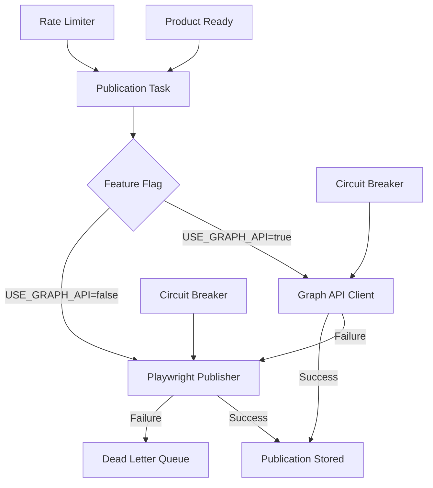

# PRP: Graph API + Playwright Hybrid Publisher

> **Priority**: P0 (CRÍTICO) | **Estimate**: 7-10 days | **Sprint**: 7 Phase 3
> **Created**: 2026-03-06 | **Status**: Draft | **Approach**: Spike → Standard

---

## 1. Overview

### 1.1 Summary

Implement a HYBRID Facebook Marketplace publisher with TWO strategies:
1. **Playwright** (PRIMARY during Sprint 7) - Browser automation with anti-detection
2. **Graph API** (SECONDARY post-sprint) - Official API after App Review

This hybrid approach allows us to START PUBLISHING IMMEDIATELY without waiting for Facebook App Review (14-30 days), while preparing for Graph API migration once approved.

**Why this matters**: Without immediate publishing capability, we cannot demonstrate value to dealers. The hybrid approach unblocks us while preparing for the robust Graph API solution.

### 1.2 Dependencies

- [ ] **PRP 1** (Task Queue) - For async publishing tasks
- [ ] **PRP 2** (Facebook OAuth) - For access tokens and pages
- [ ] **Playwright** - Browser automation (to be installed)
- [ ] **PostgreSQL** - For storing publications and results

### 1.3 Links

- Design Doc: `docs/plans/2026-03-06-sprint7-workflow-design.md` (Section 7: Publication Architecture)
- Requirements: `docs/REQUIREMENTS-SPRINT-7-MARKETPLACE.md` (Section 5: Integración Facebook)
- Playwright Docs: https://playwright.dev/python/
- Facebook Graph API: https://developers.facebook.com/docs/graph-api/reference/
- Facebook Marketplace: https://www.facebook.com/marketplace/

---

## 2. Requirements

### 2.1 User Stories

#### US-701: Publish Product via Playwright

**As a** Vendedor ProSell
**I want** to publish a product to Facebook Marketplace automatically
**So that** I don't have to manually copy-paste product details

**Acceptance Criteria**:
```gherkin
Scenario: Product published successfully
  GIVEN a product is ready to publish
  AND a Facebook page is selected
  WHEN the publish task executes
  THEN the product is published to Facebook Marketplace
  AND the publication ID is stored
  AND the product status is updated to "published"

Scenario: Publication fails with retry
  GIVEN the publication task fails
  AND the error is transient
  WHEN the task is retried
  THEN it succeeds after retry
  AND the publication is completed
```

#### US-702: Anti-Detection Measures

**As a** System
**I want** Playwright to behave like a human user
**So that** Facebook doesn't ban the account for bot activity

**Acceptance Criteria**:
```gherkin
Scenario: Playwright uses realistic timing
  GIVEN a product is being published
  WHEN filling the form
  THEN each action has 2-5 second delay
  AND typing is character-by-character (not instant)
  AND mouse movements follow natural curves

Scenario: Playwright uses realistic browser
  GIVEN a publication starts
  WHEN the browser launches
  THEN it uses a common User-Agent
  AND viewport is standard resolution (1920x1080)
  AND language is set to "es-ES"
```

#### US-703: Fallback to Graph API

**As a** System Administrator
**I want** to fallback from Playwright to Graph API if needed
**So that** publishing continues even if Playwright is detected

**Acceptance Criteria**:
```gherkin
Scenario: Graph API available, Playwright fails
  GIVEN Graph API is enabled
  AND Playwright publication fails
  WHEN the fallback triggers
  THEN Graph API publishes the product
  AND the result is stored

Scenario: Both strategies available
  GIVEN both Playwright and Graph API are enabled
  WHEN a product is published
  THEN Graph API is tried first
  AND Playwright is used as fallback
```

#### US-704: Scheduled Republishing

**As a** System
**I want** listings to be republished every 7 days
**So that** they don't expire and disappear from Marketplace

**Acceptance Criteria**:
```gherkin
Scenario: Listing expires soon
  GIVEN a publication is 7 days old
  WHEN the scheduled task runs
  THEN the listing is republished
  AND a new publication ID is stored
  AND the republish counter is incremented
```

### 2.2 Functional Requirements

- [FR-701] Playwright publisher must simulate human behavior (timing, mouse, typing)
- [FR-702] Playwright must use realistic browser fingerprint (UA, viewport, language)
- [FR-703] Graph API client must support Marketplace Listing creation
- [FR-704] System must support BOTH strategies via feature flag
- [FR-705] Publisher must auto-fallback from Graph API → Playwright on failure
- [FR-706] Publications must store marketplace_id (Facebook listing ID)
- [FR-707] Publications must track republish_count
- [FR-708] Rate limiter must prevent API abuse (token bucket)
- [FR-709] Circuit breaker must prevent cascade failures
- [FR-710] Image upload must support multiple photos (up to 10)

### 2.3 Non-Functional Requirements

- **Performance**:
  - Playwright publish: < 60 seconds (P95)
  - Graph API publish: < 10 seconds (P95)
  - Time-to-publish: < 30 seconds (overall target)
- **Reliability**:
  - Publish success rate > 99%
  - No duplicate publications for same product
  - Automatic retry on transient failures
- **Security**:
  - Access tokens never logged
  - Sessions persisted securely
  - Circuit breaker prevents API abuse

---

## 3. Technical Context

### 3.1 Tech Stack

| Component | Technology | Version | Notes |
|-----------|-----------|---------|-------|
| Browser Automation | Playwright | Latest | Async, Python 3.13 compatible |
| API Client | httpx | 0.28+ | For Graph API calls |
| Rate Limiting | Token Bucket algorithm | Custom | For API abuse prevention |
| Task Queue | Taskiq (from PRP 1) | Latest | For async publishing |
| Fingerprints | playwright-extra-plugin-stealth | Latest | Anti-detection |

### 3.2 Key Libraries

```bash
# Python dependencies (to add to pyproject.toml)
uv add playwright==1.48.0           # Browser automation
uv add playwright-extra-plugin-stealth  # Anti-detection

# Install Playwright browsers
playwright install chromium
```

### 3.3 External Documentation

**Playwright**:
- Docs: https://playwright.dev/python/
- Anti-detection: https://github.com/geometry-dashboard/Playwright-CLO
- Browser contexts: https://playwright.dev/python/docs/api/class-browser

**Facebook Graph API**:
- Marketplace: https://developers.facebook.com/docs/marketplace/
- Listing Create: https://developers.facebook.com/docs/graph-api/reference/page/feed
- Photos Upload: https://developers.facebook.com/docs/graph-api/reference/photo

**Facebook Marketplace Fields**:
- Vehicles: https://developers.facebook.com/docs/facebook-login/marketplace/vehicles

---

## 4. Implementation Blueprint

### 4.1 Architecture Overview



### 4.2 Spike Phase (Days 1-3)

**Objective**: Validate Playwright can publish to Facebook Marketplace without being banned

**Tasks**:
1. Create minimal Playwright script
2. Navigate to facebook.com/marketplace/create
3. Fill out listing form (title, price, photos)
4. Submit and verify listing created
5. Test anti-detection measures (UA, timing, mouse movement)
6. Test session persistence (cookies)
7. Test with multiple listings (check for rate limiting)
8. Document any CAPTCHA challenges or bans

**Success Criteria**:
- ✅ Listing published successfully
- ✅ No CAPTCHA challenges
- ✅ No account ban/warning
- ✅ Session persists across runs
- ✅ Multiple listings work (rate limit understood)

**Deliverable**: `docs/plans/2026-03-06-phase3-playwright-spike.md`

### 4.3 Implementation Steps

#### Step 1: Domain Layer - Publication Entities

**Files to create**:
- `apps/api/src/prosell/domain/entities/publication.py` - Publication entity
- `apps/api/src/prosell/domain/value_objects/publication_status.py` - Publication status enum
- `apps/api/src/prosell/domain/repositories/publication_repository.py` - Repository interface

**Implementation notes**:

```python
# publication.py - Publication entity
from datetime import UTC, datetime
from enum import Enum

from pydantic import Field

from prosell.domain.base import DomainModel

class PublicationStatus(str, Enum):
    """Publication status."""
    PENDING = "pending"
    IN_PROGRESS = "in_progress"
    PUBLISHED = "published"
    FAILED = "failed"
    EXPIRED = "expired"
    REMOVED = "removed"

class Publication(DomainModel):
    """Publication entity.

    Represents a Marketplace listing publication.
    """

    id: str
    product_id: str = Field(description="Product being published")
    marketplace: str = Field(default="facebook", description="Marketplace name")
    marketplace_id: str | None = Field(default=None, description="Listing ID in marketplace")
    seller_user_id: str = Field(description="Vendedor who published")
    facebook_page_id: str | None = Field(default=None, description="Facebook page used")
    status: PublicationStatus = Field(default=PublicationStatus.PENDING)
    publish_method: str = Field(description="playwright or graph_api")
    error_message: str | None = Field(default=None, description="Error if failed")
    published_at: datetime | None = Field(default=None, description="When published")
    expires_at: datetime | None = Field(default=None, description="When listing expires (7 days)")
    republish_count: int = Field(default=0, description="Number of republishes")
    created_at: datetime = Field(default_factory=lambda: datetime.now(UTC))
    updated_at: datetime = Field(default_factory=lambda: datetime.now(UTC))

    def mark_in_progress(self):
        """Mark publication as in progress."""
        self.status = PublicationStatus.IN_PROGRESS
        self.updated_at = datetime.now(UTC)

    def mark_published(self, marketplace_id: str):
        """Mark publication as successful."""
        self.status = PublicationStatus.PUBLISHED
        self.marketplace_id = marketplace_id
        self.published_at = datetime.now(UTC)
        # Facebook listings expire after 7 days
        self.expires_at = datetime.now(UTC) + timedelta(days=7)
        self.updated_at = datetime.now(UTC)

    def mark_failed(self, error: str):
        """Mark publication as failed."""
        self.status = PublicationStatus.FAILED
        self.error_message = error
        self.updated_at = datetime.now(UTC)

    def needs_republish(self) -> bool:
        """Check if listing needs republishing (expires in < 24h)."""
        if not self.expires_at:
            return False
        threshold = datetime.now(UTC) + timedelta(hours=24)
        return self.expires_at < threshold

# SQLAlchemy Model
class PublicationModel(Base):
    """SQLAlchemy model for Publication."""

    __tablename__ = "publications"

    id: Mapped[str] = mapped_column(String, primary_key=True)
    product_id: Mapped[str] = mapped_column(String, index=True)
    marketplace: Mapped[str] = mapped_column(String)
    marketplace_id: Mapped[str | None] = mapped_column(String, nullable=True)
    seller_user_id: Mapped[str] = mapped_column(String, index=True)
    facebook_page_id: Mapped[str | None] = mapped_column(String, nullable=True)
    status: Mapped[str] = mapped_column(String)
    publish_method: Mapped[str] = mapped_column(String)
    error_message: Mapped[str | None] = mapped_column(String, nullable=True)
    published_at: Mapped[datetime | None] = mapped_column(String, nullable=True)
    expires_at: Mapped[datetime | None] = mapped_column(String, nullable=True)
    republish_count: Mapped[int] = mapped_column(default=0)
    created_at: Mapped[datetime] = mapped_column(String)
    updated_at: Mapped[datetime] = mapped_column(String)
```

**Gotchas**:
- Store `marketplace_id` (Facebook listing ID) for tracking
- Track `republish_count` to monitor freshness
- Listings expire after 7 days (Facebook policy)

#### Step 2: Infrastructure Layer - Playwright Publisher

**Files to create**:
- `apps/api/src/prosell/infrastructure/publishing/playwright_publisher.py` - Playwright publisher
- `apps/api/src/prosell/infrastructure/publishing/anti_detection.py` - Anti-detection utilities

**Implementation notes**:

```python
# playwright_publisher.py - Playwright-based publisher
import asyncio
import secrets
from pathlib import Path
from random import randint, random, uniform

from playwright.async_api import async_playwright, Browser, Page, BrowserContext

from prosell.domain.entities.publication import Publication
from prosell.domain.entities.product import Product
from prosell.infrastructure.publishing.anti_detection import AntiDetectionMixin

class PlaywrightFBPublisher(AntiDetectionMixin):
    """Facebook Marketplace publisher using Playwright.

    Uses browser automation to publish listings.
    Includes anti-detection measures to avoid bot detection.
    """

    def __init__(self):
        self.user_agents = [
            # Windows Chrome
            "Mozilla/5.0 (Windows NT 10.0; Win64; x64) AppleWebKit/537.36 (KHTML, like Gecko) Chrome/122.0.0.0 Safari/537.36",
            # macOS Chrome
            "Mozilla/5.0 (Macintosh; Intel Mac OS X 10_15_7) AppleWebKit/537.36 (KHTML, like Gecko) Chrome/122.0.0.0 Safari/537.36",
            # macOS Safari
            "Mozilla/5.0 (Macintosh; Intel Mac OS X 10_15_7) AppleWebKit/605.1.15 (KHTML, like Gecko) Version/17.2 Safari/605.1.15",
        ]

        self.viewports = [
            {"width": 1920, "height": 1080},
            {"width": 1366, "height": 768},
            {"width": 1440, "height": 900},
        ]

        self.session_file = Path("fb_session.json")

    async def publish_marketplace_listing(
        self,
        product: Product,
        page_id: str,
        access_token: str,
    ) -> dict:
        """
        Publish product to Facebook Marketplace using Playwright.

        Args:
            product: Product to publish
            page_id: Facebook page ID to publish from
            access_token: Facebook page access token

        Returns:
            Dict with status and marketplace_id (if successful)

        Raises:
            PublicationException: If publication fails
        """
        async with async_playwright() as p:
            # Launch browser with anti-detection
            browser = await self._launch_browser()

            try:
                # Create context with realistic fingerprint
                context = await self._create_context(browser, access_token)

                # Navigate to marketplace
                page = await context.new_page()
                await page.goto("https://www.facebook.com/marketplace/create")

                # Random delay before starting
                await asyncio.sleep(uniform(2, 5))

                # Fill out the form
                await self._fill_title(page, product.title)
                await self._fill_price(page, product.price)
                await self._fill_category(page, product.category_id)
                await self._fill_description(page, product.description)
                await self._upload_photos(page, product.images)
                await self._fill_location(page, product.location)

                # Submit
                await self._submit_listing(page)

                # Get listing ID from URL or response
                marketplace_id = await self._extract_marketplace_id(page)

                return {
                    "status": "published",
                    "marketplace_id": marketplace_id,
                    "method": "playwright",
                }

            finally:
                # Save session
                if context:
                    await context.storage_state(path=str(self.session_file))

                await browser.close()

    async def _launch_browser(self) -> Browser:
        """Launch browser with anti-detection measures."""
        return await async_playwright().chromium.launch(
            headless=False,  # Set to True in production with xvfb
            args=[
                "--disable-blink-features=AutomationControlled",
                "--disable-dev-shm-usage",
                "--no-sandbox",
                "--disable-setuid-sandbox",
            ],
        )

    async def _create_context(
        self,
        browser: Browser,
        access_token: str,
    ) -> BrowserContext:
        """Create browser context with realistic fingerprint."""
        ua = random.choice(self.user_agents)
        viewport = random.choice(self.viewports)

        context = await browser.new_context(
            user_agent=ua,
            viewport=viewport,
            locale="es-ES",
            timezone_id="America/Argentina/Buenos_Aires",
            # Load existing session if available
            storage_state=str(self.session_file) if self.session_file.exists() else None,
        )

        # Inject access token into localStorage (for Graph API calls)
        await context.add_init_script(
            f"""
            localStorage.setItem('accessToken', '{access_token}');
            """
        )

        return context

    async def _fill_title(self, page: Page, title: str):
        """Fill title field with human-like typing."""
        await self._human_type(page, '[name="title"]', title)

    async def _fill_price(self, page: Page, price: int):
        """Fill price field with human-like typing."""
        # Price is usually in a specific input
        await self._human_type(page, '[name="price"]', str(price))

    async def _upload_photos(self, page: Page, images: list[str]):
        """Upload multiple photos with realistic delays."""
        photo_input = await page.query_selector('input[type="file"]')

        for i, image_url in enumerate(images[:10]):  # Max 10 photos
            await asyncio.sleep(uniform(1, 2))
            # Download image to temp file
            temp_path = await self._download_image(image_url)

            await photo_input.set_input_files(temp_path)

            # Wait for upload to complete
            await asyncio.sleep(uniform(1, 3))

    async def _submit_listing(self, page: Page):
        """Submit the listing with human-like delay."""
        submit_button = await page.query_selector('button[type="submit"]')

        # Random delay before submitting
        await asyncio.sleep(uniform(2, 4))

        await self._human_click(page, 'button[type="submit"]')

        # Wait for navigation
        await page.wait_for_load_state("networkidle", timeout=30000)

    async def _extract_marketplace_id(self, page: Page) -> str:
        """Extract listing ID from URL or page content."""
        # Facebook Marketplace URLs look like:
        # https://www.facebook.com/marketplace/item/1234567890/
        url = page.url

        if "/marketplace/item/" in url:
            return url.split("/")[-1].split("?")[0]

        # Fallback: Try to find in page content
        # ... (implementation depends on Facebook's current DOM)

        raise PublicationException("Could not extract marketplace ID")
```

```python
# anti_detection.py - Anti-detection utilities
import random
import asyncio
from typing import Literal

class AntiDetectionMixin:
    """Mixin with anti-detection methods."""

    async def _human_type(self, page: Page, selector: str, text: str):
        """Type text like a human (character by character)."""
        element = await page.query_selector(selector)
        await element.click()  # Focus

        for char in text:
            await element.type(char, delay=random.randint(50, 150))
            await asyncio.sleep(random.uniform(0.01, 0.05))

    async def _human_click(self, page: Page, selector: str):
        """Click with natural mouse movement."""
        element = await page.query_selector(selector)
        box = await element.bounding_box()

        # Bezier curve movement
        await page.mouse.move(
            box["x"] + box["width"] / 2,
            box["y"] + box["height"] / 2,
            steps=random.randint(10, 20),
        )

        await asyncio.sleep(random.uniform(0.5, 2.0))
        await element.click()

    def _human_delay(self, min_seconds: float = 2, max_seconds: float = 5):
        """Return a random delay for human-like timing."""
        return random.uniform(min_seconds, max_seconds)
```

**Gotchas**:
- Always use human-like delays (2-5 seconds between actions)
- Use `headless=False` during development, `xvfb` in production
- Save/load session to avoid repeated logins
- Randomize everything (UA, viewport, timing)

#### Step 3: Infrastructure Layer - Graph API Client

**Files to create**:
- `apps/api/src/prosell/infrastructure/publishing/graph_api_client.py` - Graph API client
- `apps/api/src/prosell/infrastructure/publishing/rate_limiter.py` - Rate limiter

**Implementation notes**:

```python
# graph_api_client.py - Facebook Graph API client
from datetime import UTC, datetime

import httpx

from prosell.infrastructure.publishing.rate_limiter import TokenBucketRateLimiter

class FacebookGraphAPIClient:
    """Facebook Graph API client for Marketplace publishing.

    Uses official Facebook Graph API (preferred method).
    """

    GRAPH_API_VERSION = "v19.0"
    MARKETPLACE_ENDPOINT = "https://graph.facebook.com/{version}/{{page_id}}/feed"

    def __init__(self, access_token: str, rate_limiter: TokenBucketRateLimiter):
        self.access_token = access_token
        self.rate_limiter = rate_limiter
        self.client = httpx.AsyncClient(timeout=30.0)

    async def publish_marketplace_listing(
        self,
        page_id: str,
        product: Product,
        images: list[str],
    ) -> dict:
        """
        Publish listing using Graph API.

        Args:
            page_id: Facebook page ID
            product: Product to publish
            images: List of image URLs

        Returns:
            Dict with post_id

        Raises:
            PublicationException: If API call fails
        """
        # Rate limit check
        await self.rate_limiter.acquire()

        # Upload photos first
        photo_ids = await self._upload_photos(page_id, images)

        # Create post
        url = f"https://graph.facebook.com/{self.GRAPH_API_VERSION}/{page_id}/feed"

        data = {
            "message": self._format_message(product),
            "published": False,  # Create as draft first
            "attached_media": [
                {"media_fbid": photo_id, "publish_state": "PUBLISHED"}
                for photo_id in photo_ids
            ],
        }

        response = await self.client.post(url, data=data)
        response.raise_for_status()

        result = response.json()

        # Check for errors
        if "error" in result:
            raise PublicationException(result["error"]["message"])

        return {
            "status": "published",
            "post_id": result["id"],
            "method": "graph_api",
        }

    async def _upload_photos(self, page_id: str, image_urls: list[str]) -> list[str]:
        """Upload photos to Facebook and return photo IDs."""
        photo_ids = []

        for url in image_urls[:10]:  # Max 10 photos
            # Download image
            image_data = await self._download_image(url)

            # Upload to Facebook
            upload_url = f"https://graph.facebook.com/{self.GRAPH_API_VERSION}/{page_id}/photos"
            files = {"source": ("photo.jpg", image_data, "image/jpeg")}
            data = {"published": False}

            response = await self.client.post(upload_url, files=files, data=data)
            response.raise_for_status()

            result = response.json()
            photo_ids.append(result["id"])

        return photo_ids

    def _format_message(self, product: Product) -> str:
        """Format listing description."""
        return f"""
{product.title}

{product.description}

Precio: ${product.price}

Contáctanos por más información.
        """.strip()
```

```python
# rate_limiter.py - Token bucket rate limiter
import time
from asyncio import sleep

class TokenBucketRateLimiter:
    """Token bucket algorithm for rate limiting.

    Prevents API abuse by limiting requests per time window.
    """

    def __init__(self, rate: int = 200, window: int = 3600):
        """
        Initialize rate limiter.

        Args:
            rate: Number of tokens (requests allowed)
            window: Time window in seconds (default 1 hour)
        """
        self.tokens = rate
        self.rate = rate / window  # Tokens per second
        self.last_update = time.time()

    async def acquire(self):
        """Acquire a token (wait if necessary)."""
        while True:
            now = time.time()
            elapsed = now - self.last_update

            # Refill tokens
            self.tokens = min(self.rate, self.tokens + elapsed * self.rate)
            self.last_update = now

            if self.tokens >= 1:
                self.tokens -= 1
                return

            # Not enough tokens, wait
            wait_time = (1 - self.tokens) / self.rate
            await sleep(wait_time)
```

**Gotchas**:
- Graph API has strict rate limits (200 calls/hour per page)
- Use rate limiter to avoid being banned
- Upload photos BEFORE creating post (attached_media)

#### Step 4: Infrastructure Layer - Hybrid Publisher

**Files to create**:
- `apps/api/src/prosell/infrastructure/publishing/hybrid_publisher.py` - Hybrid publisher

**Implementation notes**:

```python
# hybrid_publisher.py - Unified publisher with fallback
from prosell.core.config import settings

class HybridFacebookPublisher:
    """Hybrid Facebook publisher with automatic fallback.

    Strategy:
    1. Try Graph API first (if enabled and available)
    2. Fallback to Playwright if Graph API fails
    3. Circuit breaker prevents repeated failures
    """

    def __init__(
        self,
        graph_api_client: FacebookGraphAPIClient,
        playwright_publisher: PlaywrightFBPublisher,
        circuit_breaker: CircuitBreaker,
    ):
        self.graph_api_client = graph_api_client
        self.playwright_publisher = playwright_publisher
        self.circuit_breaker = circuit_breaker

    async def publish_marketplace_listing(
        self,
        product: Product,
        page_id: str,
        access_token: str,
    ) -> dict:
        """
        Publish listing with automatic fallback.

        Args:
            product: Product to publish
            page_id: Facebook page ID
            access_token: Page access token

        Returns:
            Dict with status and marketplace_id

        Strategy:
        - If USE_GRAPH_API=true: Try Graph API, fallback to Playwright
        - If USE_GRAPH_API=false: Use Playwright directly
        """
        # Direct to Playwright if Graph API disabled
        if not settings.use_graph_api:
            return await self.playwright_publisher.publish_marketplace_listing(
                product=product,
                page_id=page_id,
                access_token=access_token,
            )

        # Try Graph API first
        if self.circuit_breaker.state == CircuitState.OPEN:
            # Circuit breaker is OPEN, go straight to Playwright
            return await self._fallback_to_playwright(product, page_id, access_token)

        try:
            result = await self.circuit_breaker.call(
                self.graph_api_client.publish_marketplace_listing,
                product=product,
                page_id=page_id,
                images=product.images,
            )
            return result

        except Exception as e:
            # Graph API failed, fallback to Playwright
            return await self._fallback_to_playwright(product, page_id, access_token)

    async def _fallback_to_playwright(
        self,
        product: Product,
        page_id: str,
        access_token: str,
    ) -> dict:
        """Fallback to Playwright with logging."""
        logger.warning(
            f"Graph API failed, falling back to Playwright for product {product.id}"
        )

        return await self.playwright_publisher.publish_marketplace_listing(
            product=product,
            page_id=page_id,
            access_token=access_token,
        )
```

**Gotchas**:
- Feature flag `USE_GRAPH_API` controls strategy
- Circuit breaker prevents trying Graph API repeatedly if it's down
- Always log fallbacks for monitoring

#### Step 5: Application Layer - Use Cases

**Files to create**:
- `apps/api/src/prosell/application/use_cases/publishing/publish_product.py` - Publish use case
- `apps/api/src/prosell/application/use_cases/publishing/republish_listing.py` - Republish use case

**Implementation notes**:

```python
# publish_product.py - Publish product use case
from prosell.application.dto.publishing import PublishProductRequest, PublishProductResponse
from prosell.domain.entities.publication import Publication
from prosell.infrastructure.publishing.hybrid_publisher import HybridFacebookPublisher
from prosell.infrastructure.tasks.broker import broker

class PublishProductUseCase:
    """Use case for publishing a product to Facebook Marketplace."""

    def __init__(
        self,
        publisher: HybridFacebookPublisher,
        publication_repository: AbstractPublicationRepository,
    ):
        self.publisher = publisher
        self.publication_repository = publication_repository

    async def execute(self, request: PublishProductRequest) -> PublishProductResponse:
        """
        Publish product to Facebook Marketplace (async task).

        Args:
            request: Publish request

        Returns:
            Publication ID (task is queued)
        """
        # Create publication record
        publication = Publication(
            id=str(uuid4()),
            product_id=request.product_id,
            seller_user_id=request.seller_user_id,
            facebook_page_id=request.facebook_page_id,
            status=PublicationStatus.PENDING,
            publish_method="hybrid",
        )

        publication = await self.publication_repository.create(publication)

        # Enqueue async task
        from prosell.infrastructure.tasks.use_cases.publishing_tasks import publish_product_task

        await publish_product_task.kiq(
            publication_id=publication.id,
        )

        return PublishProductResponse(
            publication_id=publication.id,
            status="pending",
        )
```

```python
# publishing_tasks.py - Task queue tasks
from taskiq import task

from prosell.infrastructure.tasks.broker import broker

@task(broker=broker)
async def publish_product_task(publication_id: str) -> dict:
    """Async task to publish a product.

    Called by Taskiq worker.
    """
    from prosell.infrastructure.database.session import async_session
    from prosell.infrastructure.repositories.publication_repository_impl import SqlAlchemyPublicationRepository
    from prosell.infrastructure.repositories.product_repository_impl import SqlAlchemyProductRepository
    from prosell.infrastructure.publishing.hybrid_publisher import HybridFacebookPublisher

    async with async_session() as session:
        pub_repo = SqlAlchemyPublicationRepository(session)
        product_repo = SqlAlchemyProductRepository(session)

        # Get publication
        publication = await pub_repo.get_by_id(publication_id)
        if not publication:
            raise ValueError(f"Publication not found: {publication_id}")

        # Get product
        product = await product_repo.get_by_id(publication.product_id)
        if not product:
            raise ValueError(f"Product not found: {publication.product_id}")

        # Mark as in progress
        publication.mark_in_progress()
        await pub_repo.update(publication)

        # Get Facebook account
        fb_account = await get_facebook_account(publication.seller_user_id)
        if not fb_account:
            raise ValueError(f"No Facebook account for user: {publication.seller_user_id}")

        # Get page access token
        page_token = await get_page_token(fb_account, publication.facebook_page_id)

        # Publish
        publisher = HybridFacebookPublisher(...)
        result = await publisher.publish_marketplace_listing(
            product=product,
            page_id=publication.facebook_page_id,
            access_token=page_token,
        )

        # Update publication
        publication.mark_published(result["marketplace_id"])
        publication.publish_method = result["method"]
        await pub_repo.update(publication)

        return result
```

**Gotchas**:
- Use async tasks for publishing (don't block API response)
- Store publication record BEFORE enqueueing task
- Update publication record with result

#### Step 6: Scheduler - Republish Task

**Files to create**:
- `apps/api/src/prosell/infrastructure/tasks/use_cases/republish_tasks.py` - Republish scheduled task

**Implementation notes**:

```python
# republish_tasks.py - Scheduled republish task
from taskiq import TaskiqScheduler
from taskiq import task

from prosell.infrastructure.tasks.broker import broker

scheduler = TaskiqScheduler(broker=broker)

@scheduler.scheduled(cron="0 9 * * *")  # 9 AM daily
@task(broker=broker)
async def republish_expired_listings():
    """Re-publish listings that expire within 24 hours."""
    from prosell.infrastructure.database.session import async_session
    from prosell.infrastructure.repositories.publication_repository_impl import SqlAlchemyPublicationRepository

    async with async_session() as session:
        repo = SqlAlchemyPublicationRepository(session)

        # Find publications expiring in 24h
        expiring = await repo.get_expiring_publications(hours=24)

        results = []
        for publication in expiring:
            try:
                # Enqueue republish task
                await republish_single_listing.kiq(publication.id)
                results.append({"publication_id": publication.id, "status": "queued"})
            except Exception as e:
                results.append({"publication_id": publication.id, "status": "failed", "error": str(e)})

        return {
            "total": len(expiring),
            "queued": len([r for r in results if r["status"] == "queued"]),
            "failed": len([r for r in results if r["status"] == "failed"]),
        }

@task(broker=broker)
async def republish_single_listing(publication_id: str) -> dict:
    """Re-publish a single listing."""
    # Similar to publish_product_task
    # ... (implementation omitted for brevity)
```

**Gotchas**:
- Schedule for 9 AM daily (before listings expire)
- Increment `republish_count` each time
- Create NEW publication record for each republish

#### Step 7: Configuration - Settings

**Files to modify**:
- `apps/api/src/prosell/core/config.py` - Add feature flags

**Implementation notes**:

```python
# Add to Settings class:

# =============================================================================
# FACEBOOK PUBLISHING
# =============================================================================
use_graph_api: bool = Field(
    default=False,  # Start with Playwright, switch after App Review
    description="Use Graph API (true) or Playwright (false)",
)
use_playwright: bool = Field(
    default=True,
    description="Use Playwright automation",
)

# =============================================================================
# PLAYWRIGHT
# =============================================================================
playwright_headless: bool = Field(
    default=True,
    description="Run Playwright in headless mode (requires xvfb in production)",
)
playwright_timeout: int = Field(
    default=30000,  # 30 seconds
    description="Playwright operation timeout in milliseconds",
)
playwright_slow_mo: int = Field(
    default=0,
    description="Slow down Playwright operations by this many ms (for debugging)",
)

# =============================================================================
# GRAPH API
# =============================================================================
graph_api_rate_limit: int = Field(
    default=200,
    description="Graph API rate limit (calls per hour)",
)
graph_api_rate_window: int = Field(
    default=3600,
    description="Graph API rate limit window (seconds)",
)
```

**Gotchas**:
- Start with `USE_GRAPH_API=false`, `USE_PLAYWRIGHT=true`
- After App Review: switch to `USE_GRAPH_API=true`, `USE_PLAYWRIGHT=true` (fallback)

---

## 5. Code Patterns & Examples

### 5.1 Playwright Anti-Detection Pattern

**Reference**: `apps/api/src/prosell/infrastructure/publishing/playwright_publisher.py`

```python
# Pattern: Human-like typing
async def _human_type(page: Page, selector: str, text: str):
    element = await page.query_selector(selector)
    await element.click()

    for char in text:
        await element.type(char, delay=random.randint(50, 150))
        await asyncio.sleep(random.uniform(0.01, 0.05))

# Pattern: Human-like clicking
async def _human_click(page: Page, selector: str):
    element = await page.query_selector(selector)
    box = await element.bounding_box()

    # Bezier movement
    await page.mouse.move(
        box["x"] + box["width"] / 2,
        box["y"] + box["height"] / 2,
        steps=random.randint(10, 20),
    )

    await asyncio.sleep(random.uniform(0.5, 2.0))
    await element.click()
```

### 5.2 Hybrid Publisher Pattern

**Reference**: `apps/api/src/prosell/infrastructure/publishing/hybrid_publisher.py`

```python
# Pattern: Try Graph API, fallback to Playwright
async def publish(product, page_id, token):
    if settings.use_graph_api:
        try:
            return await graph_api_client.publish(product, page_id, token)
        except Exception as e:
            logger.warning(f"Graph API failed: {e}, falling back to Playwright")
            return await playwright_publisher.publish(product, page_id, token)
    else:
        return await playwright_publisher.publish(product, page_id, token)
```

---

## 6. Validation Gates

### 6.1 Pre-commit Checks

```bash
# Linting
ruff check --fix && ruff format .

# Type checking
pyright
```

### 6.2 Unit Tests

```bash
# Backend unit tests
cd apps/api && uv run pytest tests/unit/infrastructure/publishing/ -v
```

### 6.3 Integration Tests

```bash
# Playwright tests (need running browser)
cd apps/api && uv run pytest tests/integration/publishing/playwright/ -v
```

### 6.4 E2E Tests

```bash
# E2E: Complete publish flow
# 1. Create product
# 2. Publish to Facebook (task enqueued)
# 3. Wait for task to complete
# 4. Verify publication in Facebook
# 5. Verify publication record in DB
```

---

## 7. Testing Strategy

### 7.1 Unit Tests

**Playwright Publisher Tests**:
- Test `_human_type()` adds delays between characters
- Test `_human_click()` moves mouse in Bezier curves
- Test `_extract_marketplace_id()` parses URL correctly

**Graph API Client Tests**:
- Test rate limiter blocks when tokens exhausted
- Test `publish_marketplace_listing()` formats request correctly
- Test photo upload returns photo IDs

**Hybrid Publisher Tests**:
- Test Graph API tried first when enabled
- Test fallback to Playwright on Graph API failure
- Test circuit breaker prevents repeated calls

### 7.2 Integration Tests

**Playwright Integration**:
- Test complete flow (browser → Facebook → listing created)
- Test session persistence (cookies saved/loaded)
- Test anti-detection (no CAPTCHA)

**Graph API Integration**:
- Test API call succeeds with valid token
- Test rate limiter enforces limits

### 7.3 E2E Tests

**Critical Path**:
```gherkin
Scenario: Product published successfully
  GIVEN a product exists
  AND a Facebook page is connected
  WHEN the publish task executes
  THEN the product is published to Facebook
  AND the publication record is updated
  AND the marketplace_id is stored
```

### 7.4 Coverage Targets

- Unit tests: > 80%
- Integration tests: > 70%
- E2E tests: Critical paths only

---

## 8. Common Pitfalls

### 8.1 Playwright Detection

**Problem**: Facebook detects Playwright as a bot and shows CAPTCHA.

**Solution**: Use anti-detection measures (UA, timing, mouse movement). If still detected, use multiple accounts.

### 8.2 Session Persistence

**Problem**: Playwright has to re-login every time (slow + suspicious).

**Solution**: Save and load `storage_state` (cookies) to persist session.

### 8.3 Graph API Photo Upload

**Problem**: Creating post with photos fails if photos not uploaded first.

**Solution**: Upload photos, get photo IDs, then create post with `attached_media`.

---

## 9. Rollback Plan

If implementation fails:

1. **Playwright banned permanently**: Use Graph API only (requires App Review)
2. **Both strategies fail**: Manual publishing (CSV export, upload manually)
3. **Rate limiting too strict**: Increase rate limit or use multiple accounts
4. **Headless mode issues**: Run with `headless=False` (visible browser)

---

## 10. Implementation Tasks (Ordered)

1. ✅ Create spike POC (Playwright anti-detection)
2. ✅ Document spike findings
3. ✅ Install Playwright + plugins
4. ✅ Install Chromium browsers
5. ✅ Implement rate limiter (token bucket)
6. ✅ Implement circuit breaker
7. ✅ Implement Playwright publisher
8. ✅ Implement Graph API client
9. ✅ Implement hybrid publisher
10. ✅ Implement publish use case
11. ✅ Implement republish task
12. ✅ Create publication entities
13. ✅ Create API endpoints
14. ✅ Write unit tests (>80% coverage)
15. ✅ Write integration tests
16. ✅ Test Playwright with real Facebook account
17. ✅ Test Graph API with test app
18. ✅ Test hybrid fallback
19. ✅ Update documentation
20. ✅ Deploy to staging
21. ✅ Smoke test on staging
22. ✅ Merge to main

---


---

## 11. Completion Gates (VERIFIABLE)

Estos son los **tests de completitud** ejecutables que validan que el PRP está completo.

### 11.1 Spike Validation (si aplica)

```bash
# Spike POC completado y documentado
test -f docs/plans/2026-03-06-3-graphapi-playwright-spike.md
# Expected: File exists with findings
```

### 11.2 Unit Tests

```bash
# Tests unitarios pasan con coverage requerido
cd apps/api && uv run pytest tests/unit/ -v --cov=src --cov-report=term-missing
# Expected: All pass, coverage > 80%
```

### 11.3 Integration Tests

```bash
# Tests de integración pasan
cd apps/api && uv run pytest tests/integration/ -v
# Expected: All pass, coverage > 70%
```

### 11.4 Code Quality

```bash
# No errores de linting
cd apps/api && ruff check .
# Expected: Exit code 0

# No errores de tipo
cd apps/api && pyright .
# Expected: 0 errors
```

### 11.5 Documentation

```bash
# PRP documentación completa
grep -q "^## 11. Completion Gates" {prp_file}
# Expected: Pattern found (you're reading it!)
```

### 11.6 Final Checklist

- [ ] Spike completado (si aplica)
- [ ] Todos los tests unitarios pasan (>80%)
- [ ] Todos los tests de integración pasan (>70%)
- [ ] No errores de pyright (0 errores)
- [ ] No errores de ruff (0 errores)
- [ ] Documentación actualizada
- [ ] Code review completado
- [ ] E2E tests pasan (si aplica)


## Confidence Score

**Score**: 7/10

**Reasoning**:

**Positive factors**:
- Playwright is well-documented and reliable
- Hybrid approach provides fallback strategy
- Similar patterns exist in codebase (OAuth from PRP 2)
- Rate limiter and circuit breaker proven patterns

**Risk factors**:
- Facebook may detect Playwright as bot (anti-detection is cat-and-mouse)
- Graph API App Review uncertain (but Playwright unblocks us)
- Session persistence may fail (Facebook changes cookie behavior)
- Playwright requires heavy dependencies (Chromium ~300MB)

**Mitigation**:
- Spike validates anti-detection measures
- Hybrid strategy means we're not blocked on App Review
- Circuit breaker prevents cascade failures
- Multiple Facebook accounts provide redundancy

---

## Appendix A: Anti-Detection Checklist

### Critical (Must Have)

- [x] Random User-Agent from real browsers
- [x] Realistic viewport (1920x1080, 1366x768)
- [x] Human-like delays (2-5 seconds) between actions
- [x] Character-by-character typing (50-150ms per char)
- [x] Natural mouse movement (Bezier curves, 10-20 steps)
- [x] Language set to "es-ES"
- [x] Timezone set to "America/Argentina/Buenos_Aires"

### Important (Should Have)

- [x] Session persistence (cookies saved/loaded)
- [x] Random action order (don't always fill fields same way)
- [x] Scroll behavior (natural scroll, not jump)

### Nice to Have

- [ ] Occasional typos (backspace corrections)
- [ ] Random pauses (think time)
- [ ] Different browsers (Chrome, Firefox, Safari)

---

**END OF PRP**
