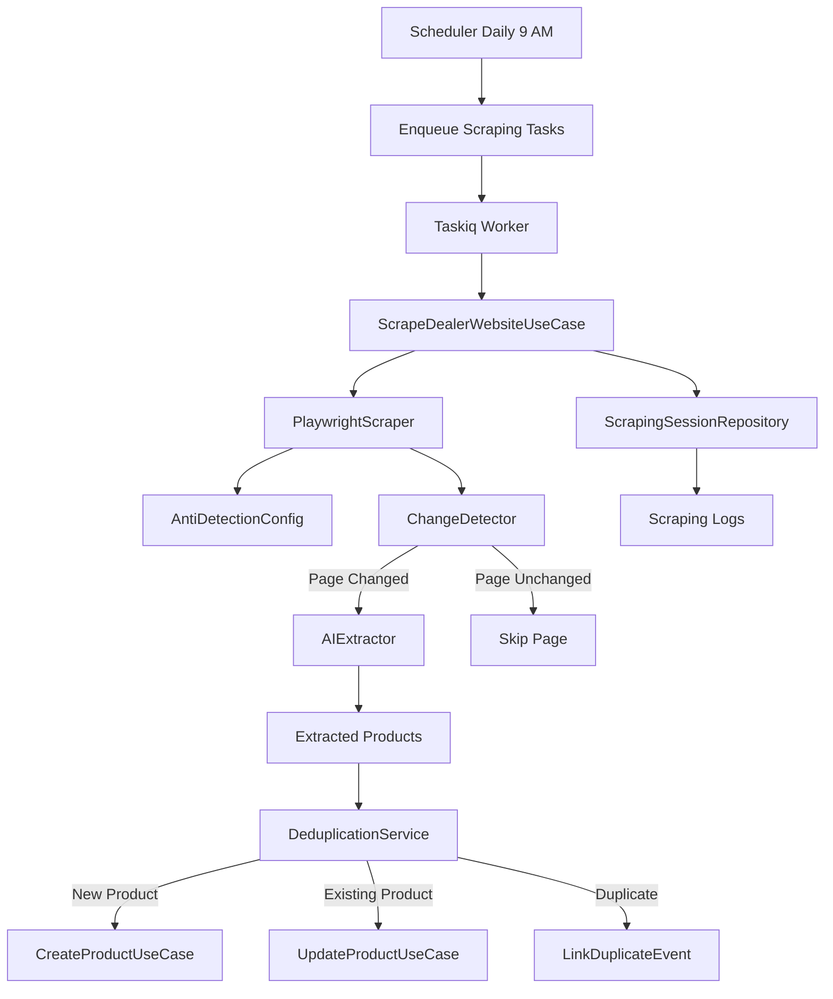

# PRP: Scraping System with AI Extraction

> **Priority**: P0 (CRÍTICO) | **Estimate**: 7-9 days | **Sprint**: 7 Phase 4
> **Created**: 2026-03-06 | **Status**: Draft | **Approach**: Spike → Standard

---

## 1. Overview

### 1.1 Summary

Implement an automated web scraping system that detects changes daily on dealer websites, performs incremental scraping with deduplication, and uses AI agents for intelligent data extraction. This system eliminates manual inventory updates by automatically detecting new/sold vehicles on dealer websites.

**Why this matters**: Without automated scraping, admins must manually check dealer websites daily and update inventory by hand. As the number of dealers grows, this becomes operationally impossible. The scraping system enables:
- Daily automatic inventory sync from dealer websites
- Detection of new vehicles listed for sale
- Detection of sold vehicles (removed from website)
- AI-powered extraction from unstructured HTML
- Incremental scraping (only process changed pages)

### 1.2 Dependencies

- [ ] PRP 1: Task Queue (for async scraping jobs)
- [ ] PRP 1: Multi-Language (for product validation)
- [ ] Sprint 5-6: Products Module (for persistence)
- [ ] Playwright installed (`playwright` package)
- [ ] Redis running (for task queue + caching)
- [ ] PostgreSQL (for product storage + scraping logs)

### 1.3 Links

- Design Doc: `docs/plans/2026-03-06-sprint7-workflow-design.md` (Section: Scraping System)
- Requirements: `docs/REQUIREMENTS-SPRINT-7-MARKETPLACE.md` (Section P1: Scraping)
- Product Entities: `apps/api/src/prosell/domain/entities/product.py` (Sprint 5-6)

---

## 2. Requirements

### 2.1 User Stories

#### US-741: Daily Change Detection

**As a** System Administrator
**I want** the system to automatically check dealer websites daily for changes
**So that** inventory stays up-to-date without manual intervention

**Acceptance Criteria**:
```gherkin
Scenario: Daily scraping job executes
  GIVEN a dealer has a website URL configured
  WHEN the daily scheduled job triggers
  THEN the scraper checks for changes
  AND new products are detected
  AND removed products are marked as sold

Scenario: No changes detected
  GIVEN a dealer website has no new products
  WHEN the scraper runs
  THEN no new products are created
  AND the scraping session logs "no changes"
```

#### US-742: Incremental Scraping

**As a** System Administrator
**I want** the scraper to only process pages that changed
**So that** scraping is fast and doesn't waste resources

**Acceptance Criteria**:
```gherkin
Scenario: Incremental scraping skips unchanged pages
  GIVEN a page was scraped yesterday
  AND the page content hasn't changed (ETag match)
  WHEN the scraper checks that page
  THEN the page is skipped
  AND no AI extraction occurs

Scenario: Incremental scraping processes changed pages
  GIVEN a page was scraped yesterday
  AND the page content changed today
  WHEN the scraper checks that page
  THEN the page is re-scraped
  AND products are updated
```

#### US-743: Deduplication

**As a** System Administrator
**I want** the scraper to detect duplicate products across pages
**So that** we don't create duplicate inventory entries

**Acceptance Criteria**:
```gherkin
Scenario: Duplicate detection by URL
  GIVEN a product with URL "site.com/toyota-corolla-123" exists
  WHEN the scraper finds the same URL again
  THEN the existing product is updated
  AND no duplicate is created

Scenario: Duplicate detection by content hash
  GIVEN a product with content hash "abc123" exists
  WHEN the scraper finds a product with the same hash
  THEN the products are linked as duplicates
  AND the admin is notified for review
```

#### US-744: AI Data Extraction

**As a** System Administrator
**I want** the scraper to use AI to extract product data from unstructured HTML
**So that** we can scrape any dealer website regardless of structure

**Acceptance Criteria**:
```gherkin
Scenario: AI extracts product from HTML
  GIVEN an HTML page contains vehicle information
  WHEN the AI extractor processes the page
  THEN structured product data is returned
  AND make, model, year, price are extracted

Scenario: AI handles multiple page layouts
  GIVEN Dealer A uses layout Type 1
  AND Dealer B uses layout Type 2
  WHEN the scraper processes both sites
  THEN products are extracted from both
  AND accuracy rate > 80%
```

#### US-745: Anti-Detection

**As a** System Administrator
**I want** the scraper to avoid bot detection
**So that** dealer websites don't block our scraping

**Acceptance Criteria**:
```gherkin
Scenario: Realistic browser behavior
  GIVEN the scraper visits a dealer website
  WHEN the page loads
  THEN the User-Agent matches a real browser
  AND viewport is realistic (1920x1080)
  AND delays between actions are 2-5 seconds
  AND mouse movement is simulated

Scenario: No bot detection
  GIVEN the scraper has been running for 30 days
  WHEN reviewing scraping logs
  THEN zero IP bans have occurred
  AND zero CAPTCHAs were triggered
```

### 2.2 Functional Requirements

- [FR-741] System must support scheduled daily scraping (cron)
- [FR-742] System must detect changes via ETag/Last-Modified headers
- [FR-743] System must deduplicate by URL and content hash
- [FR-744] System must extract structured data using AI (rules-based initially)
- [FR-745] System must implement anti-detection measures (User-Agent, viewport, delays)
- [FR-746] System must handle scraping failures gracefully (circuit breaker)
- [FR-747] System must log all scraping sessions for audit
- [FR-748] System must support manual scraping trigger (admin API)
- [FR-749] System must validate extracted products against field_config
- [FR-750] System must notify admins of new products or errors

### 2.3 Non-Functional Requirements

- **Performance**:
  - Scraping latency: < 30 seconds per page
  - Daily batch completion: < 1 hour for 100 dealers
  - Memory usage: < 1GB per scraping worker
- **Reliability**:
  - Scraping success rate: > 95%
  - Automatic retry on transient failures (3 attempts)
  - No data loss (checkpointing)
- **Security**:
  - No scraping of sites without dealer permission
  - Rate limiting per domain (respect robots.txt)
  - Rotate User-Agents to avoid patterns

---

## 3. Technical Context

### 3.1 Tech Stack

| Component | Technology | Version | Notes |
|-----------|-----------|---------|-------|
| Scraping | Playwright Python | Latest | Async browser automation |
| Anti-Detection | playwright-extra-plugin-stealth | Latest | Bot detection avoidance |
| AI Extraction | Rules-based (initially) → LLM (future) | - | OpenAI GPT-4 or Anthropic Claude |
| Task Queue | Taskiq (from PRP 1) | Latest | Async job processing |
| Deduplication | Content hashing (SHA256) | - | Python hashlib |
| Change Detection | ETag/Last-Modified | - | HTTP headers |

### 3.2 Key Libraries

```bash
# Python dependencies (to add to pyproject.toml)
uv add playwright                         # Browser automation
uv add playwright-extra                   # Extra plugins
uv add playwright-extra-plugin-stealth    # Anti-detection
uv install playwright                     # Install browser binaries

# AI extraction (future, after spike)
# uv add openai                           # GPT-4 for extraction
# uv add anthropic                        # Claude for extraction

# Playwright browsers installation
playwright install chromium
```

### 3.3 External Documentation

**Playwright Python**:
- Docs: https://playwright.dev/python/docs/api/class-playwright
- Async API: https://playwright.dev/python/docs/api/class-playwrightasync
- Launch Options: https://playwright.dev/python/docs/api/class-browsertype#browser-type-launch

**Anti-Detection**:
- playwright-extra: https://github.com/berstend/puppeteer-extra/tree/master/packages/playwright-extra
- Stealth Plugin: https://github.com/berstend/puppeteer-extra/tree/master/packages/puppeteer-extra-plugin-stealth

**Web Scraping Best Practices**:
- robots.txt: https://developers.google.com/search/docs/crawling-indexing/robots-txt
- Rate Limiting: https://developer.mozilla.org/en-US/docs/Web/HTTP/Headers/Retry-After

---

## 4. Implementation Blueprint

### 4.1 Architecture Overview



### 4.2 Spike Phase (Days 1-2)

**Objective**: Validate Playwright works with anti-detection and AI extraction

**Tasks**:
1. Create minimal Playwright scraper with stealth plugin
2. Test on sample dealer website (user-provided URL)
3. Verify anti-detection measures (no bot detection)
4. Test AI extraction (rules-based initially)
5. Test incremental scraping (ETag detection)
6. Benchmark scraping performance (time per page)
7. Test deduplication logic

**Success Criteria**:
- ✅ Playwright launches with stealth plugin (no detection)
- ✅ Scraper extracts at least 1 product from test site
- ✅ ETag detection skips unchanged pages
- ✅ Deduplication prevents duplicate products
- ✅ Scraping completes in < 30 seconds per page

**Decision Document**: Create `docs/plans/2026-03-06-phase4-scraping-spike.md` with findings

### 4.3 Implementation Steps

#### Step 1: Domain Layer - Scraping Entities

**Files to create**:
- `apps/api/src/prosell/domain/entities/scraping_session.py` - Scraping session entity
- `apps/api/src/prosell/domain/value_objects/scraped_product.py` - Scraped product value object
- `apps/api/src/prosell/domain/events/product_events.py` - Product change events
- `apps/api/src/prosell/domain/ports/i_scraper.py` - Scraper interface
- `apps/api/src/prosell/domain/ports/i_ai_extractor.py` - AI extractor interface
- `apps/api/src/prosell/domain/repositories/scraping_session_repository.py` - Scraping session repo interface

**Implementation notes**:

```python
# scraping_session.py - Scraping session entity
from datetime import UTC, datetime
from enum import StrEnum
from uuid import UUID, uuid4

from pydantic import Field

from prosell.domain.base import DomainModel

class ScrapingStatus(StrEnum):
    """Scraping session status."""
    PENDING = "pending"
    RUNNING = "running"
    COMPLETED = "completed"
    FAILED = "failed"
    PARTIAL = "partial"  # Some pages failed

class ScrapingSession(DomainModel):
    """
    Scraping session entity.

    Tracks a single scraping run for a dealer.
    """

    id: UUID = Field(default_factory=uuid4)
    dealer_id: UUID
    started_at: datetime = Field(default_factory=lambda: datetime.now(UTC))
    completed_at: datetime | None = None
    status: ScrapingStatus = ScrapingStatus.PENDING

    # Metrics
    pages_checked: int = 0
    pages_changed: int = 0
    pages_skipped: int = 0  # Incremental scraping
    products_found: int = 0
    products_created: int = 0
    products_updated: int = 0
    duplicates_found: int = 0

    # Error tracking
    errors: list[str] = []

    # Checkpoint for resume capability
    last_processed_url: str | None = None

    def start(self) -> None:
        """Mark session as running."""
        self.status = ScrapingStatus.RUNNING
        self.started_at = datetime.now(UTC)

    def complete(self) -> None:
        """Mark session as completed."""
        self.status = ScrapingStatus.COMPLETED
        self.completed_at = datetime.now(UTC)

    def fail(self, error: str) -> None:
        """Mark session as failed."""
        self.status = ScrapingStatus.FAILED
        self.completed_at = datetime.now(UTC)
        self.errors.append(error)

    def mark_page_checked(self, changed: bool = False) -> None:
        """Record a page check."""
        self.pages_checked += 1
        if changed:
            self.pages_changed += 1
        else:
            self.pages_skipped += 1

    def record_product(self, created: bool = False) -> None:
        """Record a product found."""
        self.products_found += 1
        if created:
            self.products_created += 1
        else:
            self.products_updated += 1
```

```python
# scraped_product.py - Scraped product value object
from dataclasses import dataclass

from prosell.domain.base import ValueObject

@dataclass(frozen=True)
class ScrapedProduct(ValueObject):
    """
    Scraped product value object.

    Immutable data extracted from a webpage.
    Not persisted until validated and converted to Product entity.
    """

    # Source
    source_url: str
    source_domain: str

    # Product data (extracted by AI)
    title: str
    description: str | None
    price: float | None
    currency: str = "USD"

    # Vehicle-specific (if applicable)
    make: str | None = None
    model: str | None = None
    year: int | None = None
    mileage: int | None = None
    color: str | None = None
    transmission: str | None = None
    fuel_type: str | None = None

    # Media
    images: list[str] = ()

    # Deduplication
    content_hash: str | None = None  # SHA256 of normalized data

    # Metadata
    scraped_at: str | None = None  # ISO timestamp
```

```python
# i_scraper.py - Scraper interface (Port)
from typing import Protocol

from prosell.domain.value_objects.scraped_product import ScrapedProduct

class AbstractScraper(Protocol):
    """
    Web scraper interface.

    This is a Port in Clean Architecture.
    Infrastructure layer implements this with Playwright.
    """

    async def scrape_page(self, url: str) -> list[ScrapedProduct]:
        """
        Scrape a single page for products.

        Args:
            url: URL to scrape

        Returns:
            List of scraped products
        """
        ...

    async def scrape_site(
        self,
        base_url: str,
        max_pages: int = 100,
    ) -> list[ScrapedProduct]:
        """
        Scrape an entire site (pagination).

        Args:
            base_url: Base URL of the site
            max_pages: Maximum pages to scrape

        Returns:
            List of all scraped products
        """
        ...
```

**Gotchas**:
- ScrapingSession is immutable after completion (no updates)
- ScrapedProduct is a Value Object (frozen dataclass)
- All scraping logic lives in infrastructure, domain only defines interfaces

#### Step 2: Infrastructure Layer - Playwright Scraper

**Files to create**:
- `apps/api/src/prosell/infrastructure/scraping/__init__.py` - Package init
- `apps/api/src/prosell/infrastructure/scraping/playwright_scraper.py` - Playwright scraper implementation
- `apps/api/src/prosell/infrastructure/scraping/anti_detection.py` - Anti-detection config
- `apps/api/src/prosell/infrastructure/scraping/change_detector.py` - Change detection (ETag)
- `apps/api/src/prosell/infrastructure/scraping/ai_extractor.py` - AI data extraction
- `apps/api/src/prosell/infrastructure/scraping/deduplication.py` - Deduplication service
- `apps/api/src/prosell/infrastructure/repositories/scraping_session_repository_impl.py` - Scraping session repo

**Implementation notes**:

```python
# playwright_scraper.py - Playwright scraper implementation
from playwright.async_api import async_playwright, Browser, Page

from prosell.domain.ports.i_scraper import AbstractScraper
from prosell.domain.value_objects.scraped_product import ScrapedProduct
from prosell.infrastructure.scraping.anti_detection import get_stealth_context
from prosell.infrastructure.scraping.change_detector import ChangeDetector
from prosell.infrastructure.scraping.ai_extractor import AIExtractor

class PlaywrightScraper(AbstractScraper):
    """
    Playwright-based web scraper with anti-detection.

    Implements the AbstractScraper port (Adapter in Clean Architecture).
    """

    def __init__(
        self,
        change_detector: ChangeDetector,
        ai_extractor: AIExtractor,
    ):
        self.change_detector = change_detector
        self.ai_extractor = ai_extractor

    async def scrape_page(self, url: str) -> list[ScrapedProduct]:
        """
        Scrape a single page for products.

        Args:
            url: URL to scrape

        Returns:
            List of scraped products
        """
        # Check if page changed (incremental scraping)
        if not await self.change_detector.has_changed(url):
            return []  # Skip unchanged pages

        async with async_playwright() as p:
            # Launch browser with anti-detection
            browser = await p.chromium.launch(
                headless=True,  # Use "new" headless mode
                args=get_anti_detection_args(),
            )

            # Create context with stealth
            context = await get_stealth_context(browser)

            page = await context.new_page()

            try:
                # Navigate to page
                await page.goto(
                    url,
                    wait_until="domcontentloaded",
                    timeout=30000,
                )

                # Wait for dynamic content
                await page.wait_for_timeout(2000)  # 2 seconds

                # Extract HTML
                html = await page.content()

                # Use AI to extract products
                products = await self.ai_extractor.extract(html, url)

                # Mark page as checked
                await self.change_detector.mark_checked(url)

                return products

            finally:
                await browser.close()

    async def scrape_site(
        self,
        base_url: str,
        max_pages: int = 100,
    ) -> list[ScrapedProduct]:
        """
        Scrape an entire site (pagination).

        Args:
            base_url: Base URL of the site
            max_pages: Maximum pages to scrape

        Returns:
            List of all scraped products
        """
        all_products = []

        async with async_playwright() as p:
            browser = await p.chromium.launch(
                headless=True,
                args=get_anti_detection_args(),
            )
            context = await get_stealth_context(browser)
            page = await context.new_page()

            try:
                page_num = 1
                while page_num <= max_pages:
                    # Navigate to page
                    url = f"{base_url}?page={page_num}"
                    await page.goto(url, wait_until="domcontentloaded")

                    # Check if page exists
                    if await page.title() == "404 Not Found":
                        break

                    # Extract products
                    html = await page.content()
                    products = await self.ai_extractor.extract(html, url)
                    all_products.extend(products)

                    # Check for next page
                    next_button = await page.query_selector("a.next-page")
                    if not next_button:
                        break

                    page_num += 1

                return all_products

            finally:
                await browser.close()
```

```python
# anti_detection.py - Anti-detection configuration
from playwright.async_api import Browser, BrowserContext

# Realistic User-Agents (rotated)
USER_AGENTS = [
    # Chrome on Windows
    "Mozilla/5.0 (Windows NT 10.0; Win64; x64) AppleWebKit/537.36 (KHTML, like Gecko) Chrome/122.0.0.0 Safari/537.36",
    # Chrome on macOS
    "Mozilla/5.0 (Macintosh; Intel Mac OS X 10_15_7) AppleWebKit/537.36 (KHTML, like Gecko) Chrome/122.0.0.0 Safari/537.36",
    # Firefox on Windows
    "Mozilla/5.0 (Windows NT 10.0; Win64; x64; rv:123.0) Gecko/20100101 Firefox/123.0",
    # Safari on macOS
    "Mozilla/5.0 (Macintosh; Intel Mac OS X 10_15_7) AppleWebKit/605.1.15 (KHTML, like Gecko) Version/17.3.1 Safari/605.1.15",
]

# Realistic viewports
VIEWPORTS = [
    {"width": 1920, "height": 1080},  # Full HD
    {"width": 1366, "height": 768},   # Laptop
    {"width": 1440, "height": 900},   # MacBook
    {"width": 1536, "height": 864},   # Common desktop
]

def get_anti_detection_args() -> list[str]:
    """
    Get Chromium arguments for anti-detection.

    Returns:
        List of chromium launch arguments
    """
    return [
        "--disable-blink-features=AutomationControlled",  # Hide automation
        "--disable-dev-shm-usage",                         # Overcome shared memory issues
        "--no-sandbox",                                    # Docker compatibility
        "--disable-setuid-sandbox",
        "--disable-web-security",                          # CORS (only for scraping)
        "--disable-features=IsolateOrigins,site-per-process",
    ]

async def get_stealth_context(browser: Browser) -> BrowserContext:
    """
    Create a stealth browser context to avoid bot detection.

    Args:
        browser: Playwright browser instance

    Returns:
        Configured browser context
    """
    # Import stealth plugin
    from playwright_extra import async_playwright as async_pwe
    from playwright_extra.plugins.stealth import stealth_async

    # Apply stealth to context
    context = await browser.new_context(
        user_agent=USER_AGENTS[0],  # Rotate in production
        viewport=VIEWPORTS[0],
        locale="es-AR",  # Argentina locale
        timezone_id="America/Argentina/Buenos_Aires",
        geolocation={"latitude": -34.6037, "longitude": -58.3816},  # Buenos Aires
        permissions=["geolocation"],
    )

    # Apply stealth plugin
    await stealth_async(context)

    return context
```

```python
# change_detector.py - Change detection (incremental scraping)
from hashlib import sha256
from urllib.parse import urlparse

from httpx import AsyncClient

class ChangeDetector:
    """
    Detects changes in web pages for incremental scraping.

    Uses ETag and Last-Modified headers when available.
    Falls back to content hashing.
    """

    def __init__(self):
        self.client = AsyncClient(timeout=10.0)
        self._cache: dict[str, dict] = {}  # In-memory cache (use Redis in prod)

    async def has_changed(self, url: str) -> bool:
        """
        Check if a page has changed since last scrape.

        Args:
            url: URL to check

        Returns:
            True if page changed, False if unchanged
        """
        cached = self._cache.get(url)
        if not cached:
            return True  # First time scraping

        # Try ETag
        response = await self.client.head(url)
        etag = response.headers.get("etag")
        last_modified = response.headers.get("last-modified")

        if etag and cached.get("etag") == etag:
            return False  # ETag match, page unchanged

        if last_modified and cached.get("last_modified") == last_modified:
            return False  # Last-Modified match, page unchanged

        return True  # Page changed or no headers

    async def mark_checked(self, url: str) -> None:
        """
        Mark a page as checked (store ETag/Last-Modified).

        Args:
            url: URL to mark
        """
        response = await self.client.head(url)
        self._cache[url] = {
            "etag": response.headers.get("etag"),
            "last_modified": response.headers.get("last-modified"),
            "checked_at": datetime.now(UTC).isoformat(),
        }

    def compute_content_hash(self, content: str) -> str:
        """
        Compute SHA256 hash of content.

        Args:
            content: Content to hash

        Returns:
            Hexadecimal hash
        """
        return sha256(content.strip().encode()).hexdigest()
```

**Gotchas**:
- Playwright must be installed with `playwright install chromium`
- Anti-detection is never 100% effective - monitor for blocks
- Use `wait_until="domcontentloaded"` not `networkidle` (faster)
- Store ETag cache in Redis (not memory) for production

#### Step 3: Infrastructure Layer - AI Extractor

**Files to create**:
- `apps/api/src/prosell/infrastructure/scraping/ai_extractor.py` - AI extraction service
- `apps/api/src/prosell/infrastructure/scraping/rules/vehicle_extractor.py` - Vehicle-specific rules

**Implementation notes**:

```python
# ai_extractor.py - AI data extraction service
from abc import ABC, abstractmethod

from prosell.domain.value_objects.scraped_product import ScrapedProduct

class BaseExtractor(ABC):
    """Base class for extractors."""

    @abstractmethod
    async def extract(self, html: str, url: str) -> list[ScrapedProduct]:
        """Extract products from HTML."""
        ...

class AIExtractor:
    """
    AI-powered data extraction service.

    Initially rules-based (Spike validates).
    Future: LLM-based (GPT-4 or Claude).
    """

    def __init__(self):
        # Registry of extractors by site type
        self.extractors: dict[str, BaseExtractor] = {
            "vehicle": VehicleExtractor(),
            # Future: real_estate, electronics, etc.
        }

    async def extract(self, html: str, url: str) -> list[ScrapedProduct]:
        """
        Extract products from HTML.

        Args:
            html: HTML content
            url: Source URL

        Returns:
            List of extracted products
        """
        # Detect extractor type from URL/content
        extractor_type = self._detect_extractor_type(url, html)

        extractor = self.extractors.get(extractor_type)
        if not extractor:
            raise ValueError(f"No extractor for type: {extractor_type}")

        return await extractor.extract(html, url)

    def _detect_extractor_type(self, url: str, html: str) -> str:
        """
        Detect which extractor to use based on URL/content.

        Args:
            url: Source URL
            html: HTML content

        Returns:
            Extractor type (e.g., "vehicle")
        """
        # Simple heuristic: check for vehicle keywords
        vehicle_keywords = ["auto", "camioneta", "suv", "sedan", "toyota", "ford"]
        html_lower = html.lower()

        if any(kw in html_lower for kw in vehicle_keywords):
            return "vehicle"

        # Default: try vehicle extractor
        return "vehicle"
```

```python
# rules/vehicle_extractor.py - Vehicle-specific extraction rules
from html.parser import HTMLParser
import re

from prosell.domain.value_objects.scraped_product import ScrapedProduct

class VehicleExtractor(BaseExtractor):
    """
    Rule-based vehicle data extractor.

    Uses regex and HTML parsing to extract vehicle data.
    Works for common dealer website patterns.
    """

    # Common patterns (extendable)
    PRICE_PATTERN = r'\$[\d,]+|\s[\d,]+\s?USD'
    YEAR_PATTERN = r'\b(19|20)\d{2}\b'
    MILEAGE_PATTERN = r'[\d,]+\s?(km|kilómetros|kms)'

    async def extract(self, html: str, url: str) -> list[ScrapedProduct]:
        """
        Extract vehicle products from HTML.

        Args:
            html: HTML content
            url: Source URL

        Returns:
            List of extracted vehicles
        """
        products = []

        # Find product cards (common patterns)
        product_divs = self._find_product_containers(html)

        for div in product_divs:
            product = self._extract_vehicle(div, url)
            if product:
                products.append(product)

        return products

    def _find_product_containers(self, html: str) -> list[str]:
        """Find product card containers in HTML."""
        # Common class names for product cards
        patterns = [
            r'<div[^>]*class="[^"]*vehicle[^"]*"[^>]*>(.*?)</div>',
            r'<div[^>]*class="[^"]*product[^"]*"[^>]*>(.*?)</div>',
            r'<div[^>]*class="[^"]*listing[^"]*"[^>]*>(.*?)</div>',
        ]

        containers = []
        for pattern in patterns:
            matches = re.findall(pattern, html, re.DOTALL)
            containers.extend(matches)

        return containers

    def _extract_vehicle(self, html: str, source_url: str) -> ScrapedProduct | None:
        """Extract vehicle data from product HTML."""
        # Extract title
        title = self._extract_title(html)
        if not title:
            return None

        # Extract price
        price = self._extract_price(html)

        # Extract year
        year = self._extract_year(html)

        # Extract mileage
        mileage = self._extract_mileage(html)

        # Extract make/model from title
        make, model = self._parse_make_model(title)

        # Compute content hash for deduplication
        content_hash = self._compute_hash(title, price, year)

        return ScrapedProduct(
            source_url=source_url,
            source_domain=self._extract_domain(source_url),
            title=title,
            description=None,
            price=price,
            make=make,
            model=model,
            year=year,
            mileage=mileage,
            content_hash=content_hash,
            scraped_at=datetime.now(UTC).isoformat(),
        )

    def _extract_title(self, html: str) -> str | None:
        """Extract product title from HTML."""
        # Try <h1>, <h2>, or title attribute
        patterns = [
            r'<h1[^>]*>(.*?)</h1>',
            r'<h2[^>]*>(.*?)</h2>',
            r'title="([^"]*)"',
        ]

        for pattern in patterns:
            match = re.search(pattern, html, re.IGNORECASE)
            if match:
                return match.group(1).strip()

        return None

    def _extract_price(self, html: str) -> float | None:
        """Extract price from HTML."""
        match = re.search(self.PRICE_PATTERN, html)
        if match:
            price_str = match.group(0).replace('$', '').replace(',', '').strip()
            try:
                return float(price_str)
            except ValueError:
                pass
        return None

    def _extract_year(self, html: str) -> int | None:
        """Extract vehicle year from HTML."""
        match = re.search(self.YEAR_PATTERN, html)
        if match:
            try:
                year = int(match.group(0))
                if 1990 <= year <= 2026:  # Reasonable vehicle years
                    return year
            except ValueError:
                pass
        return None

    def _parse_make_model(self, title: str) -> tuple[str | None, str | None]:
        """Parse make and model from title."""
        # Common makes (extendable)
        makes = ["Toyota", "Ford", "Chevrolet", "Volkswagen", "Honda", "Nissan"]

        title_words = title.split()
        for make in makes:
            if make.lower() in title.lower():
                idx = title.lower().index(make.lower())
                model = " ".join(title_words[idx + 1:idx + 3])  # Next 1-2 words
                return make, model

        return None, None

    def _compute_hash(self, title: str, price: float | None, year: int | None) -> str:
        """Compute content hash for deduplication."""
        from hashlib import sha256

        normalized = f"{title}|{price}|{year}".lower().strip()
        return sha256(normalized.encode()).hexdigest()

    def _extract_domain(self, url: str) -> str:
        """Extract domain from URL."""
        from urllib.parse import urlparse

        return urlparse(url).netloc
```

**Gotchas**:
- Rules-based extraction is fragile - add unit tests for each pattern
- LLM extraction (future) is more robust but slower/more expensive
- Always compute content hash for deduplication

#### Step 4: Application Layer - Scraping Use Cases

**Files to create**:
- `apps/api/src/prosell/application/use_cases/scraping/scrape_dealer_website.py` - Main use case
- `apps/api/src/prosell/application/use_cases/scraping/detect_changes.py` - Change detection use case
- `apps/api/src/prosell/application/dto/scraping/*.py` - DTOs

**Implementation notes**:

```python
# scrape_dealer_website.py - Main scraping use case
from uuid import UUID

from prosell.application.dto.scraping.scraping_response import ScrapingResponse
from prosell.domain.entities.scraping_session import ScrapingSession
from prosell.domain.ports.i_scraper import AbstractScraper
from prosell.domain.repositories.scraping_session_repository import AbstractScrapingSessionRepository
from prosell.infrastructure.scraping.deduplication import DeduplicationService

class ScrapeDealerWebsiteUseCase:
    """
    Use case for scraping a dealer website.

    Orchestrates the scraping workflow:
    1. Create scraping session
    2. Run scraper
    3. Deduplicate products
    4. Create/update products
    5. Mark session complete
    """

    def __init__(
        self,
        scraper: AbstractScraper,
        scraping_session_repo: AbstractScrapingSessionRepository,
        deduplication: DeduplicationService,
    ):
        self.scraper = scraper
        self.scraping_session_repo = scraping_session_repo
        self.deduplication = deduplication

    async def execute(self, dealer_id: UUID, website_url: str) -> ScrapingResponse:
        """
        Execute scraping for a dealer website.

        Args:
            dealer_id: Dealer UUID
            website_url: Website URL to scrape

        Returns:
            Scraping response with metrics
        """
        # Create scraping session
        session = ScrapingSession(dealer_id=dealer_id)
        await self.scraping_session_repo.create(session)

        try:
            session.start()

            # Scrape website
            scraped_products = await self.scraper.scrape_site(website_url)

            # Deduplicate and persist
            for product in scraped_products:
                existing = await self.deduplication.find_duplicate(product)

                if existing:
                    # Update existing product
                    await self.deduplication.update_product(existing, product)
                    session.record_product(created=False)
                else:
                    # Create new product
                    await self.deduplication.create_product(product, dealer_id)
                    session.record_product(created=True)

            session.complete()
            await self.scraping_session_repo.update(session)

            return ScrapingResponse(
                session_id=session.id,
                status=session.status,
                products_found=session.products_found,
                products_created=session.products_created,
                products_updated=session.products_updated,
                duplicates_found=session.duplicates_found,
            )

        except Exception as e:
            session.fail(str(e))
            await self.scraping_session_repo.update(session)
            raise
```

#### Step 5: Task Queue Integration

**Files to create**:
- `apps/api/src/prosell/infrastructure/tasks/scraping_tasks.py` - Scraping tasks

**Implementation notes**:

```python
# tasks/scraping_tasks.py - Scraping tasks for Taskiq
from taskiq import task

from prosell.infrastructure.tasks.broker import broker

@task(broker=broker)
async def scrape_dealer_website_task(dealer_id: str, website_url: str) -> dict:
    """
    Task to scrape a dealer website.

    Enqueued by daily scheduler or admin API.

    Args:
        dealer_id: Dealer UUID (as string)
        website_url: Website URL to scrape

    Returns:
        Scraping metrics
    """
    from prosell.application.use_cases.scraping.scrape_dealer_website import ScrapeDealerWebsiteUseCase
    from prosell.infrastructure.scraping.playwright_scraper import PlaywrightScraper

    # Inject dependencies
    use_case = get_scrape_dealer_website_use_case()

    result = await use_case.execute(
        dealer_id=UUID(dealer_id),
        website_url=website_url,
    )

    return {
        "session_id": str(result.session_id),
        "products_found": result.products_found,
        "products_created": result.products_created,
        "products_updated": result.products_updated,
    }
```

#### Step 6: Scheduled Task (Cron)

**Files to modify**:
- `apps/api/src/prosell/infrastructure/tasks/scheduled_tasks.py` - Create or modify

**Implementation notes**:

```python
# tasks/scheduled_tasks.py - Scheduled scraping tasks
from taskiq_scheduler import TaskiqScheduler

from prosell.infrastructure.tasks.broker import broker
from prosell.infrastructure.tasks.scraping_tasks import scrape_dealer_website_task

scheduler = TaskiqScheduler(broker=broker)

@scheduler.scheduled(cron="0 9 * * *")  # 9 AM daily
async def daily_scraping_job():
    """
    Daily scraping job.

    Fetches all active dealers with websites
    and enqueues scraping tasks.
    """
    from prosell.domain.repositories.organization_repository import AbstractOrganizationRepository

    org_repo = get_organization_repository()

    # Get all dealers with websites
    dealers = await org_repo.get_dealers_with_websites()

    # Enqueue scraping tasks
    for dealer in dealers:
        await scrape_dealer_website_task.kiq(
            dealer_id=str(dealer.id),
            website_url=dealer.website_url,
        )

    return {"dealers_queued": len(dealers)}
```

---

## 5. Code Patterns & Examples

### 5.1 Playwright Async Pattern

**Reference**: `apps/api/src/prosell/infrastructure/scraping/playwright_scraper.py`

```python
# Async Playwright pattern
from playwright.async_api import async_playwright

async def scrape_example():
    """Example async scraping function."""
    async with async_playwright() as p:
        browser = await p.chromium.launch(headless=True)
        context = await browser.new_context()

        page = await context.new_page()
        await page.goto("https://example.com")

        # Wait for selector
        await page.wait_for_selector(".product-card")

        # Extract data
        products = await page.query_selector_all(".product-card")

        for product in products:
            title = await product.inner_text()
            print(title)

        await browser.close()
```

### 5.2 Repository Pattern (Existing)

**Reference**: `apps/api/src/prosell/domain/repositories/user_repository.py`

```python
# Follow the same pattern for ScrapingSessionRepository
class AbstractScrapingSessionRepository(Protocol):
    async def create(self, session: ScrapingSession) -> ScrapingSession:
        ...

    async def get_by_id(self, session_id: UUID) -> ScrapingSession | None:
        ...

    async def update(self, session: ScrapingSession) -> ScrapingSession:
        ...
```

### 5.3 Use Case Pattern (Existing)

**Reference**: `apps/api/src/prosell/application/use_cases/auth/login_user.py`

```python
# Follow the same pattern for ScrapeDealerWebsiteUseCase
class ScrapeDealerWebsiteUseCase:
    def __init__(self, ...):
        # Dependency injection
        ...

    async def execute(self, dealer_id: UUID, website_url: str) -> ScrapingResponse:
        # Use case logic
        ...
```

---

## 6. Validation Gates

### 6.1 Pre-commit Checks

```bash
# Linting
ruff check --fix && ruff format .

# Type checking
pyright

# Run from apps/api
```

### 6.2 Unit Tests

```bash
# Scraping unit tests
cd apps/api && uv run pytest tests/unit/infrastructure/scraping/ -v --cov=src/prosell/infrastructure/scraping

# Domain tests
cd apps/api && uv run pytest tests/unit/domain/scraping/ -v
```

### 6.3 Integration Tests

```bash
# Scraping integration tests
cd apps/api && uv run pytest tests/integration/scraping/ -v
```

### 6.4 E2E Tests

```bash
# E2E: Real website scraping (with permission!)
# 1. Get test URL from dealer
# 2. Run scraping task
# 3. Verify products in DB
# 4. Check scraping session logs
```

---

## 7. Testing Strategy

### 7.1 Unit Tests

**Scraper Tests**:
- Test `ChangeDetector.has_changed()` with mock ETag
- Test `VehicleExtractor` with sample HTML
- Test content hash computation
- Test deduplication logic

**Use Case Tests**:
- Test `ScrapeDealerWebsiteUseCase` with mocked scraper
- Test session state transitions (PENDING → RUNNING → COMPLETED)
- Test error handling (FAILED status)

### 7.2 Integration Tests

**Playwright Integration**:
- Test Playwright launches correctly
- Test anti-detection context configuration
- Test scraper extracts from test HTML file

**Repository Tests**:
- Test ScrapingSession CRUD
- Test session metrics updates

### 7.3 E2E Tests

**Critical Path**:
```gherkin
Scenario: Daily scraping job completes
  GIVEN the scheduler triggers at 9 AM
  WHEN the daily_scraping_job executes
  THEN scraping tasks are enqueued for all dealers
  AND products are created/updated
  AND scraping session is marked COMPLETE
```

### 7.4 Coverage Targets

- Unit tests: > 80%
- Integration tests: > 70%
- E2E tests: Critical paths only

---

## 8. Common Pitfalls

### 8.1 Bot Detection

**Problem**: Dealer websites block scraping attempts.

**Solution**: Use comprehensive anti-detection:
- playwright-extra-plugin-stealth
- Realistic User-Agent rotation
- Random delays (2-5 seconds)
- Mouse movement simulation
- Proxy rotation (future)

### 8.2 Fragile HTML Parsing

**Problem**: Rules-based extraction breaks when site changes.

**Solution**:
- Add unit tests for each site pattern
- Monitor extraction accuracy
- Fallback to LLM extraction (future spike)
- Alert admin when accuracy drops < 80%

### 8.3 Duplicate Products

**Problem**: Same product appears multiple times.

**Solution**:
- Always compute content hash (title + price + year)
- Check by URL first (exact match)
- Check by hash second (similar match)
- Link duplicates for admin review

### 8.4 Rate Limiting

**Problem**: Scraping too fast triggers IP bans.

**Solution**:
- Respect robots.txt
- Add delays between requests (2-5 seconds)
- Use exponential backoff on 429 errors
- Implement per-domain rate limiting

---

## 9. Rollback Plan

If implementation fails:

1. **Playwright doesn't work**: Fallback to requests + BeautifulSoup (no JS rendering)
2. **Anti-detection insufficient**: Use proxy rotation (add scrapoxy/scraperapi)
3. **Rules extraction too fragile**: Accelerate LLM extraction spike
4. **Performance issues**: Limit concurrent scraping jobs, add caching

**Rollback steps**:
1. Stop scheduled scraping job
2. Revert this PRP's commits
3. Keep ScrapingSession entity (can be reused)
4. Document findings for next attempt

---

## 10. Implementation Tasks (Ordered)

1. ✅ Create spike POC (Playwright + anti-detection + extraction)
2. ✅ Document spike findings
3. ✅ Install Playwright (`uv add playwright && playwright install chromium`)
4. ✅ Create domain entities (ScrapingSession, ScrapedProduct)
5. ✅ Create domain ports (IScraper, IAIExtractor)
6. ✅ Implement PlaywrightScraper with anti-detection
7. ✅ Implement ChangeDetector (ETag/Last-Modified)
8. ✅ Implement VehicleExtractor (rules-based)
9. ✅ Implement DeduplicationService
10. ✅ Implement ScrapeDealerWebsiteUseCase
11. ✅ Create ScrapingSessionRepository
12. ✅ Create scraping tasks for Taskiq
13. ✅ Create scheduled daily job
14. ✅ Write unit tests (>80% coverage)
15. ✅ Write integration tests
16. ✅ Test with real dealer website (with permission!)
17. ✅ Update documentation
18. ✅ Deploy to staging
19. ✅ Monitor scraping accuracy for 7 days
20. ✅ Merge to main

---


---

## 11. Completion Gates (VERIFIABLE)

Estos son los **tests de completitud** ejecutables que validan que el PRP está completo.

### 11.1 Spike Validation (si aplica)

```bash
# Spike POC completado y documentado
test -f docs/plans/2026-03-06-4-scraping-spike.md
# Expected: File exists with findings
```

### 11.2 Unit Tests

```bash
# Tests unitarios pasan con coverage requerido
cd apps/api && uv run pytest tests/unit/ -v --cov=src --cov-report=term-missing
# Expected: All pass, coverage > 80%
```

### 11.3 Integration Tests

```bash
# Tests de integración pasan
cd apps/api && uv run pytest tests/integration/ -v
# Expected: All pass, coverage > 70%
```

### 11.4 Code Quality

```bash
# No errores de linting
cd apps/api && ruff check .
# Expected: Exit code 0

# No errores de tipo
cd apps/api && pyright .
# Expected: 0 errors
```

### 11.5 Documentation

```bash
# PRP documentación completa
grep -q "^## 11. Completion Gates" {prp_file}
# Expected: Pattern found (you're reading it!)
```

### 11.6 Final Checklist

- [ ] Spike completado (si aplica)
- [ ] Todos los tests unitarios pasan (>80%)
- [ ] Todos los tests de integración pasan (>70%)
- [ ] No errores de pyright (0 errores)
- [ ] No errores de ruff (0 errores)
- [ ] Documentación actualizada
- [ ] Code review completado
- [ ] E2E tests pasan (si aplica)


## Confidence Score

**Score**: 7/10

**Reasoning**:

**Positive factors**:
- Playwright is mature and well-documented
- Anti-detection techniques are well-known
- Rules-based extraction is straightforward for common patterns
- Clean Architecture patterns already established
- Task Queue from PRP 1 enables async processing

**Risk factors**:
- Spike required to validate anti-detection effectiveness
- Rules-based extraction may be fragile for diverse sites
- LLM extraction adds latency and cost (future spike)
- Some dealer sites may block scraping regardless of measures
- Monitoring for accuracy drift is required

---

## Appendix A: Spike Tasks

### Spike: Playwright Scraping (Days 1-2)

**Objective**: Validate Playwright works with anti-detection and extraction

**Tasks**:
1. Install Playwright + chromium
2. Create minimal scraper with stealth plugin
3. Scrape sample dealer website (URL from user)
4. Test anti-detection (check for bot detection)
5. Test rules-based extraction accuracy
6. Test ETag detection (incremental scraping)
7. Test deduplication logic
8. Benchmark scraping performance

**Success Criteria**:
- ✅ Scraper extracts ≥ 3 products from test site
- ✅ No bot detection triggered
- ✅ ETag detection skips unchanged pages
- ✅ Deduplication prevents duplicates
- ✅ Scraping completes in < 30 seconds per page

**Deliverable**: `docs/plans/2026-03-06-phase4-scraping-spike.md`

---

## Appendix B: AI Extraction Future Spike

### Future Spike: LLM-based Extraction (Post-MVP)

**Objective**: Validate LLM extraction for complex/unstructured sites

**Options**:
1. OpenAI GPT-4 Turbo (vision + text)
2. Anthropic Claude 3 Sonnet (long context)
3. Fine-tuned model for vehicle data

**Tasks**:
1. Test GPT-4 with HTML → JSON extraction
2. Test accuracy across 10 diverse dealer sites
3. Benchmark cost per 1000 pages
4. Test latency (target: < 5 seconds per page)
5. Compare with rules-based accuracy

**Success Criteria**:
- ✅ Accuracy > 90% on diverse sites
- ✅ Latency < 5 seconds per page
- ✅ Cost < $0.10 per page
- ✅ Handles edge cases (missing fields, malformed HTML)

**Deliverable**: Decision: LLM extraction vs. improved rules

---

**END OF PRP**
