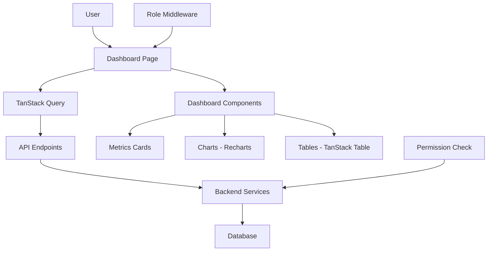

# PRP: Dashboards + Leads Management

> **Priority**: P0 (CRÍTICO) | **Estimate**: 8-10 days | **Sprint**: 7 Phase 5
> **Created**: 2026-03-06 | **Status**: Draft | **Approach**: Standard (UX First)

---

## 1. Overview

### 1.1 Summary

Implement role-based dashboards (Admin, Manager, Vendor, Dealer) and leads management for Sprint 7+. This PRP provides visibility into inventory, publications, and leads for each user role based on their permissions and assigned resources.

**Why this matters**: Without dashboards, users have ZERO visibility into:

- What products are published where
- Which leads are assigned to them
- Performance metrics (publications/day, lead conversion)
- Dealer inventory status

**UX First Approach**: Before implementing any backend, we design the UI/UX for each dashboard to avoid rework.

### 1.2 Dependencies

- [ ] PRP 1: Task Queue (for background metrics computation)
- [ ] PRP 2: Facebook OAuth (for publication data)
- [ ] PRP 3: Graph API + Playwright (for publication metrics)
- [ ] PRP 4: Scraping System (for inventory data)
- [ ] Sprint 5-6: Products Module (for product entities)

### 1.3 Links

- Design Doc: `docs/plans/2026-03-06-sprint7-workflow-design.md` (Section: Dashboards)
- Requirements: `docs/REQUIREMENTS-SPRINT-7-MARKETPLACE.md` (Section 9: Dashboard y Métricas)
- Frontend: `apps/web/src/app/dashboard/page.tsx` (placeholder dashboard)

---

## 2. Requirements

### 2.1 User Stories

#### US-751: Admin Dashboard - Global Visibility

**As an** Admin ProSell
**I want** to see all inventory, publications, and metrics across all dealers
**So that** I can monitor business health and identify issues

**Acceptance Criteria**:

```gherkin
Scenario: Admin views global metrics
  GIVEN an admin user is logged in
  WHEN they navigate to /dashboard/admin
  THEN they see total publications across all dealers
  AND they see total leads across all vendors
  AND they see publications/day trend (chart)
  AND they see leads/day trend (chart)
  AND they can drill down to specific dealers/vendors

Scenario: Admin views dealer performance
  GIVEN an admin user is on the dashboard
  WHEN they click on a dealer card
  THEN they see that dealer's inventory
  AND they see that dealer's publications
  AND they see that dealer's lead conversion rate
```

#### US-752: Manager Dashboard - Team Visibility

**As a** Manager ProSell
**I want** to see metrics for my assigned dealers and vendors
**So that** I can monitor my team's performance

**Acceptance Criteria**:

```gherkin
Scenario: Manager views team metrics
  GIVEN a manager user is logged in
  WHEN they navigate to /dashboard/manager
  THEN they see dealers assigned to them
  AND they see vendors under their management
  AND they see publications by team member
  AND they see leads by team member
  AND they cannot see other managers' data
```

#### US-753: Vendor Dashboard - Personal Metrics

**As a** Vendor ProSell
**I want** to see my dealers, publications, and assigned leads
**So that** I can track my performance and follow up on leads

**Acceptance Criteria**:

```gherkin
Scenario: Vendor views personal dashboard
  GIVEN a vendor user is logged in
  WHEN they navigate to /dashboard/vendor
  THEN they see dealers assigned to them
  AND they see their publications (status, marketplace)
  AND they see leads assigned to them
  AND they see personal KPIs (publications, leads, conversions)
  AND they cannot see other vendors' data
```

#### US-754: Dealer Dashboard - Inventory & Publications

**As a** Dealer
**I want** to see my inventory and publication status
**So that** I can verify my products are being published correctly

**Acceptance Criteria**:

```gherkin
Scenario: Dealer views their dashboard
  GIVEN a dealer user is logged in
  WHEN they navigate to /dashboard/dealer
  THEN they see their inventory (products)
  AND they see publication status for each product
  AND they see which products are published where
  AND they see product performance (views, leads)
  AND they cannot see other dealers' inventory

Scenario: Dealer edits inventory
  GIVEN a dealer user is on their dashboard
  WHEN they click edit on a product
  THEN they can modify product details
  AND validation occurs on submit
  AND the product is updated in the database
```

#### US-755: Leads View - Follow-up Management

**As a** Vendor ProSell
**I want** to view my assigned leads with contact info
**So that** I can follow up and close sales

**Acceptance Criteria**:

```gherkin
Scenario: Vendor views leads list
  GIVEN a vendor user is on their dashboard
  WHEN they navigate to /leads
  THEN they see leads assigned to them
  AND each lead shows name, phone, product interest
  AND they can filter by status (new, contacted, qualified, closed)
  AND they can mark lead status

Scenario: Vendor views lead details
  GIVEN a vendor user is on the leads page
  WHEN they click on a lead
  THEN they see lead details (name, phone, email)
  AND they see product of interest
  AND they see conversation history (from AI assistant)
  AND they can add notes
```

### 2.2 Functional Requirements

- [FR-751] Admin dashboard must show global metrics (all dealers/vendors)
- [FR-752] Manager dashboard must show team metrics (assigned dealers/vendors)
- [FR-753] Vendor dashboard must show personal metrics (their assignments only)
- [FR-754] Dealer dashboard must show their inventory + publications
- [FR-755] Leads view must show leads assigned to current user
- [FR-756] Dashboards must use role-based access control (RBAC)
- [FR-757] Metrics must update in real-time (via TanStack Query refetch)
- [FR-758] Charts must use Recharts for visualization
- [FR-759] Dashboards must be responsive (mobile, tablet, desktop)
- [FR-760] Dealer can edit their own products (not others)

### 2.3 Non-Functional Requirements

- **Performance**:
  - Dashboard load time: < 2 seconds
  - Metrics query time: < 500ms
  - Chart rendering: < 100ms
- **UX**:
  - Mobile-first responsive design
  - Dark mode support (Tailwind 4)
  - Loading states for all data
  - Error states with retry
- **Accessibility**:
  - WCAG 2.2 AA compliant
  - Keyboard navigation
  - Screen reader support

---

## 3. Technical Context

### 3.1 Tech Stack

| Component     | Technology     | Version | Notes                 |
| ------------- | -------------- | ------- | --------------------- |
| Frontend      | Next.js        | 16.1+   | App Router, Turbopack |
| UI            | React          | 19.2    | Server Components     |
| Styling       | TailwindCSS    | 4.0     | New engine            |
| Data Fetching | TanStack Query | v5      | Caching, refetch      |
| Charts        | Recharts       | 2.12+   | D3-based              |
| State         | Zustand        | 5.x     | Client state          |
| Tables        | TanStack Table | v8      | Sorting, filtering    |

### 3.2 Key Libraries

```bash
# Node dependencies (to add to package.json)
pnpm add @tanstack/react-query@5
pnpm add recharts
pnpm add @tanstack/react-table@8

# Icons (already installed)
pnpm add lucide-react
```

### 3.3 External Documentation

**TanStack Query**:

- Docs: https://tanstack.com/query/latest/docs/react/overview
- useQuery: https://tanstack.com/query/latest/docs/react/reference/useQuery
- DevTools: https://tanstack.com/query/latest/docs/react/devtools

**Recharts**:

- Docs: https://recharts.org/en-US/
- Examples: httpsrecharts.org/en-US/examples
- API: https://recharts.org/en-US/api

**Tailwind CSS 4**:

- Docs: https://tailwindcss.com/docs
- Dark mode: https://tailwindcss.com/docs/dark-mode

---

## 4. Implementation Blueprint

### 4.1 Architecture Overview



### 4.2 UX Design Phase (Days 1-2)

**Objective**: Design UI/UX before coding

**Deliverables**:

1. Wireframes for each dashboard (Admin, Manager, Vendor, Dealer)
2. Leads view wireframe
3. Component mockups (MetricsCard, Chart, Table)
4. Mobile responsive mockups

**Tools**:

- Figma or hand-drawn wireframes
- Tailwind color palette reference

**Approval**: User must approve designs before implementation

### 4.3 Implementation Steps

#### Step 1: Backend - Metrics Endpoints

**Files to create**:

- `apps/api/src/prosell/application/queries/metrics/get_user_metrics.py` - Get user metrics
- `apps/api/src/prosell/application/queries/metrics/get_dashboard_stats.py` - Get dashboard stats
- `apps/api/src/prosell/application/queries/leads/list_leads.py` - List leads query
- `apps/api/src/prosell/infrastructure/api/routers/metrics_router.py` - Metrics endpoints
- `apps/api/src/prosell/infrastructure/api/routers/leads_router.py` - Leads endpoints

**Implementation notes**:

```python
# queries/metrics/get_dashboard_stats.py - Dashboard stats query
from dataclasses import dataclass
from uuid import UUID

@dataclass
class DashboardStats:
    """Dashboard statistics DTO."""
    total_products: int
    published_products: int
    pending_products: int
    sold_products: int
    total_publications: int
    active_publications: int
    total_leads: int
    qualified_leads: int
    publications_today: int
    leads_today: int

class GetDashboardStatsUseCase:
    """Get dashboard statistics for a user."""

    def __init__(
        self,
        product_repository: AbstractProductRepository,
        publication_repository: AbstractPublicationRepository,
        lead_repository: AbstractLeadRepository,
    ):
        self.product_repo = product_repository
        self.publication_repo = publication_repository
        self.lead_repo = lead_repository

    async def execute(
        self,
        user_id: UUID,
        user_role: str,
    ) -> DashboardStats:
        """
        Get dashboard stats based on user role.

        Args:
            user_id: User UUID
            user_role: User role (admin, manager, vendor, dealer)

        Returns:
            Dashboard stats filtered by role
        """
        # Filter products based on role
        if user_role == "admin":
            product_filter = None  # See all
        elif user_role == "manager":
            # Get dealers assigned to manager's team
            dealer_ids = await self._get_manager_dealer_ids(user_id)
            product_filter = {"tenant_id": dealer_ids}
        elif user_role == "vendor":
            # Get dealers assigned to vendor
            dealer_ids = await self._get_vendor_dealer_ids(user_id)
            product_filter = {"tenant_id": dealer_ids}
        elif user_role == "dealer":
            # See only own products
            product_filter = {"tenant_id": user_id}

        # Get counts
        total_products = await self.product_repo.count(product_filter)
        published_products = await self.product_repo.count({
            **product_filter,
            "status": "published"
        })
        # ... more queries

        return DashboardStats(
            total_products=total_products,
            published_products=published_products,
            # ...
        )
```

```python
# routers/metrics_router.py - Metrics API endpoints
from fastapi import APIRouter, Depends

from prosell.application.queries.metrics.get_dashboard_stats import GetDashboardStatsUseCase
from prosell.infrastructure.api.dependencies import get_current_user

router = APIRouter(prefix="/metrics", tags=["metrics"])

@router.get("/dashboard")
async def get_dashboard_metrics(
    current_user: User = Depends(get_current_user),
    use_case: GetDashboardStatsUseCase = Depends(),
) -> DashboardStats:
    """
    Get dashboard metrics for current user.

    Returns stats filtered by user role:
    - Admin: All dealers/vendors
    - Manager: Assigned team
    - Vendor: Assigned dealers
    - Dealer: Own products only
    """
    return await use_case.execute(
        user_id=current_user.id,
        user_role=current_user.role,
    )
```

**Gotchas**:

- Role-based filtering is CRITICAL for security
- Use SQL COUNT queries (not fetch all) for performance
- Cache results in Redis (5 min TTL)

#### Step 2: Frontend - Dashboard Layout

**Files to create**:

- `apps/web/src/app/dashboard/(dashboard)/layout.tsx` - Dashboard layout
- `apps/web/src/app/dashboard/(dashboard)/admin/page.tsx` - Admin dashboard
- `apps/web/src/app/dashboard/(dashboard)/manager/page.tsx` - Manager dashboard
- `apps/web/src/app/dashboard/(dashboard)/vendor/page.tsx` - Vendor dashboard
- `apps/web/src/app/dashboard/(dashboard)/dealer/page.tsx` - Dealer dashboard

**Implementation notes**:

```tsx
// layout.tsx - Dashboard layout with sidebar
import { redirect } from "next/navigation";
import { getServerSession } from "@/lib/auth/server-check";

export default async function DashboardLayout({
  children,
  params,
}: {
  children: React.ReactNode;
  params: { role: string };
}) {
  const session = await getServerSession();

  if (!session) {
    redirect("/auth/login");
  }

  // Role-based routing
  const userRole = session.user.role;
  if (params.role !== userRole && userRole !== "admin") {
    redirect(`/dashboard/${userRole}`);
  }

  return (
    <div className="min-h-screen bg-slate-50 dark:bg-slate-900">
      {/* Sidebar */}
      <DashboardSidebar role={userRole} />

      {/* Main content */}
      <main className="lg:pl-64 p-6">{children}</main>
    </div>
  );
}
```

```tsx
// vendor/page.tsx - Vendor dashboard
import { Suspense } from "react";
import { MetricsCards } from "@/components/dashboard/MetricsCards";
import { PublicationsChart } from "@/components/dashboard/PublicationsChart";
import { LeadsTable } from "@/components/dashboard/LeadsTable";
import { DealerGrid } from "@/components/dashboard/DealerGrid";

export default function VendorDashboardPage() {
  return (
    <div className="space-y-6">
      {/* Header */}
      <div>
        <h1 className="text-3xl font-bold text-slate-900 dark:text-slate-100">
          Dashboard
        </h1>
        <p className="text-slate-600 dark:text-slate-400">
          Welcome back, {session.user.name}
        </p>
      </div>

      {/* Metrics Cards */}
      <Suspense fallback={<MetricsCardsSkeleton />}>
        <MetricsCards role="vendor" />
      </Suspense>

      {/* Charts */}
      <div className="grid grid-cols-1 lg:grid-cols-2 gap-6">
        <Suspense fallback={<ChartSkeleton />}>
          <PublicationsChart />
        </Suspense>

        <Suspense fallback={<ChartSkeleton />}>
          <LeadsTrendChart />
        </Suspense>
      </div>

      {/* Assigned Dealers */}
      <Suspense fallback={<DealerGridSkeleton />}>
        <DealerGrid />
      </Suspense>

      {/* Recent Leads */}
      <Suspense fallback={<TableSkeleton />}>
        <LeadsTable limit={10} />
      </Suspense>
    </div>
  );
}
```

**Gotchas**:

- Use Next.js 16 Route Groups `(dashboard)` for layout
- Server Components by default (use Client Components for interactivity)
- Suspense boundaries for each data section

#### Step 3: Frontend - Dashboard Components

**Files to create**:

- `apps/web/src/components/dashboard/MetricsCards.tsx` - Metrics cards
- `apps/web/src/components/dashboard/PublicationsChart.tsx` - Publications trend chart
- `apps/web/src/components/dashboard/LeadsTrendChart.tsx` - Leads trend chart
- `apps/web/src/components/dashboard/DealerGrid.tsx` - Dealer cards grid
- `apps/web/src/components/dashboard/LeadsTable.tsx` - Leads table

**Implementation notes**:

```tsx
// MetricsCards.tsx - Metrics cards component
"use client";

import { useQuery } from "@tanstack/react-query";
import { Card, CardContent, CardHeader, CardTitle } from "@/components/ui/card";
import { TrendingUp, TrendingDown, Package, MessageSquare } from "lucide-react";

interface MetricCardProps {
  title: string;
  value: string | number;
  change?: number;
  icon: React.ReactNode;
}

function MetricCard({ title, value, change, icon }: MetricCardProps) {
  return (
    <Card>
      <CardHeader className="flex flex-row items-center justify-between pb-2">
        <CardTitle className="text-sm font-medium text-slate-600 dark:text-slate-400">
          {title}
        </CardTitle>
        {icon}
      </CardHeader>
      <CardContent>
        <div className="text-2xl font-bold text-slate-900 dark:text-slate-100">
          {value}
        </div>
        {change !== undefined && (
          <p className="text-xs text-slate-500 dark:text-slate-400 mt-1 flex items-center gap-1">
            {change > 0 ? (
              <TrendingUp className="h-3 w-3 text-green-500" />
            ) : (
              <TrendingDown className="h-3 w-3 text-red-500" />
            )}
            <span className={change > 0 ? "text-green-500" : "text-red-500"}>
              {Math.abs(change)}%
            </span>
            <span>vs last month</span>
          </p>
        )}
      </CardContent>
    </Card>
  );
}

interface MetricsCardsProps {
  role: string;
}

export function MetricsCards({ role }: MetricsCardsProps) {
  const { data, isLoading, error } = useQuery({
    queryKey: ["metrics", "dashboard", role],
    queryFn: async () => {
      const res = await fetch("/api/metrics/dashboard");
      if (!res.ok) throw new Error("Failed to fetch metrics");
      return res.json();
    },
    refetchInterval: 60000, // Refetch every minute
  });

  if (isLoading) return <MetricsCardsSkeleton />;
  if (error) return <div>Error loading metrics</div>;

  const stats = data;

  return (
    <div className="grid grid-cols-1 sm:grid-cols-2 lg:grid-cols-4 gap-4">
      <MetricCard
        title="Total Products"
        value={stats.total_products}
        change={12}
        icon={<Package className="h-4 w-4 text-slate-500" />}
      />

      <MetricCard
        title="Published"
        value={stats.published_products}
        change={8}
        icon={<Package className="h-4 w-4 text-green-500" />}
      />

      <MetricCard
        title="Publications Today"
        value={stats.publications_today}
        icon={<TrendingUp className="h-4 w-4 text-blue-500" />}
      />

      <MetricCard
        title="Leads Today"
        value={stats.leads_today}
        change={-3}
        icon={<MessageSquare className="h-4 w-4 text-purple-500" />}
      />
    </div>
  );
}
```

```tsx
// PublicationsChart.tsx - Publications trend chart
"use client";

import { useQuery } from "@tanstack/react-query";
import {
  LineChart,
  Line,
  XAxis,
  YAxis,
  CartesianGrid,
  Tooltip,
  Legend,
  ResponsiveContainer,
} from "recharts";

export function PublicationsChart() {
  const { data, isLoading } = useQuery({
    queryKey: ["metrics", "publications-trend"],
    queryFn: async () => {
      const res = await fetch("/api/metrics/publications-trend?days=30");
      return res.json();
    },
  });

  if (isLoading) return <ChartSkeleton />;

  return (
    <Card>
      <CardHeader>
        <CardTitle>Publications (Last 30 Days)</CardTitle>
      </CardHeader>
      <CardContent>
        <ResponsiveContainer width="100%" height={300}>
          <LineChart data={data}>
            <CartesianGrid strokeDasharray="3 3" />
            <XAxis dataKey="date" tick={{ fontSize: 12 }} stroke="#64748b" />
            <YAxis tick={{ fontSize: 12 }} stroke="#64748b" />
            <Tooltip
              contentStyle={{
                backgroundColor: "#1e293b",
                border: "none",
                borderRadius: "8px",
              }}
            />
            <Legend />
            <Line
              type="monotone"
              dataKey="publications"
              stroke="#3b82f6"
              strokeWidth={2}
              dot={false}
            />
            <Line
              type="monotone"
              dataKey="leads"
              stroke="#8b5cf6"
              strokeWidth={2}
              dot={false}
            />
          </LineChart>
        </ResponsiveContainer>
      </CardContent>
    </Card>
  );
}
```

**Gotchas**:

- Use "use client" for TanStack Query hooks
- Refetch interval: 60 seconds for real-time updates
- ResponsiveContainer for responsive charts
- Dark mode colors (Tailwind 4)

#### Step 4: Frontend - Leads View

**Files to create**:

- `apps/web/src/app/dashboard/leads/page.tsx` - Leads list page
- `apps/web/src/components/dashboard/LeadsTable.tsx` - Leads table with filtering
- `apps/web/src/components/dashboard/LeadDetailModal.tsx` - Lead detail modal

**Implementation notes**:

```tsx
// leads/page.tsx - Leads list page
import { Suspense } from "react";
import { LeadsTable } from "@/components/dashboard/LeadsTable";

export default function LeadsPage() {
  return (
    <div className="space-y-6">
      {/* Header */}
      <div className="flex justify-between items-center">
        <div>
          <h1 className="text-3xl font-bold text-slate-900 dark:text-slate-100">
            Leads
          </h1>
          <p className="text-slate-600 dark:text-slate-400">
            Manage your assigned leads
          </p>
        </div>

        <Button>
          <MessageSquare className="h-4 w-4 mr-2" />
          Send Bulk Message
        </Button>
      </div>

      {/* Filters */}
      <LeadsFilters />

      {/* Table */}
      <Suspense fallback={<TableSkeleton />}>
        <LeadsTable />
      </Suspense>
    </div>
  );
}
```

```tsx
// LeadsTable.tsx - Leads table with TanStack Table
"use client";

import { useQuery } from "@tanstack/react-query";
import {
  createColumnHelper,
  flexRender,
  getCoreRowModel,
  useReactTable,
} from "@tanstack/react-table";
import { Badge } from "@/components/ui/badge";

interface Lead {
  id: string;
  name: string;
  phone: string;
  email?: string;
  product_interest: string;
  status: "new" | "contacted" | "qualified" | "closed";
  created_at: string;
}

const columnHelper = createColumnHelper<Lead>();

const columns = [
  columnHelper.accessor("name", {
    header: "Name",
    cell: (info) => info.getValue(),
  }),
  columnHelper.accessor("phone", {
    header: "Phone",
    cell: (info) => info.getValue(),
  }),
  columnHelper.accessor("product_interest", {
    header: "Product",
    cell: (info) => info.getValue(),
  }),
  columnHelper.accessor("status", {
    header: "Status",
    cell: (info) => {
      const status = info.getValue();
      const colors = {
        new: "bg-blue-100 text-blue-800 dark:bg-blue-900 dark:text-blue-200",
        contacted:
          "bg-yellow-100 text-yellow-800 dark:bg-yellow-900 dark:text-yellow-200",
        qualified:
          "bg-green-100 text-green-800 dark:bg-green-900 dark:text-green-200",
        closed:
          "bg-slate-100 text-slate-800 dark:bg-slate-700 dark:text-slate-300",
      };
      return <Badge className={colors[status]}>{status}</Badge>;
    },
  }),
  columnHelper.accessor("created_at", {
    header: "Created",
    cell: (info) => new Date(info.getValue()).toLocaleDateString(),
  }),
  columnHelper.display({
    id: "actions",
    header: "Actions",
    cell: (info) => (
      <Button
        size="sm"
        variant="ghost"
        onClick={() => viewLeadDetails(info.row.original.id)}
      >
        View
      </Button>
    ),
  }),
];

export function LeadsTable() {
  const { data, isLoading } = useQuery({
    queryKey: ["leads", "list"],
    queryFn: async () => {
      const res = await fetch("/api/leads");
      return res.json() as Promise<Lead[]>;
    },
  });

  const table = useReactTable({
    data: data ?? [],
    columns,
    getCoreRowModel: getCoreRowModel(),
  });

  if (isLoading) return <TableSkeleton />;

  return (
    <Card>
      <CardContent className="p-0">
        <table className="w-full">
          <thead>
            {table.getHeaderGroups().map((headerGroup) => (
              <tr key={headerGroup.id}>
                {headerGroup.headers.map((header) => (
                  <th
                    key={header.id}
                    className="px-6 py-3 text-left text-xs font-medium text-slate-500 dark:text-slate-400 uppercase tracking-wider"
                  >
                    {header.isPlaceholder
                      ? null
                      : flexRender(
                          header.column.columnDef.header,
                          header.getContext(),
                        )}
                  </th>
                ))}
              </tr>
            ))}
          </thead>
          <tbody>
            {table.getRowModel().rows.map((row) => (
              <tr
                key={row.id}
                className="border-t border-slate-200 dark:border-slate-700"
              >
                {row.getVisibleCells().map((cell) => (
                  <td
                    key={cell.id}
                    className="px-6 py-4 whitespace-nowrap text-sm text-slate-700 dark:text-slate-300"
                  >
                    {flexRender(cell.column.columnDef.cell, cell.getContext())}
                  </td>
                ))}
              </tr>
            ))}
          </tbody>
        </table>
      </CardContent>
    </Card>
  );
}
```

**Gotchas**:

- TanStack Table for headless table functionality
- Server-side pagination for large datasets
- Filter by status with query params
- Role-based filtering (vendor sees only their leads)

#### Step 5: Backend - Leads Management

**Files to create**:

- `apps/api/src/prosell/domain/entities/lead.py` - Lead entity
- `apps/api/src/prosell/domain/repositories/lead_repository.py` - Lead repo interface
- `apps/api/src/prosell/infrastructure/models/lead_model.py` - Lead ORM model
- `apps/api/src/prosell/infrastructure/repositories/lead_repository_impl.py` - Lead repo implementation

**Implementation notes**:

```python
# domain/entities/lead.py - Lead entity
from datetime import UTC, datetime
from enum import StrEnum
from uuid import UUID, uuid4

from pydantic import Field

from prosell.domain.base import DomainModel

class LeadStatus(StrEnum):
    """Lead status enum."""
    NEW = "new"
    CONTACTED = "contacted"
    QUALIFIED = "qualified"
    CLOSED = "closed"
    LOST = "lost"

class Lead(DomainModel):
    """Lead entity."""

    id: UUID = Field(default_factory=uuid4)
    dealer_id: UUID  # Dealer origin
    seller_user_id: UUID  # Assigned vendor
    product_id: UUID  # Product of interest

    # Lead info
    name: str
    phone: str
    email: str | None = None
    message: str | None = None  # Initial message from lead

    # Status
    status: LeadStatus = LeadStatus.NEW
    source: str = "facebook"  # facebook, instagram, whatsapp

    # AI qualification
    ai_score: float | None = None  # 0-1 confidence score
    similar_interests: list[str] = []  # "camioneta 7 puestos"

    # Timestamps
    first_contacted_at: datetime | None = None
    last_contacted_at: datetime | None = None
    created_at: datetime = Field(default_factory=lambda: datetime.now(UTC))
    updated_at: datetime = Field(default_factory=lambda: datetime.now(UTC))

    def mark_contacted(self) -> None:
        """Mark lead as contacted."""
        if self.status == LeadStatus.NEW:
            self.status = LeadStatus.CONTACTED
            self.first_contacted_at = datetime.now(UTC)
        self.last_contacted_at = datetime.now(UTC)
        self.updated_at = datetime.now(UTC)

    def qualify(self, score: float) -> None:
        """Mark lead as qualified with AI score."""
        self.status = LeadStatus.QUALIFIED
        self.ai_score = score
        self.updated_at = datetime.now(UTC)

    def close(self, won: bool = True) -> None:
        """Mark lead as closed (won or lost)."""
        self.status = LeadStatus.CLOSED if won else LeadStatus.LOST
        self.updated_at = datetime.now(UTC)
```

**Gotchas**:

- Lead belongs to dealer + assigned to vendor
- AI assistant qualifies lead before human sees it
- Status transition: NEW → CONTACTED → QUALIFIED → CLOSED

---

## 5. Code Patterns & Examples

### 5.1 TanStack Query Pattern

**Reference**: `apps/web/src/components/dashboard/MetricsCards.tsx`

```tsx
// TanStack Query with Server Components
import { dehydrate } from "@tanstack/react-query";
import { HydrationBoundary } from "@tanstack/react-query";

// Server Component
export default async function DashboardPage() {
  const queryClient = getQueryClient();

  // Prefetch data on server
  await queryClient.prefetchQuery({
    queryKey: ["metrics", "dashboard"],
    queryFn: getDashboardMetrics,
  });

  return (
    <HydrationBoundary state={dehydrate(queryClient)}>
      <ClientDashboard />
    </HydrationBoundary>
  );
}

// Client Component
("use client");

export function ClientDashboard() {
  const { data } = useQuery({
    queryKey: ["metrics", "dashboard"],
    queryFn: getDashboardMetrics,
  });

  return <div>{data?.total_products}</div>;
}
```

### 5.2 Recharts Pattern

```tsx
// Recharts with dark mode support
const chartColors = {
  background: "#1e293b",  // slate-800
  text: "#94a3b8",        // slate-400
  line1: "#3b82f6",       // blue-500
  line2: "#8b5cf6",       // purple-500
}

<ResponsiveContainer width="100%" height={300}>
  <LineChart data={data}>
    <CartesianGrid strokeDasharray="3 3" stroke="#334155" />
    <XAxis dataKey="date" stroke={chartColors.text} />
    <YAxis stroke={chartColors.text} />
    <Tooltip
      contentStyle={{
        backgroundColor: chartColors.background,
        border: "none",
        borderRadius: "8px",
      }}
    />
    <Line type="monotone" dataKey="value" stroke={chartColors.line1} />
  </LineChart>
</ResponsiveContainer>
```

### 5.3 Role-Based Access Pattern

```tsx
// Role-based component rendering
interface RoleGuardProps {
  allowedRoles: string[];
  children: React.ReactNode;
}

export function RoleGuard({ allowedRoles, children }: RoleGuardProps) {
  const { user } = useAuthStore();

  if (!user || !allowedRoles.includes(user.role)) {
    return <div>Not authorized</div>;
  }

  return <>{children}</>;
}

// Usage
<RoleGuard allowedRoles={["admin", "manager"]}>
  <AdminOnlyComponent />
</RoleGuard>;
```

---

## 6. Validation Gates

### 6.1 Pre-commit Checks

```bash
# Frontend linting
cd apps/web && pnpm lint

# Frontend type checking
cd apps/web && pnpm typecheck

# Backend linting
cd apps/api && ruff check --fix && ruff format .
```

### 6.2 Unit Tests

```bash
# Frontend components
cd apps/web && pnpm test components/dashboard/

# Backend queries
cd apps/api && uv run pytest tests/unit/application/queries/metrics/ -v
```

### 6.3 Integration Tests

```bash
# API endpoints
cd apps/api && uv run pytest tests/integration/api/metrics/ -v
```

### 6.4 E2E Tests

```bash
# Playwright E2E
cd tests/e2e && pnpm test dashboard-spec
```

---

## 7. Testing Strategy

### 7.1 Unit Tests

**Components**:

- Test MetricsCards renders with data
- Test Charts render with empty data
- Test Table renders rows correctly
- Test RoleGuard blocks unauthorized access

**Queries**:

- Test GetDashboardStatsUseCase filters by role
- Test ListLeadsQuery filters by assigned user

### 7.2 Integration Tests

**API**:

- Test GET /api/metrics/dashboard returns 200
- Test GET /api/metrics/dashboard filters by role
- Test GET /api/leads returns leads for user

### 7.3 E2E Tests

```gherkin
Scenario: Admin views global dashboard
  GIVEN admin user is logged in
  WHEN they navigate to /dashboard/admin
  THEN they see metrics for all dealers
  AND they see publications chart
  AND they can click on dealer to drill down

Scenario: Vendor views their dashboard
  GIVEN vendor user is logged in
  WHEN they navigate to /dashboard/vendor
  THEN they see only their assigned dealers
  AND they see their publications
  AND they see their leads
  AND they cannot see other vendors' data
```

### 7.4 Coverage Targets

- Unit tests: > 80%
- Integration tests: > 70%
- E2E tests: Critical paths only

---

## 8. Common Pitfalls

### 8.1 Over-fetching Data

**Problem**: Fetching all data (slow query).

**Solution**: Use pagination and filters:

```tsx
// Bad: Fetch all leads
const { data } = useQuery({
  queryKey: ["leads"],
  queryFn: () => fetch("/api/leads").then((r) => r.json()),
});

// Good: Paginate
const { data } = useQuery({
  queryKey: ["leads", { page: 1, limit: 20 }],
  queryFn: () => fetch("/api/leads?page=1&limit=20").then((r) => r.json()),
});
```

### 8.2 Missing Loading States

**Problem**: UI flickers while loading.

**Solution**: Always use Suspense or skeleton:

```tsx
<Suspense fallback={<Skeleton />}>
  <AsyncComponent />
</Suspense>
```

### 8.3 Role-Based Filtering Bugs

**Problem**: Vendor sees other vendors' data.

**Solution**: Filter at BOTH frontend and backend:

```python
# Backend: Always filter
if current_user.role == "vendor":
    query = query.filter(Lead.seller_user_id == current_user.id)

# Frontend: Double-check (defense in depth)
if (user.role !== "admin") {
  // Show filtered data only
}
```

---

## 9. Rollback Plan

If implementation fails:

1. **UX rejected**: Re-design based on user feedback
2. **Performance issues**: Add caching, pagination, lazy loading
3. **TanStack Query issues**: Fallback to React Server Components only
4. **Recharts issues**: Use simpler chart library or custom SVG

**Rollback steps**:

1. Revert UI changes
2. Keep backend endpoints (can be reused)
3. Simplify dashboard (remove charts, use tables only)
4. Iterate with user feedback

---

## 10. Implementation Tasks (Ordered)

1. ✅ UX Design Phase (wireframes for all dashboards)
2. ✅ User approves UX designs
3. ✅ Create backend metrics endpoints
4. ✅ Create backend leads endpoints
5. ✅ Implement role-based filtering
6. ✅ Create DashboardLayout component
7. ✅ Create Admin dashboard page
8. ✅ Create Manager dashboard page
9. ✅ Create Vendor dashboard page
10. ✅ Create Dealer dashboard page
11. ✅ Create MetricsCards component
12. ✅ Create PublicationsChart component (Recharts)
13. ✅ Create LeadsTrendChart component (Recharts)
14. ✅ Create LeadsTable component (TanStack Table)
15. ✅ Create Leads page
16. ✅ Implement role middleware
17. ✅ Write unit tests (>80% coverage)
18. ✅ Write E2E tests (Playwright)
19. ✅ User testing (all roles)
20. ✅ Deploy to production
21. ✅ Monitor performance metrics

---

---

## 11. Completion Gates (VERIFIABLE)

Estos son los **tests de completitud** ejecutables que validan que el PRP está completo.

### 11.1 Spike Validation (si aplica)

```bash
# Spike POC completado y documentado
test -f docs/plans/2026-03-06-5-dashboards-spike.md
# Expected: File exists with findings
```

### 11.2 Unit Tests

```bash
# Tests unitarios pasan con coverage requerido
cd apps/api && uv run pytest tests/unit/ -v --cov=src --cov-report=term-missing
# Expected: All pass, coverage > 80%
```

### 11.3 Integration Tests

```bash
# Tests de integración pasan
cd apps/api && uv run pytest tests/integration/ -v
# Expected: All pass, coverage > 70%
```

### 11.4 Code Quality

```bash
# No errores de linting
cd apps/api && ruff check .
# Expected: Exit code 0

# No errores de tipo
cd apps/api && pyright .
# Expected: 0 errors
```

### 11.5 Documentation

```bash
# PRP documentación completa
grep -q "^## 11. Completion Gates" {prp_file}
# Expected: Pattern found (you're reading it!)
```

### 11.6 Final Checklist

- [ ] Spike completado (si aplica)
- [ ] Todos los tests unitarios pasan (>80%)
- [ ] Todos los tests de integración pasan (>70%)
- [ ] No errores de pyright (0 errores)
- [ ] No errores de ruff (0 errores)
- [ ] Documentación actualizada
- [ ] Code review completado
- [ ] E2E tests pasan (si aplica)

## Confidence Score

**Score**: 8/10

**Reasoning**:

**Positive factors**:

- TanStack Query is mature and well-documented
- Recharts is simple and effective for basic charts
- Next.js 16 App Router patterns are established
- Tailwind 4 for styling is straightforward
- Role-based access is well-understood pattern

**Risk factors**:

- UX design phase may require iterations (user feedback)
- Performance issues with large datasets (need pagination)
- Chart customization may be limited with Recharts
- TanStack Table learning curve for advanced features

---

## Appendix A: UX Wireframes

### Admin Dashboard Wireframe

```
┌────────────────────────────────────────────────────────────────┐
│  ProSell Admin                              [Admin] [Logout] │
├────────────────────────────────────────────────────────────────┤
│                                                                │
│  ┌──────────┐ ┌──────────┐ ┌──────────┐ ┌──────────┐        │
│  │ 1,234    │ │ 856      │ │ 45       │ │ 12       │        │
│  │ Products │ │Published │ │Pubs Today│ │Leads Today│        │
│  └──────────┘ └──────────┘ └──────────┘ └──────────┘        │
│                                                                │
│  Publications Trend (30 days)              Leads Trend         │
│  ┌────────────────────────────┐  ┌────────────────────┐      │
│  │ [Line Chart]               │  │ [Line Chart]       │      │
│  │                            │  │                    │      │
│  └────────────────────────────┘  └────────────────────┘      │
│                                                                │
│  Top Dealers by Publications                                   │
│  ┌──────────────────────────────────────────────────────────┐ │
│  │ Dealer A        156 pubs   ████░░░░░░  12%            │ │
│  │ Dealer B        142 pubs   ███░░░░░░░  11%            │ │
│  │ Dealer C        98 pubs    ██░░░░░░░░   8%            │ │
│  └──────────────────────────────────────────────────────────┘ │
│                                                                │
└────────────────────────────────────────────────────────────────┘
```

### Vendor Dashboard Wireframe

```
┌────────────────────────────────────────────────────────────────┐
│  Dashboard                                      [Vendor] [Log] │
├────────────────────────────────────────────────────────────────┤
│                                                                │
│  My Dealers: 3                                                 │
│  ┌────────┐ ┌────────┐ ┌────────┐                              │
│  │Dealer A│ │Dealer B│ │Dealer C│                              │
│  │56 prods│ │32 prods│ │28 prods│                              │
│  └────────┘ └────────┘ └────────┘                              │
│                                                                │
│  My Performance                                                │
│  ┌──────────┐ ┌──────────┐ ┌──────────┐                       │
│  │ 12       │ │ 8        │ │ 15       │                       │
│  │Pubs/Week │ │Leads/Wk  │ │Conversion│                       │
│  └──────────┘ └──────────┘ └──────────┘                       │
│                                                                │
│  Recent Leads (Assigned to me)                                 │
│  ┌──────────────────────────────────────────────────────────┐ │
│  │ Name            Phone    Product      Status    Action  │ │
│  │ Juan Pérez      11-1234  Toyota Corolla  New    [View] │ │
│  │ María García    11-5678  Ford Raptor   Contacted [View] │ │
│  │ Carlos López    11-9012  Honda CRV     Qualified [View] │ │
│  └──────────────────────────────────────────────────────────┘ │
│                                                                │
└────────────────────────────────────────────────────────────────┘
```

---

**END OF PRP**
