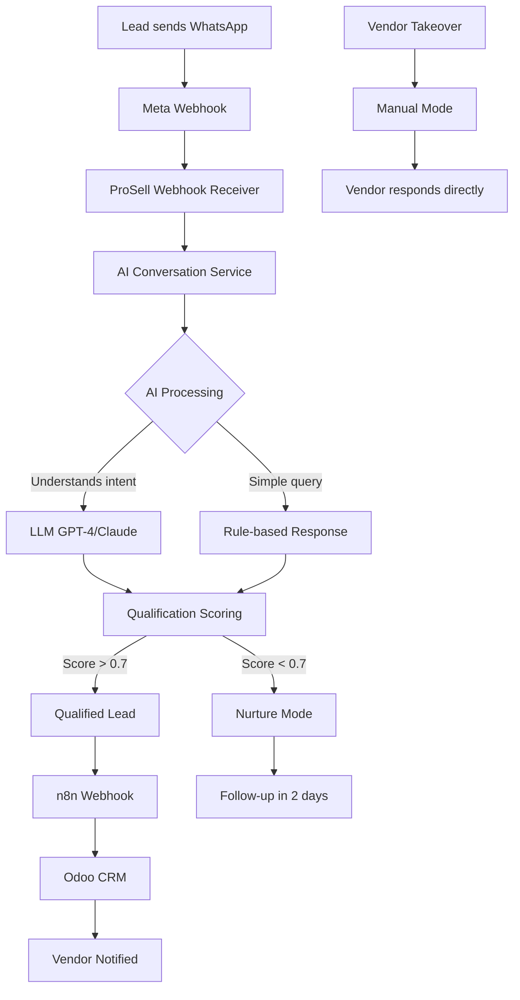

# PRP: AI Vendor Assistant + n8n/Odoo Integration

> **Priority**: P1 (Importante) | **Estimate**: 7-9 days | **Sprint**: 7 Phase 6
> **Created**: 2026-03-06 | **Status**: Draft | **Approach**: Spike → Standard

---

## 1. Overview

### 1.1 Summary

Implement an AI-powered vendor assistant that converses with leads via WhatsApp/Messenger, qualifies them, and forwards qualified leads to Odoo CRM via n8n workflows. The AI assistant handles initial lead qualification, offers similar products, and only forwards high-intent leads to human vendors.

**Why this matters**: Without AI automation, vendors must manually respond to every lead message, 24/7. This creates:
- Delayed response times (lost sales)
- Vendor burnout (interrupted sleep, constant notifications)
- Inconsistent lead qualification
- Lost follow-up opportunities

**With AI Assistant**:
- Instant responses (24/7)
- Consistent qualification (AI scoring)
- Vendor only handles qualified leads
- Better conversion rates

### 1.2 Dependencies

- [ ] PRP 2: Facebook OAuth (for webhooks)
- [ ] PRP 3: Graph API + Playwright (for publication data)
- [ ] PRP 5: Dashboards + Leads (for lead entities)
- [ ] WhatsApp Business API (Meta)
- [ ] n8n instance (self-hosted or cloud)
- [ ] Odoo CRM (existing instance)

### 1.3 Links

- Design Doc: `docs/plans/2026-03-06-sprint7-workflow-design.md` (Section: AI Assistant)
- Requirements: `docs/REQUIREMENTS-SPRINT-7-MARKETPLACE.md` (Section 7: Gestión de Leads)
- n8n Docs: https://docs.n8n.io/
- Odoo API: https://www.odoo.com/documentation/17.0/webservices.html

---

## 2. Requirements

### 2.1 User Stories

#### US-761: AI Converses with Lead

**As a** Lead interested in a vehicle
**I want** to receive instant responses via WhatsApp/Messenger
**So that** I don't have to wait for a human vendor

**Acceptance Criteria**:
```gherkin
Scenario: Lead sends first message
  GIVEN a lead sends "Hola, me interesa el Toyota Corolla"
  WHEN the AI assistant receives the message
  THEN it responds within 5 seconds
  AND asks qualifying questions
  AND offers similar products if available

Scenario: Lead asks about alternatives
  GIVEN a lead asks "Tienen algo más económico?"
  WHEN the AI assistant processes the message
  THEN it searches for similar products
  AND presents 2-3 alternatives
  AND highlights key differences
```

#### US-762: AI Qualifies Lead

**As a** Vendor ProSell
**I want** the AI to qualify leads before forwarding them
**So that** I only spend time on high-intent leads

**Acceptance Criteria**:
```gherkin
Scenario: AI qualifies lead as high-intent
  GIVEN a lead responds positively to qualification questions
  WHEN the AI detects high intent
  THEN it calculates a qualification score (> 0.7)
  AND forwards the lead to the vendor
  AND creates a task in Odoo

Scenario: AI qualifies lead as low-intent
  GIVEN a lead gives one-word responses or stops replying
  WHEN the AI detects low intent
  THEN it keeps the lead in "nurturing" status
  AND does NOT forward to vendor
  AND follows up automatically after 2 days
```

#### US-763: AI Forwards to Odoo via n8n

**As a** System Administrator
**I want** qualified leads to sync to Odoo CRM automatically
**So that** vendors can manage leads in their CRM

**Acceptance Criteria**:
```gherkin
Scenario: Qualified lead syncs to Odoo
  GIVEN a lead is qualified (score > 0.7)
  WHEN the AI forwards the lead
  THEN ProSell sends webhook to n8n
  AND n8n creates/updates lead in Odoo
  AND n8n assigns lead to vendor
  AND n8n creates follow-up task

Scenario: Lead updates sync to Odoo
  GIVEN a lead replies to AI
  WHEN new information is captured
  THEN the conversation updates in Odoo
  AND the vendor can see full history
```

#### US-764: Vendor Can Take Over

**As a** Vendor ProSell
**I want** to take over the conversation at any time
**So that** I can provide personalized service

**Acceptance Criteria**:
```gherkin
Scenario: Vendor takes over conversation
  GIVEN a vendor sees a lead in their dashboard
  WHEN they click "Take Over"
  THEN the AI stops auto-responding
  AND all future messages go to the vendor
  AND the vendor can respond via WhatsApp/Messenger

Scenario: Vendor sets away message
  GIVEN a vendor is on vacation
  WHEN they enable "Auto Mode"
  THEN the AI handles all messages
  AND notifies vendor of qualified leads daily
```

### 2.2 Functional Requirements

- [FR-761] AI must respond within 5 seconds to lead messages
- [FR-762] AI must maintain conversation context (memory)
- [FR-763] AI must qualify leads with confidence score (0-1)
- [FR-764] AI must offer similar products when relevant
- [FR-765] AI must forward qualified leads to n8n → Odoo
- [FR-766] AI must allow vendor takeover (manual intervention)
- [FR-767] System must log all AI conversations
- [FR-768] AI must support WhatsApp and Messenger channels
- [FR-769] AI must handle Spanish language (primary)
- [FR-770] AI must escalate to human on complex queries

### 2.3 Non-Functional Requirements

- **Performance**:
  - Response time: < 5 seconds (P95)
  - AI inference: < 2 seconds
  - Webhook latency: < 1 second
- **Reliability**:
  - AI uptime: > 99.9%
  - No lost messages (retry logic)
  - Fallback to human if AI fails
- **Cost**:
  - Target: < $0.10 per conversation
  - Monitor LLM token usage

---

## 3. Technical Context

### 3.1 Tech Stack

| Component | Technology | Version | Notes |
|-----------|-----------|---------|-------|
| AI Provider | OpenAI GPT-4 | Latest | Or Anthropic Claude |
| WhatsApp | Meta Graph API | v19.0 | Webhooks |
| Messenger | Meta Graph API | v19.0 | Webhooks |
| Workflow | n8n | Latest | Self-hosted or cloud |
| CRM | Odoo | 17.0 | Lead management |
| Backend | FastAPI | 0.115+ | Webhook receivers |

### 3.2 Key Libraries

```bash
# Python dependencies (to add to pyproject.toml)
uv add openai                           # GPT-4
# OR
uv add anthropic                        # Claude

uv add httpx                            # Async HTTP for webhooks
```

### 3.3 External Documentation

**OpenAI API**:
- Docs: https://platform.openai.com/docs/api-reference
- Chat: https://platform.openai.com/docs/api-reference/chat
- Streaming: https://platform.openai.com/docs/api-reference/streaming

**Anthropic Claude**:
- Docs: https://docs.anthropic.com/claude/reference/messages
- Streaming: https://docs.anthropic.com/claude/docs/streaming

**WhatsApp Business API**:
- Docs: https://developers.facebook.com/docs/whatsapp/cloud-api
- Webhooks: https://developers.facebook.com/docs/whatsapp/cloud-api/webhooks

**n8n**:
- Docs: https://docs.n8n.io/
- Webhooks: https://docs.n8n.io/workflows/webhooks/

**Odoo API**:
- REST API: https://www.odoo.com/documentation/17.0/webservices/rest.html
- RPC API: https://www.odoo.com/documentation/17.0/webservices/odoo.html

---

## 4. Implementation Blueprint

### 4.1 Architecture Overview



### 4.2 Spike Phase (Days 1-2)

**Objective**: Validate LLM + WhatsApp + n8n integration

**Tasks**:
1. Create minimal FastAPI webhook receiver
2. Connect to OpenAI GPT-4 (or Claude)
3. Test AI conversation with sample lead messages
4. Test WhatsApp Business API sandbox
5. Test n8n webhook → Odoo CRM flow
6. Benchmark end-to-end latency
7. Calculate cost per 100 conversations

**Success Criteria**:
- ✅ AI responds intelligently to vehicle queries
- ✅ WhatsApp webhook receives messages
- ✅ n8n creates lead in Odoo
- ✅ End-to-end latency < 10 seconds
- ✅ Cost < $0.10 per conversation

**Decision Document**: Create `docs/plans/2026-03-06-phase6-ai-spike.md` with findings

### 4.3 Implementation Steps

#### Step 1: Domain Layer - Conversation Entities

**Files to create**:
- `apps/api/src/prosell/domain/entities/conversation.py` - Conversation entity
- `apps/api/src/prosell/domain/entities/message.py` - Message entity
- `apps/api/src/prosell/domain/value_objects/qualification_score.py` - Qualification score value object
- `apps/api/src/prosell/domain/ports/i_llm_provider.py` - LLM provider interface
- `apps/api/src/prosell/domain/ports/i_notification_service.py` - Notification service interface

**Implementation notes**:

```python
# entities/conversation.py - Conversation entity
from datetime import UTC, datetime
from enum import StrEnum
from uuid import UUID, uuid4

from pydantic import Field

from prosell.domain.base import DomainModel

class ConversationMode(StrEnum):
    """Conversation mode."""
    AI_AUTO = "ai_auto"  # AI handles everything
    HUMAN_ONLY = "human_only"  # Human took over
    HYBRID = "hybrid"  # AI assists, human can intervene

class Conversation(DomainModel):
    """Conversation entity (AI + Lead)."""

    id: UUID = Field(default_factory=uuid4)
    lead_id: UUID
    seller_user_id: UUID  # Vendor assigned
    product_id: UUID  # Original product of interest

    # Mode
    mode: ConversationMode = ConversationMode.AI_AUTO
    taken_over_at: datetime | None = None
    taken_over_by: UUID | None = None  # User who took over

    # Qualification
    qualification_score: float = 0.0  # 0-1
    qualified_at: datetime | None = None
    similar_interests: list[str] = []  # "camioneta 7 puestos"

    # Timestamps
    started_at: datetime = Field(default_factory=lambda: datetime.now(UTC))
    last_message_at: datetime | None = None
    ended_at: datetime | None = None

    # Channel
    channel: str  # "whatsapp", "messenger"
    channel_lead_id: str  # Lead's ID in WhatsApp/Messenger

    def add_message(self, role: str, content: str) -> "Message":
        """Add a message to conversation."""
        from prosell.domain.entities.message import Message

        self.last_message_at = datetime.now(UTC)
        return Message.create(
            conversation_id=self.id,
            role=role,
            content=content,
        )

    def qualify(self, score: float, interests: list[str] | None = None) -> None:
        """Mark conversation as qualified."""
        self.qualification_score = score
        self.qualified_at = datetime.now(UTC)
        if interests:
            self.similar_interests.extend(interests)

    def take_over(self, user_id: UUID) -> None:
        """Human takes over conversation."""
        self.mode = ConversationMode.HUMAN_ONLY
        self.taken_over_at = datetime.now(UTC)
        self.taken_over_by = user_id

    def enable_ai(self) -> None:
        """Re-enable AI mode."""
        self.mode = ConversationMode.AI_AUTO
        self.taken_over_at = None
        self.taken_over_by = None
```

```python
# entities/message.py - Message entity
from datetime import UTC, datetime
from enum import StrEnum
from uuid import UUID, uuid4

from pydantic import Field

from prosell.domain.base import DomainModel

class MessageRole(StrEnum):
    """Message role."""
    LEAD = "lead"
    AI = "ai"
    HUMAN = "human"  # Vendor

class Message(DomainModel):
    """Message entity within conversation."""

    id: UUID = Field(default_factory=uuid4)
    conversation_id: UUID
    role: MessageRole

    content: str
    metadata: dict | None = None  # LLM tokens, confidence, etc.

    created_at: datetime = Field(default_factory=lambda: datetime.now(UTC))

    @classmethod
    def create(
        cls,
        conversation_id: UUID,
        role: MessageRole,
        content: str,
    ) -> "Message":
        """Factory method for new message."""
        return cls(
            conversation_id=conversation_id,
            role=role,
            content=content,
            metadata=None,
        )
```

```python
# value_objects/qualification_score.py - Qualification score
from dataclasses import dataclass
from enum import StrEnum

class QualificationReason(StrEnum):
    """Reason for qualification score."""
    RESPONSIVE = "responsive"  # Lead replies quickly
    SPECIFIC_QUESTIONS = "specific_questions"  # Asks detailed questions
    BUDGET_CONFIRMED = "budget_confirmed"  # Confirmed budget
    PURCHASE_TIMELINE = "purchase_timeline"  # Has timeline
    CONTACT_INFO_SHARED = "contact_info_shared"  # Gave email/phone
    HIGH_INTENT_KEYWORDS = "high_intent_keywords"  # "comprar ahora"

@dataclass(frozen=True)
class QualificationScore:
    """Qualification score value object."""
    score: float  # 0-1
    reasons: list[QualificationReason]
    confidence: float  # 0-1 (how sure are we?)

    def is_qualified(self, threshold: float = 0.7) -> bool:
        """Check if lead is qualified."""
        return self.score >= threshold
```

#### Step 2: Infrastructure Layer - LLM Provider

**Files to create**:
- `apps/api/src/prosell/infrastructure/ai/openai_provider.py` - OpenAI implementation
- `apps/api/src/prosell/infrastructure/ai/anthropic_provider.py` - Anthropic implementation
- `apps/api/src/prosell/infrastructure/ai/conversation_service.py` - AI conversation service

**Implementation notes**:

```python
# openai_provider.py - OpenAI GPT-4 provider
from openai import AsyncOpenAI

from prosell.domain.ports.i_llm_provider import AbstractLLMProvider

class OpenAIProvider(AbstractLLMProvider):
    """OpenAI GPT-4 provider."""

    def __init__(self, api_key: str):
        self.client = AsyncOpenAI(api_key=api_key)
        self.model = "gpt-4-turbo-preview"

    async def chat(
        self,
        messages: list[dict],
        temperature: float = 0.7,
        max_tokens: int = 500,
    ) -> str:
        """
        Chat with GPT-4.

        Args:
            messages: Conversation history
            temperature: Sampling temperature
            max_tokens: Max tokens to generate

        Returns:
            AI response
        """
        response = await self.client.chat.completions.create(
            model=self.model,
            messages=messages,
            temperature=temperature,
            max_tokens=max_tokens,
        )

        return response.choices[0].message.content

    async def qualify_lead(
        self,
        conversation_history: list[dict],
        product_info: dict,
    ) -> tuple[float, list[str], float]:
        """
        Qualify a lead based on conversation.

        Args:
            conversation_history: Messages so far
            product_info: Product details

        Returns:
            (score, reasons, confidence)
        """
        # Build qualification prompt
        system_prompt = """You are a lead qualification AI for a vehicle dealership.
Analyze the conversation and output a JSON object:
{
  "score": 0.0-1.0,
  "reasons": ["responsive", "specific_questions", ...],
  "confidence": 0.0-1.0,
  "similar_interests": ["camioneta 7 puestos", ...]
}"""

        messages = [
            {"role": "system", "content": system_prompt},
            *conversation_history,
        ]

        response = await self.client.chat.completions.create(
            model=self.model,
            messages=messages,
            response_format={"type": "json_object"},
            temperature=0.3,  # Lower for structured output
        )

        import json
        result = json.loads(response.choices[0].message.content)

        return (
            result["score"],
            result["reasons"],
            result["confidence"],
        )
```

```python
# conversation_service.py - AI conversation service
from prosell.domain.ports.i_llm_provider import AbstractLLMProvider
from prosell.domain.repositories.conversation_repository import AbstractConversationRepository
from prosell.domain.repositories.product_repository import AbstractProductRepository

class AIConversationService:
    """Service for AI-driven conversations with leads."""

    def __init__(
        self,
        llm_provider: AbstractLLMProvider,
        conversation_repo: AbstractConversationRepository,
        product_repo: AbstractProductRepository,
    ):
        self.llm = llm_provider
        self.conversation_repo = conversation_repo
        self.product_repo = product_repo

    async def handle_incoming_message(
        self,
        channel_lead_id: str,
        message_content: str,
        channel: str,
        product_id: UUID,
    ) -> str:
        """
        Handle incoming message from lead.

        Args:
            channel_lead_id: Lead's ID in WhatsApp/Messenger
            message_content: Message text
            channel: "whatsapp" or "messenger"
            product_id: Product of interest

        Returns:
            AI response to send back
        """
        # Get or create conversation
        conversation = await self.conversation_repo.get_by_channel_id(
            channel_lead_id,
            channel,
        )

        if not conversation:
            # Create new conversation
            from prosell.domain.entities.conversation import Conversation
            conversation = Conversation(
                channel_lead_id=channel_lead_id,
                channel=channel,
                product_id=product_id,
                # Get assigned seller for product
                seller_user_id=await self._get_seller_for_product(product_id),
            )
            await self.conversation_repo.create(conversation)

        # Check mode
        if conversation.mode == "human_only":
            # Don't respond, let human handle it
            return None

        # Add lead message
        lead_message = conversation.add_message(
            role="lead",
            content=message_content,
        )

        # Build conversation history for LLM
        history = await self._build_conversation_history(conversation)

        # Get product info for context
        product = await self.product_repo.get_by_id(product_id)

        # Generate AI response
        system_prompt = self._build_system_prompt(product)
        messages = [
            {"role": "system", "content": system_prompt},
            *history,
        ]

        ai_response = await self.llm.chat(messages)

        # Add AI message
        conversation.add_message(role="ai", content=ai_response)

        # Qualify lead every 3 messages
        if self._should_qualify(conversation):
            score, reasons, confidence = await self.llm.qualify_lead(
                history,
                product.to_dict(),
            )

            if score > 0.7:
                # Qualified! Forward to Odoo
                await self._forward_to_odoo(conversation, score, reasons)

            conversation.qualify(score)

        # Update conversation
        await self.conversation_repo.update(conversation)

        return ai_response

    def _build_system_prompt(self, product) -> str:
        """Build system prompt with product context."""
        return f"""You are an AI vendor assistant for ProSell, a vehicle dealership.

Current product of interest:
{product.title}
Price: ${product.price}
Details: {product.description}

Your role:
1. Answer questions about the vehicle
2. Ask qualifying questions (budget, timeline, financing)
3. Offer similar products if available
4. Be friendly, professional, and helpful
5. Respond in Spanish

Qualification questions to ask:
- "¿Tienes un presupuesto en mente?"
- "¿Cuándo estás planeando comprar?"
- "¿Necesitas financiamiento?"

If the lead shows high intent (specific questions, budget confirmed, timeline),
indicate this in your response so they can be forwarded to a human vendor."""

    def _should_qualify(self, conversation: Conversation) -> bool:
        """Check if we should qualify the lead now."""
        # Count messages
        message_count = len(conversation.messages)
        return message_count % 3 == 0  # Every 3 messages
```

#### Step 3: Infrastructure Layer - WhatsApp/Messenger Webhooks

**Files to create**:
- `apps/api/src/prosell/infrastructure/api/routers/webhooks_router.py` - Webhook endpoints
- `apps/api/src/prosell/infrastructure/api/webhooks/whatsapp_handler.py` - WhatsApp webhook handler
- `apps/api/src/prosell/infrastructure/api/webhooks/messenger_handler.py` - Messenger webhook handler

**Implementation notes**:

```python
# routers/webhooks_router.py - Webhook router
from fastapi import APIRouter, BackgroundTasks, Request

from prosell.infrastructure.api.webhooks.whatsapp_handler import handle_whatsapp_message
from prosell.infrastructure.api.webhooks.messenger_handler import handle_messenger_message

router = APIRouter(prefix="/webhooks", tags=["webhooks"])

@router.post("/whatsapp")
async def whatsapp_webhook(
    request: Request,
    background_tasks: BackgroundTasks,
):
    """
    Receive WhatsApp webhook from Meta.

    Verify webhook signature (X-Hub-Signature).
    Process messages asynchronously.
    """
    payload = await request.json()

    # Verify signature
    signature = request.headers.get("x-hub-signature-256")
    if not verify_webhook_signature(payload, signature):
        raise HTTPException(401)

    # Process messages in background
    background_tasks.add_task(process_whatsapp_messages, payload)

    return {"status": "received"}

@router.post("/messenger")
async def messenger_webhook(
    request: Request,
    background_tasks: BackgroundTasks,
):
    """Receive Messenger webhook from Meta."""
    payload = await request.json()

    # Verify signature
    signature = request.headers.get("x-hub-signature-256")
    if not verify_webhook_signature(payload, signature):
        raise HTTPException(401)

    # Process messages in background
    background_tasks.add_task(process_messenger_messages, payload)

    return {"status": "received"}
```

```python
# webhooks/whatsapp_handler.py - WhatsApp webhook handler
from fastapi import HTTPException

from prosell.infrastructure.ai.conversation_service import AIConversationService

async def handle_whatsapp_message(payload: dict):
    """Process incoming WhatsApp message."""
    try:
        # Extract message
        entry = payload["entry"][0]
        changes = entry["changes"][0]
        value = changes["value"]

        # Get phone number (lead ID)
        phone_number = value["messages"][0]["from"]

        # Get message text
        message_text = value["messages"][0]["text"]["body"]

        # Get product ID from context (sent via WhatsApp template params)
        product_id = value.get("referral_id")  # Passed when user clicked on ad

        if not product_id:
            # No context, send menu
            return await send_whatsapp_menu(phone_number)

        # Handle with AI
        ai_service = get_ai_conversation_service()
        response = await ai_service.handle_incoming_message(
            channel_lead_id=phone_number,
            message_content=message_text,
            channel="whatsapp",
            product_id=UUID(product_id),
        )

        # Send response back to WhatsApp
        await send_whatsapp_message(phone_number, response)

    except Exception as e:
        logger.error(f"Error handling WhatsApp message: {e}")
        raise

async def send_whatsapp_message(phone_number: str, text: str):
    """Send message via WhatsApp Business API."""
    url = f"https://graph.facebook.com/v19.0/{settings.WHATSAPP_PHONE_ID}/messages"

    headers = {
        "Authorization": f"Bearer {settings.WHATSAPP_ACCESS_TOKEN}",
        "Content-Type": "application/json",
    }

    payload = {
        "messaging_product": "whatsapp",
        "to": phone_number,
        "type": "text",
        "text": {"body": text},
    }

    async with httpx.AsyncClient() as client:
        await client.post(url, json=payload, headers=headers)
```

#### Step 4: Infrastructure Layer - n8n Integration

**Files to create**:
- `apps/api/src/prosell/infrastructure/n8n/client.py` - n8n webhook client

**Implementation notes**:

```python
# n8n/client.py - n8n webhook client
import httpx

from prosell.core.config import settings

class N8nClient:
    """Client for sending webhooks to n8n."""

    def __init__(self):
        self.webhook_url = settings.N8N_WEBHOOK_URL
        self.timeout = 10.0

    async def send_lead_to_odoo(
        self,
        lead_data: dict,
    ) -> dict:
        """
        Send qualified lead to n8n (which syncs to Odoo).

        Args:
            lead_data: Lead information

        Returns:
            n8n response
        """
        payload = {
            "event": "lead_qualified",
            "data": lead_data,
            "timestamp": datetime.now(UTC).isoformat(),
        }

        async with httpx.AsyncClient(timeout=self.timeout) as client:
            response = await client.post(
                self.webhook_url,
                json=payload,
            )
            response.raise_for_status()
            return response.json()
```

```python
# Usage in conversation_service.py
async def _forward_to_odoo(
    self,
    conversation: Conversation,
    score: float,
    reasons: list[str],
):
    """Forward qualified lead to n8n → Odoo."""
    n8n_client = N8nClient()

    await n8n_client.send_lead_to_odoo({
        "lead_id": str(conversation.lead_id),
        "phone": conversation.channel_lead_id,
        "product_id": str(conversation.product_id),
        "seller_user_id": str(conversation.seller_user_id),
        "qualification_score": score,
        "qualification_reasons": reasons,
        "similar_interests": conversation.similar_interests,
        "conversation_summary": await self._summarize_conversation(conversation),
    })
```

---

## 5. Code Patterns & Examples

### 5.1 LLM Prompt Pattern

```python
# System prompt with context
system_prompt = f"""You are an AI vendor assistant for ProSell.

Product: {product.title}
Price: ${product.price}
Make: {product.make}
Model: {product.model}

Your role:
- Answer questions about this vehicle
- Ask qualifying questions
- Offer similar products
- Be friendly and professional

Always respond in Spanish."""

# Conversation history
messages = [
    {"role": "system", "content": system_prompt},
    {"role": "user", "content": "Hola, me interesa este auto"},
    {"role": "assistant", "content": "¡Hola! El {product.title} es excelente. ¿Tienes alguna pregunta específica?"},
    {"role": "user", "content": user_message},
]

# Generate response
response = await llm.chat(messages)
```

### 5.2 Webhook Verification Pattern

```python
# Verify Meta webhook signature
import hmac
import hashlib

def verify_webhook_signature(payload: dict, signature: str) -> bool:
    """Verify X-Hub-Signature from Meta."""
    app_secret = settings.META_APP_SECRET

    # Compute signature
    payload_json = json.dumps(payload, separators=(",", ":"))
    expected_sig = "sha256=" + hmac.new(
        app_secret.encode(),
        payload_json.encode(),
        hashlib.sha256,
    ).hexdigest()

    # Compare
    return hmac.compare_digest(expected_sig, signature)
```

### 5.3 Async Task Pattern

```python
# FastAPI BackgroundTasks
from fastapi import BackgroundTasks

@router.post("/webhooks/whatsapp")
async def whatsapp_webhook(
    request: Request,
    background_tasks: BackgroundTasks,
):
    payload = await request.json()

    # Don't block webhook response
    background_tasks.add_task(process_whatsapp_message, payload)

    return {"status": "received"}
```

---

## 6. Validation Gates

### 6.1 Pre-commit Checks

```bash
# Linting
ruff check --fix && ruff format .
pyright
```

### 6.2 Unit Tests

```bash
# AI service tests
cd apps/api && uv run pytest tests/unit/infrastructure/ai/ -v

# Conversation tests
cd apps/api && uv run pytest tests/unit/domain/conversation/ -v
```

### 6.3 Integration Tests

```bash
# Webhook tests
cd apps/api && uv run pytest tests/integration/webhooks/ -v
```

### 6.4 E2E Tests

```bash
# Manual test with WhatsApp sandbox
# 1. Send message to test number
# 2. Verify AI responds
# 3. Verify lead created in Odoo
```

---

## 7. Testing Strategy

### 7.1 Unit Tests

**LLM Provider**:
- Test chat() returns response
- Test qualify_lead() returns score

**Conversation Service**:
- Test handle_incoming_message() creates conversation
- Test conversation mode switching

**Webhook Handlers**:
- Test signature verification
- Test message extraction

### 7.2 Integration Tests

**End-to-end flow**:
1. Mock WhatsApp webhook
2. Verify AI responds
3. Verify conversation saved to DB
4. Verify n8n webhook called

### 7.3 E2E Tests (Manual)

**WhatsApp Sandbox**:
1. Send message to WhatsApp test number
2. Verify AI response < 5 seconds
3. Ask qualifying questions
4. Verify lead qualifies
5. Verify lead appears in Odoo

---

## 8. Common Pitfalls

### 8.1 LLM Hallucination

**Problem**: AI makes up vehicle details not in inventory.

**Solution**:
- Restrict AI to product info provided
- Add instruction: "Only mention vehicles from the provided list"
- Validate AI responses against inventory

### 8.2 Context Window Overflow

**Problem**: Long conversations exceed LLM context.

**Solution**:
- Summarize old messages (keep key points)
- Limit conversation history to last 20 messages
- Use separate summary field

### 8.3 WhatsApp Rate Limits

**Problem**: Too many messages trigger rate limiting.

**Solution**:
- Respect WhatsApp rate limits (1 msg/sec)
- Use queue for outbound messages
- Implement exponential backoff

### 8.4 n8n/Odoo Downtime

**Problem**: Webhook fails when n8n/Odoo is down.

**Solution**:
- Retry logic with exponential backoff
- Dead letter queue for failed webhooks
- Alert admin on repeated failures

---

## 9. Rollback Plan

If implementation fails:

1. **LLM too expensive**: Switch to rule-based responses
2. **WhatsApp API issues**: Use Messenger only
3. **n8n integration fails**: Direct Odoo API (skip n8n)
4. **AI quality poor**: Add more examples to prompt, fine-tune model

**Rollback steps**:
1. Disable AI auto-response
2. Route messages to human vendors directly
3. Keep conversation logging (can be reused)
4. Document findings for next attempt

---

## 10. Implementation Tasks (Ordered)

1. ✅ Create spike POC (LLM + WhatsApp + n8n)
2. ✅ Document spike findings
3. ✅ Choose LLM provider (OpenAI vs Anthropic)
4. ✅ Set up WhatsApp Business API sandbox
5. ✅ Set up n8n instance + Odoo CRM
6. ✅ Create domain entities (Conversation, Message)
7. ✅ Create LLM provider (OpenAI implementation)
8. ✅ Create AI conversation service
9. ✅ Create webhook endpoints (WhatsApp, Messenger)
10. ✅ Implement message handlers
11. ✅ Implement n8n webhook client
12. ✅ Implement lead qualification logic
13. ✅ Implement vendor takeover feature
14. ✅ Write unit tests (>80% coverage)
15. ✅ Manual E2E testing (WhatsApp sandbox)
16. ✅ Deploy to staging
17. ✅ Monitor cost per 100 conversations
18. ✅ Deploy to production
19. ✅ Monitor AI quality (human review)

---


---

## 11. Completion Gates (VERIFIABLE)

Estos son los **tests de completitud** ejecutables que validan que el PRP está completo.

### 11.1 Spike Validation (si aplica)

```bash
# Spike POC completado y documentado
test -f docs/plans/2026-03-06-6-ai-assistant-spike.md
# Expected: File exists with findings
```

### 11.2 Unit Tests

```bash
# Tests unitarios pasan con coverage requerido
cd apps/api && uv run pytest tests/unit/ -v --cov=src --cov-report=term-missing
# Expected: All pass, coverage > 80%
```

### 11.3 Integration Tests

```bash
# Tests de integración pasan
cd apps/api && uv run pytest tests/integration/ -v
# Expected: All pass, coverage > 70%
```

### 11.4 Code Quality

```bash
# No errores de linting
cd apps/api && ruff check .
# Expected: Exit code 0

# No errores de tipo
cd apps/api && pyright .
# Expected: 0 errors
```

### 11.5 Documentation

```bash
# PRP documentación completa
grep -q "^## 11. Completion Gates" {prp_file}
# Expected: Pattern found (you're reading it!)
```

### 11.6 Final Checklist

- [ ] Spike completado (si aplica)
- [ ] Todos los tests unitarios pasan (>80%)
- [ ] Todos los tests de integración pasan (>70%)
- [ ] No errores de pyright (0 errores)
- [ ] No errores de ruff (0 errores)
- [ ] Documentación actualizada
- [ ] Code review completado
- [ ] E2E tests pasan (si aplica)


## Confidence Score

**Score**: 6/10

**Reasoning**:

**Positive factors**:
- LLM APIs are mature and well-documented
- WhatsApp Business API is standard
- n8n has good Odoo integration
- FastAPI async is perfect for webhooks

**Risk factors**:
- **Spike required** to validate LLM quality for Spanish
- WhatsApp Business API approval process (14-30 days)
- n8n/Odoo integration complexity
- LLM cost may exceed budget
- AI hallucination risk (wrong vehicle info)

---

## Appendix A: Spike Tasks

### Spike: LLM + WhatsApp + n8n (Days 1-2)

**Objective**: Validate end-to-end AI conversation flow

**Tasks**:
1. Create OpenAI account + API key
2. Create minimal FastAPI webhook
3. Connect to WhatsApp Business API sandbox
4. Test GPT-4 conversation (Spanish, vehicle context)
5. Test lead qualification (accuracy)
6. Set up n8n + Odoo (local instance)
7. Test n8n webhook → Odoo lead creation
8. Benchmark: latency, cost per conversation

**Success Criteria**:
- ✅ AI responds naturally in Spanish
- ✅ Qualification accuracy > 80%
- ✅ End-to-end latency < 10 seconds
- ✅ Cost < $0.10 per conversation
- ✅ Lead created in Odoo successfully

**Deliverable**: `docs/plans/2026-03-06-phase6-ai-spike.md`

---

**END OF PRP**
