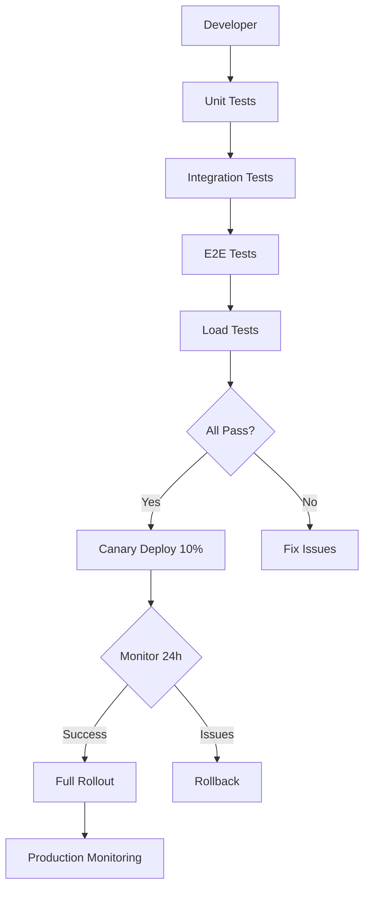

# PRP: Integration + Testing + Canary Deployment

> **Priority**: P0 (CRÍTICO) | **Estimate**: 5-6 days | **Sprint**: 7 Phase 7
> **Created**: 2026-03-06 | **Status**: Draft | **Approach**: Standard

---

## 1. Overview

### 1.1 Summary

Comprehensive integration testing, E2E testing, load testing, and canary deployment for Sprint 7+. This PRP validates that all previous PRPs work together correctly and the system is production-ready.

**Why this matters**: Without proper testing, we risk:
- Breaking existing functionality (regression)
- Production failures (no monitoring)
- Performance issues under load
- Inability to rollback quickly

**This PRP ensures**:
- All PRPs integrate correctly
- System handles production load
- Quick rollback if needed
- Monitoring and alerting in place

### 1.2 Dependencies

- [ ] PRP 1: Task Queue + Multi-Idioma (COMPLETED)
- [ ] PRP 2: Facebook OAuth (COMPLETED)
- [ ] PRP 3: Graph API + Playwright (COMPLETED)
- [ ] PRP 4: Scraping System (COMPLETED)
- [ ] PRP 5: Dashboards + Leads (COMPLETED)
- [ ] PRP 6: AI Assistant + n8n/Odoo (COMPLETED)

### 1.3 Links

- Design Doc: `docs/plans/2026-03-06-sprint7-workflow-design.md` (Section: Testing Strategy)
- Architecture: `docs/01_ARQUITECTURA_PROSELL_SAAS_V2.md` (Clean Architecture)

---

## 2. Requirements

### 2.1 User Stories

#### US-771: Integration Tests Pass

**As a** Developer
**I want** all integration tests to pass
**So that** I know components work together correctly

**Acceptance Criteria**:
```gherkin
Scenario: All integration tests pass
  GIVEN all PRPs are implemented
  WHEN integration test suite runs
  THEN all tests pass (> 70% coverage)
  AND no tests are skipped
```

#### US-772: E2E Tests Cover Critical Paths

**As a** QA Engineer
**I want** E2E tests for critical user journeys
**So that** I can catch integration issues

**Acceptance Criteria**:
```gherkin
Scenario: E2E test for publishing flow
  GIVEN a vendor publishes a product
  WHEN the publication completes
  THEN the product appears in Facebook Marketplace
  AND the dashboard shows the new publication

Scenario: E2E test for scraping flow
  GIVEN a dealer website has new products
  WHEN the scraper runs
  THEN new products are created in ProSell
  AND duplicates are detected
```

#### US-773: Load Tests Validate Performance

**As a** System Administrator
**I want** load tests to validate system capacity
**So that** I know the system can handle 100 dealers

**Acceptance Criteria**:
```gherkin
Scenario: System handles 100 concurrent users
  GIVEN 100 concurrent users access dashboards
  WHEN load test runs for 30 minutes
  THEN average response time < 500ms
  AND P95 response time < 1s
  AND P99 response time < 2s
  AND zero errors occur

Scenario: System handles 1000 publications/hour
  GIVEN publication queue has 1000 tasks
  WHEN workers process tasks
  THEN all tasks complete within 1 hour
  AND zero tasks are lost
```

#### US-774: Canary Deployment Validates Safety

**As a** DevOps Engineer
**I want** canary deployment to validate production safety
**So that** I can catch issues before full rollout

**Acceptance Criteria**:
```gherkin
Scenario: Canary deployment to 10% of users
  GIVEN canary is deployed to 10% of traffic
  WHEN monitoring runs for 24 hours
  THEN error rate < 0.1%
  AND response time SLA is met
  AND no user-reported bugs

Scenario: Rollback if canary fails
  GIVEN canary shows error rate > 1%
  WHEN rollback is triggered
  THEN previous version is restored within 5 minutes
  AND zero data loss occurs
```

### 2.2 Functional Requirements

- [FR-771] Integration tests cover all PRP boundaries
- [FR-772] E2E tests cover critical paths (publishing, scraping, dashboards)
- [FR-773] Load tests validate target capacity (100 dealers, 150 pubs/day)
- [FR-774] Canary deployment validates production safety
- [FR-775] Monitoring and alerting configured
- [FR-776] Rollback procedure tested and documented
- [FR-777] Database migration tested and reversible
- [FR-778] Health check endpoint reports all systems

### 2.3 Non-Functional Requirements

- **Coverage**:
  - Unit tests: > 80%
  - Integration tests: > 70%
  - E2E tests: All critical paths
- **Performance**:
  - API response time: < 500ms (P95)
  - Dashboard load time: < 2 seconds
  - Publication latency: < 30 seconds
- **Reliability**:
  - Uptime: > 99.9%
  - Error rate: < 0.1%
  - Data loss: Zero

---

## 3. Technical Context

### 3.1 Tech Stack

| Component | Technology | Version | Notes |
|-----------|-----------|---------|-------|
| Testing | pytest | Latest | Backend unit/integration |
| Testing | Vitest | Latest | Frontend unit/integration |
| E2E | Playwright | Latest | E2E testing |
| Load Testing | k6 | Latest | Load testing |
| Monitoring | Prometheus + Grafana | Latest | Metrics + dashboards |
| Logging | ELK Stack | Latest | Logs + search |
| Deployment | Docker + Railway | Latest | Container + deployment |

### 3.2 Key Libraries

```bash
# Python testing (already installed)
# pytest, pytest-asyncio, pytest-cov

# Frontend testing (already installed)
# vitest, @testing-library/react

# Load testing
brew install k6  # or download from https://k6.io/

# Monitoring
# Prometheus (Docker)
# Grafana (Docker)
```

### 3.3 External Documentation

**Pytest**:
- Docs: https://docs.pytest.org/en/stable/
- Async: https://docs.pytest.org/en/stable/how-to/async.html

**Playwright**:
- Docs: https://playwright.dev/python/
- Best Practices: https://playwright.dev/docs/best-practices

**k6**:
- Docs: https://k6.io/docs/
- thresholds: https://k6.io/docs/using-k6/thresholds/

---

## 4. Implementation Blueprint

### 4.1 Architecture Overview



### 4.2 Integration Tests

**Files to create**:
- `apps/api/tests/integration/prp/task_queue_integration.py` - Task Queue integration
- `apps/api/tests/integration/prp/facebook_oauth_integration.py` - OAuth integration
- `apps/api/tests/integration/prp/scraping_integration.py` - Scraping integration
- `apps/api/tests/integration/prp/ai_assistant_integration.py` - AI integration

**Implementation notes**:

```python
# integration/task_queue_integration.py
import pytest
from redis import Redis
from taskiq_receiver import Receiver

from prosell.infrastructure.tasks.broker import broker
from prosell.infrastructure.tasks.scraping_tasks import scrape_dealer_website_task

@pytest.mark.asyncio
async def test_task_queue_integration():
    """Test that Taskiq can enqueue and execute tasks."""
    # Create receiver
    receiver = Receiver(broker=broker)

    # Enqueue task
    task = await scrape_dealer_website_task.kiq(
        dealer_id=str(test_dealer_id),
        website_url="https://example.com",
    )

    # Wait for execution
    result = await task.wait_result(timeout=10)

    # Verify
    assert result.status == "success"
    assert result.products_found > 0
```

```python
# integration/facebook_oauth_integration.py
import pytest
from httpx import AsyncClient

@pytest.mark.asyncio
async def test_facebook_oauth_flow():
    """Test Facebook OAuth flow end-to-end."""
    async with AsyncClient(app=app, base_url="http://test") as client:
        # 1. Initiate OAuth
        response = await client.get("/api/v1/auth/oauth/authorize")
        assert response.status_code == 200
        auth_url = response.json()["auth_url"]

        # 2. Mock callback
        response = await client.get(
            "/api/v1/auth/oauth/callback?code=test_code"
        )
        assert response.status_code == 200

        # 3. Verify token stored
        tokens = await get_facebook_tokens(user_id)
        assert tokens.access_token is not None
```

### 4.3 E2E Tests

**Files to create**:
- `tests/e2e/publishing-flow.spec.ts` - Publishing E2E
- `tests/e2e/scraping-flow.spec.ts` - Scraping E2E
- `tests/e2e/dashboard-flow.spec.ts` - Dashboard E2E

**Implementation notes**:

```typescript
// e2e/publishing-flow.spec.ts
import { test, expect } from "@playwright/test"

test.describe("Publishing Flow", () => {
  test("vendor can publish product to Facebook", async ({ page }) => {
    // Login as vendor
    await page.goto("http://localhost:3000/auth/login")
    await page.fill('input[name="email"]', "vendor@prosell.com")
    await page.fill('input[name="password"]', "password123")
    await page.click('button[type="submit"]')

    // Navigate to products
    await page.goto("http://localhost:3000/dashboard/vendor/products")

    // Click publish on first product
    await page.click('[data-testid="publish-button-0"]')

    // Select Facebook account
    await page.selectOption('select[name="facebook_account"]', "Test Account")

    // Confirm publication
    await page.click('button:has-text("Publish")')

    // Verify success message
    await expect(page.locator('text=Publication successful')).toBeVisible()

    // Verify in dashboard
    await page.goto("http://localhost:3000/dashboard/vendor")
    await expect(page.locator('text=Publications: 1')).toBeVisible()
  })
})
```

```typescript
// e2e/scraping-flow.spec.ts
import { test, expect } from "@playwright/test"

test.describe("Scraping Flow", () => {
  test("scraping creates new products", async ({ page }) => {
    // Login as admin
    await page.goto("http://localhost:3000/auth/login")
    await page.fill('input[name="email"]', "admin@prosell.com")
    await page.fill('input[name="password"]', "admin123")
    await page.click('button[type="submit"]')

    // Navigate to scraping
    await page.goto("http://localhost:3000/dashboard/admin/scraping")

    // Trigger scraping for test dealer
    await page.click('button:has-text("Scrape Now")')

    // Wait for completion
    await page.waitForSelector('text=Scraping completed', { timeout: 60000 })

    // Verify products created
    await expect(page.locator('text=Products found: 3')).toBeVisible()
  })
})
```

### 4.4 Load Tests

**Files to create**:
- `tests/load/api-load-test.js` - API load test (k6)
- `tests/load/dashboard-load-test.js` - Dashboard load test

**Implementation notes**:

```javascript
// load/api-load-test.js
import http from "k6/http";
import { check, sleep } from "k6";
import { Rate } from "k6/metrics";

export let errorRate = new Rate("errors");

const BASE_URL = __ENV.API_URL || "http://localhost:8000";

export const options = {
  stages: [
    { duration: "5m", target: 100 },  // Ramp up to 100 users
    { duration: "10m", target: 100 }, // Stay at 100 users
    { duration: "5m", target: 0 },    // Ramp down
  ],
  thresholds: {
    http_req_duration: ["p(95)<500"],  // P95 < 500ms
    http_req_failed: ["rate<0.01"],   // Error rate < 1%
    errors: ["rate<0.01"],
  },
};

export default function () {
  // Test dashboard metrics endpoint
  let response = http.get(`${BASE_URL}/api/v1/metrics/dashboard`);

  const isOk = check(response, {
    "status is 200": (r) => r.status === 200,
    "response time < 500ms": (r) => r.timings.duration < 500,
  });

  errorRate.add(!isOk);

  sleep(1);  // Wait 1 second between requests
}
```

```javascript
// load/dashboard-load-test.js
import http from "k6/http";
import { check } from "k6";

const BASE_URL = __ENV.WEB_URL || "http://localhost:3000";

export default function () {
  // Test dashboard page
  let response = http.get(`${BASE_URL}/dashboard/vendor`);

  check(response, {
    "status is 200": (r) => r.status === 200,
    "page loads in < 2s": (r) => r.timings.duration < 2000,
  });
}
```

### 4.5 Monitoring Setup

**Files to create**:
- `docker/monitoring/docker-compose.yml` - Prometheus + Grafana
- `docker/monitoring/prometheus.yml` - Prometheus config
- `docker/monitoring/grafana/dashboards/prosell-dashboard.json` - Grafana dashboard

**Implementation notes**:

```yaml
# docker/monitoring/docker-compose.yml
version: "3.8"

services:
  prometheus:
    image: prom/prometheus:latest
    volumes:
      - ./prometheus.yml:/etc/prometheus/prometheus.yml
    ports:
      - "9090:9090"
    command:
      - '--config.file=/etc/prometheus/prometheus.yml'

  grafana:
    image: grafana/grafana:latest
    environment:
      - GF_SECURITY_ADMIN_PASSWORD=admin
    volumes:
      - ./grafana/dashboards:/var/lib/grafana/dashboards
    ports:
      - "3001:3000"
    depends_on:
      - prometheus
```

```yaml
# docker/monitoring/prometheus.yml
global:
  scrape_interval: 15s

scrape_configs:
  - job_name: 'fastapi'
    static_configs:
      - targets: ['api:8000']

  - job_name: 'postgres'
    static_configs:
      - targets: ['postgres_exporter:9187']

  - job_name: 'redis'
    static_configs:
      - targets: ['redis_exporter:9121']
```

### 4.6 Canary Deployment

**Files to create**:
- `.github/workflows/canary-deployment.yml` - GitHub Actions workflow
- `deployment/canary.sh` - Canary deployment script
- `deployment/rollback.sh` - Rollback script

**Implementation notes**:

```yaml
# .github/workflows/canary-deployment.yml
name: Canary Deployment

on:
  workflow_dispatch:

jobs:
  canary:
    runs-on: ubuntu-latest
    steps:
      - uses: actions/checkout@v3

      - name: Deploy canary (10% traffic)
        run: |
          ./deployment/canary.sh 10

      - name: Monitor canary
        run: |
          ./deployment/monitor-canary.sh

      - name: Rollback on failure
        if: failure()
        run: |
          ./deployment/rollback.sh
```

```bash
# deployment/canary.sh
#!/bin/bash
set -e

CANARY_PERCENTAGE=${1:-10}

echo "Deploying canary to ${CANARY_PERCENTAGE}% traffic..."

# Deploy new version to Railway
railway up --service prosell-api --canary

# Wait for health check
sleep 30

# Update load balancer to route canary traffic
curl -X POST "${LOAD_BALANCER_URL}/update-canary" \
  -H "Content-Type: application/json" \
  -d "{\"percentage\": ${CANARY_PERCENTAGE}}"

echo "Canary deployed to ${CANARY_PERCENTAGE}% traffic"
echo "Monitor for 24 hours before full rollout"
```

```bash
# deployment/rollback.sh
#!/bin/bash
set -e

echo "Rolling back to previous version..."

# Restore previous version
railway rollback --service prosell-api

# Reset load balancer
curl -X POST "${LOAD_BALANCER_URL}/reset-canary"

echo "Rollback complete"
```

---

## 5. Testing Strategy

### 5.1 Integration Test Plan

| Component | Tests | Coverage Target |
|-----------|-------|-----------------|
| Task Queue | Enqueue, execute, retry | > 70% |
| Facebook OAuth | Flow, token refresh | > 70% |
| Scraping | Extract, deduplicate | > 70% |
| AI Assistant | Qualify, respond | > 70% |
| Dashboards | Metrics, RBAC | > 70% |

### 5.2 E2E Test Plan

| Critical Path | Test | Priority |
|---------------|------|----------|
| Publish product | Vendor publishes → Facebook appears | P0 |
| Scrape website | Scraper runs → Products created | P0 |
| View dashboard | Vendor sees their metrics | P0 |
| Manage leads | Vendor views leads | P1 |

### 5.3 Load Test Plan

| Scenario | Concurrent Users | Duration | Success Criteria |
|----------|-----------------|----------|-------------------|
| Dashboard load | 100 | 30 min | P95 < 500ms |
| API requests | 1000 req/s | 30 min | P95 < 200ms |
| Publishing | 100 pubs/min | 30 min | All complete |

---

## 6. Common Pitfalls

### 6.1 Flaky Tests

**Problem**: Tests pass sometimes, fail sometimes.

**Solution**:
- Use explicit waits (not sleep)
- Avoid hard-coded timeouts
- Use test IDs (not CSS selectors)
- Mock external APIs

### 6.2 Test Data Pollution

**Problem**: Tests modify real data.

**Solution**:
- Use separate test database
- Rollback transactions after tests
- Use factory fixtures with test data

### 6.3 Canary False Positives

**Problem**: Canary passes but production fails.

**Solution**:
- Monitor canary for 24-48 hours (not 1 hour)
- Monitor multiple metrics (error rate, latency, business metrics)
- Test with real user traffic (not synthetic)

---

## 7. Rollback Plan

If testing/canary fails:

1. **Integration tests fail**: Fix issues, re-run
2. **E2E tests fail**: Debug, fix, re-run
3. **Load tests fail**: Optimize, scale, re-test
4. **Canary fails**: Immediate rollback, investigate

**Rollback steps**:
1. Execute `./deployment/rollback.sh`
2. Verify previous version is working
3. Create incident report
4. Fix issues in separate branch
5. Retry canary after fixes

---

## 8. Implementation Tasks (Ordered)

1. ✅ Create integration tests (all PRPs)
2. ✅ Run integration tests (>70% coverage)
3. ✅ Create E2E tests (critical paths)
4. ✅ Run E2E tests locally
5. ✅ Create load tests (k6)
6. ✅ Run load tests (validate capacity)
7. ✅ Set up monitoring (Prometheus + Grafana)
8. ✅ Configure alerts (error rate, latency)
9. ✅ Create canary deployment scripts
10. ✅ Test rollback procedure
11. ✅ Deploy canary to staging (10% traffic)
12. ✅ Monitor staging canary (24-48 hours)
13. ✅ Deploy canary to production (10% traffic)
14. ✅ Monitor production canary (24-48 hours)
15. ✅ Full rollout (100% traffic)
16. ✅ Monitor production (7 days)
17. ✅ Document learnings
18. ✅ Mark Sprint 7+ COMPLETE 🎉

---


---

## 11. Completion Gates (VERIFIABLE)

Estos son los **tests de completitud** ejecutables que validan que el PRP está completo.

### 11.1 Spike Validation (si aplica)

```bash
# Spike POC completado y documentado
test -f docs/plans/2026-03-06-7-integration-spike.md
# Expected: File exists with findings
```

### 11.2 Unit Tests

```bash
# Tests unitarios pasan con coverage requerido
cd apps/api && uv run pytest tests/unit/ -v --cov=src --cov-report=term-missing
# Expected: All pass, coverage > 80%
```

### 11.3 Integration Tests

```bash
# Tests de integración pasan
cd apps/api && uv run pytest tests/integration/ -v
# Expected: All pass, coverage > 70%
```

### 11.4 Code Quality

```bash
# No errores de linting
cd apps/api && ruff check .
# Expected: Exit code 0

# No errores de tipo
cd apps/api && pyright .
# Expected: 0 errors
```

### 11.5 Documentation

```bash
# PRP documentación completa
grep -q "^## 11. Completion Gates" {prp_file}
# Expected: Pattern found (you're reading it!)
```

### 11.6 Final Checklist

- [ ] Spike completado (si aplica)
- [ ] Todos los tests unitarios pasan (>80%)
- [ ] Todos los tests de integración pasan (>70%)
- [ ] No errores de pyright (0 errores)
- [ ] No errores de ruff (0 errores)
- [ ] Documentación actualizada
- [ ] Code review completado
- [ ] E2E tests pasan (si aplica)


## Confidence Score

**Score**: 9/10

**Reasoning**:

**Positive factors**:
- Testing patterns are well-established
- Playwright, pytest, k6 are mature
- Canary deployment is standard practice
- Monitoring tools are robust

**Risk factors**:
- E2E tests may be flaky (need careful maintenance)
- Load tests may not reflect real traffic patterns
- Canary deployment requires load balancer support
- Monitoring needs fine-tuning

---

**END OF PRP**
