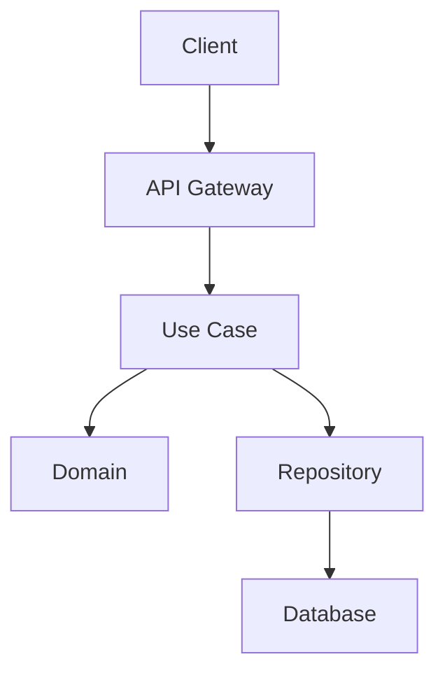

# PRP: [Feature Name]

> **Priority**: P0 | **Estimate**: [X days] | **Sprint**: [X]
> **Created**: [Date] | **Status**: Draft

---

## 1. Overview

### 1.1 Summary
[Brief description of what this feature does and why it matters]

### 1.2 Dependencies
- [ ] [Dependency 1]
- [ ] [Dependency 2]

### 1.3 Links
- PRD: `docs/02_REQUISITOS_PRD_PROSELL_SAAS_V2.md`
- Architecture: `docs/01_ARQUITECTURA_PROSELL_SAAS_V2.md`
- Tasks: `docs/05_TAREAS_SPRINT_PROSELL_SAAS_V2.md`

---

## 2. Requirements

### 2.1 User Stories

#### US-[XXX]: [Title]
**As a** [role]
**I want** [action]
**So that** [benefit]

**Acceptance Criteria**:
```gherkin
Scenario: [Scenario name]
  GIVEN [precondition]
  WHEN [action]
  THEN [outcome]
```

### 2.2 Functional Requirements
- [ ] [FR-001] [Description]
- [ ] [FR-002] [Description]

### 2.3 Non-Functional Requirements
- **Performance**: [Specific metrics]
- **Security**: [Security considerations]
- **Scalability**: [Scaling requirements]

---

## 3. Technical Context

### 3.1 Tech Stack

| Component | Technology | Version | Notes |
|-----------|------------|---------|-------|
| Backend | [Framework] | [Version] | [Notes] |
| Frontend | [Framework] | [Version] | [Notes] |
| Database | [DB] | [Version] | [Notes] |

### 3.2 Key Libraries

```bash
# Python dependencies
pip install [package]==[version]

# Node dependencies
pnpm add [package]@[version]
```

### 3.3 External Documentation
- [Library Name]: [URL to specific docs]
- [Reference]: [URL to examples]

---

## 4. Implementation Blueprint

### 4.1 Architecture Overview



### 4.2 Implementation Steps

#### Step 1: [Layer/Component Name]
**Files to create**:
- `path/to/file1.py` - [Purpose]
- `path/to/file2.py` - [Purpose]

**Implementation notes**:
```python
# Pseudocode / Example pattern
class ExampleEntity:
    def __init__(self, ...):
        ...
```

**Gotchas**:
- [Gotcha 1]
- [Gotcha 2]

#### Step 2: [Layer/Component Name]
...

---

## 5. Code Patterns & Examples

### 5.1 [Pattern Name]

**Reference**: `path/to/reference/file.py`

```python
# Real example from codebase
def example_function():
    ...
```

### 5.2 [Pattern Name]
...

---

## 6. Validation Gates

### 6.1 Pre-commit Checks

```bash
# Linting
ruff check --fix && ruff format .

# Type checking
pyright

# Frontend
cd apps/web && pnpm lint && pnpm typecheck
```

### 6.2 Unit Tests

```bash
# Backend
cd apps/api && uv run pytest tests/unit/ -v --cov=src

# Frontend
cd apps/web && pnpm test
```

### 6.3 Integration Tests

```bash
# Backend integration
cd apps/api && uv run pytest tests/integration/ -v
```

### 6.4 E2E Tests

```bash
# Playwright
cd tests/e2e && pnpm test
```

---

## 7. Testing Strategy

### 7.1 Unit Tests
- [Entity tests] - Test business logic in isolation
- [Use case tests] - Test application logic with mocks
- [Service tests] - Test infrastructure services

### 7.2 Integration Tests
- [Repository tests] - Test database operations
- [API tests] - Test endpoint behavior

### 7.3 E2E Tests
- [User flow] - Test complete user journeys

### 7.4 Coverage Targets
- Unit tests: > 80%
- Integration tests: > 70%
- E2E tests: Critical paths only

---

## 8. Common Pitfalls

### 8.1 [Pitfall Name]
**Problem**: [Description]
**Solution**: [How to avoid/fix]

### 8.2 [Pitfall Name]
...

---

## 9. Rollback Plan

If implementation fails:
1. [Rollback step 1]
2. [Rollback step 2]
3. [Rollback step 3]

---

## 10. Completion Checklist

- [ ] All user stories implemented
- [ ] All acceptance criteria met
- [ ] All validation gates passing
- [ ] Documentation updated
- [ ] Code review completed
- [ ] Tests passing with required coverage

---

## Confidence Score

**Score**: [X]/10

**Reasoning**:
- [Positive factor 1]
- [Positive factor 2]
- [Risk factor 1]
- [Risk factor 2]
