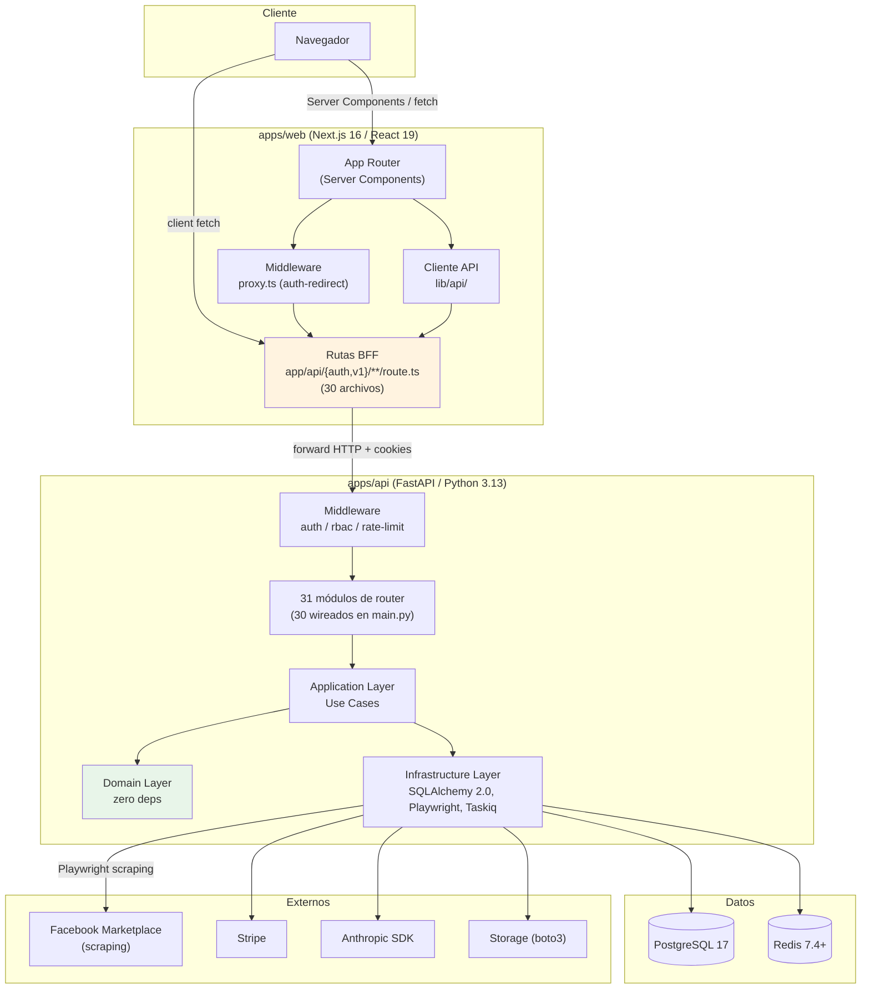
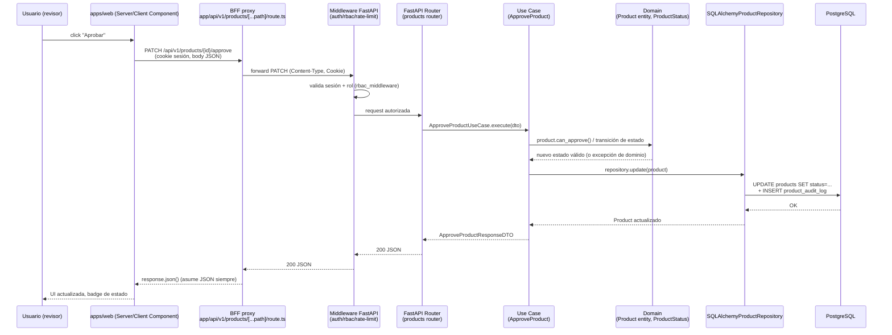
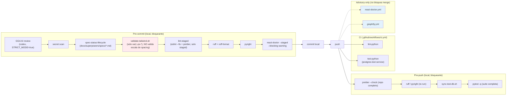

# Architecture — ProSell SaaS

## System Overview

ProSell SaaS es un monorepo pnpm + Turborepo con tres miembros de workspace reales — un backend FastAPI (`apps/api`), un frontend Next.js 16 (`apps/web`) y una suite E2E standalone (`tests/e2e`, paquete `@prosell/e2e`) — comunicados el frontend y el backend exclusivamente por HTTP a través de un conjunto de rutas proxy BFF (Backend-For-Frontend) del lado de Next.js. No existe código compartido en tiempo de compilación entre `apps/web` y `apps/api`: `pnpm-workspace.yaml` declara el glob `packages/*`, pero **el directorio `packages/` no existe en disco** — es un glob de workspace muerto/sin cumplir, coherente con la nota aspiracional de `CLAUDE.md` ("Shared code (future)").

## Architectural Style

**Monolito modular en ambos lados**, con Clean Architecture estricta en el backend:

- **Backend (`apps/api`)**: un único servicio FastAPI, internamente dividido en las tres capas de Clean Architecture (`domain → application → infrastructure`), con 31 módulos de router bajo `infrastructure/api/routers/` como puntos de entrada — de los cuales **30** están efectivamente wireados vía `app.include_router(...)` en `main.py` (discrepancia de 1 router no confirmada como intencional en este pase — ver `code-quality-assessment.md`). No hay evidencia de descomposición en microservicios.
- **Frontend (`apps/web`)**: Next.js 16 App Router con Server Components por defecto, un conjunto de 30 rutas API internas (`app/api/**/route.ts`) que actúan como capa BFF/proxy hacia el backend FastAPI — nunca el navegador llama directo a `apps/api`. Un middleware propio (`apps/web/src/proxy.ts`) resuelve matching de rutas y redirecciones de auth (`PROTECTED_ROUTES`/`PUBLIC_ROUTES`/`AUTH_REDIRECT_ROUTES`).
- **Scraping/ML**: orquestado desde el backend (Playwright + Taskiq/Redis para colas asíncronas), no es un servicio separado — vive dentro de `apps/api/src/prosell/infrastructure/{tasks,integrations,images}`.

Evidencia: 13 servicios en `docker-compose.yml` (ninguno adicional de aplicación propia más allá de `api`/`web`), ausencia física de `packages/*`, y la estructura de `apps/api/src/prosell/` que replica el patrón Clean Architecture canónico.

## Component Relationships

**Regla de dependencia (backend)**: `Infrastructure → Application → Domain`, con Domain sin dependencias externas (Python puro), tal como declara `CLAUDE.md` raíz y confirma la estructura de directorios escaneada.

**Corrección de límites del proxy BFF (deuda activa, no re-verificada línea por línea este pase)**: los proxies dinámicos `apps/web/src/app/api/v1/*/[...path]/route.ts` fuerzan `response.json()` sobre toda respuesta del backend sin verificar `content-type` — un defecto arquitectónico ya documentado en memoria del proyecto que rompe cualquier endpoint no-JSON (ver `api-documentation.md` y `code-quality-assessment.md`).

## Data Flow

1. El navegador interactúa con un Server Component (SSR) o dispara un fetch de cliente contra una ruta BFF de Next.js; el middleware `proxy.ts` decide primero si la ruta requiere auth y redirige si corresponde.
2. La ruta BFF reenvía la petición al backend FastAPI, incluyendo cookies de sesión httpOnly.
3. El middleware de FastAPI (`auth_middleware.py`, `rbac_middleware.py`, `rate_limit_middleware.py`) valida sesión/rol/límite de tasa antes de llegar al router.
4. El router correspondiente valida el DTO de entrada (Pydantic), delega a un Use Case de la capa Application.
5. El Use Case orquesta entidades/servicios de dominio y llama a un puerto (interfaz) que la capa Infrastructure implementa (repositorio SQLAlchemy, servicio externo, etc.).
6. La respuesta (DTO de salida) sube de vuelta por las mismas capas hasta el router, que la serializa a JSON.
7. La ruta BFF de Next.js recibe la respuesta y hoy la fuerza a `response.json()` en los proxies dinámicos — el punto de fragilidad documentado.
8. El cliente API del frontend (`lib/api/`) parsea la respuesta contra su esquema Zod-mirror correspondiente antes de entregarla a TanStack Query / componentes.

## Interaction Diagrams

### 1. Transición de estado de producto (BFF → middleware → FastAPI → SQLAlchemy)

Flujo representativo de una transacción de negocio típica: un revisor aprueba una publicación desde la cola de revisión.

### 2. Pipeline de calidad de código (pre-commit + pre-push, bloqueante vs. advisory)

Este segundo diagrama explica por qué las clases Tailwind inválidas (familia `.5` ya corregida, y el residuo de familia `.25`/`.75` encontrado en este rescan) llegaron a `main` sin ser atrapadas: `validate-tailwind.sh` solo revisa el patrón `var(--ps-*)` dentro de `className`, no la validez de la clase de utilidad de spacing contra la escala configurada — ningún linter del pipeline actual lo hace. El hook `next-lint` en pre-commit está además comentado ("TODO: currently disabled due to next lint issues"), dejando `lint-staged` como único chequeo ESLint por commit (solo archivos staged).

## Key Design Decisions

- **Clean Architecture con Domain zero-deps** en el backend — permite testear reglas de negocio sin infraestructura y aísla el dominio de cambios en SQLAlchemy/FastAPI.
- **Multi-tenant por `tenant_id` explícito** en cada agregado — decisión de aislamiento a nivel de fila, no de esquema/DB separada.
- **BFF como capa de indirección obligatoria** — el navegador nunca habla directo con FastAPI; centraliza cookies httpOnly y auth, a costa de duplicar la superficie de rutas (30 archivos proxy) y de introducir el defecto conocido de `response.json()` ciego en los proxies dinámicos.
- **Middleware en capas en ambos lados** — Next.js resuelve auth-redirect en `proxy.ts` antes de tocar una ruta BFF; FastAPI aplica auth/rbac/rate-limit antes de llegar al router — doble punto de enforcement, no uno solo.
- **Zod-mirror 1:1** — cada DTO de backend tiene un esquema Zod equivalente en frontend, para no confiar en `as X` sin validar (regla zero-tolerance del proyecto).
- **`packages/*` no implementado pese a estar documentado** — decisión implícita (o plan diferido) de no compartir tipos en build-time entre `apps/web` y `apps/api`; hoy el contrato se sincroniza a mano vía los esquemas Zod-mirror.
- **`tests/e2e` como miembro de workspace independiente** (`@prosell/e2e`), no un simple directorio de specs — aislado de `apps/web`/`apps/api` en su propio `package.json`.

## Improvement Opportunities

- Cerrar la brecha `response.json()`-sin-content-type en los proxies dinámicos (`products`, `categories`, `organizations`, `vehicles`) antes de que un endpoint no-JSON (CSV, archivo) los rompa en producción.
- Decidir formalmente el destino de `packages/*`: implementarlo o quitar el glob de `pnpm-workspace.yaml` — hoy es un glob de workspace sin cumplir.
- Evaluar mover la validación de clases Tailwind a un linter real (p. ej. plugin ESLint de Tailwind) en vez de un grep de `validate-tailwind.sh` que no puede detectar clases de utilidad inválidas — causa raíz estructural de que la familia `.25`/`.75` haya pasado desapercibida incluso después de corregir la familia `.5`.
- Investigar por qué 1 de los 31 módulos de router bajo `infrastructure/api/routers/` no está wireado en `main.py` — confirmar si es intencional (router desactivado a propósito) o un olvido.
- Investigar el propósito de `apps/app/` (orphan, un solo archivo) — candidato a eliminación o a integración real.
- Habilitar el chequeo de rol admin pendiente en `marketplace_access_router.py:110` (TODO abierto).
