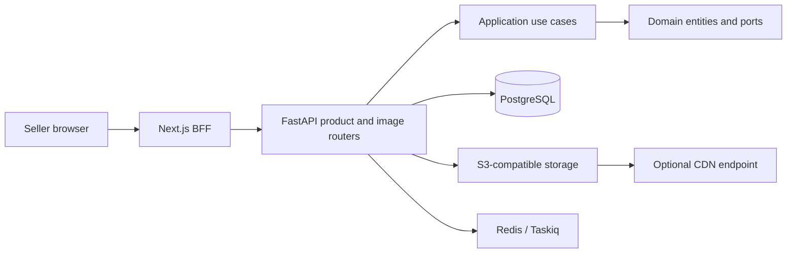
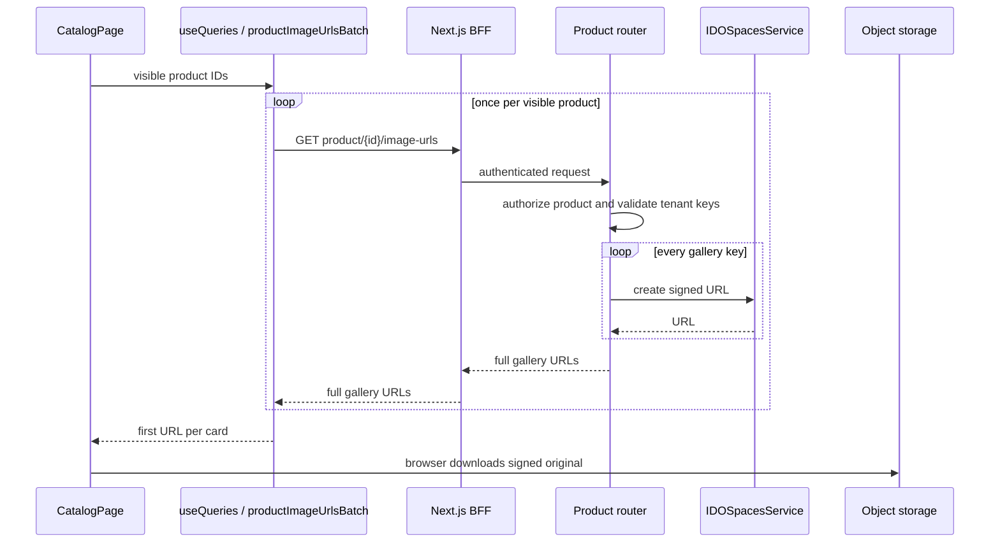
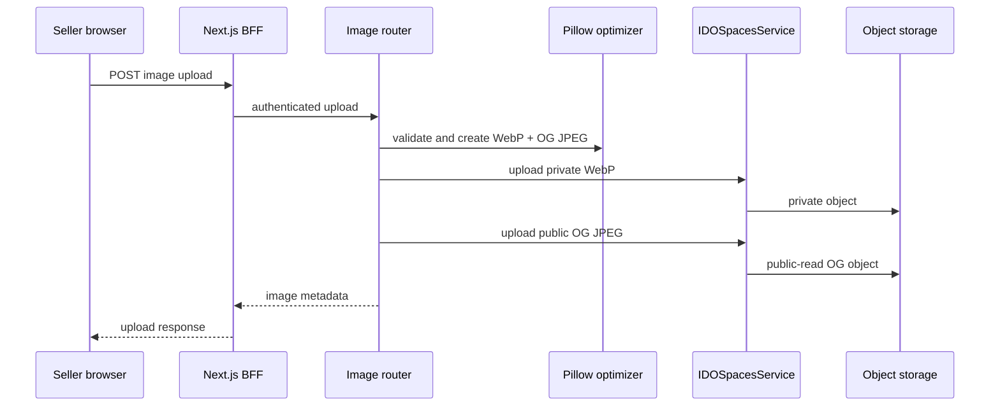

# Architecture Analysis

## System Overview

The system is a modular monolith: a Next.js App Router web application communicates through authenticated BFF routes with a FastAPI API. The API follows Clean Architecture boundaries: domain entities and interfaces, application use cases/DTOs, and infrastructure adapters for HTTP, PostgreSQL, Redis/Taskiq, and S3-compatible storage.

## Architectural Style

- **Frontend:** Next.js 16 App Router, React 19, TanStack Query, and Zustand.
- **Backend:** asynchronous FastAPI and SQLAlchemy 2.0 with PostgreSQL.
- **Object storage:** `IDOSpacesService` abstraction backed by MinIO locally and DigitalOcean Spaces in deployment.
- **Security boundary:** API authorization plus tenant-key validation before signed private image URLs are returned.

## Component Relationships

## Interaction Diagrams

### Current catalog cover-image flow

### Upload and derivative flow

## Data Flow

`Product.image_urls` is the current catalog image source. Product-card rendering needs a single cover URL, while `GET /api/v1/products/{product_id}/image-urls` currently returns URLs for the full gallery. Upload processing generates a full-size WebP and public OG JPEG; no current response selects or exposes a private thumbnail for cards.

## Key Design Decisions

- Authentication and tenant-key validation are defense in depth, not redundant checks to remove during batching.
- Browser-facing signed object URLs use `next/image` with `unoptimized`, because the Next server cannot reach the browser-facing MinIO host.
- `do_cdn_endpoint` is configuration only today; no application path reads it and upload operations do not set object cache-control metadata.

## Improvement Opportunities

1. Add an authenticated batch cover-image contract that authorizes each product and signs only its selected cover derivative.
2. Create and maintain a private catalog-thumbnail derivative independently of the public OG JPEG.
3. Specify signed-URL TTL, object cache-control, invalidation, and CDN routing as an executable contract.
4. Test cross-organization administrator access and legacy `attributes.image_urls` behavior at the new boundary.
