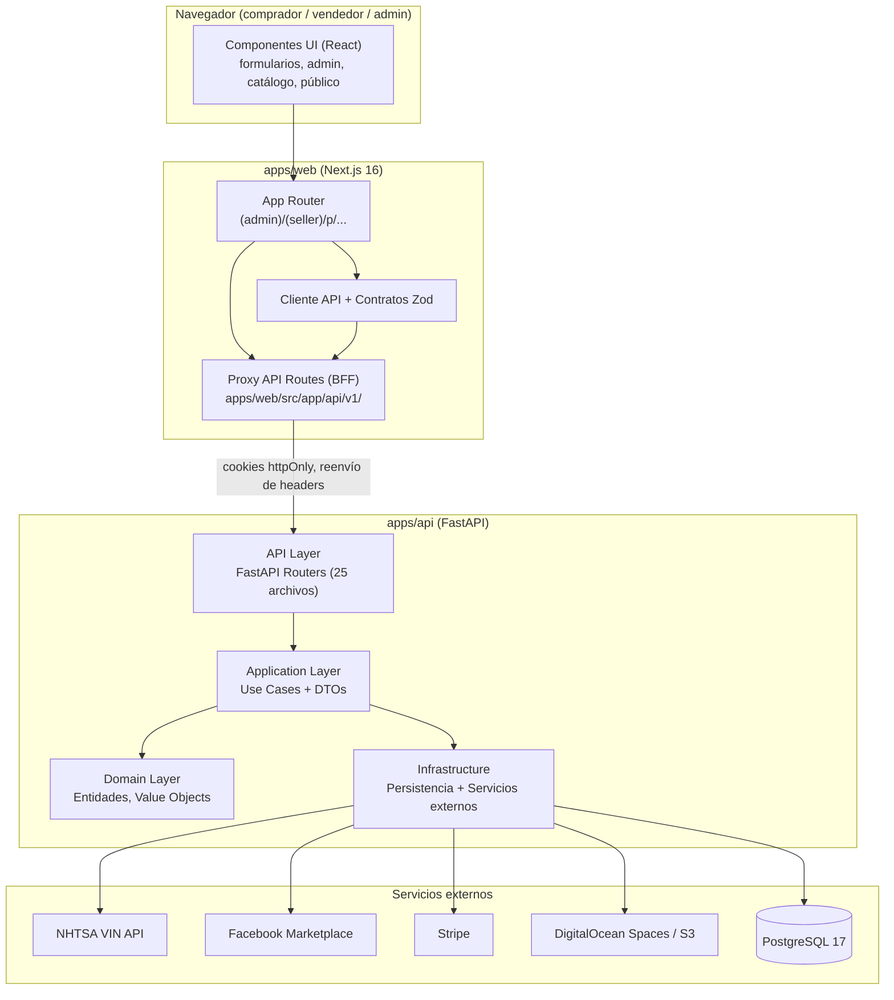
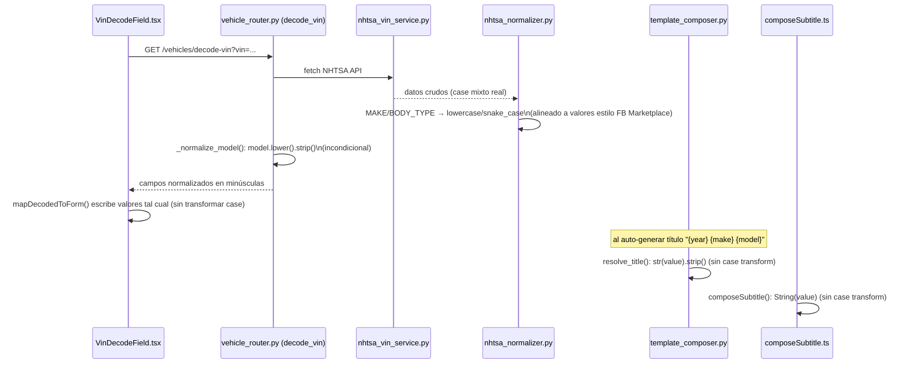
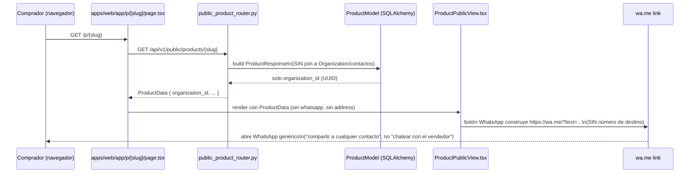
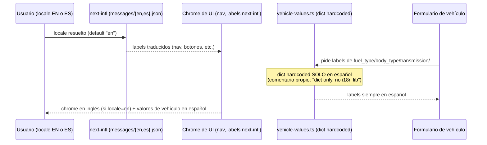
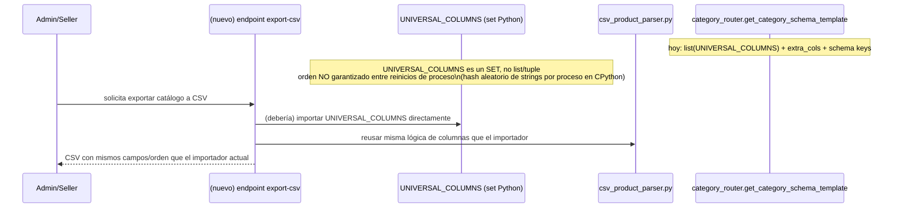

# Architecture — prosell-sass

## System Overview

ProSell SaaS es un monorepo con dos servicios principales — un backend FastAPI (`apps/api`) y un frontend Next.js (`apps/web`) — más una micro-app mínima (`apps/app`, solo confirmada como página de privacidad) y una suite E2E Playwright separada (`tests/e2e/`). El backend implementa Clean Architecture estricta (`domain → application → infrastructure`), con el dominio sin dependencias externas. El frontend actúa como BFF (Backend-for-Frontend) parcial: sus propias rutas API (`apps/web/src/app/api/v1/`) proxean hacia el backend real, principalmente para preservar cookies httpOnly de autenticación.

## Architectural Style

**Monolito modular en dos servicios, con Clean Architecture en el backend.** Evidencia:

- Separación física en 3 capas dentro de `apps/api/src/prosell/` (`domain/`, `application/`, `infrastructure/`), consistente con la regla explícita de `CLAUDE.md`: "Domain layer has ZERO external dependencies".
- Inyección de dependencias basada en interfaces: el dominio/aplicación define puertos (`application/ports/`, p. ej. `IDOSpacesService`, `IVINDecoderService`) que la infraestructura implementa — patrón Ports & Adapters (Hexagonal).
- No hay evidencia de despliegue como microservicios independientes (no hay múltiples `main.py`/entrypoints de servicio backend, un solo `apps/api`) — es un monolito modular, no microservicios.
- El frontend no es SSR puro tampoco es SPA pura: usa App Router de Next.js 16 con Server Components por defecto (regla de `CLAUDE.md`), y una capa de proxy API routes hace de BFF liviano.

## Component Relationships

**Fallback de texto**: el navegador renderiza Componentes UI dentro del App Router de `apps/web`; las páginas llaman al Cliente API (contratos Zod) que pega contra las Proxy API Routes del propio Next.js; esas rutas proxy reenvían la request (con cookies httpOnly) hacia los FastAPI Routers de `apps/api`; los routers delegan en Use Cases de Application, que a su vez operan sobre el Domain Layer y sobre Infrastructure (persistencia PostgreSQL y servicios externos: NHTSA, Facebook, Stripe, Spaces).

## Data Flow

El flujo típico de una acción de negocio (p. ej. crear un producto vehículo) es:

1. El vendedor completa el formulario dinámico (`GenericProductForm` / `SchemaFieldRenderer`), guiado por el `attribute_schema` JSONB de la categoría elegida.
2. Si es un vehículo, puede invocar el decodificador VIN (`VinDecodeField` → proxy → `vehicle_router.decode_vin` → `nhtsa_vin_service` → NHTSA API → `nhtsa_normalizer`).
3. Al enviar, el Cliente API valida contra el schema Zod espejo y pega al proxy BFF, que reenvía al `product_router` de FastAPI.
4. El `product_router` delega en un Use Case de creación, que valida contra las reglas de `Category` (dominio) y persiste vía repositorio SQLAlchemy — cada cambio de estado se audita automáticamente en `product_audit_log` (trigger a nivel de `repo.update()`, no convención de call-site).
5. El producto entra en estado `draft`/pendiente y debe pasar por la cola de revisión (`review-queue`) antes de ser visible en el catálogo público (`p/[slug]`).

## Interaction Diagrams

Diagramas de secuencia mostrando cómo se implementan (o fallan en implementarse) las transacciones de negocio detrás de los bugs del intent activo, trazadas a nivel de archivo por el scan del desarrollador.

### 1. BUG-3 / BUG-6 — Schema de categoría: select pierde su valor / se renderiza como texto

```mermaid
sequenceDiagram
    participant Admin as Admin (CategorySchemaEditor)
    participant ZodA as AttributeField (Zod, categorySchema.ts)
    participant API as category_router.py (PATCH /schema)
    participant DTO as CategoryResponse (JSONB libre)
    participant Domain as Category.validate_attributes()
    participant Form as SchemaFieldRenderer.tsx
    participant TypeB as AttributeSchemaEntry (types/category.ts)

    Admin->>ZodA: elige Render As = "select"
    Note over ZodA: AttributeField NO tiene campo "options"<br/>no hay UI para poblarlas
    Admin->>API: PATCH /categories/{id}/schema (JSONB)
    API->>DTO: persiste tal cual (dict libre)
    Note over DTO: sin validar contra AttributeField ni AttributeSchemaEntry
    Domain-->>DTO: (soporta options si existieran - no invocado aquí)

    Note over Form: al crear un producto de esa categoría
    Form->>TypeB: lee attribute_schema del producto
    Form->>Form: if (Array.isArray(entry.options) && entry.options.length) render Select
    Note over Form: entry.options es undefined (nunca se pobló)<br/>render_as="select" es IGNORADO
    Form-->>Admin: renderiza <input type="text"> en vez de <Select>
```

**Fallback de texto**: el admin elige "Render As → select" en `CategorySchemaEditor`, pero el tipo Zod que respalda esa UI (`AttributeField`) no tiene ningún campo `options` — no hay dónde cargarlas. El `PATCH /categories/{id}/schema` persiste el JSONB tal cual, sin validación cruzada. Cuando el formulario de creación de producto (`SchemaFieldRenderer`) decide qué control renderizar, lee un tipo _distinto_ (`AttributeSchemaEntry`) y decide renderizar `<Select>` solo si `entry.options` es un array no vacío — nunca mira `render_as`. Como `options` nunca se pobló, siempre cae al input de texto plano. El dominio backend (`Category.validate_attributes()`) sí sabe validar `options` cuando existen, pero nunca llega a intervenir porque el dato nunca las tuvo.

### 2. BUG-5 — Capitalización (Title Case) en formulario de vehículos

**Fallback de texto**: `nhtsa_normalizer.py` convierte deliberadamente los valores decodificados de NHTSA a minúsculas/snake_case, pensado para consistencia con los enums estilo Facebook Marketplace usados en scraping/publicación — no para mostrarse al usuario humano. `vehicle_router._normalize_model()` además fuerza `.lower()` incondicionalmente sobre cualquier modelo. Estos valores en minúscula se reutilizan tal cual como valores humanos en el endpoint general de decode-vin que consume el formulario de creación de producto. Nada aguas abajo los re-capitaliza: `mapDecodedToForm()` los escribe verbatim, `template_composer.resolve_title()` (que genera el título automático `{year} {make} {model}`) solo hace `str(value).strip()`, y `composeSubtitle.ts` (subtítulo de la tarjeta de catálogo) solo hace `String(value)`. **No existe ninguna utilidad `titleCase`/`toTitleCase` en todo el código base** (confirmado por búsqueda) — es una utilidad faltante, no una llamada olvidada.

### 3. BUG-4 — Compartir contacto de organización por WhatsApp

**Fallback de texto**: `OrganizationContact` (value object backend) y `ContactManager.tsx` (UI admin) permiten registrar contactos nombrados con campo `whatsapp` — pero esa data nunca llega al comprador. `public_product_router.get_public_product` construye el `ProductResponse` directo desde `ProductModel`, sin join hacia `Organization` ni sus contactos. `getProduct()` en `p/[slug]/page.tsx` solo llama a `/api/v1/public/products/{slug}` y su interfaz `ProductData` solo lleva `organization_id` (UUID pelado). El botón "WhatsApp" en `ProductPublicView.tsx` arma un link genérico `https://wa.me/?text=...` sin destinatario — es "compartir a cualquier contacto", no "escribirle directamente al vendedor". Si la intención de negocio es la segunda, falta toda la plomería del lado público: el endpoint, el DTO, y el componente. Corregir el bug reportado ("debe ocultar el teléfono, solo mostrar dirección") requiere primero decidir qué dato SÍ debe viajar al público antes de tocar la UI.

### 4. BUG-7 — Mezcla de idiomas español/inglés en formularios de vehículos

**Fallback de texto**: el frontend corre `next-intl` como sistema de i18n, con `defaultLocale: "en"` (comentario: "Default: English (USA market primary)"). Pero `vehicle-values.ts` — que provee **todas** las etiquetas de valores de atributos de vehículo (fuel_type, body_type, transmission, etc.) mostradas en todo el UI de seller/admin — es un diccionario hardcodeado solo en español, sin ninguna conciencia de locale (comentario propio en el archivo: "ponytail: dict only, no i18n lib. Add next-intl when multi-locale needed"). Un usuario en locale inglés ve el chrome de la app en inglés (vía next-intl) mezclado con etiquetas de vehículo en español — muy probablemente el bug concreto reportado. Esto es un síntoma de un problema más amplio: `docs/AUDIT-UI-UX-I18N-2026-07-21.md` documenta que solo 2 de +125 archivos usan `useTranslations`, con el resto del panel admin/seller/CRM hardcodeado. El backend tiene su propio sistema de i18n (`infrastructure/i18n/translator.py`) pero es **código muerto** — no lo importa nada fuera de su propio paquete.

### 5. FEAT-1 — Exportación de catálogo a CSV (espejo del importador)

**Fallback de texto**: el endpoint existente que genera la plantilla CSV de importación (`category_router.get_category_schema_template`) construye el orden de columnas como `list(UNIVERSAL_COLUMNS) + extra_cols + [schema keys]`, donde `UNIVERSAL_COLUMNS = {"title", "price", "category_id"}` es un **set** de Python, no una lista/tupla ordenada. `list()` sobre un set de strings no garantiza orden estable entre reinicios de proceso (CPython aleatoriza el hash de strings por proceso). El nuevo endpoint de exportación (FEAT-1), para "espejar los mismos campos/orden que el importador actual" de forma confiable, debe importar `UNIVERSAL_COLUMNS` directamente y aplicar su propio orden fijo — o mejor, la constante fuente debería convertirse en una secuencia ordenada (`tuple`/`list`) para que ambos endpoints (import template y export) compartan una única fuente de verdad estable.

## Key Design Decisions

- **Clean Architecture estricta en backend, con dominio cero-dependencias** — facilita testear reglas de negocio sin infraestructura, a costa de más indirección (DTOs, puertos, mapeos) en cada feature.
- **JSONB libre para `attribute_schema` de categoría** — da flexibilidad total para categorías dinámicas (vehículos, inmuebles, artículos) sin migraciones por cada tipo de atributo, pero es la causa raíz directa de BUG-3/6: sin un contrato de tipo único compartido entre el editor de schema y el renderer runtime, el JSONB acepta formas que un lado entiende y el otro no.
- **BFF liviano en Next.js (Proxy API Routes)** — centraliza el manejo de cookies httpOnly, pero cada proxy debe reenviar manualmente los headers necesarios; un bug histórico confirmado (sesión 2026-08-21, fuera de este intent) mostró que un proxy descartaba silenciosamente `If-Match`, rompiendo 4 endpoints de "deshacer" solo quando se usaban desde el navegador real.
- **Normalización de valores decodificados hacia minúsculas/snake_case (NHTSA → estilo Facebook)** — decisión correcta para el pipeline de scraping/publicación, pero reutilizada sin transformación en el endpoint humano de decode-vin — mezcla dos audiencias (máquina vs. humano) en un solo endpoint sin diferenciación de presentación.
- **next-intl adoptado solo parcialmente** — decisión de alcance (probablemente priorización de tiempo) documentada en `docs/AUDIT-UI-UX-I18N-2026-07-21.md`, con el 95% del UI todavía hardcodeado.

## Improvement Opportunities

1. **Unificar el tipo de `attribute_schema`** entre `AttributeField` (editor) y `AttributeSchemaEntry` (runtime) en un único contrato Zod compartido, con `options` disponible en ambos y el renderer decidiendo por `render_as` en vez de por la presencia de `options`. Esto resuelve BUG-3 y BUG-6 de raíz.
2. **Introducir una utilidad `toTitleCase()`** aplicada en el punto de presentación (formulario, `resolve_title`, `composeSubtitle`) — no en el normalizador NHTSA, que debe seguir devolviendo minúsculas para el pipeline de scraping. Mantener dos vistas del mismo dato: una "canónica" (minúsculas, para máquina) y una "de presentación" (Title Case, para humano).
3. **Decidir y plomar el flujo completo de contacto público** antes de tocar el botón de WhatsApp — requiere extender `public_product_router` con un join (o endpoint dedicado) hacia los contactos de la organización, y decidir explícitamente qué campos son públicos (WhatsApp sí, teléfono no, dirección sí — según lo pedido en BUG-4).
4. **Auditar los demás proxies BFF** (`organizations`, `categories`) por el mismo patrón de headers descartados que rompió `products` — es una clase de bug, no un caso aislado, según lo aprendido en la sesión 2026-08-21.
5. **Completar la migración a `next-intl`** o, si el alcance actual es "normalizar sin i18n completo" (como pide el intent), extraer `vehicle-values.ts` a un formato consciente de locale igual sin llegar a next-intl completo — documentar la decisión explícitamente para no repetir la mezcla en el próximo campo agregado.
6. **Eliminar el archivo de respaldo** `auth_router.py.backup2` del árbol versionado.
7. **Convertir `UNIVERSAL_COLUMNS` a una secuencia ordenada** antes de construir FEAT-1 sobre ella.
8. **Corregir el drift de documentación de Tailwind**: `CLAUDE.md` y `docs/AUDIT-UI-UX-I18N-2026-07-21.md` afirman "TailwindCSS 4.0" / "Tailwind 4 configurado", pero el `package.json` real fija `3.4.17` con `tailwind.config.ts` + directivas `@tailwind base/components/utilities` de estilo v3 (Tailwind v4 usa `@import "tailwindcss"` sin archivo de config JS). Ver `technology-stack.md`.
