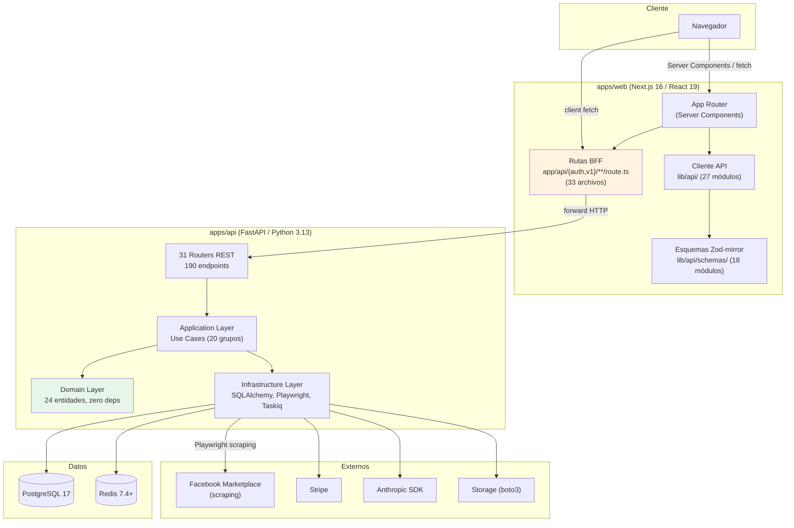
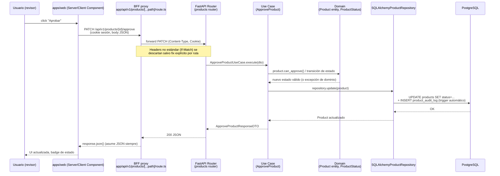
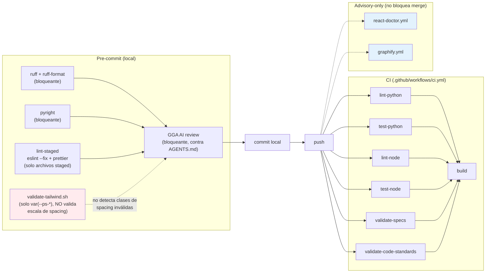

# Architecture — ProSell SaaS

## System Overview

ProSell SaaS es un monorepo pnpm + Turborepo con dos aplicaciones principales desacopladas — un backend FastAPI (`apps/api`) y un frontend Next.js 16 (`apps/web`) — comunicadas exclusivamente por HTTP a través de un conjunto de rutas proxy BFF (Backend-For-Frontend) del lado de Next.js. No existe hoy código compartido en tiempo de compilación entre ambos: el `packages/shared-types/` documentado en el `CLAUDE.md` raíz **no existe** en el repo (ver `code-quality-assessment.md` § drift documental).

## Architectural Style

**Monolito modular en ambos lados**, con Clean Architecture estricta en el backend:

- **Backend (`apps/api`)**: un único servicio FastAPI, internamente dividido en las tres capas de Clean Architecture (`domain → application → infrastructure`), con 31 routers HTTP como puntos de entrada de infraestructura. No hay evidencia de descomposición en microservicios — es un monolito bien capeado.
- **Frontend (`apps/web`)**: Next.js 16 App Router con Server Components por defecto, un conjunto de rutas API internas (`app/api/**/route.ts`) que actúan como capa BFF/proxy hacia el backend FastAPI — nunca el navegador llama directo a `apps/api`.
- **Scraping/ML**: orquestado desde el backend (Playwright + Taskiq/Redis para colas asíncronas), no es un servicio separado en este pase (no se encontró un `apps/scraper` ni similar — vive dentro de `apps/api/src/prosell/infrastructure`).

Evidencia: ausencia de `docker-compose` con múltiples servicios de aplicación propios más allá de `api`/`web` (el resto son Postgres/Redis), ausencia de `packages/*`, y la estructura de directorio de `apps/api/src/prosell/` que replica el patrón Clean Architecture canónico.

## Component Relationships

**Regla de dependencia (backend)**: `Infrastructure → Application → Domain`, con Domain sin dependencias externas (Python puro), tal como declara `CLAUDE.md` raíz y confirma la estructura de directorios escaneada.

**Corrección de límites del proxy BFF**: los proxies dinámicos `apps/web/src/app/api/v1/*/[...path]/route.ts` (`products`, `categories`, `organizations`, `vehicles`) fuerzan `response.json()` sobre toda respuesta del backend sin verificar `content-type` — un defecto arquitectónico conocido que rompe cualquier endpoint no-JSON (ver `api-documentation.md` y `code-quality-assessment.md`).

## Data Flow

1. El navegador interactúa con un Server Component (SSR) o dispara un fetch de cliente contra una ruta BFF de Next.js.
2. La ruta BFF reenvía la petición al backend FastAPI, incluyendo cookies de sesión httpOnly.
3. El router de FastAPI correspondiente valida el DTO de entrada (Pydantic), delega a un Use Case de la capa Application.
4. El Use Case orquesta entidades/servicios de dominio y llama a un puerto (interfaz) que la capa Infrastructure implementa (repositorio SQLAlchemy, servicio externo, etc.).
5. La respuesta (DTO de salida) sube de vuelta por las mismas capas hasta el router, que la serializa a JSON.
6. La ruta BFF de Next.js recibe la respuesta y hoy la fuerza a `response.json()` — el punto de fragilidad documentado.
7. El cliente API del frontend (`lib/api/`) parsea la respuesta contra su esquema Zod-mirror correspondiente (`lib/api/schemas/`) antes de entregarla a TanStack Query / componentes.

## Interaction Diagrams

### 1. Transición de estado de producto (BFF → FastAPI → SQLAlchemy)

Flujo representativo de una transacción de negocio típica: un revisor aprueba una publicación desde la cola de revisión.

### 2. Pipeline de calidad de código (pre-commit + CI, advisory vs. bloqueante)

Este segundo diagrama explica directamente por qué el bug de este intent (clases Tailwind inválidas `h-9.5`/`px-4.5`) llegó a `main` sin ser atrapado: `validate-tailwind.sh` solo revisa el patrón `var(--ps-*)` dentro de `className`, no la validez de la clase de utilidad de spacing contra la escala configurada — ningún linter en el pipeline actual lo hace.

## Key Design Decisions

- **Clean Architecture con Domain zero-deps** en el backend — permite testear reglas de negocio sin infraestructura y aísla el dominio de cambios en SQLAlchemy/FastAPI.
- **Multi-tenant por `tenant_id` explícito** en cada agregado — decisión de aislamiento a nivel de fila, no de esquema/DB separada.
- **BFF como capa de indirección obligatoria** — el navegador nunca habla directo con FastAPI; centraliza cookies httpOnly y auth, a costa de duplicar la superficie de rutas (33 archivos proxy) y de introducir el defecto de `response.json()` ciego.
- **Zod-mirror 1:1** — cada DTO de backend tiene un esquema Zod equivalente en frontend, para no confiar en `as X` sin validar (regla zero-tolerance del proyecto).
- **Auditoría automática de cambios de estado** — `ProductAuditLog` se dispara por diff en `SqlAlchemyProductRepository.update()`, no por convención de call-site, evitando el olvido de auditar un flujo nuevo.
- **`packages/*` no implementado pese a estar documentado** — decisión implícita (o plan diferido) de no compartir tipos en build-time entre `apps/web` y `apps/api`; hoy el contrato se sincroniza a mano vía los esquemas Zod-mirror.

## Improvement Opportunities

- Cerrar la brecha `response.json()`-sin-content-type en los 4 proxies dinámicos (`products`, `categories`, `organizations`, `vehicles`) antes de que un endpoint no-JSON (CSV, archivo) los rompa en producción.
- Decidir formalmente el destino de `packages/shared-types/`: implementarlo o quitarlo de la documentación — hoy es drift activo.
- Evaluar mover la validación de clases Tailwind a un linter real (p. ej. plugin ESLint de Tailwind) en vez de un grep de `validate-tailwind.sh` que no puede detectar clases de utilidad inválidas.
- Investigar el propósito de `apps/app/` (orphan, un solo archivo) — candidato a eliminación o a integración real.
