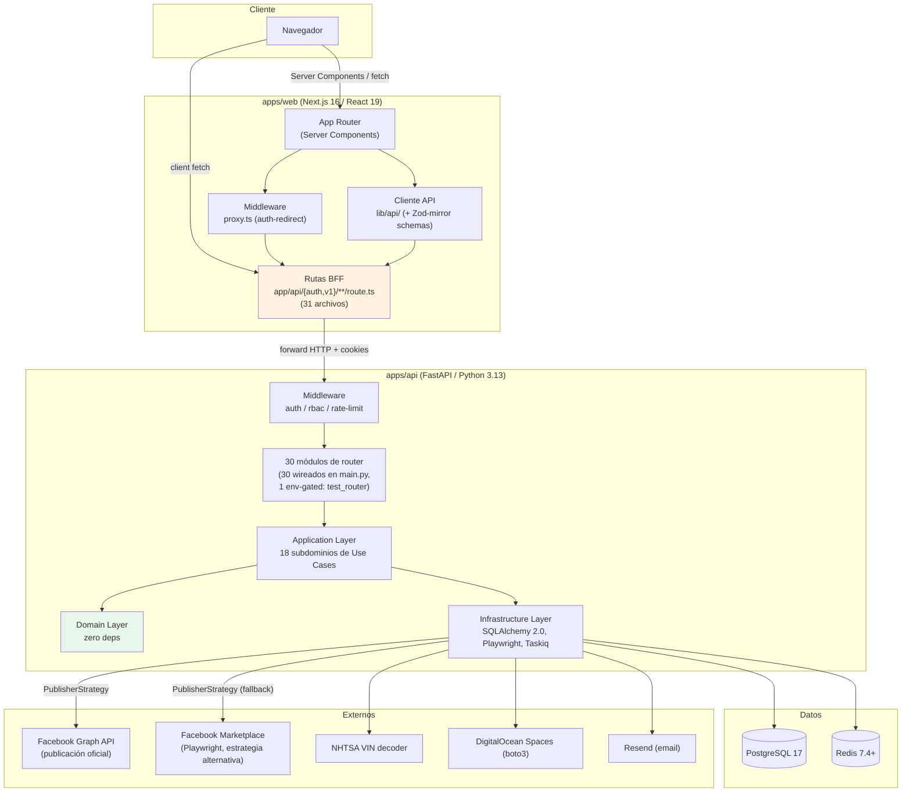
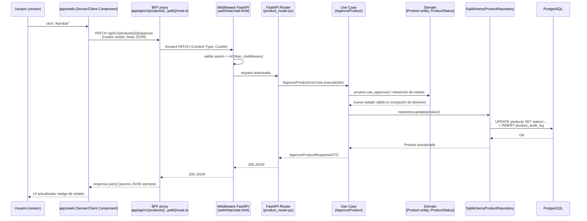
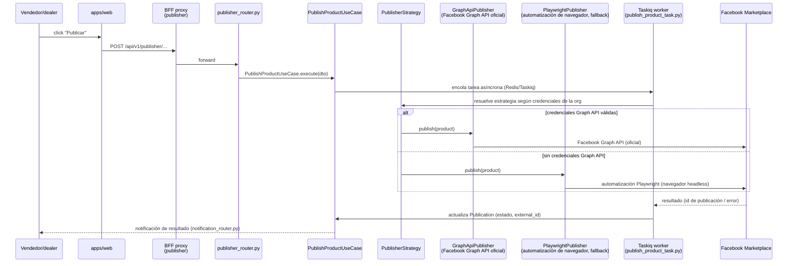
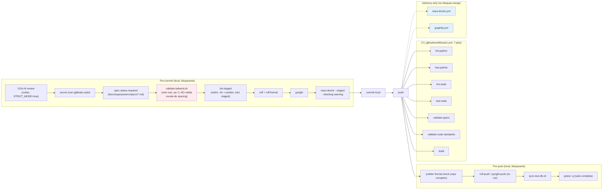
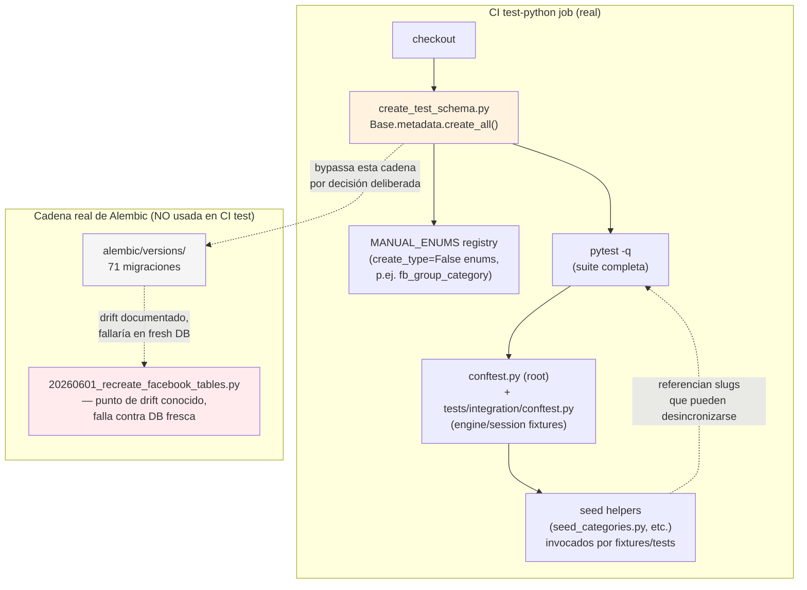
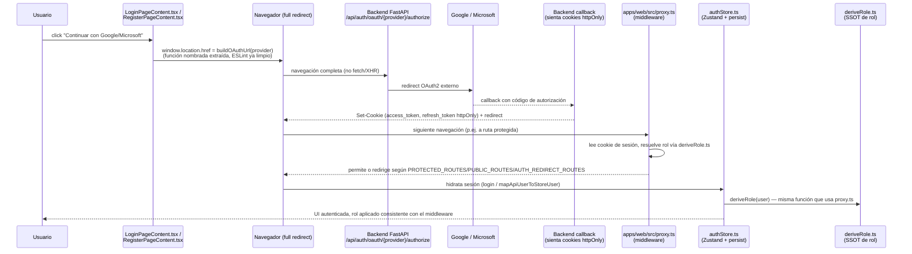
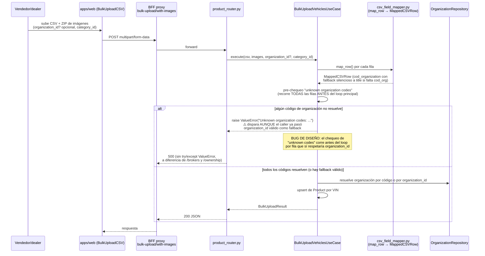
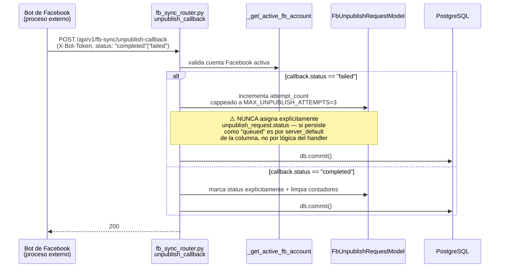
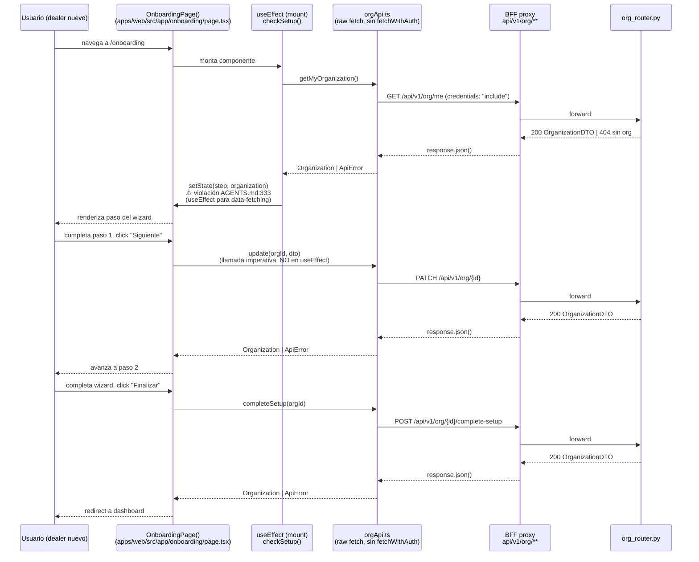
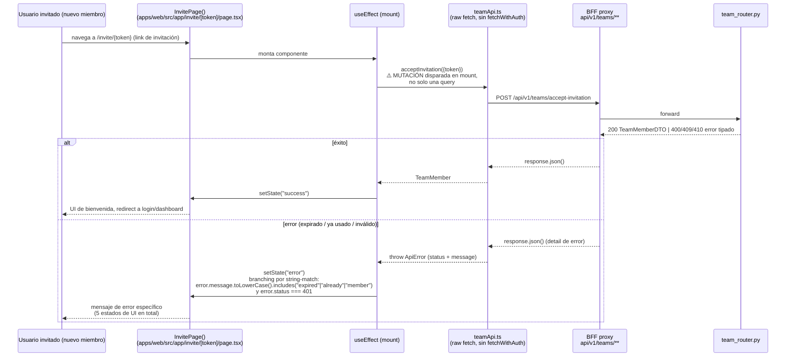

# Architecture — ProSell SaaS

## System Overview

ProSell SaaS es un monorepo pnpm + Turborepo con tres miembros de workspace reales — un backend FastAPI (`apps/api`), un frontend Next.js 16 (`apps/web`) y una suite E2E standalone (`tests/e2e`, paquete `@prosell/e2e`) — comunicados el frontend y el backend exclusivamente por HTTP a través de un conjunto de rutas proxy BFF (Backend-For-Frontend) del lado de Next.js. No existe código compartido en tiempo de compilación entre `apps/web` y `apps/api`: `pnpm-workspace.yaml` declara el glob `packages/*`, pero **el directorio `packages/` no existe en disco** — es un glob de workspace muerto/sin cumplir, coherente con la nota aspiracional de `CLAUDE.md` ("Shared code (future)").

## Architectural Style

**Monolito modular en ambos lados**, con Clean Architecture estricta en el backend:

- **Backend (`apps/api`)**: un único servicio FastAPI, internamente dividido en las tres capas de Clean Architecture (`domain → application → infrastructure`), con **30 módulos de router** bajo `infrastructure/api/routers/` (verificado por listado directo de archivo, sin contar `__init__.py`), de los cuales **los 30 están wireados** vía `app.include_router(...)` en `main.py` (confirmado por conteo de invocaciones — corrige un conteo previo de 31 módulos/30 wireados de un pase anterior). Uno de esos 30, `test_router.py`, está condicionado a `settings.environment in ["development", "testing"]` — no se registra en producción. No hay evidencia de descomposición en microservicios.
- **Frontend (`apps/web`)**: Next.js 16 App Router con Server Components por defecto, **31 rutas API internas** (`app/api/**/route.ts`, conteo verificado por listado directo) que actúan como capa BFF/proxy hacia el backend FastAPI — nunca el navegador llama directo a `apps/api`. Un middleware propio (`apps/web/src/proxy.ts`) resuelve matching de rutas y redirecciones de auth (`PROTECTED_ROUTES`/`PUBLIC_ROUTES`/`AUTH_REDIRECT_ROUTES`).
- **Publicación a Facebook / tareas asíncronas**: orquestado desde el backend (Playwright + Taskiq/Redis para colas asíncronas), no es un servicio separado — vive dentro de `apps/api/src/prosell/infrastructure/{tasks,services}`. No hay scraping genérico multi-marketplace ni módulo de ML — ver `business-overview.md` § Corrección respecto a `CLAUDE.md`.

Evidencia: servicios de aplicación (`api`, `web`) en `docker-compose.yml`, ausencia física de `packages/*`, y la estructura de `apps/api/src/prosell/` que replica el patrón Clean Architecture canónico (`domain/{entities,value_objects,repositories,ports,services,exceptions,events}`, `application/use_cases/` con 18 subdominios, `infrastructure/{api,models,repositories,services,tasks}`).

## Component Relationships

**Regla de dependencia (backend)**: `Infrastructure → Application → Domain`, con Domain sin dependencias externas (Python puro), tal como declara `CLAUDE.md` raíz y confirma la estructura de directorios escaneada.

**Corrección de límites del proxy BFF (deuda activa)**: los proxies dinámicos `apps/web/src/app/api/v1/*/[...path]/route.ts` fuerzan `response.json()` sobre toda respuesta del backend sin verificar `content-type` — un defecto arquitectónico ya documentado en memoria del proyecto que rompe cualquier endpoint no-JSON (ver `api-documentation.md` y `code-quality-assessment.md`).

## Data Flow

1. El navegador interactúa con un Server Component (SSR) o dispara un fetch de cliente contra una ruta BFF de Next.js; el middleware `proxy.ts` decide primero si la ruta requiere auth y redirige si corresponde.
2. La ruta BFF reenvía la petición al backend FastAPI, incluyendo cookies de sesión httpOnly.
3. El middleware de FastAPI (`auth_middleware.py`, `rbac_middleware.py`, `rate_limit_middleware.py`) valida sesión/rol/límite de tasa antes de llegar al router.
4. El router correspondiente valida el DTO de entrada (Pydantic), delega a un Use Case de la capa Application.
5. El Use Case orquesta entidades/servicios de dominio y llama a un puerto (interfaz) que la capa Infrastructure implementa (repositorio SQLAlchemy, servicio externo, publisher, etc.).
6. La respuesta (DTO de salida) sube de vuelta por las mismas capas hasta el router, que la serializa a JSON.
7. La ruta BFF de Next.js recibe la respuesta y hoy la fuerza a `response.json()` en los proxies dinámicos — el punto de fragilidad documentado.
8. El cliente API del frontend (`lib/api/`) parsea la respuesta contra su esquema Zod-mirror correspondiente antes de entregarla a TanStack Query / componentes / stores Zustand.

## Interaction Diagrams

### 1. Transición de estado de producto (BFF → middleware → FastAPI → SQLAlchemy)

Flujo representativo de una transacción de negocio típica: un revisor aprueba una publicación desde la cola de revisión.

### 2. Publicación a Facebook Marketplace (estrategia dual, tarea asíncrona)

Flujo representativo del pilar de negocio "publicación automatizada" — corrige la aspiración de `CLAUDE.md` ("Automated Scraping") por lo efectivamente implementado: publicación del propio inventario, no extracción de datos de terceros.

### 3. Pipeline de calidad de código (pre-commit + pre-push, bloqueante vs. advisory)

Este diagrama explica por qué clases Tailwind inválidas (familias `.5`/`.25`) llegan a `main` sin ser atrapadas: `validate-tailwind.sh` solo revisa el patrón `var(--ps-*)` dentro de `className`, no la validez de la clase de utilidad de spacing contra la escala configurada — ningún linter del pipeline actual lo hace. El hook `next-lint` en pre-commit está comentado ("TODO: currently disabled due to next lint issues"), dejando `lint-staged` como único chequeo ESLint por commit (solo archivos staged) — ESLint completo (`--max-warnings=0`) solo corre en CI (`lint-node`).

### 4. Bootstrap de schema de test en CI — `create_test_schema.py` vs. la cadena real de Alembic (nuevo, scan enfocado `260830-ci-seed-data`)

El job `test-python` de CI **no** ejecuta la cadena real de migraciones Alembic para levantar la base de datos de test. En su lugar, `apps/api/scripts/create_test_schema.py` bootstrapea el schema directo desde los modelos ORM vía `Base.metadata.create_all()`. Esto es **documentado y deliberado**, no drift accidental: el propio docstring del script lo explica — _"this project's migration chain has drift (see alembic/versions/20260601_recreate_facebook_tables.py) and fails on a fresh database, so the test DB is bootstrapped straight from the ORM models instead."_

**Consecuencia arquitectónica clave**: como el schema de test siempre refleja fielmente los modelos ORM actuales (FKs, `nullable`, índices — todo, sin excepción), **no hay drift silencioso de schema** entre lo que corre en CI y lo que definen los modelos. Lo que sí puede desincronizarse — y de hecho lo hizo — es la **data de seed** que los tests asumen (ver hallazgo raíz en `code-quality-assessment.md`): un cambio en `seed_categories.py` (aplanar la jerarquía de vehículos, commit `2166f142`) no rompe el schema, pero sí invalida silenciosamente cualquier test que hardcodee un slug de categoría que dejó de existir.

**Patrón de fixture `shared_session` incompatible con `db.commit()` explícito en el handler bajo test**: en `apps/api/tests/integration/api/routers/test_fb_sync_router.py` (fixture local `shared_session`/`_setup_override`) y replicado en `apps/api/tests/integration/bulk_upload/conftest.py`, el patrón abre `async with session_factory() as session, session.begin(): yield session` y mapea ese MISMO objeto session como el `get_async_session` que ve la app vía `app.dependency_overrides`. En producción, `get_async_session` (`infrastructure/database/session.py`) crea una sesión nueva por request — el handler puede llamar `db.commit()` con seguridad. En el fixture de test, ese `commit()` explícito cierra la transacción externa que `session.begin()` había abierto, y cualquier query posterior en el MISMO test sobre esa sesión revienta con `sqlalchemy.exc.InvalidRequestError: Can't operate on closed transaction inside context manager`. Confirmado en vivo contra `unpublish_callback` (`fb_sync_router.py`): la 1ª llamada (que hace `db.commit()`) responde 200; la 2ª llamada del mismo test (para verificar idempotencia) revienta con esa excepción.

### 5. Login con OAuth (Google/Microsoft) — redirect completo del navegador, sin BFF

**Nota histórica**: el intent `260829-auth-navigation-refactor` eliminó los 5 supresores `eslint-disable @next/next/no-location-assign-relative-destination` que existían en este flujo (1 en `fetchWithAuth.ts`, 4 duplicados en `LoginPageContent.tsx`/`RegisterPageContent.tsx`), extrayendo la construcción de la URL a una función nombrada — la regla ESLint solo analiza estáticamente literales/template-literals/identificadores constantes del lado derecho de la asignación, no `CallExpression`s, por lo que extraer a función basta para pasar el linter sin cambiar comportamiento (aprendizaje persistido en `project.md`).

### 6. Bulk upload CSV — resolución de organización con fallback (bug de diseño confirmado, scan enfocado `260830-ci-fixes-round2`)

**Contraste con el modo preview**: `BulkUploadPreviewUseCase.execute()` (dry-run, `/bulk-upload/preview`) **no** lanza `ValueError` por códigos de organización desconocidos — solo los reporta en `summary.missing_org_codes`. Esto sugiere que `test_bulk_upload_preview.py` y `test_bulk_upload_with_images.py` probablemente NO comparten el mismo root cause de falla, pese a ejercitar el mismo CSV — discrepancia documentada como pendiente de verificar en `code-quality-assessment.md`.

### 7. FB Sync — `unpublish_callback` (bot → backend), asignación de estado implícita vía `server_default` (scan enfocado `260830-ci-fixes-round2`)

**Nota de fragilidad, no confirmada con corrida real**: la rama `"failed"` depende de que la columna `status` tenga `server_default="queued"` para que el request quede correctamente re-encolado tras un fallo cappeado — un cambio futuro al default de la columna, o una migración que lo pierda, dejaría el status en un valor incorrecto sin que ningún test lo detecte a nivel de lógica del handler. El developer no corrió pytest para confirmar si esto es la causa raíz de la falla real del test asociado — queda como hallazgo a verificar en Requirements Analysis / Code Generation.

### 8. Onboarding de organización — `useEffect` de mount + llamadas imperativas por botón (nuevo, scan enfocado `260828-useeffect-to-react-query`)

**Alcance del defecto real vs. candidatos a refactor separados**: la violación literal de `AGENTS.md:333` es únicamente el `useEffect` de mount que dispara `checkSetup()`/`getMyOrganization()` — un candidato directo a `useQuery`. Las llamadas de `handleStep1`/`completeSetup` (disparadas por click, no por efecto) son candidatas naturales a `useMutation` por consistencia y manejo de estado, pero técnicamente NO son la violación de la regla en sí — el scan las señala como pregunta abierta de alcance para Requirements Analysis, sin resolverla de oficio (ver `code-quality-assessment.md`).

### 9. Aceptación de invitación por token — mutación disparada en el mount (nuevo, scan enfocado `260828-useeffect-to-react-query`)

**Riesgo de migración identificado**: el branching de error de esta página depende de inspeccionar `error.message` (string-matching) y `error.status` — cualquier envoltura de `useMutation` DEBE preservar `ApiError` (o un shape tipado equivalente) para que esta lógica siga funcionando. El precedente más cercano en el repo (`notificationsApi.ts`, ver más abajo) descarta el detalle del backend en un `Error` genérico — copiarlo tal cual rompería esta página. Ver `code-quality-assessment.md` para el detalle de triangulación de manejo de errores.

### Precedente de patrón — hooks React Query colocados en el módulo de API (`notificationsApi.ts`, `leads.ts`)

`apps/web/src/lib/api/notificationsApi.ts` es el único precedente confirmado en el repo de `useQuery`/`useMutation` definidos directamente en el archivo del cliente API (no en un hook separado): `useNotifications()` (`staleTime` 20s, `refetchInterval` 30s), `useMarkNotificationRead()`, `useMarkAllNotificationsRead()` (invalidan `NOTIFICATIONS_QUERY_KEY` en `onSuccess`). Usa `fetchWithAuth` (a diferencia de `orgApi`/`teamApi`), pero lanza `new Error(...)` genérico en `!response.ok`, perdiendo el detalle del backend — patrón a NO copiar tal cual para `orgApi`/`teamApi` por el riesgo de branching descrito arriba. `leads.ts` es un segundo precedente más grande (`useLeads`, `useLead`, `useUpdateLeadStatus`, `useReassignLead`, `useLeadDuplicates`, `useLeadAuditTrail`, `useTeamMetrics`), confirmando que colocar los hooks en el propio módulo de API (en vez de un archivo de hooks separado) es la convención establecida del proyecto.

## Key Design Decisions

- **Clean Architecture con Domain zero-deps** en el backend — permite testear reglas de negocio sin infraestructura y aísla el dominio de cambios en SQLAlchemy/FastAPI.
- **Multi-tenant por `tenant_id` explícito** en cada agregado — decisión de aislamiento a nivel de fila, no de esquema/DB separada.
- **BFF como capa de indirección obligatoria** — el navegador nunca habla directo con FastAPI; centraliza cookies httpOnly y auth, a costa de duplicar la superficie de rutas (31 archivos proxy) y de introducir el defecto conocido de `response.json()` ciego en los proxies dinámicos.
- **Middleware en capas en ambos lados** — Next.js resuelve auth-redirect en `proxy.ts` antes de tocar una ruta BFF; FastAPI aplica auth/rbac/rate-limit antes de llegar al router — doble punto de enforcement, no uno solo.
- **Zod-mirror 1:1** — cada DTO de backend tiene un esquema Zod equivalente en frontend, para no confiar en `as X` sin validar (regla zero-tolerance del proyecto).
- **`packages/*` no implementado pese a estar documentado** — decisión implícita (o plan diferido) de no compartir tipos en build-time entre `apps/web` y `apps/api`; hoy el contrato se sincroniza a mano vía los esquemas Zod-mirror.
- **`tests/e2e` como miembro de workspace independiente** (`@prosell/e2e`), no un simple directorio de specs — aislado de `apps/web`/`apps/api` en su propio `package.json`.
- **`deriveRole.ts` como single source of truth de rol** — documentado inline; tanto `proxy.ts` (redirect a nivel middleware) como `authStore.ts` (estado de sesión en cliente) llaman la misma función, evitando que el rol derivado diverja entre el gate de rutas y la UI.
- **Publicación a Facebook con estrategia intercambiable** (`PublisherStrategy`) — Graph API oficial como camino primario, Playwright (automatización de navegador) como estrategia alternativa cuando no hay credenciales Graph API. Es un patrón Strategy clásico aplicado a un puerto de dominio, no un motor de scraping multi-sitio.
- **Tareas asíncronas vía Taskiq + Redis** en vez de llamadas síncronas a Facebook desde el request-response del router — publicar, republicar, borrar y actualizar un listado, y sincronizar leads/tokens, son todas tareas de background.
- **OAuth como redirect de navegador completo, no fetch** — `window.location.href` hacia el endpoint de autorización del backend, necesario porque el flujo OAuth2 requiere que el navegador salga del origen de la SPA.
- **Schema de test bootstrapeado desde ORM (`Base.metadata.create_all()`), no desde Alembic** — decisión deliberada y documentada en el propio `create_test_schema.py` para evitar que CI dependa de una cadena de migraciones con drift conocido (`20260601_recreate_facebook_tables.py` falla contra DB fresca). Trade-off: el schema de CI nunca tiene drift respecto a los modelos, pero tampoco valida que la cadena real de Alembic funcione contra una base nueva — ver `code-quality-assessment.md` para la discusión de si reparar esa cadena entra en el alcance de "arreglar seed data".

## Improvement Opportunities

- Cerrar la brecha `response.json()`-sin-content-type en los proxies dinámicos (`products`, `categories`, `organizations`, `vehicles`) antes de que un endpoint no-JSON (CSV, archivo) los rompa en producción.
- Decidir formalmente el destino de `packages/*`: implementarlo o quitar el glob de `pnpm-workspace.yaml` — hoy es un glob de workspace sin cumplir.
- Evaluar mover la validación de clases Tailwind a un linter real (p. ej. plugin ESLint de Tailwind) en vez de un grep de `validate-tailwind.sh` que no puede detectar clases de utilidad inválidas.
- Remover o justificar formalmente las dependencias backend sin uso detectado en código fuente: `anthropic>=0.40.0` (cero imports) y `stripe>=11.0.0` (cero imports) — o documentar por qué se mantienen instaladas (integración planificada, no implementada).
- Decidir el destino de `test_cleanup_router.py`: existe como archivo (480 líneas) pero no está importado/wireado en ningún punto del código (`main.py` ni ningún otro módulo) — dead code, no un endpoint expuesto. Ver `code-quality-assessment.md` para el detalle completo del hallazgo de seguridad relacionado (`test_router.py` sí está wireado pero gateado por entorno).
- Decidir el destino de las 3 subcarpetas vacías de `use_cases/` (`dealer/`, `user_dealer/`, `vehicle/`) — scaffolding sin contenido, candidato a eliminación o a implementación real.
- Actualizar `CLAUDE.md` para reflejar lo efectivamente implementado (publicación a Facebook, no scraping genérico; sin ML) en vez de la visión aspiracional original — ver `business-overview.md` § Corrección.
- Corregir el drift de versión Tailwind en `CLAUDE.md` ("TailwindCSS 4" en la tabla de stack y en "Key Conventions" línea ~194) — el proyecto real usa `tailwindcss: 3.4.17`.
- Actualizar los 4 tests de `apps/api/tests/integration/database/test_seed_categories.py` y `test_seed_car_attributes.py` que buscan el slug `"suvs"` (nivel 3, eliminado el 6-ago por `2166f142`) para apuntar a `carros-y-camionetas` como la hoja real (nivel 2) — root-cause de mayor confianza de la falla actual de CI en `main` (ver `code-quality-assessment.md`).
- Evaluar si reparar la cadena real de migraciones Alembic (el drift documentado en `20260601_recreate_facebook_tables.py`) entra en el alcance de este intent o queda como deuda separada — hoy CI nunca ejercita esa cadena contra una DB fresca porque `create_test_schema.py` la bypassa.
- Revisar el patrón de fixture `shared_session`/dependency-override compartido en `test_fb_sync_router.py` y `bulk_upload/conftest.py` — es incompatible con cualquier handler que llame `db.commit()` explícitamente dentro del mismo test cuando se necesita más de una llamada al endpoint sobre la misma sesión.
- Corregir el bug de diseño en `bulk_upload_vehicles.py` (scan `260830-ci-fixes-round2`): el chequeo de "unknown organization codes" corre antes del loop por fila que sí respeta un `organization_id` de fallback provisto por el caller — hoy lanza `ValueError` innecesariamente. Envolver `bulk_upload_preview`/`bulk_upload_with_images` en `try/except ValueError → HTTPException(400)` en `product_router.py`, igual que ya hacen `/brokers` y `/ownership`.
- Levantar (o pedir excepción puntual para) la política de permisos local que bloquea Read/Bash sobre rutas con "credential" (`.claude/settings.local.json`) para poder cubrir `fb_credential_migration_router.py` a profundidad en un futuro scan — hoy solo se conoce su estructura vía graphify.
- Migrar `onboarding/page.tsx` e `invite/[token]/page.tsx` de `useEffect` a React Query (`useQuery`/`useMutation`), preservando el shape tipado de `ApiError` para el branching de error de `invite/[token]/page.tsx` — al mismo tiempo, evaluar si conviene cerrar la brecha de `fetchWithAuth` en `orgApi.ts`/`teamApi.ts` (ninguno de los dos módulos la usa hoy, así que ambos flujos carecen silenciosamente de auto-refresh de sesión en 401) y consolidar la duplicación verbatim de `ApiError`/`handleResponse<T>()` entre ambos módulos. Ver `code-quality-assessment.md` para el detalle de riesgo.
