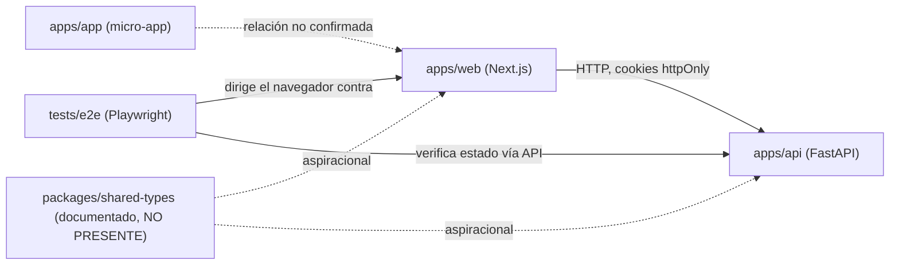

# Dependencies — prosell-sass

## Dependencias internas entre paquetes (monorepo)

**Fallback de texto**: `apps/web` depende de `apps/api` vía HTTP (con cookies httpOnly para auth). La suite `tests/e2e` dirige un navegador real contra `apps/web` y, en algunos flujos, verifica estado directamente contra `apps/api`. La relación entre `apps/app` (micro-app) y `apps/web` no fue confirmada — solo se sabe que ambos son apps Next.js del mismo monorepo. `packages/shared-types`, documentado en `CLAUDE.md` como código compartido futuro, **no existe** en el árbol actual — no hay dependencia real que trazar ahí todavía; cualquier tipo compartido hoy vive duplicado (ver el caso `AttributeField` vs `AttributeSchemaEntry` en `component-inventory.md`).

## Dependencias externas críticas — Backend

| Dependencia                                               | Rol                                            | Punto de acoplamiento conocido                                                                                                                                                                      |
| --------------------------------------------------------- | ---------------------------------------------- | --------------------------------------------------------------------------------------------------------------------------------------------------------------------------------------------------- |
| NHTSA VIN Decoder API                                     | Fuente de datos de decodificación de vehículos | `nhtsa_vin_service.py` — sin fallback/circuit breaker confirmado en este pase; si NHTSA cambia formato de respuesta, `nhtsa_normalizer.py` rompe silenciosamente (no verificado el manejo de error) |
| PostgreSQL 17                                             | Persistencia primaria                          | vía SQLAlchemy 2.0 async + asyncpg                                                                                                                                                                  |
| DigitalOcean Spaces / S3 (boto3)                          | Storage de imágenes                            | abstraído detrás de `IDOSpacesService` (puerto)                                                                                                                                                     |
| Stripe                                                    | Pagos/wallet                                   | `wallet_router` (no leído a fondo)                                                                                                                                                                  |
| Facebook Marketplace (facebook-sdk + Playwright scraping) | Scraping/publicación multi-marketplace         | `facebook_router`, `fb_account_router`, `fb_sync_router`, `fb_credential_migration_router` (ninguno leído a fondo en este pase)                                                                     |
| Redis (vía taskiq)                                        | Cola de tareas asíncronas                      | declarado en extras, no verificado en runtime en este pase                                                                                                                                          |
| Anthropic (SDK)                                           | Presente como dependencia, uso no investigado  | `pyproject.toml` extras — **hallazgo abierto**: no se confirmó en qué feature se usa                                                                                                                |

## Dependencias externas críticas — Frontend

| Dependencia            | Rol                                     | Punto de acoplamiento conocido                                                                                                                                   |
| ---------------------- | --------------------------------------- | ---------------------------------------------------------------------------------------------------------------------------------------------------------------- |
| next-intl              | i18n frontend                           | Solo 2 de +125 archivos la usan (`docs/AUDIT-UI-UX-I18N-2026-07-21.md`) — la mayor parte del UI está hardcodeado, incluyendo `vehicle-values.ts` (raíz de BUG-7) |
| @radix-ui/react-select | Primitiva de Select (shadcn/ui)         | **Parcheada** vía `patches/@radix-ui__react-select.patch` — cualquier bump de esta librería requiere revalidar el parche                                         |
| TanStack Query         | Cache/fetching                          | Consume los contratos Zod espejo de `lib/api/schemas/`                                                                                                           |
| Zod                    | Validación runtime de contratos backend | Ver el caso de doble-tipo (`AttributeField`/`AttributeSchemaEntry`) — dos schemas Zod distintos describiendo el mismo concepto backend, sin unificación          |

## Dependencias internas relevantes a los bugs del intent

- **`SchemaFieldRenderer.tsx` depende del tipo `AttributeSchemaEntry` (`types/category.ts`)**, mientras que **`CategorySchemaEditor` depende del tipo `AttributeField` (`lib/api/schemas/categorySchema.ts`)** — dos consumidores del mismo dato backend (`Category.attribute_schema` JSONB) con contratos de tipo incompatibles entre sí. Ninguno depende del otro; ambos dependen, sin saberlo, del mismo JSONB libre que no impone forma. Esta es la dependencia implícita rota detrás de BUG-3/6.
- **`vehicle_router.decode_vin` depende de `nhtsa_normalizer.py`**, cuya salida en minúsculas fue diseñada para el pipeline de scraping/Facebook (`facebook_router`/`fb_sync_router`), no para consumo humano directo — un acoplamiento de conveniencia entre dos audiencias distintas del mismo normalizador, raíz de BUG-5.
- **`public_product_router.py` NO depende de `OrganizationContact`** (value object) ni de ningún repositorio de contactos — la ausencia de esa dependencia es, literalmente, la causa de que BUG-4 sea un vacío de plomería y no solo un bug visual.
- **`category_router.get_category_schema_template` depende de `UNIVERSAL_COLUMNS`** (un `set`) para construir el orden de columnas del CSV — dependencia frágil que FEAT-1 (export CSV) heredará si reutiliza la misma constante sin normalizarla primero a una secuencia ordenada.

## Dependencia de tooling nueva — `react-doctor` (intent activo)

`react-doctor ^0.9.12` se agregó esta sesión como devDependency raíz, sin archivo de configuración propio (corre con sus defaults). Se cablea en dos puntos:

- `.pre-commit-config.yaml` — hook local `react-doctor --staged --blocking warning`, pero el wrapper de shell no propaga el exit code: el commit siempre pasa, los hallazgos van a stderr.
- `.github/workflows/react-doctor.yml` (nuevo) — usa la action `millionco/react-doctor@v2`; su input `blocking:` está comentado, así que el job es puramente advisorio.

**Riesgo de dependencia**: no hay una segunda herramienta de análisis de código muerto (`knip`, `ts-prune`, `depcheck`) en `apps/web/package.json` para cruzar contra los hallazgos `unused-export`/`unused-file`/`unused-dependency` de `react-doctor` — sus 60 diagnósticos de deslop (31 + 29) dependen de la exactitud de un único analizador estático, sin verificación cruzada, antes de borrar código en masa.

## Dependencias de build/CI

- pnpm workspaces + Turborepo orquestan el fan-out de scripts entre `apps/web`, `apps/api` (via wrappers) y el resto del monorepo.
- `apps/web` y `apps/api` son **desplegables independientemente** (Dockerfiles separados) pese a compartir el monorepo — no hay acoplamiento de build entre ambos más allá de los scripts raíz de Turbo.
- `.pre-commit-config.yaml` + `.gga` (AI code review contra reglas de `AGENTS.md`) se ejecutan en cada commit — dependencia de proceso, no de código, pero bloqueante si falla.

## Riesgos de dependencia detectados

1. **NHTSA como única fuente de decodificación VIN** — sin evidencia (en este pase) de fallback si el servicio externo falla o cambia contrato.
2. **`@radix-ui/react-select` parcheado** — riesgo de que un bump automático de dependencias silencie o rompa el parche sin que CI lo detecte, si no hay un test específico cubriendo el comportamiento parcheado.
3. **`Translator`/`translator` backend (`i18n/translator.py`) es código muerto** — no es un riesgo de dependencia externa, pero sí de dependencia interna no usada: mantenerlo vivo en el árbol sin consumidores es deuda de claridad, y su existencia puede confundir a quien busque "dónde se traduce el backend" (respuesta real: en ningún lado, todavía).
