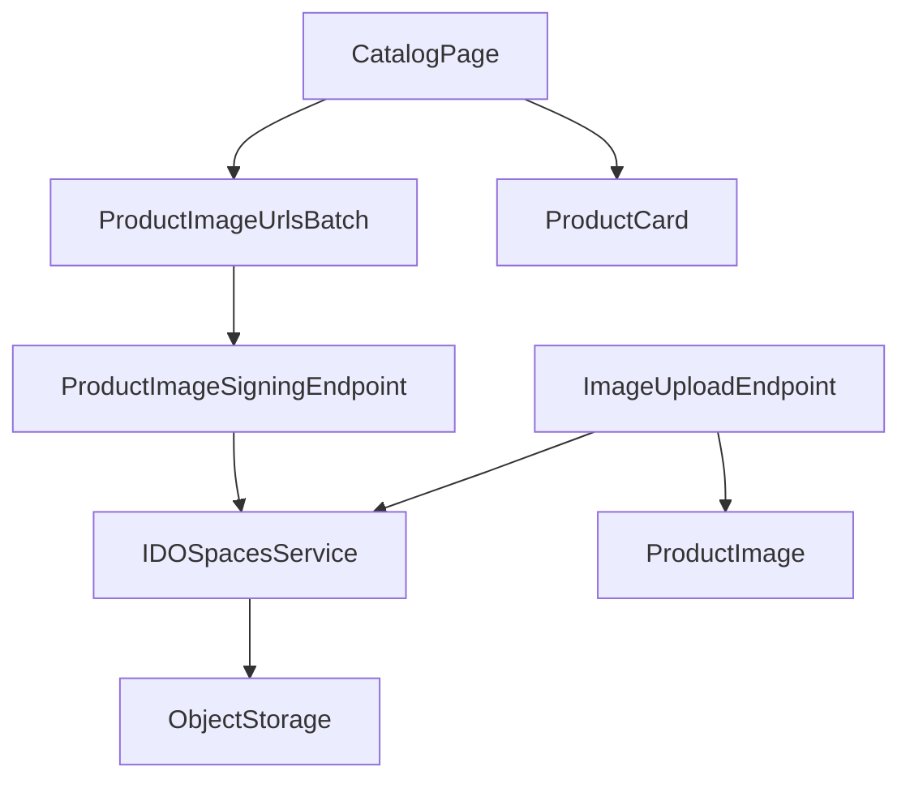

# Dependencies

## Internal Dependencies

- `CatalogPage` supplies visible product IDs to `ProductImageUrlsBatch` and renders `ProductCard`.
- `ProductImageUrlsBatch` reaches the product image-signing API through the BFF/API client.
- `ProductImageSigningEndpoint` relies on the authenticated user, product access rules, tenant-key validation, and `IDOSpacesService`.
- `ImageUploadEndpoint` persists derivatives through the same storage integration.

## External Dependencies

- **PostgreSQL:** product, tenant, and image metadata persistence.
- **Redis/Taskiq:** asynchronous task infrastructure used by the application.
- **MinIO / DigitalOcean Spaces:** object storage and presigned URL capability.
- **DigitalOcean CDN endpoint:** configuration exists but is not wired into the active code path.
- **Facebook integrations:** Graph API and Playwright publishing adapters; they are outside the catalog-card image request path.

## Dependency Risks

- The browser can access signed MinIO URLs while the Next server cannot, which forces the current `unoptimized` image behavior.
- A CDN migration must not bypass backend authorization for private originals.
- Public OG objects have a different exposure model than private catalog objects and cannot be silently reused as thumbnails.
