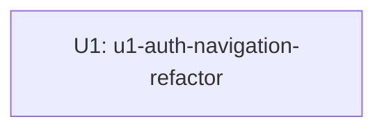

# Unit Dependency DAG

Un único Unit, sin dependencias — no hay grafo de dependencia real que dibujar más allá de
declarar el nodo aislado.

## Dependency Graph



## Integration Points

Ninguno — U1 no llama ni es llamado por otro Unit de este intent. Internamente consume (sin que
eso constituya una dependencia entre Units) el backend FastAPI ya existente vía las rutas BFF de
`apps/web/src/app/api/auth/` y el endpoint externo de OAuth authorize — ambos fuera de alcance de
este intent y sin cambios.

## Parallel Development Opportunities

Ninguna — un solo Unit no admite paralelismo entre Units.

## Machine-Readable Edge Block

```yaml
units:
  - name: u1-auth-navigation-refactor
    kind: ui
    depends_on: []
```
