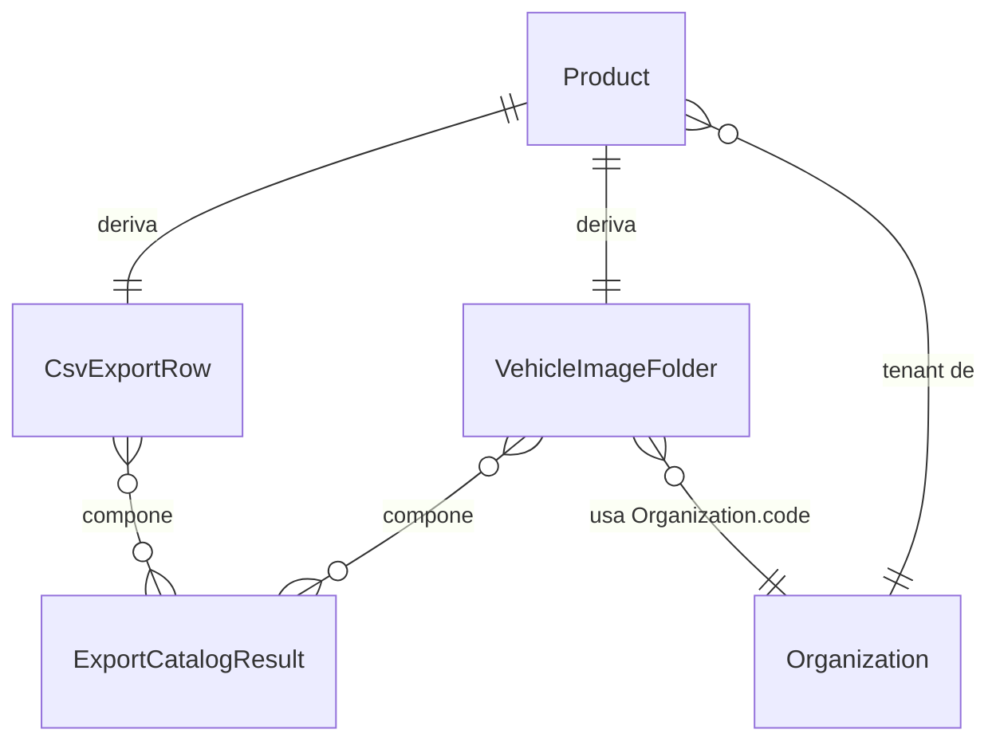

# Functional Spec — u1-catalog-export-api

## Endpoint

`GET /api/v1/products/export-client-format.zip` (confirmado como final —
`contract-summary.md` lo dejaba provisional, esta etapa lo cierra).

## Workflow — Exportar catálogo en formato cliente

Flujo síncrono único, disparado por el request HTTP de `u2-catalog-export-ui`
(`unit-of-work-dependency.md` — U2 depende de U1).

1. **Autenticación y resolución de tenant**: el middleware ya vigente
   (`auth_middleware.py`, `rbac_middleware.py`) valida la sesión;
   `organization_id` se resuelve del JWT (BR1.2). Ningún parámetro de la
   petición participa en esta resolución.
2. **Query de productos**: filtrar `Product` por `status=published` y
   `organization_id` resuelto (BR1.1).
3. **Chequeo de catálogo vacío**: si `count == 0`, lanzar
   `EmptyCatalogExportError` (subclase de `ProductError`, BR4.1, BR4.3) →
   404 con body tipado (`stories.md` AC1.1.5).
4. **Chequeo de cap de recursos**: si `count` excede el cap definido en
   NFR Design, lanzar `ExportLimitExceededError` (subclase de
   `ProductError`, BR3.1, BR4.3) → 413 Payload Too Large (`stories.md`
   AC1.3.1).
5. **Por cada producto** (published, dentro del cap):
   1. Construir `CsvExportRow` — mapeo directo de atributos del producto
      a las 24 columnas exactas (BR1.3, BR1.4).
   2. Construir `VehicleImageFolder.folder_name` — segmentos sanitizados
      de organización (BR2.2), año/marca/modelo/millas, color desde
      `attributes.exterior_color` (BR2.3), todos pasados por el
      sanitizador (BR2.4, BR2.1).
   3. Para cada `image_key` en `product.image_urls`: leer los bytes vía
      `IDOSpacesService.get_object()` (decisión de esta etapa — puerto
      nuevo). La llamada al puerto vive en el use case
      (`application/use_cases/`), nunca en `domain/services/` — layer
      boundary confirmado en `requirements.md` § Constraints y
      `team-practices.md`. Si falla la lectura de una imagen individual:
      loguear `warning` con `product_id` + `image_key`, continuar con
      las imágenes restantes (BR4.2) — no se aborta el producto ni el
      export.
6. **Ensamblar el ZIP**: un único archivo — CSV en la raíz (todas las
   `CsvExportRow` serializadas) + una carpeta por vehículo con sus
   imágenes disponibles (`ExportCatalogResult`, `entities.md`). Nunca dos
   archivos de descarga separados (`stories.md` AC1.1.1).
7. **Responder**: `200`, `Content-Type: application/zip`,
   `Content-Disposition: attachment; filename="<nombre>.zip"` (nombre
   real por defecto — ver Open question abajo), body = el ZIP ensamblado.

Las 12 ACs cubiertas por este Unit (ver `traceability.json`) son el
subconjunto que `unit-of-work-story-map.md` (Units Generation) asigna a
`u1-catalog-export-api` dentro de US1.1 y US1.3 — las ACs restantes de
esas historias (ej. AC1.1.10, todas las de US1.2) son responsabilidad de
`u2-catalog-export-ui`.

## Manejo de errores (resumen operativo)

| Condición                    | Excepción (subclase de `ProductError`)    | HTTP                  | Comportamiento |
| ---------------------------- | ----------------------------------------- | --------------------- | -------------- |
| Catálogo vacío               | `EmptyCatalogExportError`                 | 404                   | BR4.1          |
| Cap de recursos excedido     | `ExportLimitExceededError`                | 413                   | BR3.1          |
| Imagen individual no legible | — (no es una excepción HTTP, solo un log) | 200 (export continúa) | BR4.2          |

No hay máquina de estados — el flujo es una única operación de lectura
síncrona sin transiciones de entidad persistida (Domain Design ADR-002,
`decisions.md`: sin entidad nueva, sin estado que sobreviva a la
request).

## Diagrama entidad-relación (derivado de `entities.md`)

## Resumen de reglas (derivado de `rules.md`)

12 reglas: BR1.1-BR1.4 (formato/autorización del CSV), BR2.1-BR2.4
(nombre de carpeta de imágenes y sanitización), BR3.1 (cap de recursos),
BR4.1-BR4.3 (catálogo vacío, imagen faltante, jerarquía de excepciones).
Ver `rules.md` Part B para el detalle completo.

## Open question para NFR Design

- **Número exacto del cap** de recursos (BR3.1) — filas, imágenes
  totales, o tamaño de ZIP. `requirements.md` sugiere el precedente
  `max_rows=5000` del import existente como punto de partida.
- **Nombre de archivo real por defecto** en `Content-Disposition` (ej.
  `catalogo_<org>_<fecha>.zip`) — mencionado como pendiente desde
  Contract Design, se fija en Code Generation.

## Review

**Verdict:** READY
**Reviewer:** aidlc-architecture-reviewer-agent
**Date:** 2026-09-05T14:16:09Z
**Iteration:** 1

### Findings

| #   | Severity          | Location                       | Finding                                                                                                                                                                                                                | Recommendation                                                                                                                                                                                    |
| --- | ----------------- | ------------------------------ | ---------------------------------------------------------------------------------------------------------------------------------------------------------------------------------------------------------------------- | ------------------------------------------------------------------------------------------------------------------------------------------------------------------------------------------------- |
| 1   | Major (corregido) | Los 4 artefactos de la etapa   | `unit-of-work-story-map.md` — declarado en el `consumes:` de esta etapa — nunca se citaba por nombre de archivo en ninguno de los 4 artefactos producidos.                                                             | **Corregido**: se agregó una cita explícita a `unit-of-work-story-map.md` en `functional-spec.md`, señalando que las 12 ACs de `traceability.json` son el subconjunto que esa etapa asigna a U1.  |
| 2   | Major (corregido) | `functional-spec.md`, paso 5.3 | Cita de fuente inexacta: atribuía el layer boundary de `IDOSpacesService` a "`components.md` § layer boundary", sección que no existe ahí — la regla real vive en `requirements.md` § Constraints/`team-practices.md`. | **Corregido**: cita ajustada a `requirements.md § Constraints` y `team-practices.md`. La decisión de diseño en sí ya era correcta.                                                                |
| 3   | Minor (corregido) | `traceability.json`, AC1.1.1   | `unit-of-work-story-map.md` asigna AC1.1.1 solo a U2; U1 reclamaba cobertura vía BR1.5 sin nota explicativa de la doble reclamación.                                                                                   | **Corregido**: se agregó una nota inline en `traceability.json` aclarando que U1 cubre la precondición backend (respuesta = único ZIP) y que la verificación end-to-end es responsabilidad de U2. |
| 4   | Minor (corregido) | `traceability.json`, AC1.1.9   | BR1.5 no cubría explícitamente el contrato de `Content-Type`/`Content-Disposition` que AC1.1.9 verifica — fit de contenido débil.                                                                                      | **Corregido**: se amplió el `statement`/`logic` de BR1.5 en `rules.md` para incluir explícitamente esos headers.                                                                                  |

### Summary

El core del diseño es sólido: YAML de `entities.md`/`rules.md` bien formado y con todos los campos requeridos, las 13 reglas de negocio citan fuentes verificables contra `requirements.md`/`stories.md`, BR2.3 describe correctamente el fix de regresión (no comportamiento nuevo), el ER diagram de `functional-spec.md` refleja fielmente `entities.md`, no hay código completo (solo pseudocódigo ≤15 líneas), y el layer boundary de `IDOSpacesService.get_object()` en el use case (no en `domain/services/`) es la decisión correcta. Los 4 hallazgos (2 Major, 2 Minor) eran todos mecánicos/objetivos — citas de fuente ausentes o inexactas, y un fit de target débil — corregidos antes de abrir el gate, sin afectar la implementabilidad del diseño.
