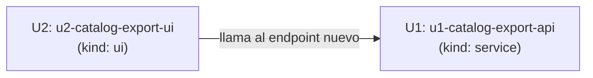

# Unit Dependency DAG — Export de catálogo

Topología solamente — esta etapa NO recomienda un orden de implementación
ni identifica un critical path; eso es decisión económica de Delivery
Planning (2.9), que consume este DAG como input.

## Dependency Graph



`u2-catalog-export-ui` depende de `u1-catalog-export-api`: el frontend
consume el endpoint HTTP nuevo que U1 expone. Sin dependencia inversa —
U1 no depende de nada de U2.

## Integration Points

| From | To  | Mechanism                                                                                          | Contrato                                                                                                           |
| ---- | --- | -------------------------------------------------------------------------------------------------- | ------------------------------------------------------------------------------------------------------------------ |
| U2   | U1  | HTTP síncrono, vía proxy BFF de `products` (`apps/web/src/app/api/v1/products/[...path]/route.ts`) | Endpoint nuevo de export (formato/nombre/Content-Type exacto a formalizar en Contract Design, 2.8 — próxima etapa) |

## Parallel Development Opportunities

Ninguna entre U1 y U2 — dependencia directa unidireccional (U2 → U1), un
único par de units. Contract Design (2.8, en alcance para `classic`)
formaliza el contrato del endpoint entre ambos ANTES de construir, lo que
sí habilita desarrollo en paralelo dentro de Construction una vez el
contrato esté fijado (U2 puede mockear la respuesta contra el contrato
mientras U1 se construye).

## Edge Block (machine-readable, requerido por el sensor `required-sections`)

```yaml
units:
  - name: u1-catalog-export-api
    kind: service
    depends_on: []
  - name: u2-catalog-export-ui
    kind: ui
    depends_on: [u1-catalog-export-api]
```

Sin ciclos: `u2-catalog-export-ui` depende de `u1-catalog-export-api`;
`u1-catalog-export-api` no depende de nada. Dos units declaradas, dos
nombres únicos, ambos referenciados en `depends_on` están declarados.
