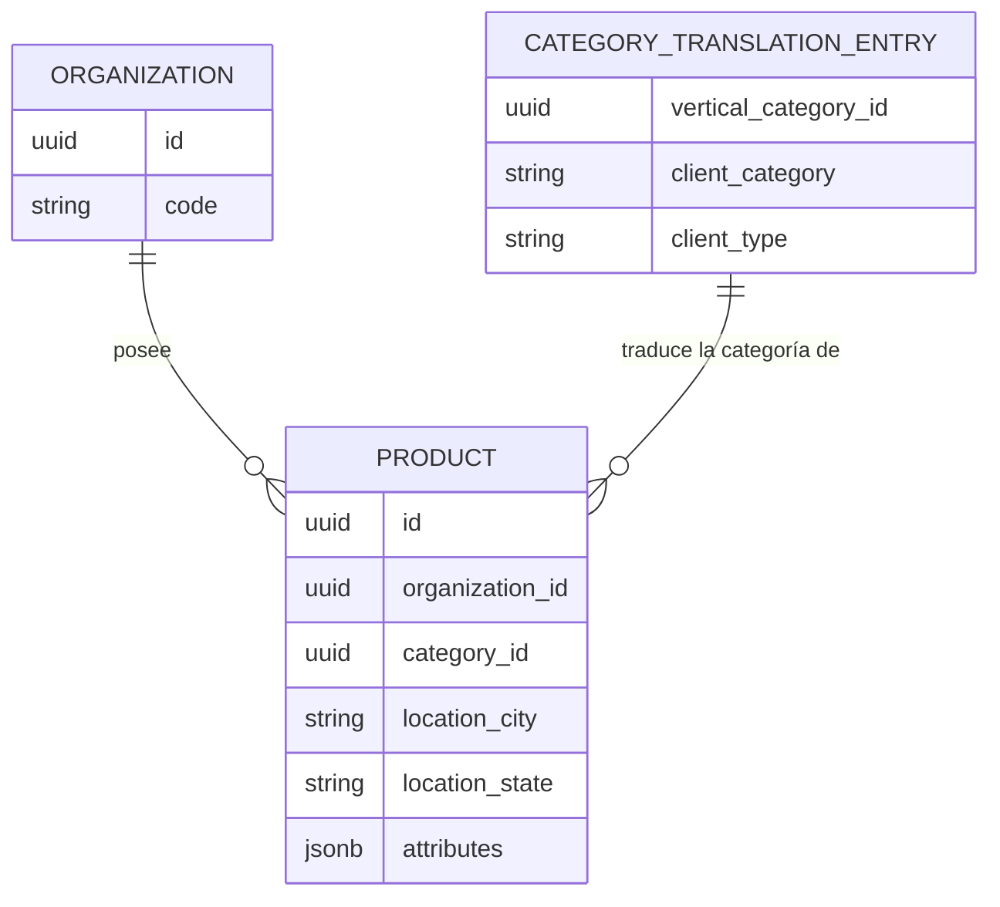

# Functional Spec — u1-cross-org-export-api

Fuente de verdad de workflows y transiciones de estado para este Unit.
`entities.md` (forma de datos) y `rules.md` (lógica de decisión) no
capturan el orden — este archivo sí.

## Workflow 1 — Export de catálogo formato cliente (organización puntual o propia)

Sin cambios en la lógica de RESOLUCIÓN DE ALCANCE (organización propia
o puntual, permiso, límite por-tenant) respecto a lo ya existente — esa
parte del workflow es la línea base para contrastar con el Workflow 2.
**Corrección**: el paso 4 SÍ introduce un cambio de comportamiento
observable en este mismo workflow, no solo en el Workflow 2 — FR7
(corrección de mapeo de columnas) y BR1.7 (exclusión de productos sin
traducción de categoría) se aplican en `build_client_format_row()`/el
loop de armado, que es COMPARTIDO por ambos workflows. Un producto de
una organización puntual sin traducción de categoría (ej. fuera de la
vertical vehículos) que antes aparecía en el CSV con columnas vacías o
con el valor crudo interno, después de este intent queda EXCLUIDO del
export — y las 7 columnas corregidas (BR1.1-BR1.6, BR1.8) cambian de valor
para todo producto ya existente, no solo para exports "todas". Build
and Test debe cubrir esta regresión también contra el camino puntual
existente, no asumir que el Workflow 1 queda intacto.

**Corrección adicional (hallazgo mecánico de este reviewer)**: el paso 1
omitía `base_folder`/`facebook_groups_fallback` — per `contract-summary.md`
(Contract 2, ambos `required: true`) y FR8.1/FR9.1 ("en TODO export...
no solo en el modo 'todas'"), estos dos query params son obligatorios en
CUALQUIER modo, no solo en el Workflow 2. BR2.6 (path) y BR2.7 (fallback
de groups) declaran explícitamente `trigger`/`applies_to` sin restricción
de modo. El paso 4 se corrige para reflejar que también aplica BR2.6/BR2.7.

```
1. Request → GET /export-client-format.zip?base_folder=...&facebook_groups_fallback=...[&organization_id=...]
2. Chequear permiso (_check_org_scope_permission) → resolver organización efectiva
3. Pedir productos published de esa organización (hasta EXPORT_MAX_PRODUCTS)
4. Para cada producto: resolver el vertical raíz de category_id vía CategoryRepository (walk-up por parent_id, BR1.3); excluir si ese vertical no tiene traducción (BR1.7); si tiene, construir fila (BR1.1-BR1.6, BR1.8, BR2.6, BR2.7) y carpeta de imágenes
5. Armar CSV + ZIP
6. Responder con StreamingResponse
```

## Workflow 2 — Export "todas las organizaciones" (NUEVO)

```
1. Request → GET /export-client-format.zip?all_organizations=true&base_folder=...&facebook_groups_fallback=...
2. Chequear permiso: has_permission(ORG_ADMIN_VIEW_ALL) (BR2.1)
   → si falta el permiso: 403, FIN
3. Pedir productos published de TODAS las organizaciones (sin filtro de tenant)
4. Si el total > EXPORT_MAX_PRODUCTS (500): 413, FIN (BR2.4)
5. Si el total == 0: 404 (mismo comportamiento que catálogo vacío puntual, US4.5), FIN
6. Resolver en BATCH el org_code de cada organización distinta presente en el lote (BR2.3) — construir dict {organization_id: org_code} ANTES del loop por fila
7. Para cada producto:
   a. Resolver el vertical raíz de category_id vía CategoryRepository (walk-up por parent_id, BR1.3); excluir si ese vertical no tiene traducción (BR1.7)
   b. Construir fila del CSV (BR1.1-BR1.6, BR1.8, BR2.6, BR2.7) usando el org_code YA RESUELTO del dict del paso 6 (nunca reresolviendo ni reutilizando el de otro producto)
   c. Construir carpeta de imágenes bajo el segmento de SU PROPIA organización (BR2.6)
8. Armar CSV (todas las filas) + ZIP (todas las carpetas)
9. Registrar auditoría: scope=ALL_ORGS + user + own_org (BR2.5)
10. Responder con StreamingResponse, filename=catalogo_TODAS_{fecha}.zip (BR2.8)
```

### Casos de error (Workflow 2)

| Paso | Condición                | Respuesta |
| ---- | ------------------------ | --------- |
| 2    | Sin `ORG_ADMIN_VIEW_ALL` | 403       |
| 4    | Total de productos > 500 | 413       |
| 5    | Total de productos == 0  | 404       |

## Diagrama ER (derivado de entities.md)



## Resumen de reglas (derivado de rules.md)

Ver `rules.md` para el detalle completo. En orden de aplicación dentro
del Workflow 2: BR2.1 (permiso) → BR2.4 (límite) → BR2.3 (resolución
batch) → BR1.7 (exclusión) → BR1.1-BR1.6/BR1.8/BR2.6/BR2.7 (mapeo de fila) →
BR2.5 (auditoría) → BR2.8 (nombre de archivo).
