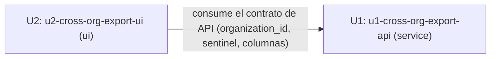

# Unit Dependency DAG — 260911-cross-org-export-ux

## Diagrama



## Puntos de integración

- **API**: `GET /api/v1/products/export-client-format.zip` — U2 pasa
  `organization_id` (org puntual) o el sentinel de "todas" (contrato
  ya fijado en `requirements.md`); U1 lo interpreta y arma el
  CSV+ZIP.
- **API**: `GET /api/v1/products` (o el endpoint que alimente
  `useInfiniteProducts()`) — U2 pasa `organization_id`/sentinel para
  el filtrado real de grilla; U1 debe aceptar el mismo parámetro
  (decisión de Functional Design: mismo query param que el endpoint de
  export, o uno nuevo — no resuelto en esta etapa).
- **Datos compartidos**: `OrganizationSchema.product_count` (ya
  existe, sin cambio de contrato) — U2 lo consume para el filtro del
  picker (FR1.2); no requiere ningún cambio en U1.

## Oportunidades de desarrollo en paralelo

U1 y U2 pueden construirse simultáneamente **contra el contrato ya
fijado en `requirements.md`/`stories.md`** (mismo criterio ya
reconfirmado en el precedente `260903-catalog-client-export`) — la
dependencia declarada es de INTEGRACIÓN en Build and Test, no de
implementación secuencial. No hay set de Units genuinamente
independiente más allá de este par (solo 2 Units en este intent).

## Edge block (machine-readable)

```yaml
units:
  - name: u1-cross-org-export-api
    kind: service
    depends_on: []
  - name: u2-cross-org-export-ui
    kind: ui
    depends_on: [u1-cross-org-export-api]
```
