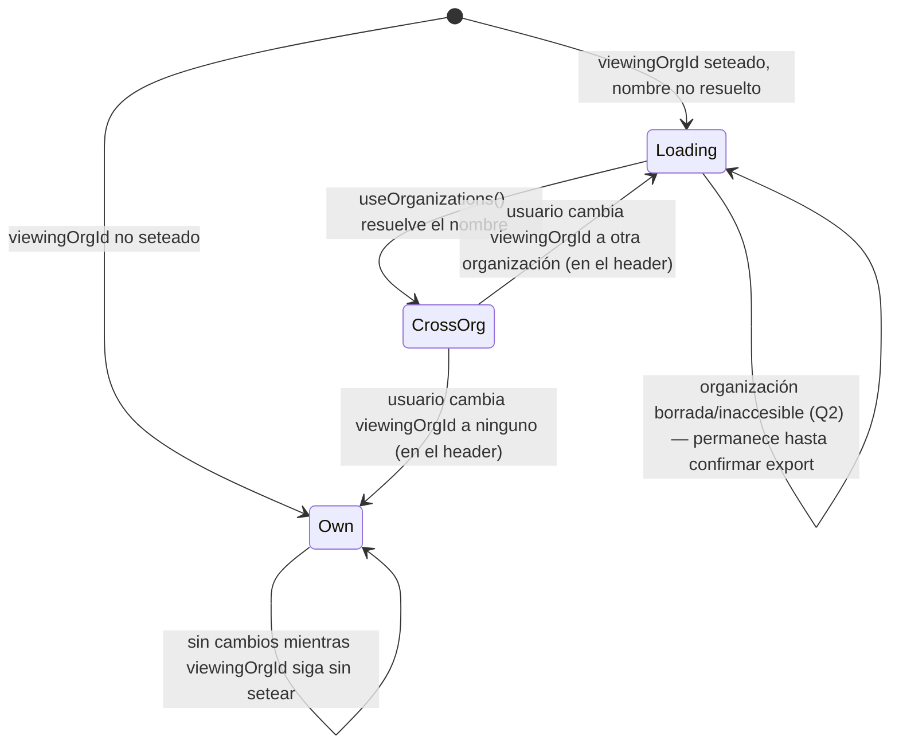

# Functional Spec — u1-export-org-confirmation

Unit kind `ui` — sin `entities.md`/`rules.md` (no hay entidades ni reglas
de negocio de dominio nuevas). Este archivo es autocontenido: especifica
el workflow de interacción y las transiciones de estado directamente
desde `unit-of-work.md`/`requirements.md`, per la nota de la plantilla
del stage para Units UI-only.

## Workflow: Exportar catálogo cross-org

**Trigger**: usuario con `ORG_ADMIN_VIEW_ALL` hace click en "Exportar
catálogo (formato cliente)" en `/catalog`.

1. Leer `organizationStore.viewingOrgId` (Zustand, ya existente).
2. Si `viewingOrgId` NO está seteado → `organization = { kind: "own" }`.
3. Si `viewingOrgId` está seteado:
   a. Consultar `useOrganizations()` (TanStack Query, ya existente) para
   resolver el `name` de esa organización.
   b. Si el nombre todavía no resolvió (`isLoading` o cache vacío) →
   `organization = { kind: "loading" }`.
   c. Si el nombre resolvió → `organization = { kind: "cross-org", name }`.
   d. Si `viewingOrgId` no aparece en el resultado de `useOrganizations()`
   (organización borrada o ya inaccesible para el admin, Q2 afirmada)
   → tratar igual que "nombre no disponible": `organization = { kind:
"loading" }` hasta que el usuario confirme el export, momento en el
   cual sigue el mismo camino que catálogo vacío (paso 6).
4. Renderizar `ExportSummaryBanner` con el `organization` resuelto (ver
   `frontend-components.md` para el detalle del prop).
5. Usuario confirma (botón "Continuar") → `exportCatalogClientFormat()`
   se invoca con `organization_id` = `viewingOrgId` cuando
   `organization.kind !== "own"`, sin el parámetro en caso contrario.
6. Respuesta del backend:
   - 200 + ZIP → descarga normal (comportamiento ya existente, sin
     cambios).
   - 404 (catálogo vacío) Y `organization.kind !== "own"` → mostrar
     mensaje mencionando el nombre si está disponible (`organization.kind
=== "cross-org"`), o el fallback genérico "Esta organización no
     tiene catálogo publicado para exportar" (Q3 afirmada) cuando el
     nombre no está disponible (incluye el caso de organización borrada/
     inaccesible, Q2).
   - 404 (catálogo vacío) Y `organization.kind === "own"` → mensaje
     genérico ya existente hoy, SIN cambios (AC2.1.2).
   - 403/otro error de red → boundary de manejo de errores ya existente
     en `handleExportClientFormat` (catch de red + toast genérico, ya
     implementado en `260903-catalog-client-export`) — sin cambio nuevo
     de este Unit.

## Workflow: Usuario sin `ORG_ADMIN_VIEW_ALL`

1. `OrganizationPicker` no se renderiza en el header (comportamiento ya
   existente, sin tocar).
2. `organizationStore.viewingOrgId` nunca se setea a otra organización
   para este usuario (el guard existente en
   `organizationStore.setViewingOrgId()` ya lo impide — este Unit no
   agrega ningún guard nuevo, Q1 afirmada).
3. El workflow de export sigue el paso 2 de "Exportar catálogo cross-org"
   (`organization = { kind: "own" }`) en el 100% de los casos — cero
   ramas de código nuevas visibles para este usuario.

## Transiciones de estado del badge (derivado de Refined Mockups)

## Escenarios de negocio (happy/unhappy paths)

| #   | Escenario                                       | Resultado                                                          |
| --- | ----------------------------------------------- | ------------------------------------------------------------------ |
| 1   | Admin exporta org propia (default)              | ZIP de su propia organización, sin badge (AC1.1.2, AC1.1.6)        |
| 2   | Admin exporta org cross-org, nombre ya cargado  | ZIP de la org elegida, badge visible con nombre (AC1.1.1, AC1.1.5) |
| 3   | Admin exporta org cross-org, nombre cargando    | Badge en skeleton, NUNCA idéntico al caso 1 (AC1.1.4, Major fix)   |
| 4   | Admin exporta org cross-org sin catálogo        | Mensaje con nombre de la org (AC2.1.1)                             |
| 5   | Admin exporta org cross-org borrada/inaccesible | Mismo camino que catálogo vacío, mensaje fallback genérico (Q2/Q3) |
| 6   | Admin exporta org propia sin catálogo           | Mensaje genérico ya existente, sin cambios (AC2.1.2)               |
| 7   | Usuario sin permiso exporta                     | Cero cambios visibles (AC3.1.1–AC3.1.3)                            |

## Review

**Verdict:** READY

**Findings:**

1. [Severidad: Minor] — El estado `"loading"` del prop `organization` de `ExportSummaryBanner` está sobrecargado semánticamente: cubre tanto "nombre todavía no resuelto" (transitorio, se resuelve solo) como "organización borrada/inaccesible" (permanente, nunca se resuelve — el diagrama de estados lo modela como `Loading --> Loading`). Ambos casos convergen correctamente en el mismo resultado observable (skeleton hasta confirmar, luego mensaje de catálogo vacío), así que no es un defecto funcional, pero un futuro mantenedor que lea solo `frontend-components.md` § States podría asumir que `"loading"` siempre se resuelve a `"cross-org"`. — Ubicación: `functional-spec.md` § Transiciones de estado del badge; `frontend-components.md` § Props/Inputs. — Recomendación: no bloqueante — ya está documentado en prosa en ambos archivos (funcional-spec.md paso 3d, frontend-components.md línea 20); opcionalmente, Code Generation podría agregar un comentario en el tipo TS marcando explícitamente que `"loading"` es la unión de dos causas distintas.

Verificación de los 2 hallazgos Minor de la revisión anterior — ambos resueltos:

- Cierre de OQ2 ahora citado explícitamente al inicio de `functional-design-questions.md` ("Cierre explícito de OQ2 (`requirements.md` § Open Questions)"), con la cita textual de la pregunta original y la respuesta (lectura directa del store, sin capa de abstracción).
- Q1 ahora incluye el párrafo "Reconciliación con `team.md` § Code Style", que explica por qué la precisión de Practices Discovery sobre chequeo de permiso puntual (pensada para la bifurcación de diseño con selector nuevo, descartada) no aplica al badge de solo lectura de este Unit.

Verificación completa (no solo el diff de los 2 hallazgos previos):

- Las 11 ACs de `stories.md` (AC1.1.1–AC1.1.6, AC2.1.1–AC2.1.2, AC3.1.1–AC3.1.3) están en `traceability.json` con `status: "N/A"` y target concreto en `functional-spec.md`/`frontend-components.md` — el uso de `N/A` en vez de un `BRx.y` inexistente sigue el precedente ya establecido para Unit kind `ui` sin `rules.md` (`project.md`, learning 260829-auth-navigation-refactor). Sin huérfanos: las 11 ACs tienen target, y no hay ningún target en `functional-spec.md` que no corresponda a una AC citada.
- NFR1 (gating) y NFR2 (consistencia de estado) no aparecen como `upstream_ids` directos de `traceability.json` de esta etapa, pero llegan transitivamente cubiertos vía AC3.1.1/AC3.1.2 (NFR1) y AC1.1.4 (NFR2), ya trazados FR/NFR→AC en `user-stories/traceability.json` — no es un gap, es la cadena de trazabilidad completa.
- El workflow de `functional-spec.md` es consistente con `requirements.md`: FR1.1/FR1.2/FR1.4 (envío condicional de `organization_id`, sin reset) se reflejan en los pasos 1–5; FR1.3 (sin selector nuevo) se refleja en "Componente NO modificado: `OrganizationPicker`" de `frontend-components.md`; FR3.1/FR3.2 (mensaje específico solo en caso cross-org) se reflejan en el paso 6.
- Las 3 Open Questions heredadas (OQ1 de `requirements.md`, la nota no-bloqueante de US1 sobre organización borrada, la nota no-bloqueante de US2 sobre fallback de nombre) están todas resueltas con pregunta explícita (Q1/Q2/Q3) y su resolución está reflejada en el artefacto generado, no solo en el archivo de preguntas.
- El componente `ExportSummaryBanner` sigue el patrón ya vigente de componentes puros que reciben datos ya resueltos por el padre (mismo patrón que `OrganizationPicker`), sin fetch propio ni estado interno nuevo — consistente con `team-practices.md`/`team.md`.
- El manejo de errores (403/red) se apoya explícitamente en el boundary ya existente de `260903-catalog-client-export` (catch de red + toast genérico) sin reintroducir lógica nueva — consistente con el mandate Q6 de manejo de errores centralizado.

No se detectaron hallazgos Critical ni Major.
