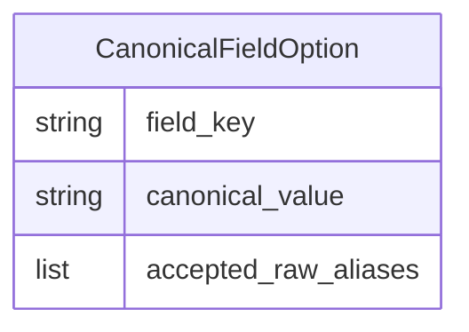

# Functional Spec — U1 (`u1-vehicle-catalog-api`)

Fuente de verdad de los flujos de trabajo y transiciones de este Unit. Basado en `entities.md`, `rules.md`, `requirements.md` y `contract-summary.md`.

## Workflow 1 — Decode de VIN con reconciliación (Contrato 1)

1. El usuario ingresa un VIN en el formulario de creación/edición de vehículo (UI en U2).
2. `VehicleVinDecodeService` llama a NHTSA (`NHTSAVinService`, sin cambios).
3. `nhtsa_normalizer.py` normaliza cada valor crudo de NHTSA a un token estilo Facebook (sin cambios).
4. Para cada campo select-backed relevante, `VehicleVinDecodeService` llama a `FacebookVehicleValueCatalog.reconcile(field_key, normalized_value)` (BR1.1).
5. Si hay match: el campo se completa con el `canonical_value` exacto (BR1.2 CASE 1).
6. Si NO hay match Y `get_options(field_key)` tiene al menos una entrada (catálogo aplicable): el campo queda `null` y se agrega a `unmatched_fields` (BR1.2 CASE 2).
7. Si `get_options(field_key)` no tiene ninguna entrada (0 entradas, catálogo no aplicable a ese field_key): el campo se devuelve con el valor normalizado tal cual, sin agregarlo a `unmatched_fields` (BR1.2 CASE 3, distinción fijada en Q1 de esta etapa).
8. La respuesta (`VINDecodeResponse` extendida, Contrato 1) se devuelve al frontend.

`field_key` en todo este workflow usa el vocabulario attribute_schema/VIN-decode (`make`, `fuel_type`, `body_type`, `drivetrain`, etc. — ver `entities.md`), el mismo que `Category.attribute_schema` ya usa hoy.

## Workflow 2 — Consulta de opciones canónicas (Contrato 2)

1. El editor de schema de categorías (UI en U2, gateado a Platform Admin del lado de la UI) solicita las opciones canónicas de un `field_key` — mismo vocabulario attribute_schema/VIN-decode que Workflow 1 (no el enum `FacebookFieldKey`; la traducción entre `row.key`/`FACEBOOK_FIELD_KEY_MAP` y este vocabulario es responsabilidad de Functional Design de U2).
2. El endpoint requiere solo autenticación (`CurrentUser`), sin `_require_platform_admin()` — mismo patrón que `GET /{category_id}/schema` (BR1.4, corrección post-revisión).
3. `CategorySchemaService` llama a `FacebookVehicleValueCatalog.get_options(field_key)`.
4. Si el `field_key` tiene al menos una entrada: se devuelve la lista completa de `canonical_value` (200, BR1.4).
5. Si el `field_key` no tiene ninguna entrada: se devuelve 404 y se registra un warning server-side con el `field_key` no reconocido (BR1.4, Q1 opción A).

## Workflow 3 — Migración legacy (FR3.1, ejecución única)

1. Query de vehículos cuyo valor de atributo no calza con ninguna `CanonicalFieldOption` del `field_key` correspondiente (BR3.1).
2. Para cada registro candidato, aplicar las 3 guardas antes de migrar: (a) el producto todavía existe, (b) el nuevo valor calza con el catálogo canónico, (c) el registro no fue modificado por otro proceso desde que se armó el conjunto a migrar (anti-drift/re-ejecución) — guardas propias de este caso, no copiadas literal del precedente (BR3.1, corrección post-revisión).
3. Si las 3 guardas pasan: aplicar el nuevo valor reconciliado y registrar el cambio en el log de resumen de la migración.
4. Si alguna guarda falla: excluir ese registro puntual del batch y registrarlo como excluido en el log — no abortar la migración completa.

## Workflow 4 — Sanitización del CSV cliente (FR5.1)

1. `export_catalog_client_format.py` arma cada fila con `build_client_format_row()` (sin cambios en su firma).
2. Para cada valor de celda tipo string: si empieza con `=`, `+`, `-` o `@`, se prefija con `'` antes de escribirse (BR5.1).
3. El resto del comportamiento del export (prioridad de ubicación producto > organización, columnas ya definidas) no cambia.

## Documentación del contrato de publisher (FR4.1 — no es un workflow, es un entregable)

Documentar (en un artefacto de referencia, no en código) el contrato de `IPublisherService` (`publish`/`update`/`delete`) y sus 3 adapters (`playwright_publisher.py`, `graph_api_publisher.py`, `null_graph_api_publisher.py`), incluyendo explícitamente que el parámetro `access_token` del adapter de Playwright es en realidad session cookies de Facebook (credencial de mayor alcance que un token de página) — sin modificar el contrato ni el comportamiento de los 3 adapters.

## Entity-Relationship Diagram (derivado de `entities.md`)

<!-- Text fallback: una sola entidad, CanonicalFieldOption, sin relaciones con otras entidades — es una tabla de lookup estática dentro de FacebookVehicleValueCatalog. -->

## Rules Summary (derivado de `rules.md`)

| Regla | Qué hace                                                                                |
| ----- | --------------------------------------------------------------------------------------- |
| BR1.1 | Reconcilia un valor normalizado contra el catálogo canónico.                            |
| BR1.2 | Campo sin match → null + unmatched_fields.                                              |
| BR1.3 | validate_attributes() sigue sin cambios.                                                |
| BR1.4 | Endpoint de opciones: 200 con lista completa, o 404 + warning si field_key desconocido. |
| BR3.1 | Migración legacy con guardas triples.                                                   |
| BR5.1 | Sanitización de fórmulas en el CSV cliente.                                             |
