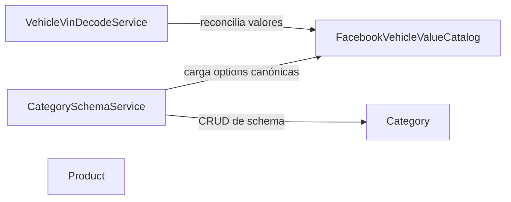

# Domain Design — Catálogo Canónico de Vehículos para Facebook

Building blocks nuevos y existentes tocados por este intent, basados en `requirements.md` (FR1-FR5), `stories.md` (US1.1, US1.2, US2.1) y el codekb (`architecture.md`, `component-inventory.md`).

## Part A — Catálogo (machine-readable)

```yaml
components:
  - name: FacebookVehicleValueCatalog
    summary: Catálogo canónico de valores de Facebook Marketplace por campo de vehículo y lógica de reconciliación contra ese catálogo.
    behaviour: >
      Dado un campo select-backed de vehículo (marca, tipo, combustible, tracción, etc.) y un valor normalizado,
      devuelve la opción canónica exacta si existe una correspondencia, o None si no hay match (FR1.1, FR1.2).
      Dado solo un campo, devuelve el conjunto completo de opciones canónicas vigentes para ese campo (FR1.4, US1.2/AC1.2.1).
      Domain service puro, sin dependencias externas — mismo molde que category_translation.py (dato + lógica en una sola pieza).
    responsibilities:
      - Ser la única fuente de verdad backend de los valores canónicos de Facebook Marketplace por campo de vehículo
      - Reconciliar un valor normalizado contra esa fuente de verdad
      - Exponer el conjunto completo de opciones canónicas de un campo
    depends_on: []
    dependents:
      - component: VehicleVinDecodeService
        interaction: reconciliar cada valor decodificado antes de devolverlo al formulario (FR1.1, FR1.2)
      - component: CategorySchemaService
        interaction: cargar las options canónicas de un campo mapeado a una clave de Facebook (US1.2/AC1.2.1)
    external_dependencies: []
    entities:
      - name: CanonicalFieldOption
        identifier: field_key + canonical_value
        attributes: [field_key, canonical_value, accepted_raw_aliases]
        references: []

  - name: VehicleVinDecodeService
    summary: Decodifica un VIN contra NHTSA y devuelve valores de atributo para el formulario de crear/editar vehículo.
    realized_by: apps/api/src/prosell/infrastructure/api/routers/vehicle_router.py::decode_vin(), apps/api/src/prosell/infrastructure/services/nhtsa_vin_service.py, apps/api/src/prosell/infrastructure/services/nhtsa_normalizer.py (sin cambios en los tres)
    behaviour: >
      Llama a la API de NHTSA, normaliza los valores crudos a tokens estilo Facebook (nhtsa_normalizer.py, sin cambios),
      y — nuevo en este intent — reconcilia cada valor normalizado contra FacebookVehicleValueCatalog antes de
      devolverlo; un campo sin match vuelve vacío en vez de un token no reconciliado (FR1.1, FR1.2).
    responsibilities:
      - Orquestar el decode de VIN (existente, sin cambios)
      - Delegar la reconciliación de valores a FacebookVehicleValueCatalog (nuevo)
    depends_on:
      - component: FacebookVehicleValueCatalog
        interaction: reconciliar valores decodificados
        style: sync
    dependents: []
    external_dependencies:
      - name: NHTSA API
        kind: third-party-api
        purpose: decodificar el VIN a datos crudos de vehículo
    entities: []

  - name: CategorySchemaService
    summary: Administra los schemas de atributos de categoría, incluyendo las opciones ofrecidas para campos select-backed mapeados a Facebook.
    realized_by: apps/api/src/prosell/infrastructure/api/routers/category_router.py, apps/web/src/components/admin/category-schema-editor.tsx (FACEBOOK_FIELD_KEY_MAP, línea ~550)
    behaviour: >
      CRUD de schema de categoría (existente, sin cambios). Nuevo en este intent: para un campo mapeado a una
      clave conocida del catálogo de Facebook, carga sus options desde FacebookVehicleValueCatalog en vez de la
      lista estática mantenida a mano (US1.2/AC1.2.1). El mecanismo exacto de sincronización (FR1.4) es decisión
      de Functional Design.
    responsibilities:
      - CRUD de schema de categoría (existente)
      - Sourcing de options de campos mapeados a Facebook desde el catálogo canónico (nuevo)
    depends_on:
      - component: FacebookVehicleValueCatalog
        interaction: cargar options canónicas de un campo
        style: sync
      - component: Category
        interaction: leer/escribir el schema de atributos de la categoría
        style: sync
    dependents: []
    external_dependencies: []
    entities: []

  - name: Category
    summary: Representa una categoría de producto con su schema de atributos y reglas de validación.
    realized_by: apps/api/src/prosell/domain/entities/category.py
    behaviour: >
      validate_attributes() valida los valores de atributo de un producto contra las options configuradas del
      schema — sin cambios en este intent (FR1.3); ahora valida implícitamente valores que llegan ya reconciliados
      desde VehicleVinDecodeService cuando el usuario los acepta tal cual.
    responsibilities:
      - Poseer la definición del schema de atributos de la categoría
      - Validar valores de atributo al guardar
    depends_on: []
    dependents:
      - component: CategorySchemaService
        interaction: CRUD de schema
    external_dependencies: []
    entities:
      - name: Category
        identifier: id
        attributes: [name, attribute_schema]
        references: []

  - name: Product
    summary: Representa un producto/vehículo publicado, incluyendo su override de ubicación.
    realized_by: apps/api/src/prosell/domain/entities/product.py
    behaviour: >
      Persiste location_city/location_state a nivel de producto, usados como override sobre el default de la
      organización en creación, edición y export — comportamiento ya existente, sin cambios en este intent
      (confirmado contra código real en stories.md). Declarado acá solo por trazabilidad de US2.1/FR2.
    responsibilities:
      - Poseer el override de ubicación por producto
    depends_on: []
    dependents: []
    external_dependencies: []
    entities:
      - name: Product
        identifier: id
        attributes: [location_city, location_state]
        references: []
```

## Part B — Vista humana

### Component Diagram



<!-- Text fallback: VehicleVinDecodeService y CategorySchemaService dependen de FacebookVehicleValueCatalog (componente nuevo). CategorySchemaService también depende de Category (existente, sin cambios). Product queda aislado, sin dependencias, declarado solo por trazabilidad. -->

### Component Summary

| Component                   | Purpose                                                                              | Depends On                            | Dependents                                     | Entities Owned       |
| --------------------------- | ------------------------------------------------------------------------------------ | ------------------------------------- | ---------------------------------------------- | -------------------- |
| FacebookVehicleValueCatalog | Catálogo canónico de valores de Facebook + reconciliación (nuevo)                    | —                                     | VehicleVinDecodeService, CategorySchemaService | CanonicalFieldOption |
| VehicleVinDecodeService     | Decode de VIN + reconciliación (existente, extendido)                                | FacebookVehicleValueCatalog           | —                                              | —                    |
| CategorySchemaService       | CRUD de schema de categoría + sourcing de options de Facebook (existente, extendido) | FacebookVehicleValueCatalog, Category | —                                              | —                    |
| Category                    | Schema de atributos + validación (existente, sin cambios)                            | —                                     | CategorySchemaService                          | Category             |
| Product                     | Producto/vehículo + override de ubicación (existente, sin cambios)                   | —                                     | —                                              | Product              |

### Entity Ownership

| Entity               | Owning Component            | Identifier                  | Attributes                                       | References |
| -------------------- | --------------------------- | --------------------------- | ------------------------------------------------ | ---------- |
| CanonicalFieldOption | FacebookVehicleValueCatalog | field_key + canonical_value | field_key, canonical_value, accepted_raw_aliases | —          |
| Category             | Category                    | id                          | name, attribute_schema                           | —          |
| Product              | Product                     | id                          | location_city, location_state                    | —          |

### External Dependencies

| Component               | Dependency | Kind            | Purpose                                       |
| ----------------------- | ---------- | --------------- | --------------------------------------------- |
| VehicleVinDecodeService | NHTSA API  | third-party-api | Decodificar el VIN a datos crudos de vehículo |

### Rationale

| Component                                       | Por qué es un building block separado                                                                                                                                                                                                        |
| ----------------------------------------------- | -------------------------------------------------------------------------------------------------------------------------------------------------------------------------------------------------------------------------------------------- |
| FacebookVehicleValueCatalog                     | Dueño de datos y regla de negocio nuevos (el catálogo canónico y su reconciliación) que hoy no tienen home — resuelve de fondo el hallazgo #87 (dos catálogos sin reconciliación runtime) concentrando esa responsabilidad en un solo lugar. |
| VehicleVinDecodeService / CategorySchemaService | No son componentes nuevos — se declaran para expresar la dependencia nueva que ganan hacia FacebookVehicleValueCatalog, sin redecidir su frontera existente.                                                                                 |
| Category / Product                              | Declarados solo por trazabilidad (destino de AC1.1.3/AC1.1.4 y de US2.1/FR2 respectivamente) — sin cambio de comportamiento en este intent.                                                                                                  |

**Alternativas rechazadas**: separar `FacebookVehicleValueCatalog` en dos componentes (catálogo de datos + servicio de reconciliación) — rechazado por sobre-ingeniería: mismo orden de magnitud que `category_translation.py` (que tampoco separa dato de lógica), sin ciclo de vida ni cadencia de cambio distinta entre ambos hoy. Ver `decisions.md` ADR-001.

## Review

**Verdict:** READY
**Reviewer:** aidlc-architecture-reviewer-agent
**Date:** 2026-09-16T11:46:09Z
**Iteration:** 1

### Verificación mecánica (well-formedness del YAML)

- **Nombres únicos**: `FacebookVehicleValueCatalog`, `VehicleVinDecodeService`, `CategorySchemaService`, `Category`, `Product` — 5 nombres, sin duplicados. OK.
- **Sin auto-dependencia**: ningún componente se lista a sí mismo en `depends_on`. OK.
- **Simetría `depends_on`/`dependents`**: verificada componente por componente —
  - `FacebookVehicleValueCatalog.dependents` = [`VehicleVinDecodeService`, `CategorySchemaService`] ↔ `VehicleVinDecodeService.depends_on` = [`FacebookVehicleValueCatalog`] ✓ y `CategorySchemaService.depends_on` incluye `FacebookVehicleValueCatalog` ✓.
  - `Category.dependents` = [`CategorySchemaService`] ↔ `CategorySchemaService.depends_on` incluye `Category` ✓.
  - `Product.depends_on`/`dependents` = `[]`/`[]`, consistente con estar aislado. OK.
- **Grafo acíclico**: `FacebookVehicleValueCatalog` y `Category` no dependen de nadie (raíces); `VehicleVinDecodeService` y `CategorySchemaService` solo dependen hacia esas raíces. Sin ciclos. OK.
- **`owned_by`/`entities` resuelven a componentes declarados**: `CanonicalFieldOption` → `FacebookVehicleValueCatalog`, `Category` (entidad) → `Category` (componente), `Product` (entidad) → `Product` (componente). Los tres componentes propietarios están declarados en el mismo catálogo. `references: []` en las tres entidades — nada que validar cruzado. OK.

### Fidelidad contra código real (verificado con Grep/Read, no asumido)

- `nhtsa_normalizer.py` (`apps/api/src/prosell/infrastructure/services/nhtsa_normalizer.py`): confirmado `NHTSA_TO_FACEBOOK: dict[str, str]` + `normalize_nhtsa_value()`, sin dependencias externas, tal como describe ADR-002. Vive en `infrastructure/services/`, no en `domain/services/` — confirma la inconsistencia de capa ya documentada en `team.md`/`evidence.md`; ADR-002 la señala correctamente como deuda preexistente fuera de alcance, no la oculta.
- `vehicle_router.py::decode_vin()`: confirmado que importa y llama `normalize_nhtsa_value()` de `nhtsa_normalizer.py` y a `NHTSAVinService` para cada campo select-backed (`make`, `fuel_type`, `transmission`, `body_type`, `drivetrain`, `wheelbase_type`, `bed_type`, `cab_type`, `electrification_level`, etc.) — coincide exactamente con la composición que `components.md`/el brief de dispatch atribuyen a `VehicleVinDecodeService`.
- `category_router.py`: confirmado `_require_platform_admin()` (línea 115) gatea `create_category`, `update_category`, `delete_category`, `update_category_attribute_schema` y `patch_category_schema` — consistente con que `stories.md` haya reasignado US1.2 a Platform Admin (no Admin de Dealership), y con que `CategorySchemaService` en `components.md` no necesite modelar un actor distinto.
- `category-schema-editor.tsx`: confirmado `FACEBOOK_FIELD_KEY_MAP` declarado en la línea 550 exacta citada en el brief, y usado en la línea ~483-490 al renderizar cada fila de schema — consistente con FR1.4/US1.2/AC1.2.1.
- `category_translation.py`: confirmado que vive en `apps/api/src/prosell/domain/services/` — valida la premisa de ADR-001/ADR-002 de que es "el molde" correcto (domain service puro, ya en la capa de dominio) para `FacebookVehicleValueCatalog`.
- `Product` (`apps/api/src/prosell/domain/entities/product.py`): confirmado `location_city: str | None` y `location_state: str | None` como atributos de instancia (líneas 65-66), settables vía métodos de la entidad (líneas 542/544) — coincide exactamente con lo declarado en `components.md` (`attributes: [location_city, location_state]`) y con ADR-003 (sin cambios de dominio).
- Verificación cruzada con el hallazgo real de Refined Mockups (Critical #1, ya corregido en ese stage): el mockup original modelaba "ubicación" como un único select, contradiciendo el shape real de dos campos (`location_city`/`location_state`). `components.md` no repite ese error — declara los dos atributos por separado desde el principio. No hay una inconsistencia equivalente en este artefacto.

### Cobertura de traceability.json

- `US1.1` → `VehicleVinDecodeService, FacebookVehicleValueCatalog` — coherente con FR1.1/FR1.2 y con las dependencias declaradas en `components.md` (VDS depende de FVC para reconciliar).
- `US1.2` → `CategorySchemaService, FacebookVehicleValueCatalog` — coherente con AC1.2.1 y con la dependencia CSS→FVC declarada.
- `US2.1` → `Product` — coherente con ADR-003 (sin componente de lógica nuevo, solo trazabilidad).
- `AC1.1.3`/`AC1.1.4` → `Category (validate_attributes, sin cambios)` — coherente con FR1.3 y con que `Category` no gane comportamiento nuevo.
- `FR3`/`FR4`/`FR5` → `N/A` con justificación específica cada uno, consistente con ADR-004 y con `stories.md` § Dependencies (que ya establece que ninguno genera historia propia).
- `team-practices-test-floor-4` → `N/A`, heredado consistentemente del mismo ID ya introducido en `stories.md`/su propio `traceability.json` — sin invención de un ID nuevo no trazable.
- No hay huérfanos: los 3 upstream_ids (`US1.1`, `US1.2`, `US2.1`) están cubiertos, y las entradas `reverse` cubren exactamente lo que el brief pedía verificar (AC1.1.3, AC1.1.4) más los FR sin componente propio.

### Consistencia de las 4 ADRs contra `components.md`

- ADR-001 (componente único FVC): coincide con el catálogo — un solo `FacebookVehicleValueCatalog` con dato+lógica, sin componente `FacebookValueReconciliationService` separado.
- ADR-002 (FVC aguas abajo de `nhtsa_normalizer.py`, sin reemplazarlo): coincide — `VehicleVinDecodeService.depends_on` apunta a `FacebookVehicleValueCatalog`, y `nhtsa_normalizer.py` no aparece como componente modificado ni fusionado.
- ADR-003 (`Category`/`Product` sin cambio de dominio): coincide — ambos declarados con `depends_on`/comportamiento "sin cambios", solo por trazabilidad.
- ADR-004 (FR3/FR4/FR5 sin componente nuevo): coincide con `traceability.json` (`N/A` en los tres) y con la ausencia de componentes de migración/publisher/export en el catálogo.

### Alcance frente a `requirements.md`/`stories.md`

- No se infló alcance: `Category` y `Product` se declaran explícitamente "sin cambios" (ADR-003), consistente con la nota de developer en `stories.md` § Dependencies ("el trabajo real de esta historia es la UI de edición, no lógica de dominio nueva. Functional Design no debería diseñar trabajo de backend nuevo para esta historia").
- No se recortó alcance: FR1 (reconciliación) y FR2 (ubicación) están representados; FR3/FR4/FR5 están correctamente fuera del catálogo de componentes porque ni `stories.md` ni el propio `requirements.md` les atribuyen una frontera de componente nueva — decisión ya tomada aguas arriba, no una omisión de esta etapa.
- El componente nuevo (`FacebookVehicleValueCatalog`) resuelve exactamente el hallazgo #87 citado en `requirements.md`/`team.md`, sin expandirse a resolver además #88 (`CATEGORY_TRANSLATION_TABLE`, correctamente fuera vía `team-practices-test-floor-4`) ni #89/#91 más allá de lo que FR1.4 pide.

### Hallazgos

Ninguno de severidad Critical o Major. Un hallazgo Minor, no bloqueante:

| #   | Severidad | Ubicación                                                                          | Hallazgo                                                                                                                                                                                                                                                                                                                                                                                                                                                                                                                                                                                                                                                                                    | Recomendación                                                                                                                                 |
| --- | --------- | ---------------------------------------------------------------------------------- | ------------------------------------------------------------------------------------------------------------------------------------------------------------------------------------------------------------------------------------------------------------------------------------------------------------------------------------------------------------------------------------------------------------------------------------------------------------------------------------------------------------------------------------------------------------------------------------------------------------------------------------------------------------------------------------------- | --------------------------------------------------------------------------------------------------------------------------------------------- |
| 1   | Minor     | `components.md` Part A, entradas `VehicleVinDecodeService`/`CategorySchemaService` | El `summary`/`behaviour` de ambos componentes existentes no cita los archivos de código concretos que los componen (sí lo hace el brief de dispatch y `decisions.md` ADR-002, pero no el propio `components.md`) — un desarrollador que lea únicamente este artefacto sin `decisions.md` no tiene la ruta exacta (`vehicle_router.py::decode_vin()`, `NHTSAVinService`, `nhtsa_normalizer.py` / `category_router.py`, `category-schema-editor.tsx`). Verificado mecánicamente: ambos archivos y símbolos citados en el brief existen tal cual (confirmado con Grep). No es un hallazgo de fidelidad — el mapeo es correcto — solo de completitud de citación dentro del artefacto primario. | Opcional: agregar una línea de "Código real" con las rutas de archivo bajo cada componente existente, mismo patrón que `decisions.md` ya usa. |

### Summary

El catálogo YAML es well-formed (nombres únicos, sin auto-dependencia, `depends_on`/`dependents` simétricos, grafo acíclico, entidades con propietario resuelto). Toda afirmación de código verificable (`nhtsa_normalizer.py`, `vehicle_router.py::decode_vin()`, `category_router.py::_require_platform_admin`, `category-schema-editor.tsx:550`, `category_translation.py`, `Product.location_city/location_state`) calza exactamente con lo que el diseño asume — no se repite el tipo de inconsistencia (shape de dato incorrecto) que Refined Mockups sí encontró y corrigió en un stage anterior del mismo intent. `traceability.json` cubre US1.1/US1.2/US2.1 y las AC relevantes sin huérfanos, y las 4 ADRs de `decisions.md` describen exactamente el componente que quedó declarado, sin desviación. El alcance ni se amplió (Category/Product correctamente sin cambios de dominio) ni se recortó (FR1/FR2 representados; FR3/FR4/FR5 correctamente fuera por decisión ya tomada aguas arriba). Un desarrollador puede implementar Functional Design sobre este catálogo sin volver a preguntarle al arquitecto.
