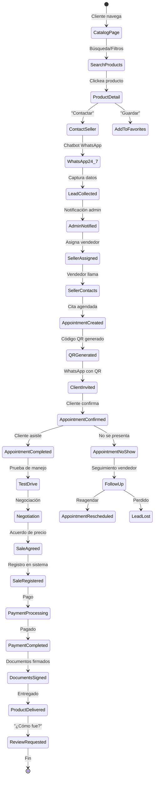

# 📋 DOCUMENTO DE REQUISITOS (PRD) - PROSELL SAAS v2.0

**Proyecto**: ProSell SaaS - Plataforma Multiproducto de E-commerce, Análisis y Automatización
**Versión**: 2.0
**Fecha**: Febrero 2026
**Estado**: Planificación

---

## 1. VISIÓN Y OBJETIVOS

### 1.1 Propuesta de Valor

**ProSell SaaS** es una plataforma integral que combina:

- **E-commerce Multiproducto**: Marketplace para organizaciones/dealers
- **Sistema de Ventas Avanzado**: Citas, comisiones, equipos MLM
- **Análisis de Mercado**: Scraping + Inteligencia de precios
- **Agentes IA**: Asistentes conversacionales
- **Sistema de Prepago**: Billetera virtual con tokens

### 1.2 Objetivos Q4 2026

| Métrica                | Objetivo |
| ---------------------- | -------- |
| Organizaciones activas | 300      |
| Productos en catálogo  | 100,000  |
| Usuarios mensuales     | 50,000   |
| Ingresos mensuales     | $100,000 |

---

## 2. SISTEMA DE ROLES Y PERMISOS

### 2.1 Jerarquía de Roles

```
MASTER (ProSell)
├── MANAGER (Gestiona equipo, asignado a orgs)
│   └── SELLER_PROSELL (Vende de todas las orgs)
│
ORGANIZATION
├── ORG_ADMIN (Admin de su org)
│   └── ORG_SELLER (Vende de su org)
│
PUBLIC
└── CLIENT (Comprador)
```

### 2.2 Permisos por Rol

| Acción                  | Master | Manager | Seller PS | Org Admin | Org Seller | Client |
| ----------------------- | ------ | ------- | --------- | --------- | ---------- | ------ |
| Crear organización      | ✅     | ❌      | ❌        | ❌        | ❌         | ❌     |
| Aprobar productos       | ✅     | ❌      | ❌        | ❌        | ❌         | ❌     |
| Ver todos los productos | ✅     | ✅\*    | ✅        | ❌        | ❌         | 🌐     |
| Crear producto          | ✅     | ❌      | ❌        | ✅\*\*    | ❌         | ❌     |
| Crear cita              | ✅     | ✅      | ✅        | ✅        | ✅         | ❌     |
| Registrar venta         | ✅     | ✅\*    | ❌        | ✅\*\*    | ❌         | ❌     |
| Ver comisiones propias  | ✅     | ✅      | ✅        | ✅        | ✅         | ❌     |
| Editar % comisiones     | ✅     | ❌      | ❌        | ❌        | ❌         | ❌     |
| Gestionar equipos       | ✅     | ✅      | ❌        | ❌        | ❌         | ❌     |

\*Solo orgs asignadas | \*\*Solo su org | 🌐Solo público

---

## 3. ÉPICAS Y FUNCIONALIDADES MVP

### 3.1 Sprint 1-2: Autenticación (Semanas 1-4)

#### US-001: Registro de Usuario

**Descripción**: Usuario nuevo se registra con email/contraseña

**Criterios de Aceptación**:

```gherkin
Scenario: Registro exitoso con email válido
  GIVEN un usuario no registrado
  WHEN se registra con:
    - email válido y único
    - contraseña fuerte (8+ chars, mayúscula, número, especial)
    - acepta términos y condiciones
  THEN se crea cuenta con estado PENDING_VERIFICATION
  AND se envía email de verificación con token expiración 24h
  AND NO puede hacer login hasta verificar email
  AND se muestra mensaje "Revisa tu email para verificar"

Scenario: Email ya registrado
  GIVEN un email ya registrado en el sistema
  WHEN intenta registrarse con mismo email
  THEN se muestra error "El email ya está registrado"
  AND NO se crea nueva cuenta
  AND se ofrece opción "¿Olvidaste tu contraseña?"

Scenario: Contraseña débil
  GIVEN usuario intenta registrarse
  WHEN contraseña NO cumple requisitos mínimos
  THEN se muestra error específico:
    "La contraseña debe tener al menos 8 caracteres,
     una mayúscula, un número y un carácter especial"
  AND campo de contraseña se marca inválido

Scenario: Email inválido
  GIVEN usuario ingresa email con formato inválido
  WHEN envía formulario
  THEN se muestra error "Formato de email inválido"
  AND se sugiere formato correcto: usuario@ejemplo.com

Scenario: Captcha fallido
  GIVEN usuario completa formulario correctamente
  WHEN NO resuelve captcha correctamente
  THEN se muestra error "Confirma que no eres un robot"
  AND formulario NO se envía
```

**Escenarios Negativos**:

- Email con + alias (test+alias@gmail.com) → tratar como único
- Dominio temporal (tempmail.com) → bloquear con warning
- IP con múltiples registros → rate limit 3/hora
- Bot detectado → requiere reCAPTCHA v3

---

#### US-002: Login

**Descripción**: Usuario existente inicia sesión

**Criterios de Aceptación**:

```gherkin
Scenario: Login exitoso
  GIVEN un usuario verificado
  WHEN ingresa email y contraseña correctos
  THEN es redirigido al dashboard
  AND se generan tokens:
    - access_token (expira 1h)
    - refresh_token (expira 7 días)
  AND se registra última IP y timestamp

Scenario: Credenciales inválidas
  GIVEN usuario ingresa email o contraseña incorrectos
  WHEN envía formulario
  THEN se muestra error "Credenciales inválidas"
  AND se incrementa contador de intentos fallidos
  AND NO se revela si email existe (security)

Scenario: Cuenta bloqueada por intentos
  GIVEN usuario tiene 5 intentos fallidos
  WHEN intenta login nuevamente
  THEN se muestra error "Cuenta bloqueada temporalmente"
  AND se desbloquea automáticamente después de 15 min
  AND se envía email notificando bloqueo

Scenario: Email no verificado
  GIVEN usuario registrado pero NO verificado
  WHEN intenta hacer login
  THEN se muestra error "Debes verificar tu email primero"
  AND se ofrece opción "Reenviar email de verificación"

Scenario: "Recordarme" activado
  GIVEN usuario marca "Recordarme"
  WHEN hace login exitoso
  THEN refresh_token expira en 30 días (no 7 días)
  AND se guarda cookie httpOnly en navegador
```

**Recuperación de Contraseña**:

```gherkin
Scenario: Flujo recuperación exitoso
  GIVEN usuario olvida su contraseña
  WHEN solicita recuperación con su email
  THEN se envía email con link de reset (expira 1h)
  AND token es único y de un solo uso
  WHEN usa link para nueva contraseña
  THEN puede establecer nueva contraseña
  AND tokens existentes son revocados
  AND debe hacer login nuevamente
```

---

#### US-003: OAuth Social

**Descripción**: Login con Google/Facebook

**Criterios de Aceptación**:

```gherkin
Scenario: Primer login con Google
  GIVEN usuario sin cuenta en ProSell
  WHEN clickea "Continuar con Google"
  THEN es redirigido a Google OAuth
  WHEN autoriza ProSell
  THEN se crea cuenta automáticamente con:
    - email de Google
    - avatar de Google
    - estado VERIFIED (sin email verification)
  AND es redirigido a onboarding (seleccionar rol)

Scenario: Cuenta ya existe con mismo email
  GIVEN usuario con cuenta email/contraseña
  WHEN hace login con Google (mismo email)
  THEN se muestra opción:
    - "Vincular cuenta Google" → actualiza cuenta
    - "Usar cuenta existente" → requiere contraseña
  AND después de vincular puede usar Google

Scenario: Vinculación de cuentas
  GIVEN usuario logueado con email/contraseña
  WHEN va a Settings → "Vincular Google"
  THEN puede agregar Google como método de login
  AND puede usar ambos métodos después
```

**Mapeo de Datos Google**:

```
Google Profile → ProSell User
  email         → email (VERIFIED)
  name          → full_name
  picture       → avatar_url
  sub           → google_id (social_id)
```

---

#### US-004: 2FA (Two-Factor Authentication)

**Descripción**: Autenticación de dos factores obligatoria para admins

**Criterios de Aceptación**:

```gherkin
Scenario: Configuración inicial de 2FA
  GIVEN usuario con rol ADMIN/MANAGER
  WHEN hace login por primera vez
  THEN es obligado a configurar 2FA
  AND se muestra QR code para Google Authenticator
  AND se generan 10 códigos de respaldo
  AND debe ingresar código actual para confirmar

Scenario: Login con 2FA
  GIVEN usuario con 2FA habilitado
  WHEN ingresa email y contraseña correctos
  THEN es redirigido a página "Ingresa tu código 2FA"
  WHEN ingresa código TOTP correcto (6 dígitos)
  THEN accede al dashboard
  AND código es válido solo 30 segundos

Scenario: Código 2FA inválido
  GIVEN usuario en página de 2FA
  WHEN ingresa código incorrecto
  THEN se muestra error "Código inválido"
  AND tiene 5 intentos antes de bloqueo temporal
  AND puede usar código de respaldo si perdió acceso

Scenario: Uso de código de respaldo
  GIVEN usuario perdió acceso a Authenticator
  WHEN usa uno de sus códigos de respaldo
  THEN código es válido
  AND ese código de respaldo es consumido
  AND se muestra "Códigos restantes: X"
  WHEN quedan solo 3 códigos
  THEN se sugiere regenerar nuevos códigos
```

**Reglas 2FA**:

| Rol            | 2FA Obligatorio | Desde cuándo |
| -------------- | --------------- | ------------ |
| MASTER         | SÍ              | Inmediato    |
| MANAGER        | SÍ              | Inmediato    |
| SELLER_PROSELL | NO              | -            |
| ORG_ADMIN      | SÍ              | Al crear org |
| ORG_SELLER     | NO              | -            |
| CLIENT         | NO              | -            |

---

#### US-005: Sistema RBAC

**Descripción**: Control de acceso basado en roles

**Criterios de Aceptación**:

```gherkin
Scenario: Verificación de permisos en endpoint
  GIVEN usuario con rol ORG_ADMIN
  WHEN intenta acceder a GET /api/products (todos los productos)
  THEN recibe HTTP 403 Forbidden
  AND error message: "No tienes permiso para esta acción"

Scenario: Verificación de permisos en UI
  GIVEN usuario con rol ORG_SELLER
  WHEN está en dashboard
  THEN NO ve botón "Crear Organización"
  AND NO ve sección "Comisiones Globales"
  AND SOLO ve productos de su organización

Scenario: Usuario con múltiples roles
  GIVEN usuario con roles ORG_ADMIN y SELLER_PROSELL
  WHEN accede al sistema
  THEN tiene permisos de AMBOS roles
  AND puede cambiar contexto entre organizaciones
```

**Matriz Completa de Permisos**:

```
┌─────────────────────────────────────────────────────────────────────┐
│ PERMISO                        │MASTER│MGR│SP│OA│OS│CL│
├─────────────────────────────────────────────────────────────────────┤
│ Ver Dashboard                   │  ✓  │ ✓ │ ✓ │ ✓ │ ✓ │ - │
│ Crear Organización             │  ✓  │ - │ - │ - │ - │ - │
│ Editar CUALQUIER organización   │  ✓  │ - │ - │ - │ - │ - │
│ Editar SU organización          │  -  │ - │ - │ ✓ │ - │ - │
│ Ver TODOS los productos         │  ✓  │ ✓*│ ✓ │ - │ - │ - │
│ Ver productos PÚBLICOS          │  -  │ - │ - │ - │ - │ ✓ │
│ Crear producto (su org)         │  ✓  │ - │ - │ ✓ │ - │ - │
│ Editar producto (su org)        │  ✓  │ - │ - │ ✓ │ - │ - │
│ Aprobar producto (cualquiera)   │  ✓  │ - │ - │ - │ - │ - │
│ Pausar producto (su org)        │  ✓  │ - │ - │ ✓ │ - │ - │
│ Marcar vendido (cualquiera)     │  ✓  │ ✓*│ - │ ✓*│ - │ - │
│ Crear cita (cualquier producto) │  ✓  │ ✓ │ ✓ │ ✓ │ ✓ │ - │
│ Ver TODAS las citas             │  ✓  │ ✓*│ - │ ✓*│ - │ - │
│ Ver SUS citas                   │  -  │ - │ ✓ │ - │ ✓ │ - │
│ Asignar vendedores a equipo     │  ✓  │ ✓ │ - │ - │ - │ - │
│ Ver TODAS las comisiones        │  ✓  │ ✓*│ - │ ✓*│ - │ - │
│ Ver SUS comisiones              │  -  │ - │ ✓ │ - │ ✓ │ - │
│ Editar % de comisión global     │  ✓  │ - │ - │ - │ - │ - │
│ Recargar wallet                 │  ✓  │ - │ - │ ✓ │ - │ - │
│ Ver TODOS los wallets           │  ✓  │ - │ - │ - │ - │ - │
│ Ver dashboard analytics         │  ✓  │ ✓ │ ✓ │ ✓ │ ✓ │ - │
└─────────────────────────────────────────────────────────────────────┘
*Solo organizaciones asignadas al equipo
```

---

---

### 3.2 Sprint 3-4: Organizaciones (Semanas 5-8)

**US-010: CRUD Organizaciones**

- Crear con datos completos
- Logo y banner
- Información de contacto
- Dirección

**US-011: Verificación**

- Estado: PENDING → VERIFIED/REJECTED
- Documentación requerida
- Notificación al admin

**US-012: Configuración de Org**

- Auto-publicar Sí/No
- Límites (productos, usuarios, imágenes)
- Comisiones personalizadas

**US-013: Equipos ProSell**

- Crear equipo con manager
- Asignar vendedores (máx 10)
- Asignar organizaciones
- Promoción vendedor → manager

---

### 3.3 Sprint 5-6: Productos (Semanas 9-12)

**US-020: CRUD Productos**

- Formulario dinámico por categoría
- Campos base + específicos
- Validaciones
- Estados: DRAFT, PENDING, PUBLISHED, PAUSED, SOLD

**US-021: Categorías Dinámicas**

Estructura jerárquica:

```
Vehículos
├── Autos/Camionetas
├── Motos
├── Comercial (Camiones, Tractores)
├── PowerSport (ATVs, Motos de agua)
├── Botes
├── RV & Campers
└── Trailers

Inmuebles
├── Casas
├── Apartamentos
└── Terrenos

Electrónicos, Maquinaria, Otros...
```

**Campos Vehículos:**

```
- VIN (con decoder)
- Año, Marca, Modelo, Trim
- Millas
- Combustible, Transmisión, Tracción
- Color exterior/interior
- Tipo de carrocería
```

**US-022: Galería de Imágenes**

- Hasta 20 imágenes por producto
- Drag & drop para ordenar
- Imagen principal
- Crop/resize automático
- Almacenamiento en DO Spaces

**US-023: Carga Masiva CSV**

- Plantilla por categoría
- Validación pre-importación
- Reporte de errores
- Procesamiento async

**US-024: VIN Decoder**

- Integración NHTSA API
- Auto-completar campos
- Guardar datos raw

**US-025: Aprobación de Publicaciones**

- Cola de pendientes
- Aprobar/Rechazar con razón
- Auto-aprobar si configurado
- Aprobar en lote

---

### 3.4 Sprint 7-8: Catálogo Público (Semanas 13-16)

**US-030: Listado de Productos**

- Vista grid/lista
- Paginación (20/página)
- Ordenamiento múltiple
- Responsive design

**US-031: Búsqueda Avanzada**

- Búsqueda full-text
- Filtros por categoría
- Filtros específicos (marca, modelo, año, precio, millas)
- Filtro por ubicación

**US-032: Detalle de Producto**

- Galería con lightbox
- Especificaciones completas
- Análisis precio vs mercado
- Info del vendedor
- Productos similares
- Botones de contacto

**US-033: Comparador**

- Hasta 5 productos
- Tabla comparativa
- Destacar diferencias
- Exportar PDF

---

### 3.5 Sprint 9-10: Ventas (Semanas 17-20)

**US-040: Sistema de Citas**

Tipos:

1. Cliente externo (WhatsApp 24/7 → Admin asigna → Vendedor contacta)
2. Cliente interno (Vendedor crea directamente)

Funcionalidades:

- Crear cita con datos cliente
- Generar código QR
- Enviar por canal preferido
- Recordatorios automáticos
- Reprogramar/cancelar

**US-041: Registro de Venta**

- Seleccionar producto y vendedor
- Precio final (editable)
- Calcular comisiones
- Cambiar estado a SOLD
- Notificar interesados
- Enviar notificación WhatsApp

**US-042: Sistema de Comisiones**

Distribución default:

- Vendedor: 40%
- Manager: 20%
- ProSell: 40%

Reglas:

- % editables por Master
- Manager puede vender (recibe % vendedor)
- Comisiones PENDING → PAID

---

### 3.6 Sprint 11-12: Wallet (Semanas 21-24)

**US-050: Billetera Virtual**

- Balance en USD
- Historial de transacciones
- Facturación electrónica

**US-051: Recarga**

- Stripe (automático)
- Zelle (manual)
- Efectivo (manual)

**US-052: Sistema de Tokens**

| Token            | Precio Sugerido |
| ---------------- | --------------- |
| PHOTO_UPLOAD     | $0.10/foto      |
| VEHICLE_LISTING  | $5.00/listing   |
| WHATSAPP_MSG     | $0.05/msg       |
| MAINTENANCE_FEE  | $10.00/mes      |
| FEATURED_LISTING | $15.00/7días    |
| VIN_DECODE       | $0.50/consulta  |

**US-053: Paquetes**

| Paquete      | Contenido                 | Precio |
| ------------ | ------------------------- | ------ |
| Starter      | 10 listings + 100 fotos   | $50    |
| Professional | 30 listings + 300 fotos   | $120   |
| Enterprise   | 100 listings + 1000 fotos | $350   |

---

## 4. REQUISITOS NO FUNCIONALES

### 4.1 Rendimiento

- Carga inicial: < 3 segundos
- API Response (p95): < 200ms
- Usuarios concurrentes: 200

### 4.2 Disponibilidad

- Uptime: 99.9%
- RTO: < 1 hora
- RPO: < 5 minutos

### 4.3 Seguridad

- HTTPS obligatorio
- JWT + Refresh tokens
- Bcrypt para passwords
- RBAC middleware
- Rate limiting

### 4.4 Compatibilidad

- Chrome, Firefox, Safari, Edge (últimas 2 versiones)
- Responsive: Desktop, Tablet, Mobile
- PWA: Instalable, offline básico

---

## 5. INTEGRACIONES

| Servicio            | Uso                          |
| ------------------- | ---------------------------- |
| Meta APIs           | WhatsApp Business, Messenger |
| Stripe              | Pagos, facturación           |
| NHTSA               | Decodificación VIN           |
| DigitalOcean Spaces | Almacenamiento imágenes      |
| Anthropic Claude    | Agentes IA                   |

---

## 6. KPIs DE ÉXITO

### 6.1 Técnicos

- Uptime > 99.9%
- API Latency < 200ms
- Test Coverage > 90%
- Error Rate < 0.1%

### 6.2 Producto

- Organizaciones activas: 300
- Productos: 100,000
- MAU: 50,000
- Retention 30d: 85%
- Time to First Value: < 15 min

### 6.3 Negocio (Calculado)

```
CAC (Cost of Acquisition):
  Fórmula: Marketing Budget / Nuevas Organizaciones
  Objetivo: <$50/org
  Canales: SEO, Content, Referral, Paid Ads

LTV (Lifetime Value):
  Fórmula: ARPU × Average Lifetime (meses)
  Cálculo: $50/month × 12 meses = $600
  Objetivo: >$500/org

Unit Economics:
  Gross Margin: (>70%)
  ├── Costos Servidores: $500/mes
  ├── Costos Soporte: $2,000/mes
  ├── Costos Marketing: $10,000/mes
  └── Ingresos: $100,000/mes
  ─────────────────────────────
  Gross Margin: ~87%

Churn Rate:
  Fórmula: Clientes perdidos / Clientes totales
  Objetivo: <5% mensual
  Alerta: >8% mensual

Burn Rate & Runway:
  Burn Rate Mensual: $25,000
  Runway (con $250k): 10 meses
  Punto de equilibrio: Mes 14

LTV:CAC Ratio:
  Objetivo: 7.5:1
  Mínimo aceptable: 3:1
```

---

## 7. RIESGOS

| Riesgo             | Mitigación                         |
| ------------------ | ---------------------------------- |
| Bloqueo scraping   | Proxies rotativos, rate limiting   |
| Baja adopción      | Piloto gratis, onboarding dedicado |
| Performance escala | Cache, read replicas, CDN          |
| Seguridad          | Auditorías, pentesting, encryption |

---

## 8. COMPLIANCE E INTERNACIONALIZACIÓN

### 8.1 GDPR y Privacidad (Europa)

**Requisitos de Consentimiento**:

```
CONSENTIMIENTO OBLIGATORIO:
  - Checkbox "Acepto términos y condiciones" (NO pre-seleccionado)
  - Checkbox "Acepto política de privacidad" (NO pre-seleccionado)
  - Checkbox "Acepto comunicaciones de marketing" (OPCIONAL)
  - Banner de cookies con opción "Rechazar no esenciales"
```

**Derechos del Usuario (GDPR Art. 15-22)**:

```gherkin
Scenario: Derecho de Acceso (Right to Access)
  GIVEN usuario logueado
  WHEN solicita "Mis datos"
  THEN recibe JSON/CSV con TODOS sus datos:
    - Perfil personal
    - Organizaciones
    - Productos creados
    - Transacciones
    - Activity logs
  AND puede descargar en formato machine-readable

Scenario: Derecho al Olvido (Right to be Forgotten)
  GIVEN usuario solicita eliminar cuenta
  WHEN confirma "Sí, eliminar permanentemente"
  THEN se ejecuta soft-delete:
    - Marca user.deleted_at = NOW()
    - Anonimiza datos personales (email, phone)
    - Mantiene datos financieros (7 años, legal)
  AND NO puede recuperar cuenta
  AND datos son purgados permanentemente después de 30 días

Scenario: Derecho de Portabilidad
  GIVEN usuario solicita "Exportar mis datos"
  THEN recibe archivo JSON con estructura estándar
  AND puede importar en otro sistema

Scenario: Derecho de Rectificación
  GIVEN usuario detecta error en sus datos
  WHEN edita su información
  THEN cambios se reflejan inmediatamente
  AND se registra audit log del cambio

Scenario: Retirada de Consentimiento
  GIVEN usuario con marketing opt-in
  WHEN desmarca "Recibir comunicaciones"
  THEN se elimina de listas de marketing
  AND confirma "Ya no recibirás emails de marketing"
```

**Retención de Datos**:

```
TIPO DE DATO                  | RETENCIÓN | JUSTIFICACIÓN
-----------------------------|-----------|------------------------
User activity logs           | 90 días   | Seguridad, debugging
Authentication logs          | 2 años    | Auditoría de acceso
Financial transactions       | 7 años    | Requisito legal IRS
Email marketing preferences  | Indefinido | Hasta revocación
Deleted user data (anonymized)| 30 días  | Gracia recuperación
Support tickets              | 3 años    | Mejora servicio
```

### 8.2 CCPA (California Consumer Privacy Act)

**Derechos Adicionales para California**:

```
- Do Not Sell My Info (no vendemos datos, pero debe estar visible)
- Opt-out de venta de datos (implementado como "no vendemos datos")
- Icono de privacidad en footer
- Link a "Your Privacy Choices" en email footer
```

### 8.3 Internacionalización (i18n)

**Fase 1 (MVP)**: Español (Latinoamérica) + Inglés (US)

```
IDIOMAS SOPORTADOS:
  🇪🇸 Español (Latinoamérica) - DEFAULT
  🇺🇸 English (US)

FORMATOS POR REGIÓN:

🇪🇸 Español (Latam):
  - Moneda: USD (sin centavos para vehículos, con centavos para tokens)
  - Fecha: DD/MM/YYYY
  - Hora: 12h (AM/PM)
  - Números: 1,234.56 (punto decimal, coma miles)
  - Teléfono: +XX XXX XXX XXXX

🇺🇸 English (US):
  - Moneda: USD
  - Fecha: MM/DD/YYYY
  - Hora: 12h (AM/PM)
  - Números: 1,234.56
  - Teléfono: +1 XXX XXX XXXX

FUTURO (Fase 3):
  🇧🇷 Portugués (Brasil)
  🇲🇽 Español (México)
```

**Zonas Horarias**:

```
ALMACENAMIENTO: Todos los timestamps en UTC
DISPLAY: Convertido a timezone del usuario

Timezones soportados:
  - UTC (default para usuarios sin timezone)
  - America/Argentina/Buenos_Aires
  - America/Mexico_City
  - America/Sao_Paulo
  - America/New_York
  - America/Los_Angeles

CONVERSIÓN:
  Backend: Siempre UTC
  Frontend: Local timezone del browser
  Email: Timezone de la organización
```

### 8.4 Impuestos (Tax Calculation)

**Fase 1 (MVP)**: Sin IVA/Impuestos (B2B)

**Fase 2 (Futuro)**:

```
IMPUESTOS A CONSIDERAR:
  - Argentina: IVA 21% (para residentes)
  - México: IVA 16%
  - Brasil: ICMS variable por estado
  - USA: Sales Tax por estado (para clientes finales)

CÁLCULO:
  - Geolocalización por IP
  - Base de datos de tasas por jurisdicción
  - Stripe Tax para cálculo automático
```

---

## 9. FLUJOS DE USUARIO (User Journey Maps)

### 9.1 Flujo de Registro → Primera Venta

```mermaid
stateDiagram-v2
    [*] --> LandingPage: Usuario llega
    LandingPage --> ClickRegistrar: Interesado
    ClickRegistrar --> RegistroForm: "Comenzar gratis"
    RegistroForm --> EmailVerification: Submit formulario
    EmailVerification --> EmailSent: Sistema envía email
    EmailSent --> EmailVerified: Usuario clickea link
    EmailVerification --> EmailExpired: 24h pasaron
    EmailExpired --> ResendEmail: "Reenviar email"
    ResendEmail --> EmailSent: Nuevo email enviado

    EmailVerified --> RoleSelection: "Selecciona tu rol"
    RoleSelection --> OrgAdminFlow: "Tengo un negocio"
    RoleSelection --> SellerProSellFlow: "Quiero vender"

    OrgAdminFlow --> CreateOrganization: Datos del negocio
    CreateOrganization --> OrgPending: Estado PENDING
    OrgPending --> OrgApproved: Master aprueba
    OrgPending --> OrgRejected: Master rechaza
    OrgApproved --> DashboardAdmin: Acceso completo
    OrgRejected --> AppealProcess: Apelar o corregir

    SellerProSellFlow --> OnboardingSeller: Completar perfil
    OnboardingSeller --> DashboardSeller: Esperando asignación

    DashboardAdmin --> CreateProduct: "Publicar vehículo"
    CreateProduct --> ProductDraft: Guardar borrador
    ProductDraft --> ProductPending: "Enviar aprobación"
    ProductPending --> ProductPublished: Master aprueba
    ProductPublished --> ProductVisible: Visible en catálogo

    ProductVisible --> ClientInquiry: Cliente pregunta
    ClientInquiry --> AppointmentCreated: Crear cita
    AppointmentCreated --> AppointmentConfirmed: Confirmada
    AppointmentConfirmed --> SaleCompleted: Venta realizada
    SaleCompleted --> CommissionCalculated: Comisiones generadas
    CommissionCalculated --> NotificationSent: WhatsApp a todos
    NotificationSent --> [*]: Fin del ciclo
```



### 9.2 Flujo de Compra (Cliente Externo)



---

## 10. PLAN DE TESTING POR USER STORY

### Matriz de Testing

| User Story          | Unit Tests                                                        | Integration Tests                                     | E2E Tests                               | Performance             | Security                           |
| ------------------- | ----------------------------------------------------------------- | ----------------------------------------------------- | --------------------------------------- | ----------------------- | ---------------------------------- |
| US-001 Registro     | ✅ Email validation<br/>✅ Password strength<br/>✅ User creation | ✅ DB insert<br/>✅ Email send<br/>✅ Duplicate check | ✅ Full flow<br/>✅ Email click         | ⚡ Registration < 500ms | 🔒 SQL injection<br/>🔒 Rate limit |
| US-002 Login        | ✅ Password verify<br/>✅ Token generation<br/>✅ Attempt counter | ✅ Auth check<br/>✅ Session create                   | ✅ Login flow<br/>✅ Blocked user       | ⚡ Login < 300ms        | 🔒 Brute force<br/>🔒 Token theft  |
| US-003 OAuth        | ✅ Token parse<br/>✅ User mapping                                | ✅ OAuth call<br/>✅ Account link                     | ✅ Google flow<br/>✅ Link account      | ⚡ OAuth < 2s           | 🔒 Token storage                   |
| US-004 2FA          | ✅ TOTP generation<br/>✅ Code validation<br/>✅ Backup codes     | ✅ QR generation<br/>✅ 2FA enable/disable            | ✅ Setup flow<br/>✅ Login with 2FA     | ⚡ Validation < 100ms   | 🔒 Code exposure                   |
| US-010 Org CRUD     | ✅ Slug generation<br/>✅ Status validation                       | ✅ CRUD operations<br/>✅ Image upload                | ✅ Create org<br/>✅ Edit org           | ⚡ Save < 500ms         | 🔒 Unauthorized edit               |
| US-020 Product CRUD | ✅ Price validation<br/>✅ Status transitions                     | ✅ Category FK<br/>✅ Image association               | ✅ Create product<br/>✅ Edit product   | ⚡ Save < 500ms         | 🔒 Invalid data                    |
| US-040 Citas        | ✅ QR generation<br/>✅ Status transitions                        | ✅ Notification send<br/>✅ Calendar check            | ✅ Book appointment<br/>✅ Cancel       | ⚡ Create < 300ms       | 🔒 Double booking                  |
| US-041 Ventas       | ✅ Commission calc<br/>✅ Price validation                        | ✅ Transaction create<br/>✅ Status update            | ✅ Register sale<br/>✅ View commission | ⚡ Save < 500ms         | 🔒 Invalid amount                  |

### Criterios de Pass/Fail

```
UNIT TESTS:
  ✅ PASS: Todos los tests pasan
  ✅ Cobertura > 90%
  ✅ Sin mocks excesivos (máx 3 por test)
  ❌ FAIL: Cualquier test falla
  ❌ FAIL: Cobertura < 80%

INTEGRATION TESTS:
  ✅ PASS: Flujo completo funciona
  ✅ DB rollback después de cada test
  ✅ Datos limpios (fixtures)
  ❌ FAIL: Estado contaminado entre tests
  ❌ FAIL: Dependencia de servicios externos

E2E TESTS:
  ✅ PASS: User journey completo
  ✅ Sin hard-coded waits
  ✅ Seletores estables (role > data-testid > text)
  ❌ FAIL: Flaky tests (intermitentes)
  ❌ FAIL: Dependencia de orden de ejecución

PERFORMANCE TESTS:
  ✅ PASS: p95 < umbral especificado
  ✅ PASS: p99 < 2× umbral
  ❌ FAIL: p95 > umbral
  ❌ FAIL: Memory leak detectado

SECURITY TESTS:
  ✅ PASS: OWASP Top 10 cubierto
  ✅ PASS: Sin secrets en código
  ✅ PASS: SQL injection bloqueado
  ❌ FAIL: Vulnerabilidad crítica encontrada
  ❌ FAIL: Autenticación bypass
```

---

## 11. REQUISITOS DE AUDITORÍA Y LOGGING

### 11.1 Campos de Auditoría (Obligatorios en TODAS las tablas)

```sql
-- Campos de auditoría en todas las entidades
CREATE TABLE audit_fields (
    -- Quién creó
    created_by UUID REFERENCES users(id),
    created_at TIMESTAMP WITH TIME ZONE DEFAULT NOW(),

    -- Quién modificó por última vez
    updated_by UUID REFERENCES users(id),
    updated_at TIMESTAMP WITH TIME ZONE DEFAULT NOW(),

    -- Soft delete (NO borrar físicamente)
    deleted_by UUID REFERENCES users(id),
    deleted_at TIMESTAMP WITH TIME ZONE,

    -- Versión para optimistic locking
    version INTEGER DEFAULT 1,

    -- Tenant para multi-tenancy
    tenant_id UUID NOT NULL
);
```

### 11.2 Logs Inmutables

```
EVENTOS CRÍTICOS (LOG INMUTABLE):
  ┌──────────────────────────────────────────────────────────────┐
  │ EVENTO                │ RETENCIÓN │ UBICACIÓN      │ ALARMA  │
  ├──────────────────────────────────────────────────────────────┤
  │ Login success/fail    │ 2 años    │ DB audit_log  │ Sí (fail)│
  │ Permission denied     │ 2 años    │ DB audit_log  │ Sí      │
  │ Data export           │ 3 años    │ DB audit_log  │ Sí      │
  │ Account delete        │ 7 años    │ DB audit_log  │ Sí      │
  │ Financial transaction │ 7 años    │ DB immutable  │ Sí      │
  │ Commission change     │ 7 años    │ DB immutable  │ Sí      │
  │ Password change       │ 2 años    │ DB audit_log  │ Sí      │
  │ Role assignment       │ 2 años    │ DB audit_log  │ Sí      │
  │ API key creation      │ 2 años    │ DB audit_log  │ Sí      │
  └──────────────────────────────────────────────────────────────┘

FORMATO DE LOG (JSON):
{
  "timestamp": "2026-02-05T10:30:00Z",
  "event_type": "user.login.success",
  "user_id": "uuid",
  "ip_address": "xxx.xxx.xxx.xxx",
  "user_agent": "Mozilla/5.0...",
  "location": {"country": "AR", "city": "Buenos Aires"},
  "metadata": {"method": "oauth", "provider": "google"}
}

ALERTAS:
  - 5 failed logins desde misma IP → Bloquear IP
  - 10 failed logins mismo usuario → Notificar admin
  - Export de >1000 registros → Requiere aprobación admin
  - Cambio de rol por non-Master → Alerta crítica
```

### 11.3 Consultas de Auditoría

```gherkin
Scenario: Admin consulta "¿Quién modificó este producto?"
  GIVEN admin con rol MASTER
  WHEN va a Audit Logs → Filtra por producto
  THEN ve timeline completo:
    - 2026-02-05 10:00 - Creado por user_1 (IP xxx.xxx.xxx.xxx)
    - 2026-02-05 11:00 - Modificado por user_2 (IP yyy.yyy.yyy.yyy)
      └─ Cambio: price $10000 → $9500
    - 2026-02-05 12:00 - Estado PUBLISHED por user_1

Scenario: Auditoría de comisiones
  GIVEN Master ve discrepancia en comisiones
  WHEN consulta audit log de comisión
  THEN ve:
    - Quién creó la comisión
    - Quién modificó el porcentaje
    - Quién marcó como PAGADA
    - IP y timestamp de cada acción
```

---

## 12. ESTRATEGIA DE MIGRACIÓN Y ROLLBACK

### 12.1 Plan de Rollback

```
ROLLBACK POR TIPO DE CAMBIO:

┌─────────────────────────────────────────────────────────────────┐
│ TIPO DE CAMBIO        │ ROLLBACK STRATEGY                      │ TIME TARGET│
├─────────────────────────────────────────────────────────────────┤
│ Bug fix (no DB)       │ git revert → redeploy                  │ < 5 min     │
│ Feature flag OFF      │ Apagar flag en config                  │ < 1 min     │
│ DB migration          │ Alembic downgrade                      │ < 15 min    │
│ Data migration        │ Restaurar backup                      │ < 30 min    │
│ External API change   │ Versión anterior de API                │ < 10 min    │
│ Schema breaking       │ Blue/Green deploy                      │ < 5 min     │
└─────────────────────────────────────────────────────────────────┘

PROCEDIMIENTO DE EMERGENCIA:
  1. Detectar anomalía (monitoring alerta)
  2. Evaluar severidad (S1/S2/S3)
  3. S1 Crítica:
     - Rollback inmediato
     - Notificar stakeholders
     - Crear incident ticket
     - Post-mortem en 24h
  4. S2 Alta:
     - Feature flag OFF si disponible
     - Hotfix schedule
  5. S3 Normal:
     - Fix en próximo release

FEATURE FLAGS IMPLEMENTACIÓN:
  - LaunchDarkly o solución open-source (Flagsmith)
  - Flags en Redis (escritura < 1ms)
  - Panel admin para toggles
```

### 12.2 Migración de Datos (si existe sistema previo)

```
ETL STRATEGY (Extract, Transform, Load):

EXTRACT:
  - Exportar CSV/JSON del sistema legacy
  - Snapshot de DB (pg_dump)
  - Validar checksum

TRANSFORM:
  - Mapeo de campos:
    legacy.user_id → prosell.users.id
    legacy.product_status → prosell.products.status (con lookup table)
  - Normalizar datos:
    - Emails a lowercase
    - Teléfonos a formato E.164
    - Fechas a UTC

LOAD:
  - Cargar en lotes de 1000 registros
  - Validar antes de commit
  - Reintentar registros fallidos 3 veces

VALIDACIÓN POST-MIGRACIÓN:
  - Count: mismo número de registros
  - Checksum: datos idénticos
  - Spot check: 100 registros random manuales
  - User testing: 5 usuarios prueban datos migrados

PLAN B:
  - Si migración falla > 10%
  - Rollback a sistema legacy
  - Corregir transformación
  - Reintentar
```

---

## 13. ESCENARIOS DE FALLO (Error Paths)

### 13.1 Manejo de Errores por Dominio

```gherkin
# AUTHENTICATION

Scenario: Contraseña olvidada, email no existe
  GIVEN usuario solicita reset con email inexistente
  THEN NO se revela "email no existe" (security)
  AND muestra "Si el email existe, recibirás instrucciones"
  AND NO se envía email real

Scenario: 2FA codes agotados
  GIVEN usuario usó todos los códigos de respaldo
  WHEN intenta hacer login
  THEN requiere contactar soporte
  AND soporte puede resetear tras verificar identidad

# PRODUCTOS

Scenario: Producto con duplicado VIN
  GIVEN usuario intenta crear vehículo con VIN existente
  THEN muestra error "Este VIN ya está registrado"
  AND sugiere "¿Quieres editar el producto existente?"
  AND NO permite duplicado

Scenario: Imagen upload falla
  WHEN usuario sube imagen y DO Spaces falla
  THEN muestra error "Error al subir imagen, intenta nuevamente"
  Y conserva datos del formulario (no pierde trabajo)
  Y reintentar automáticamente 3 veces con backoff

Scenario: Límite de imágenes alcanzado
  GIVEN usuario con 20 imágenes en producto
  WHEN intenta agregar más
  THEN muestra error "Límite de 20 imágenes alcanzado"
  AND sugiere "Elimina una imagen primero"

# VENTAS

Scenario: Producto ya vendido
  GIVEN vendedor intenta registrar venta
  WHEN producto ya tiene estado SOLD
  THEN muestra error "Este producto ya fue vendido"
  AND muestra detalles de venta previa (fecha, vendedor, precio)

Scenario: Comisión negativa o inválida
  GIVEN admin intenta setear comisión negativa
  THEN muestra error "La comisión debe ser entre 0% y 100%"
  Y campo se marca inválido

Scenario: Cita solapada
  GIVEN vendedor crea cita para mismo horario
  WHEN ya existe cita confirmada
  THEN muestra advertencia "Ya tienes cita a esta hora"
  Y permite crear de todas formas (override manual)

# WALLET

Scenario: Balance insuficiente
  GIVEN usuario intenta consumir tokens
  WHEN wallet balance < costo
  THEN muestra error "Balance insuficiente"
  AND sugiere "Recarga tu wallet"
  AND muestra botón "Ir a recarga"

Scenario: Stripe payment falla
  GIVEN usuario paga con Stripe
  WHEN payment declinado
  THEN muestra error específico del banco
  Y sugiere "Usa otro método de pago"
  Y conserva datos de formulario (no re-ingresar)

Scenario: Stale data (optimistic locking)
  GIVEN usuario A y usuario B editan mismo producto
  WHEN A guarda primero
  Y B intenta guardar después
  THEN muestra error "Este producto fue modificado por otro usuario"
  AND muestra cambios actuales
  AND permite "Sobrescribir" o "Cancelar"
```

### 13.2 Códigos de Error HTTP

```
Error Codes Mapping:
  400 Bad Request         → Datos inválidos (validación falló)
  401 Unauthorized        → No autenticado (token inválido/expirado)
  403 Forbidden           → No autorizado (permiso insuficiente)
  404 Not Found           → Recurso no existe
  409 Conflict            → Recurso en conflicto (duplicado)
  422 Unprocessable       → Error semántico (lógica de negocio)
  429 Too Many Requests   → Rate limit excedido
  500 Server Error        → Error interno (loggear y monitorear)
  503 Service Unavailable → Mantenimiento o degradación

Response Format (Error):
{
  "error": {
    "code": "INSUFFICIENT_BALANCE",
    "message": "No tienes suficiente balance",
    "details": {
      "required": 5.00,
      "available": 2.50,
      "currency": "USD"
    },
    "timestamp": "2026-02-05T10:30:00Z",
    "request_id": "req_abc123"
  }
}
```

---

## 14. REQUISITOS DE REPORTING Y ANALYTICS

### 14.1 Dashboards por Rol

```
MASTER DASHBOARD:
  ┌────────────────────────────────────────────────────────────┐
  │ Métricas Globales                                          │
  │ ├── Organizaciones: 280 (↑12 este mes)                   │
  │ ├── Productos: 45,230 (↑1,234 esta semana)                │
  │ ├── Ventas este mes: $450,000 (↑15% vs mes anterior)      │
  │ ├── Comisiones pendientes: $12,500                        │
  │ └── Usuarios activos: 8,450                               │
  │                                                            │
  │ Gráficos                                                   │
  │ ├── Ventas por mes (últimos 12 meses)                     │
  │ ├── Organizaciones por estado                             │
  │ ├── Top 10 vendedores                                     │
  │ └── Categorías más vendidas                               │
  │                                                            │
  │ Acciones Rápidas                                           │
  │ ├── [Aprobar 15 productos pendientes]                     │
  │ ├── [Ver 5 organizaciones nuevas]                         │
  │ └── [Exportar reporte mensual]                            │
  └────────────────────────────────────────────────────────────┘

MANAGER DASHBOARD:
  ┌────────────────────────────────────────────────────────────┐
  │ Métricas de Equipo                                         │
  │ ├── Mi equipo: 8 vendedores                               │
  │ ├── Ventas del equipo: $125,000 (este mes)                │
  │ ├── Mis comisiones: $25,000                               │
  │ ├── Citas hoy: 12                                         │
  │ └── Conversión: 35%                                       │
  │                                                            │
  │ Organizaciones Asignadas                                   │
  │ ├── Dealer ABC - 45 productos activos                     │
  │ ├── Dealer XYZ - 23 productos activos                     │
  │ └── AutoMax - 67 productos activos                        │
  │                                                            │
  │ Rendimiento de Vendedores                                  │
  │ ├── Juan Pérez - $18,000 (⭐ top performer)               │
  │ ├── María López - $14,500                                 │
  │ └── ...                                                   │
  └────────────────────────────────────────────────────────────┘

ORG_ADMIN DASHBOARD:
  ┌────────────────────────────────────────────────────────────┐
  │ Métricas de Organización                                   │
  │ ├── Productos activos: 45                                 │
  │ ├── Productos vendidos este mes: 8                        │
  │ ├── Vistas del catálogo: 2,340                            │
  │ ├── Leads recibidos: 56                                   │
  │ └── Balance wallet: $150.00                               │
  │                                                            │
  │ Inventario                                                  │
  │ ├── Publicados: 32                                        │
  │ ├── Borradores: 8                                         │
  │ ├── Pausados: 3                                           │
  │ └── Vendidos: 45 (histórico)                             │
  │                                                            │
  │ Vendedores                                                  │
  │ ├── Juan Pérez - 12 ventas                                │
  │ ├── ...                                                   │
  └────────────────────────────────────────────────────────────┘

SELLER DASHBOARD:
  ┌────────────────────────────────────────────────────────────┐
  │ Mis Actividades                                             │
  │ ├── Mis productos: 12                                     │
  │ ├── Mis citas hoy: 3                                      │
  │ ├── Mis ventas este mes: 5                               │
  │ ├── Mis comisiones: $2,500                                │
  │ └── Leads pendientes: 8                                   │
  │                                                            │
  │ Próximas Citas                                             │
  │ ├── 10:30 AM - Juan González - Toyota Camry               │
  │ ├── 2:00 PM - María Rodríguez - Ford F-150                │
  │ └── ...                                                   │
  └────────────────────────────────────────────────────────────┘
```

### 14.2 Reportes Exportables

```
REPORTES DISPONIBLES:

  📊 Reporte de Ventas:
     ├── Período: Diario / Semanal / Mensual / Personalizado
     ├── Desglose: Por organización, vendedor, categoría
     ├── Métricas: Total ventas, comisiones, productos vendidos
     ├── Formatos: PDF, Excel, CSV
     └── Programación: Email diario/semanal/mensual

  💰 Reporte de Comisiones:
     ├── Período: Mensual (cierre contable)
     ├── Detalle: Por vendedor, por venta, por rol
     ├── Métricas: Comisión calculada, pagada, pendiente
     ├── Formatos: PDF (para contabilidad), Excel
     └── Programación: Email mensual

  📦 Reporte de Inventario:
     ├── Por organización o global
     ├── Métricas: Productos por estado, categoría, antigüedad
     ├── Alertas: Productos sin visitas en 30 días
     └── Formatos: Excel, PDF

  👥 Reporte de Actividad:
     ├── Por usuario o organización
     ├── Métricas: Logins, productos creados, citas gestionadas
     ├── Período: Últimos 7/30/90 días
     └── Formatos: CSV, PDF

  📈 Reporte de Market Analytics:
     ├── Comparativa de precios vs mercado
     ├── Productos sobre/bajo precio promedio
     ├── Tendencias de precios por categoría
     └── Formatos: PDF, Excel con gráficos
```

---

## 15. ESTRATEGIA DE FEATURE FLAGS

### 15.1 Flags Planificados

```
FEATURE FLAGS REGISTRY:

┌────────────────────────────────────────────────────────────────┐
│ FLAG                    │ ENTORNO │ DEFAULT │ ROLLOUT          │
├────────────────────────────────────────────────────────────────┤
│ new_ui_dashboard        │ all     │ OFF     │ Fase 2 (Q2)     │
│ ai_chat_agents          │ prod    │ OFF     │ 5% → 25% → 100%  │
│ ebay_scraper_enabled    │ prod    │ OFF     │ Orgs específicas │
│ advanced_analytics      │ prod    │ OFF     │ Enterprise tier  │
│ multi_currency          │ dev     │ OFF     │ Fase 3 (Q3)     │
│ bulk_csv_import         │ prod    │ ON      │ 100%            │
│ qr_code_appointments    │ prod    │ ON      │ 100%            │
│ whatsapp_notifications  │ prod    │ ON      │ 100%            │
│ commission_v2           │ prod    │ OFF     │ Testing         │
│ featured_listings       │ prod    │ ON      │ Orgs pagadas    │
└────────────────────────────────────────────────────────────────┘
```

### 15.2 Proceso de Rollout

```
ROLLOUT PROGRESSIVE:
  1. Internal Testing (1%)
     - Solo empleados
     - Monitorear errores
     - Feedback rápido

  2. Beta Users (5%)
     - Orgs seleccionadas
     - Comunicación proactiva
     - Soporte dedicado

  3. Early Adopters (25%)
     - Opt-in disponible
     - Anuncio en changelog
     - Monitorear métricas

  4. General Release (100%)
     - Default para todos
     - Opt-out disponible (transición)

  5. Removal of Flag
     - Después de 30 días estable
     - Remover código del flag
     - Limpiar configuración

KILL SWITCH (Emergencia):
  - Si alertas > umbral
  - OFF inmediato del flag
  - Notificar usuarios afectados
  - Root cause analysis
```

---

## 16. CHECKLIST DE ARRANQUE

Antes de comenzar el Sprint 1, verificar:

```
✅ REQUISITOS:
  ✅ Todos los US tienen criterios de aceptación
  ✅ Escenarios negativos documentados
  ✅ Requisitos no funcionales claros
  ✅ KPIs definidos y medibles

✅ DISEÑO:
  ✅ Modelos de datos definidos
  ✅ APIs diseñadas (OpenAPI spec)
  ✅ UI wireframes aprobados
  ✅ Flujos de usuario validados

✅ INFRAESTRUCTURA:
  ✅ Repo creado y configurado
  ✅ CI/CD pipeline funcional
  ✅ Ambientes: dev, staging, prod
  ✅ Secrets management configurado
  ✅ Monitoring/alerting setup

✅ EQUIPO:
  ✅ Roles definidos
  ✅ Proceso de code review establecido
  ✅ Mecanismo de comunicación (Slack/Discord)
  ✅ Horarios de sync definidos

✅ LEGAL:
  ✅ Términos de servicio redactados
  ✅ Política de privacidad lista
  ✅ GDPR compliance check
  ✅ Data processing agreement
```

---

**Documentos relacionados:**

- [Arquitectura del Sistema](./01_ARQUITECTURA_PROSELL_SAAS_V2.md)
- [Roadmap de Desarrollo](./04_ROADMAP_PROSELL_SAAS_V2.md)
- [Lista de Tareas](./05_TAREAS_SPRINT_PROSELL_SAAS_V2.md)
