# 🗄️ MODELO DE DATOS - PROSELL SAAS v2.0

**Proyecto**: ProSell SaaS
**Versión**: 2.0
**Fecha**: Febrero 2026
**Base de Datos**: PostgreSQL 17

---

## 📊 DIAGRAMA ENTIDAD-RELACIÓN (ERD)

### Vista General del Sistema

```mermaid
erDiagram
    %% ============ USUARIOS Y AUTENTICACIÓN ============
    users ||--o{ user_roles : has
    users ||--o| wallets : owns
    users }o--|| organizations : belongs_to
    users }o--o| teams : member_of
    users ||--o{ sessions : has
    users ||--o{ appointments : creates
    users ||--o{ appointments : assigned_to
    users ||--o{ sales : sells
    users ||--o{ commissions : earns

    roles ||--o{ user_roles : assigned
    roles ||--o{ role_permissions : has
    permissions ||--o{ role_permissions : granted

    %% ============ ORGANIZACIONES Y EQUIPOS ============
    organizations ||--o{ products : owns
    organizations ||--o{ users : employs
    organizations ||--o{ teams : has
    organizations ||--|| wallets : has
    organizations ||--o| org_configs : configured_by

    teams ||--|| users : managed_by
    teams ||--o{ team_assignments : has
    team_assignments }o--|| users : assigns

    %% ============ PRODUCTOS ============
    products ||--o{ product_images : has
    products }o--|| categories : categorized_as
    products ||--o| vehicles : extended_by
    products ||--o| real_estate : extended_by
    products ||--o{ appointments : scheduled_for
    products ||--o| sales : sold_as

    categories ||--o{ category_fields : defines
    categories ||--o| categories : parent_of

    %% ============ VENTAS ============
    appointments }o--|| users : client
    appointments }o--|| users : seller
    appointments }o--|| products : for_product

    sales ||--|| products : of_product
    sales ||--|| users : by_seller
    sales ||--o| appointments : from_appointment
    sales ||--o{ commissions : generates

    commissions }o--|| users : paid_to
    commissions }o--|| sales : from_sale

    %% ============ WALLET ============
    wallets ||--o{ transactions : has
    wallets ||--o{ token_balances : contains

    %% ============ SCRAPING ============
    scraped_listings ||--o{ price_history : tracks
    scraped_listings }o--|| marketplace_sources : from

    %% ============ NOTIFICACIONES ============
    users ||--o{ notifications : receives
```



---

## 📋 DEFINICIÓN DE TABLAS

### 1. MÓDULO DE USUARIOS Y AUTENTICACIÓN

#### 1.1 Tabla: `users`

```sql
CREATE TABLE users (
    id UUID PRIMARY KEY DEFAULT gen_random_uuid(),
    email VARCHAR(255) NOT NULL UNIQUE,
    email_verified_at TIMESTAMP,
    phone VARCHAR(20),
    phone_verified_at TIMESTAMP,
    password_hash VARCHAR(255),
    full_name VARCHAR(200) NOT NULL,
    avatar_url VARCHAR(500),

    -- Relaciones
    organization_id UUID REFERENCES organizations(id) ON DELETE SET NULL,
    team_id UUID REFERENCES teams(id) ON DELETE SET NULL,

    -- Estado
    is_active BOOLEAN DEFAULT true,
    is_verified BOOLEAN DEFAULT false,

    -- 2FA
    two_factor_enabled BOOLEAN DEFAULT false,
    two_factor_secret VARCHAR(100),
    backup_codes JSONB,

    -- OAuth
    google_id VARCHAR(100) UNIQUE,
    facebook_id VARCHAR(100) UNIQUE,
    apple_id VARCHAR(100) UNIQUE,

    -- Metadata
    last_login_at TIMESTAMP,
    created_at TIMESTAMP DEFAULT CURRENT_TIMESTAMP,
    updated_at TIMESTAMP DEFAULT CURRENT_TIMESTAMP
);

-- Índices
CREATE INDEX idx_users_email ON users(email);
CREATE INDEX idx_users_organization ON users(organization_id);
CREATE INDEX idx_users_team ON users(team_id);
CREATE INDEX idx_users_active ON users(is_active) WHERE is_active = true;
```

#### 1.2 Tabla: `roles`

```sql
CREATE TABLE roles (
    id UUID PRIMARY KEY DEFAULT gen_random_uuid(),
    name VARCHAR(50) NOT NULL UNIQUE,
    display_name VARCHAR(100) NOT NULL,
    description TEXT,
    level VARCHAR(20) NOT NULL CHECK (level IN ('PLATFORM', 'ORGANIZATION')),
    is_system BOOLEAN DEFAULT false, -- No se puede eliminar
    created_at TIMESTAMP DEFAULT CURRENT_TIMESTAMP
);

-- Datos iniciales
INSERT INTO roles (name, display_name, description, level, is_system) VALUES
    ('MASTER', 'Master ProSell', 'Control total del sistema', 'PLATFORM', true),
    ('MANAGER', 'Manager', 'Gestiona equipo de vendedores', 'PLATFORM', true),
    ('SELLER_PROSELL', 'Vendedor ProSell', 'Vendedor de la plataforma', 'PLATFORM', true),
    ('ORG_ADMIN', 'Admin Organización', 'Administrador de organización', 'ORGANIZATION', true),
    ('ORG_SELLER', 'Vendedor Organización', 'Vendedor de organización', 'ORGANIZATION', true),
    ('CLIENT', 'Cliente', 'Usuario comprador', 'PLATFORM', true);
```

#### 1.3 Tabla: `permissions`

```sql
CREATE TABLE permissions (
    id UUID PRIMARY KEY DEFAULT gen_random_uuid(),
    name VARCHAR(100) NOT NULL UNIQUE,
    display_name VARCHAR(150) NOT NULL,
    description TEXT,
    module VARCHAR(50) NOT NULL, -- users, organizations, products, sales, wallet, etc.
    created_at TIMESTAMP DEFAULT CURRENT_TIMESTAMP
);

-- Permisos del sistema
INSERT INTO permissions (name, display_name, module) VALUES
    -- Usuarios
    ('users.create', 'Crear usuarios', 'users'),
    ('users.read', 'Ver usuarios', 'users'),
    ('users.update', 'Editar usuarios', 'users'),
    ('users.delete', 'Eliminar usuarios', 'users'),
    ('users.assign_roles', 'Asignar roles', 'users'),

    -- Organizaciones
    ('orgs.create', 'Crear organizaciones', 'organizations'),
    ('orgs.read', 'Ver organizaciones', 'organizations'),
    ('orgs.read_all', 'Ver todas las organizaciones', 'organizations'),
    ('orgs.update', 'Editar organizaciones', 'organizations'),
    ('orgs.verify', 'Verificar organizaciones', 'organizations'),
    ('orgs.suspend', 'Suspender organizaciones', 'organizations'),

    -- Productos
    ('products.create', 'Crear productos', 'products'),
    ('products.read', 'Ver productos propios', 'products'),
    ('products.read_all', 'Ver todos los productos', 'products'),
    ('products.update', 'Editar productos', 'products'),
    ('products.delete', 'Eliminar productos', 'products'),
    ('products.approve', 'Aprobar productos', 'products'),
    ('products.publish', 'Publicar productos', 'products'),

    -- Ventas
    ('appointments.create', 'Crear citas', 'sales'),
    ('appointments.read', 'Ver citas propias', 'sales'),
    ('appointments.read_all', 'Ver todas las citas', 'sales'),
    ('sales.register', 'Registrar ventas', 'sales'),
    ('sales.read', 'Ver ventas propias', 'sales'),
    ('sales.read_all', 'Ver todas las ventas', 'sales'),
    ('commissions.read', 'Ver comisiones propias', 'sales'),
    ('commissions.read_all', 'Ver todas las comisiones', 'sales'),
    ('commissions.edit_rates', 'Editar tasas de comisión', 'sales'),

    -- Wallet
    ('wallet.read', 'Ver billetera propia', 'wallet'),
    ('wallet.read_all', 'Ver todas las billeteras', 'wallet'),
    ('wallet.recharge', 'Recargar billetera', 'wallet'),
    ('wallet.manage', 'Gestionar billeteras', 'wallet'),

    -- Equipos
    ('teams.create', 'Crear equipos', 'teams'),
    ('teams.read', 'Ver equipos', 'teams'),
    ('teams.manage', 'Gestionar equipos', 'teams'),

    -- Analytics
    ('analytics.read_own', 'Ver analytics propios', 'analytics'),
    ('analytics.read_all', 'Ver todos los analytics', 'analytics');
```

#### 1.4 Tabla: `user_roles`

```sql
CREATE TABLE user_roles (
    id UUID PRIMARY KEY DEFAULT gen_random_uuid(),
    user_id UUID NOT NULL REFERENCES users(id) ON DELETE CASCADE,
    role_id UUID NOT NULL REFERENCES roles(id) ON DELETE CASCADE,
    organization_id UUID REFERENCES organizations(id) ON DELETE CASCADE, -- NULL para roles de plataforma
    assigned_by UUID REFERENCES users(id),
    assigned_at TIMESTAMP DEFAULT CURRENT_TIMESTAMP,

    CONSTRAINT unique_user_role_org UNIQUE (user_id, role_id, organization_id)
);

CREATE INDEX idx_user_roles_user ON user_roles(user_id);
CREATE INDEX idx_user_roles_role ON user_roles(role_id);
```

#### 1.5 Tabla: `role_permissions`

```sql
CREATE TABLE role_permissions (
    id UUID PRIMARY KEY DEFAULT gen_random_uuid(),
    role_id UUID NOT NULL REFERENCES roles(id) ON DELETE CASCADE,
    permission_id UUID NOT NULL REFERENCES permissions(id) ON DELETE CASCADE,
    created_at TIMESTAMP DEFAULT CURRENT_TIMESTAMP,

    CONSTRAINT unique_role_permission UNIQUE (role_id, permission_id)
);
```

#### 1.6 Tabla: `sessions`

```sql
CREATE TABLE sessions (
    id UUID PRIMARY KEY DEFAULT gen_random_uuid(),
    user_id UUID NOT NULL REFERENCES users(id) ON DELETE CASCADE,
    refresh_token_hash VARCHAR(255) NOT NULL,
    device_info JSONB, -- {browser, os, ip, device_type}
    is_active BOOLEAN DEFAULT true,
    expires_at TIMESTAMP NOT NULL,
    created_at TIMESTAMP DEFAULT CURRENT_TIMESTAMP,
    last_activity_at TIMESTAMP DEFAULT CURRENT_TIMESTAMP
);

CREATE INDEX idx_sessions_user ON sessions(user_id);
CREATE INDEX idx_sessions_token ON sessions(refresh_token_hash);
CREATE INDEX idx_sessions_active ON sessions(is_active) WHERE is_active = true;
```

---

### 2. MÓDULO DE ORGANIZACIONES

#### 2.1 Tabla: `organizations`

```sql
CREATE TYPE org_type AS ENUM ('DEALER', 'BUSINESS', 'INDIVIDUAL');
CREATE TYPE org_status AS ENUM ('PENDING', 'VERIFIED', 'REJECTED', 'SUSPENDED');

CREATE TABLE organizations (
    id UUID PRIMARY KEY DEFAULT gen_random_uuid(),
    name VARCHAR(200) NOT NULL,
    slug VARCHAR(200) NOT NULL UNIQUE,
    type org_type NOT NULL DEFAULT 'BUSINESS',

    -- Media
    logo_url VARCHAR(500),
    banner_url VARCHAR(500),

    -- Contacto
    email VARCHAR(255) NOT NULL,
    phone VARCHAR(20),
    whatsapp VARCHAR(20),
    website VARCHAR(255),

    -- Dirección
    address_line1 VARCHAR(255),
    address_line2 VARCHAR(255),
    city VARCHAR(100),
    state VARCHAR(100),
    zip_code VARCHAR(20),
    country VARCHAR(100) DEFAULT 'USA',
    latitude DECIMAL(10, 8),
    longitude DECIMAL(11, 8),

    -- Estado
    status org_status DEFAULT 'PENDING',
    verified_at TIMESTAMP,
    verified_by UUID REFERENCES users(id),
    rejection_reason TEXT,
    suspended_at TIMESTAMP,
    suspended_reason TEXT,

    -- Configuración
    auto_publish BOOLEAN DEFAULT false,

    -- Metadata
    created_at TIMESTAMP DEFAULT CURRENT_TIMESTAMP,
    updated_at TIMESTAMP DEFAULT CURRENT_TIMESTAMP
);

CREATE INDEX idx_organizations_slug ON organizations(slug);
CREATE INDEX idx_organizations_status ON organizations(status);
CREATE INDEX idx_organizations_location ON organizations USING GIST (
    ll_to_earth(latitude, longitude)
) WHERE latitude IS NOT NULL AND longitude IS NOT NULL;
```

#### 2.2 Tabla: `org_configs`

```sql
CREATE TABLE org_configs (
    id UUID PRIMARY KEY DEFAULT gen_random_uuid(),
    organization_id UUID NOT NULL UNIQUE REFERENCES organizations(id) ON DELETE CASCADE,

    -- Límites
    max_products INT DEFAULT 100,
    max_users INT DEFAULT 10,
    max_images_per_product INT DEFAULT 20,

    -- Notificaciones
    notification_email BOOLEAN DEFAULT true,
    notification_whatsapp BOOLEAN DEFAULT true,
    notification_sms BOOLEAN DEFAULT false,

    -- Comisiones personalizadas (override global)
    custom_commission_rate DECIMAL(5, 4), -- NULL = usar global

    -- Metadata
    created_at TIMESTAMP DEFAULT CURRENT_TIMESTAMP,
    updated_at TIMESTAMP DEFAULT CURRENT_TIMESTAMP
);
```

#### 2.3 Tabla: `teams`

```sql
CREATE TABLE teams (
    id UUID PRIMARY KEY DEFAULT gen_random_uuid(),
    name VARCHAR(100) NOT NULL,
    manager_id UUID NOT NULL REFERENCES users(id),
    organization_id UUID REFERENCES organizations(id) ON DELETE CASCADE, -- NULL = equipo ProSell
    max_members INT DEFAULT 10,
    is_active BOOLEAN DEFAULT true,
    created_at TIMESTAMP DEFAULT CURRENT_TIMESTAMP,
    updated_at TIMESTAMP DEFAULT CURRENT_TIMESTAMP
);

CREATE INDEX idx_teams_manager ON teams(manager_id);
CREATE INDEX idx_teams_organization ON teams(organization_id);
```

#### 2.4 Tabla: `team_assignments`

```sql
CREATE TABLE team_assignments (
    id UUID PRIMARY KEY DEFAULT gen_random_uuid(),
    team_id UUID NOT NULL REFERENCES teams(id) ON DELETE CASCADE,
    user_id UUID NOT NULL REFERENCES users(id) ON DELETE CASCADE,
    assigned_organizations UUID[], -- Array de org_ids, NULL = todas
    assigned_at TIMESTAMP DEFAULT CURRENT_TIMESTAMP,
    assigned_by UUID REFERENCES users(id),

    CONSTRAINT unique_team_user UNIQUE (team_id, user_id)
);

CREATE INDEX idx_team_assignments_user ON team_assignments(user_id);
CREATE INDEX idx_team_assignments_team ON team_assignments(team_id);
```

---

### 3. MÓDULO DE PRODUCTOS

#### 3.1 Tabla: `categories`

```sql
CREATE TABLE categories (
    id UUID PRIMARY KEY DEFAULT gen_random_uuid(),
    parent_id UUID REFERENCES categories(id) ON DELETE CASCADE,
    name VARCHAR(100) NOT NULL,
    slug VARCHAR(100) NOT NULL,
    description TEXT,
    icon VARCHAR(50), -- Nombre del ícono
    image_url VARCHAR(500),
    sort_order INT DEFAULT 0,
    is_active BOOLEAN DEFAULT true,
    created_at TIMESTAMP DEFAULT CURRENT_TIMESTAMP,

    CONSTRAINT unique_category_slug_parent UNIQUE (slug, parent_id)
);

CREATE INDEX idx_categories_parent ON categories(parent_id);
CREATE INDEX idx_categories_slug ON categories(slug);

-- Datos iniciales: Categorías principales
INSERT INTO categories (id, name, slug, icon, sort_order) VALUES
    ('11111111-1111-1111-1111-111111111111', 'Vehículos', 'vehicles', 'car', 1),
    ('22222222-2222-2222-2222-222222222222', 'Inmuebles', 'real-estate', 'home', 2),
    ('33333333-3333-3333-3333-333333333333', 'Electrónicos', 'electronics', 'smartphone', 3),
    ('44444444-4444-4444-4444-444444444444', 'Maquinaria', 'machinery', 'tool', 4),
    ('55555555-5555-5555-5555-555555555555', 'Otros', 'others', 'package', 5);

-- Subcategorías de Vehículos
INSERT INTO categories (parent_id, name, slug, sort_order) VALUES
    ('11111111-1111-1111-1111-111111111111', 'Autos/Camionetas', 'cars-trucks', 1),
    ('11111111-1111-1111-1111-111111111111', 'Motos', 'motorcycles', 2),
    ('11111111-1111-1111-1111-111111111111', 'Comercial/Industrial', 'commercial', 3),
    ('11111111-1111-1111-1111-111111111111', 'PowerSport', 'powersport', 4),
    ('11111111-1111-1111-1111-111111111111', 'Botes', 'boats', 5),
    ('11111111-1111-1111-1111-111111111111', 'RV & Campers', 'rv-campers', 6),
    ('11111111-1111-1111-1111-111111111111', 'Trailers', 'trailers', 7);
```

#### 3.2 Tabla: `category_fields`

```sql
CREATE TYPE field_type AS ENUM (
    'TEXT', 'TEXTAREA', 'NUMBER', 'DECIMAL',
    'SELECT', 'MULTISELECT', 'BOOLEAN',
    'DATE', 'DATETIME', 'ADDRESS', 'URL'
);

CREATE TABLE category_fields (
    id UUID PRIMARY KEY DEFAULT gen_random_uuid(),
    category_id UUID NOT NULL REFERENCES categories(id) ON DELETE CASCADE,
    field_name VARCHAR(100) NOT NULL, -- Nombre técnico: year, make, model
    field_label VARCHAR(200) NOT NULL, -- Label UI: "Año", "Marca", "Modelo"
    field_type field_type NOT NULL,

    -- Configuración
    options JSONB, -- Para SELECT/MULTISELECT: [{value, label}]
    default_value VARCHAR(500),
    placeholder VARCHAR(200),
    help_text TEXT,

    -- Validación
    is_required BOOLEAN DEFAULT false,
    validation_rules JSONB, -- {min, max, pattern, min_length, max_length}

    -- UI
    is_searchable BOOLEAN DEFAULT false, -- Aparece en filtros
    is_visible_in_list BOOLEAN DEFAULT true, -- Aparece en cards
    sort_order INT DEFAULT 0,
    field_group VARCHAR(100), -- Para agrupar en UI: "basic", "specs", "features"

    -- Dependencias
    depends_on VARCHAR(100), -- Nombre del campo del que depende
    depends_on_value JSONB, -- Valores que activan este campo

    created_at TIMESTAMP DEFAULT CURRENT_TIMESTAMP,

    CONSTRAINT unique_category_field UNIQUE (category_id, field_name)
);

CREATE INDEX idx_category_fields_category ON category_fields(category_id);
CREATE INDEX idx_category_fields_searchable ON category_fields(is_searchable) WHERE is_searchable = true;
```

#### 3.3 Tabla: `products`

```sql
CREATE TYPE product_status AS ENUM (
    'DRAFT', 'PENDING', 'PUBLISHED', 'PAUSED',
    'RESERVED', 'SOLD', 'REJECTED', 'ARCHIVED'
);
CREATE TYPE product_condition AS ENUM ('NEW', 'USED', 'REFURBISHED', 'FOR_PARTS');

CREATE TABLE products (
    id UUID PRIMARY KEY DEFAULT gen_random_uuid(),
    organization_id UUID NOT NULL REFERENCES organizations(id) ON DELETE CASCADE,
    category_id UUID NOT NULL REFERENCES categories(id),
    created_by UUID NOT NULL REFERENCES users(id),

    -- Información básica
    title VARCHAR(200) NOT NULL,
    description TEXT NOT NULL,
    condition product_condition NOT NULL,

    -- Precio
    price DECIMAL(12, 2) NOT NULL,
    original_price DECIMAL(12, 2), -- Para mostrar descuento
    currency VARCHAR(3) DEFAULT 'USD',
    price_negotiable BOOLEAN DEFAULT false,

    -- Estado
    status product_status DEFAULT 'DRAFT',
    rejection_reason TEXT,
    approved_by UUID REFERENCES users(id),
    approved_at TIMESTAMP,
    published_at TIMESTAMP,

    -- Ubicación
    address_line1 VARCHAR(255),
    city VARCHAR(100),
    state VARCHAR(100),
    zip_code VARCHAR(20),
    country VARCHAR(100) DEFAULT 'USA',
    latitude DECIMAL(10, 8),
    longitude DECIMAL(11, 8),

    -- Atributos dinámicos (campos según categoría)
    attributes JSONB DEFAULT '{}',

    -- Métricas
    views_count INT DEFAULT 0,
    favorites_count INT DEFAULT 0,
    inquiries_count INT DEFAULT 0,

    -- Metadata
    created_at TIMESTAMP DEFAULT CURRENT_TIMESTAMP,
    updated_at TIMESTAMP DEFAULT CURRENT_TIMESTAMP,

    -- Full-text search
    search_vector TSVECTOR
);

-- Índices
CREATE INDEX idx_products_organization ON products(organization_id);
CREATE INDEX idx_products_category ON products(category_id);
CREATE INDEX idx_products_status ON products(status);
CREATE INDEX idx_products_price ON products(price);
CREATE INDEX idx_products_created ON products(created_at DESC);
CREATE INDEX idx_products_published ON products(published_at DESC) WHERE status = 'PUBLISHED';
CREATE INDEX idx_products_attributes ON products USING GIN(attributes);
CREATE INDEX idx_products_search ON products USING GIN(search_vector);
CREATE INDEX idx_products_location ON products USING GIST (
    ll_to_earth(latitude, longitude)
) WHERE latitude IS NOT NULL;

-- Trigger para search_vector
CREATE OR REPLACE FUNCTION update_product_search_vector()
RETURNS TRIGGER AS $$
BEGIN
    NEW.search_vector :=
        setweight(to_tsvector('english', COALESCE(NEW.title, '')), 'A') ||
        setweight(to_tsvector('english', COALESCE(NEW.description, '')), 'B') ||
        setweight(to_tsvector('english', COALESCE(NEW.attributes::text, '')), 'C');
    RETURN NEW;
END;
$$ LANGUAGE plpgsql;

CREATE TRIGGER trg_products_search_vector
    BEFORE INSERT OR UPDATE ON products
    FOR EACH ROW EXECUTE FUNCTION update_product_search_vector();
```

#### 3.4 Tabla: `product_images`

```sql
CREATE TABLE product_images (
    id UUID PRIMARY KEY DEFAULT gen_random_uuid(),
    product_id UUID NOT NULL REFERENCES products(id) ON DELETE CASCADE,

    -- URLs
    original_url VARCHAR(500) NOT NULL,
    thumbnail_url VARCHAR(500),
    medium_url VARCHAR(500),
    large_url VARCHAR(500),

    -- Metadata
    filename VARCHAR(255),
    file_size INT, -- bytes
    width INT,
    height INT,
    mime_type VARCHAR(50),

    -- Ordenamiento
    sort_order INT DEFAULT 0,
    is_primary BOOLEAN DEFAULT false,

    -- Metadata
    uploaded_at TIMESTAMP DEFAULT CURRENT_TIMESTAMP,

    CONSTRAINT check_one_primary CHECK (
        NOT is_primary OR (
            SELECT COUNT(*) FROM product_images pi
            WHERE pi.product_id = product_id AND pi.is_primary = true
        ) <= 1
    )
);

CREATE INDEX idx_product_images_product ON product_images(product_id);
CREATE INDEX idx_product_images_primary ON product_images(product_id, is_primary) WHERE is_primary = true;
```

#### 3.5 Tabla: `vehicles` (Extensión de Productos)

```sql
CREATE TYPE fuel_type AS ENUM ('GASOLINE', 'DIESEL', 'ELECTRIC', 'HYBRID', 'PLUG_IN_HYBRID', 'FLEX', 'OTHER');
CREATE TYPE transmission_type AS ENUM ('AUTOMATIC', 'MANUAL', 'CVT', 'SEMI_AUTOMATIC', 'OTHER');
CREATE TYPE drivetrain_type AS ENUM ('FWD', 'RWD', 'AWD', '4WD', '4X4', 'OTHER');
CREATE TYPE title_status AS ENUM ('CLEAN', 'SALVAGE', 'REBUILT', 'FLOOD', 'LEMON', 'OTHER');

CREATE TABLE vehicles (
    id UUID PRIMARY KEY DEFAULT gen_random_uuid(),
    product_id UUID NOT NULL UNIQUE REFERENCES products(id) ON DELETE CASCADE,

    -- Identificación
    vin VARCHAR(17) UNIQUE,
    stock_number VARCHAR(50),

    -- Datos básicos
    year INT NOT NULL CHECK (year >= 1900 AND year <= 2100),
    make VARCHAR(100) NOT NULL,
    model VARCHAR(100) NOT NULL,
    trim VARCHAR(100),
    body_style VARCHAR(100),

    -- Motor y mecánica
    mileage INT CHECK (mileage >= 0),
    fuel_type fuel_type,
    transmission transmission_type,
    drivetrain drivetrain_type,
    engine VARCHAR(100),
    cylinders INT,
    displacement DECIMAL(4, 2), -- Litros
    horsepower INT,

    -- Exterior/Interior
    exterior_color VARCHAR(50),
    interior_color VARCHAR(50),
    doors INT CHECK (doors >= 1 AND doors <= 6),
    seats INT CHECK (seats >= 1 AND seats <= 20),

    -- Documentación
    title_status title_status DEFAULT 'CLEAN',

    -- VIN Decoded
    vin_decoded_data JSONB,
    vin_decoded_at TIMESTAMP,

    -- Metadata
    created_at TIMESTAMP DEFAULT CURRENT_TIMESTAMP,
    updated_at TIMESTAMP DEFAULT CURRENT_TIMESTAMP
);

CREATE INDEX idx_vehicles_product ON vehicles(product_id);
CREATE INDEX idx_vehicles_vin ON vehicles(vin) WHERE vin IS NOT NULL;
CREATE INDEX idx_vehicles_make_model ON vehicles(make, model);
CREATE INDEX idx_vehicles_year ON vehicles(year);
CREATE INDEX idx_vehicles_mileage ON vehicles(mileage);
```

#### 3.6 Tabla: `real_estate` (Extensión de Productos)

```sql
CREATE TYPE property_type AS ENUM (
    'SINGLE_FAMILY', 'TOWNHOUSE', 'CONDO', 'MULTI_FAMILY',
    'APARTMENT', 'LAND', 'COMMERCIAL', 'INDUSTRIAL', 'OTHER'
);

CREATE TABLE real_estate (
    id UUID PRIMARY KEY DEFAULT gen_random_uuid(),
    product_id UUID NOT NULL UNIQUE REFERENCES products(id) ON DELETE CASCADE,

    property_type property_type NOT NULL,

    -- Dimensiones
    sqft INT,
    lot_size_sqft INT,
    bedrooms INT,
    bathrooms DECIMAL(3, 1),
    half_baths INT,
    floors INT,

    -- Características
    year_built INT,
    parking_type VARCHAR(50),
    parking_spaces INT,
    garage_spaces INT,

    -- Amenidades (flags)
    has_pool BOOLEAN DEFAULT false,
    has_ac BOOLEAN DEFAULT false,
    has_heating BOOLEAN DEFAULT false,
    has_fireplace BOOLEAN DEFAULT false,
    has_washer_dryer BOOLEAN DEFAULT false,

    -- Costos
    hoa_fee DECIMAL(10, 2),
    property_tax DECIMAL(10, 2),

    -- Features adicionales
    features JSONB, -- Array de features

    created_at TIMESTAMP DEFAULT CURRENT_TIMESTAMP,
    updated_at TIMESTAMP DEFAULT CURRENT_TIMESTAMP
);

CREATE INDEX idx_real_estate_product ON real_estate(product_id);
CREATE INDEX idx_real_estate_type ON real_estate(property_type);
CREATE INDEX idx_real_estate_beds ON real_estate(bedrooms);
CREATE INDEX idx_real_estate_sqft ON real_estate(sqft);
```

---

### 4. MÓDULO DE VENTAS

#### 4.1 Tabla: `appointments`

```sql
CREATE TYPE appointment_status AS ENUM (
    'PENDING', 'CONFIRMED', 'COMPLETED',
    'CANCELLED', 'NO_SHOW', 'RESCHEDULED'
);
CREATE TYPE appointment_source AS ENUM (
    'WEB', 'WHATSAPP', 'MESSENGER', 'INSTAGRAM',
    'FACEBOOK', 'PHONE', 'WALK_IN', 'REFERRAL', 'OTHER'
);

CREATE TABLE appointments (
    id UUID PRIMARY KEY DEFAULT gen_random_uuid(),
    product_id UUID NOT NULL REFERENCES products(id) ON DELETE CASCADE,

    -- Usuarios involucrados
    client_user_id UUID REFERENCES users(id), -- NULL si cliente no registrado
    seller_user_id UUID NOT NULL REFERENCES users(id),
    created_by_user_id UUID NOT NULL REFERENCES users(id),

    -- Datos del cliente (si no está registrado)
    client_name VARCHAR(200),
    client_email VARCHAR(255),
    client_phone VARCHAR(20),
    client_preferred_contact VARCHAR(20), -- whatsapp, email, phone

    -- Cita
    status appointment_status DEFAULT 'PENDING',
    scheduled_at TIMESTAMP NOT NULL,
    duration_minutes INT DEFAULT 60,

    -- QR Code
    qr_code VARCHAR(100) UNIQUE,
    qr_scanned_at TIMESTAMP,

    -- Pre-negociación
    offer_details JSONB, -- {discount, special_price, notes, etc.}

    -- Origen
    source appointment_source NOT NULL,
    source_details JSONB, -- Detalles adicionales del origen

    -- Notas
    notes TEXT,
    cancellation_reason TEXT,

    -- Recordatorios
    reminder_24h_sent BOOLEAN DEFAULT false,
    reminder_2h_sent BOOLEAN DEFAULT false,

    -- Metadata
    created_at TIMESTAMP DEFAULT CURRENT_TIMESTAMP,
    updated_at TIMESTAMP DEFAULT CURRENT_TIMESTAMP
);

CREATE INDEX idx_appointments_product ON appointments(product_id);
CREATE INDEX idx_appointments_seller ON appointments(seller_user_id);
CREATE INDEX idx_appointments_client ON appointments(client_user_id);
CREATE INDEX idx_appointments_scheduled ON appointments(scheduled_at);
CREATE INDEX idx_appointments_status ON appointments(status);
CREATE INDEX idx_appointments_qr ON appointments(qr_code);
```

#### 4.2 Tabla: `sales`

```sql
CREATE TYPE payment_method AS ENUM (
    'CASH', 'CHECK', 'FINANCING', 'WIRE_TRANSFER',
    'CREDIT_CARD', 'DEBIT_CARD', 'CRYPTO', 'OTHER'
);

CREATE TABLE sales (
    id UUID PRIMARY KEY DEFAULT gen_random_uuid(),
    product_id UUID NOT NULL UNIQUE REFERENCES products(id),
    seller_user_id UUID NOT NULL REFERENCES users(id),
    appointment_id UUID REFERENCES appointments(id),

    -- Precios
    listed_price DECIMAL(12, 2) NOT NULL,
    final_price DECIMAL(12, 2) NOT NULL,
    currency VARCHAR(3) DEFAULT 'USD',

    -- Pago
    payment_method payment_method NOT NULL,
    payment_details JSONB,

    -- Comprador
    buyer_name VARCHAR(200),
    buyer_email VARCHAR(255),
    buyer_phone VARCHAR(20),
    buyer_user_id UUID REFERENCES users(id),

    -- Notas
    notes TEXT,

    -- Comisión total calculada
    total_commission DECIMAL(12, 2),
    commission_rate DECIMAL(5, 4), -- 0.0300 = 3%

    -- Metadata
    sold_at TIMESTAMP DEFAULT CURRENT_TIMESTAMP,
    created_at TIMESTAMP DEFAULT CURRENT_TIMESTAMP
);

CREATE INDEX idx_sales_product ON sales(product_id);
CREATE INDEX idx_sales_seller ON sales(seller_user_id);
CREATE INDEX idx_sales_date ON sales(sold_at);
```

#### 4.3 Tabla: `commissions`

```sql
CREATE TYPE commission_role AS ENUM ('SELLER', 'MANAGER', 'PLATFORM');
CREATE TYPE commission_status AS ENUM ('PENDING', 'APPROVED', 'PAID', 'CANCELLED');

CREATE TABLE commissions (
    id UUID PRIMARY KEY DEFAULT gen_random_uuid(),
    sale_id UUID NOT NULL REFERENCES sales(id) ON DELETE CASCADE,
    user_id UUID NOT NULL REFERENCES users(id),

    role commission_role NOT NULL,
    percentage DECIMAL(5, 4) NOT NULL, -- 0.4000 = 40%
    amount DECIMAL(12, 2) NOT NULL,
    currency VARCHAR(3) DEFAULT 'USD',

    status commission_status DEFAULT 'PENDING',
    approved_at TIMESTAMP,
    approved_by UUID REFERENCES users(id),
    paid_at TIMESTAMP,
    payment_reference VARCHAR(100),

    notes TEXT,

    created_at TIMESTAMP DEFAULT CURRENT_TIMESTAMP
);

CREATE INDEX idx_commissions_sale ON commissions(sale_id);
CREATE INDEX idx_commissions_user ON commissions(user_id);
CREATE INDEX idx_commissions_status ON commissions(status);
CREATE INDEX idx_commissions_date ON commissions(created_at);
```

#### 4.4 Tabla: `commission_settings`

```sql
CREATE TABLE commission_settings (
    id UUID PRIMARY KEY DEFAULT gen_random_uuid(),

    -- Tasas globales por defecto
    total_rate DECIMAL(5, 4) DEFAULT 0.0300, -- 3% del precio de venta
    seller_share DECIMAL(5, 4) DEFAULT 0.4000, -- 40% de la comisión
    manager_share DECIMAL(5, 4) DEFAULT 0.2000, -- 20% de la comisión
    platform_share DECIMAL(5, 4) DEFAULT 0.4000, -- 40% de la comisión

    -- Validación: shares deben sumar 1.0
    CONSTRAINT check_shares_sum CHECK (
        seller_share + manager_share + platform_share = 1.0000
    ),

    effective_from TIMESTAMP DEFAULT CURRENT_TIMESTAMP,
    effective_to TIMESTAMP,
    created_by UUID REFERENCES users(id),
    created_at TIMESTAMP DEFAULT CURRENT_TIMESTAMP
);
```

---

### 5. MÓDULO DE WALLET

#### 5.1 Tabla: `wallets`

```sql
CREATE TYPE wallet_owner_type AS ENUM ('USER', 'ORGANIZATION');

CREATE TABLE wallets (
    id UUID PRIMARY KEY DEFAULT gen_random_uuid(),
    owner_id UUID NOT NULL,
    owner_type wallet_owner_type NOT NULL,

    balance DECIMAL(12, 2) DEFAULT 0.00,
    currency VARCHAR(3) DEFAULT 'USD',

    is_active BOOLEAN DEFAULT true,

    created_at TIMESTAMP DEFAULT CURRENT_TIMESTAMP,
    updated_at TIMESTAMP DEFAULT CURRENT_TIMESTAMP,

    CONSTRAINT unique_wallet_owner UNIQUE (owner_id, owner_type)
);

CREATE INDEX idx_wallets_owner ON wallets(owner_id, owner_type);
```

#### 5.2 Tabla: `token_types`

```sql
CREATE TABLE token_types (
    id UUID PRIMARY KEY DEFAULT gen_random_uuid(),
    code VARCHAR(50) NOT NULL UNIQUE,
    name VARCHAR(100) NOT NULL,
    description TEXT,
    unit_price DECIMAL(10, 4) NOT NULL, -- Precio por unidad en USD
    is_active BOOLEAN DEFAULT true,
    created_at TIMESTAMP DEFAULT CURRENT_TIMESTAMP
);

-- Tokens iniciales
INSERT INTO token_types (code, name, description, unit_price) VALUES
    ('PHOTO_UPLOAD', 'Subida de Foto', 'Token para subir una imagen de producto', 0.10),
    ('VEHICLE_LISTING', 'Publicación de Vehículo', 'Token para publicar un vehículo (30 días)', 5.00),
    ('REAL_ESTATE_LISTING', 'Publicación de Inmueble', 'Token para publicar un inmueble (30 días)', 10.00),
    ('WHATSAPP_MSG', 'Mensaje WhatsApp', 'Token para enviar un mensaje de WhatsApp', 0.05),
    ('SMS_MSG', 'Mensaje SMS', 'Token para enviar un SMS', 0.08),
    ('VIN_DECODE', 'Decodificación VIN', 'Token para decodificar un VIN', 0.50),
    ('FEATURED_LISTING', 'Destacar Producto', 'Token para destacar producto (7 días)', 15.00),
    ('AI_ANALYSIS', 'Análisis con IA', 'Token para análisis de precio con IA', 1.00),
    ('MAINTENANCE_FEE', 'Mantenimiento Mensual', 'Cuota de mantenimiento mensual', 10.00);
```

#### 5.3 Tabla: `token_balances`

```sql
CREATE TABLE token_balances (
    id UUID PRIMARY KEY DEFAULT gen_random_uuid(),
    wallet_id UUID NOT NULL REFERENCES wallets(id) ON DELETE CASCADE,
    token_type_id UUID NOT NULL REFERENCES token_types(id),

    quantity INT DEFAULT 0 CHECK (quantity >= 0),

    updated_at TIMESTAMP DEFAULT CURRENT_TIMESTAMP,

    CONSTRAINT unique_wallet_token UNIQUE (wallet_id, token_type_id)
);

CREATE INDEX idx_token_balances_wallet ON token_balances(wallet_id);
```

#### 5.4 Tabla: `transactions`

```sql
CREATE TYPE transaction_type AS ENUM (
    'DEPOSIT', 'WITHDRAW', 'PURCHASE',
    'CONSUME', 'REFUND', 'TRANSFER', 'ADJUSTMENT'
);
CREATE TYPE transaction_status AS ENUM ('PENDING', 'COMPLETED', 'FAILED', 'CANCELLED');
CREATE TYPE payment_provider AS ENUM ('STRIPE', 'ZELLE', 'CASH', 'BANK_TRANSFER', 'INTERNAL');

CREATE TABLE transactions (
    id UUID PRIMARY KEY DEFAULT gen_random_uuid(),
    wallet_id UUID NOT NULL REFERENCES wallets(id),

    type transaction_type NOT NULL,
    status transaction_status DEFAULT 'PENDING',

    -- Montos
    amount DECIMAL(12, 2) NOT NULL,
    currency VARCHAR(3) DEFAULT 'USD',

    -- Tokens (si aplica)
    token_type_id UUID REFERENCES token_types(id),
    token_quantity INT,

    -- Pago (si aplica)
    payment_provider payment_provider,
    payment_reference VARCHAR(255), -- Stripe session_id, Zelle confirmation, etc.
    payment_details JSONB,

    -- Referencia
    reference_type VARCHAR(50), -- 'product', 'appointment', 'sale', etc.
    reference_id UUID,

    -- Descripción
    description TEXT,

    -- Metadata
    processed_at TIMESTAMP,
    processed_by UUID REFERENCES users(id),
    created_at TIMESTAMP DEFAULT CURRENT_TIMESTAMP
);

CREATE INDEX idx_transactions_wallet ON transactions(wallet_id);
CREATE INDEX idx_transactions_type ON transactions(type);
CREATE INDEX idx_transactions_status ON transactions(status);
CREATE INDEX idx_transactions_date ON transactions(created_at);
CREATE INDEX idx_transactions_payment_ref ON transactions(payment_reference);
```

#### 5.5 Tabla: `token_packages`

```sql
CREATE TABLE token_packages (
    id UUID PRIMARY KEY DEFAULT gen_random_uuid(),
    name VARCHAR(100) NOT NULL,
    description TEXT,

    price DECIMAL(10, 2) NOT NULL,
    currency VARCHAR(3) DEFAULT 'USD',
    discount_percentage DECIMAL(5, 2) DEFAULT 0, -- % de ahorro

    -- Contenido del paquete
    contents JSONB NOT NULL, -- [{token_type_code, quantity}]

    -- Validez
    is_active BOOLEAN DEFAULT true,
    valid_from TIMESTAMP,
    valid_to TIMESTAMP,

    sort_order INT DEFAULT 0,
    created_at TIMESTAMP DEFAULT CURRENT_TIMESTAMP
);

-- Paquetes iniciales
INSERT INTO token_packages (name, description, price, discount_percentage, contents, sort_order) VALUES
    ('Starter', 'Paquete inicial para comenzar', 50.00, 0,
     '[{"code": "VEHICLE_LISTING", "qty": 10}, {"code": "PHOTO_UPLOAD", "qty": 100}, {"code": "WHATSAPP_MSG", "qty": 50}]', 1),
    ('Professional', 'Paquete para profesionales', 120.00, 20,
     '[{"code": "VEHICLE_LISTING", "qty": 30}, {"code": "PHOTO_UPLOAD", "qty": 300}, {"code": "WHATSAPP_MSG", "qty": 200}]', 2),
    ('Enterprise', 'Paquete empresarial', 350.00, 30,
     '[{"code": "VEHICLE_LISTING", "qty": 100}, {"code": "PHOTO_UPLOAD", "qty": 1000}, {"code": "WHATSAPP_MSG", "qty": 500}]', 3);
```

---

### 6. MÓDULO DE SCRAPING

#### 6.1 Tabla: `marketplace_sources`

```sql
CREATE TABLE marketplace_sources (
    id UUID PRIMARY KEY DEFAULT gen_random_uuid(),
    name VARCHAR(100) NOT NULL UNIQUE,
    code VARCHAR(50) NOT NULL UNIQUE,
    base_url VARCHAR(255),
    is_active BOOLEAN DEFAULT true,
    scraper_config JSONB, -- Configuración específica del scraper
    created_at TIMESTAMP DEFAULT CURRENT_TIMESTAMP
);

INSERT INTO marketplace_sources (name, code, base_url) VALUES
    ('Facebook Marketplace', 'FACEBOOK', 'https://www.facebook.com/marketplace'),
    ('eBay Motors', 'EBAY', 'https://www.ebay.com/motors'),
    ('Craigslist', 'CRAIGSLIST', 'https://craigslist.org'),
    ('Cars.com', 'CARS_COM', 'https://www.cars.com'),
    ('AutoTrader', 'AUTOTRADER', 'https://www.autotrader.com');
```

#### 6.2 Tabla: `scraped_listings`

```sql
CREATE TABLE scraped_listings (
    id UUID PRIMARY KEY DEFAULT gen_random_uuid(),
    source_id UUID NOT NULL REFERENCES marketplace_sources(id),

    external_id VARCHAR(255) NOT NULL,
    external_url VARCHAR(500),

    title VARCHAR(500),
    description TEXT,
    price DECIMAL(12, 2),
    currency VARCHAR(3) DEFAULT 'USD',

    -- Ubicación
    city VARCHAR(100),
    state VARCHAR(100),
    zip_code VARCHAR(20),
    latitude DECIMAL(10, 8),
    longitude DECIMAL(11, 8),

    -- Datos crudos y parseados
    raw_data JSONB,
    parsed_data JSONB, -- Datos estructurados extraídos

    -- Imágenes
    image_urls JSONB, -- Array de URLs

    -- Deduplicación
    content_hash VARCHAR(64) NOT NULL, -- SHA-256

    -- Estado
    is_active BOOLEAN DEFAULT true,
    first_seen_at TIMESTAMP DEFAULT CURRENT_TIMESTAMP,
    last_seen_at TIMESTAMP DEFAULT CURRENT_TIMESTAMP,

    created_at TIMESTAMP DEFAULT CURRENT_TIMESTAMP,

    CONSTRAINT unique_source_external UNIQUE (source_id, external_id)
);

CREATE INDEX idx_scraped_listings_source ON scraped_listings(source_id);
CREATE INDEX idx_scraped_listings_hash ON scraped_listings(content_hash);
CREATE INDEX idx_scraped_listings_price ON scraped_listings(price);
CREATE INDEX idx_scraped_listings_location ON scraped_listings(state, city);
CREATE INDEX idx_scraped_listings_parsed ON scraped_listings USING GIN(parsed_data);
```

#### 6.3 Tabla: `price_history`

```sql
CREATE TABLE price_history (
    id UUID PRIMARY KEY DEFAULT gen_random_uuid(),
    scraped_listing_id UUID NOT NULL REFERENCES scraped_listings(id) ON DELETE CASCADE,

    price DECIMAL(12, 2) NOT NULL,
    currency VARCHAR(3) DEFAULT 'USD',

    recorded_at TIMESTAMP DEFAULT CURRENT_TIMESTAMP
);

CREATE INDEX idx_price_history_listing ON price_history(scraped_listing_id);
CREATE INDEX idx_price_history_date ON price_history(recorded_at);
```

#### 6.4 Tabla: `scraping_jobs`

```sql
CREATE TYPE job_status AS ENUM ('PENDING', 'RUNNING', 'COMPLETED', 'FAILED', 'CANCELLED');

CREATE TABLE scraping_jobs (
    id UUID PRIMARY KEY DEFAULT gen_random_uuid(),
    source_id UUID NOT NULL REFERENCES marketplace_sources(id),

    status job_status DEFAULT 'PENDING',

    -- Configuración
    search_params JSONB, -- {location, category, filters}

    -- Resultados
    total_listings INT DEFAULT 0,
    new_listings INT DEFAULT 0,
    updated_listings INT DEFAULT 0,
    failed_listings INT DEFAULT 0,

    -- Timing
    started_at TIMESTAMP,
    completed_at TIMESTAMP,

    -- Errores
    error_message TEXT,
    error_details JSONB,

    created_at TIMESTAMP DEFAULT CURRENT_TIMESTAMP
);

CREATE INDEX idx_scraping_jobs_source ON scraping_jobs(source_id);
CREATE INDEX idx_scraping_jobs_status ON scraping_jobs(status);
```

---

### 7. MÓDULO DE NOTIFICACIONES

#### 7.1 Tabla: `notifications`

```sql
CREATE TYPE notification_channel AS ENUM ('EMAIL', 'WHATSAPP', 'SMS', 'MESSENGER', 'PUSH', 'IN_APP');
CREATE TYPE notification_status AS ENUM ('PENDING', 'SENT', 'DELIVERED', 'READ', 'FAILED');

CREATE TABLE notifications (
    id UUID PRIMARY KEY DEFAULT gen_random_uuid(),
    user_id UUID NOT NULL REFERENCES users(id) ON DELETE CASCADE,

    channel notification_channel NOT NULL,
    status notification_status DEFAULT 'PENDING',

    -- Contenido
    template_code VARCHAR(100),
    subject VARCHAR(255),
    body TEXT,
    data JSONB, -- Variables para template

    -- Delivery
    sent_at TIMESTAMP,
    delivered_at TIMESTAMP,
    read_at TIMESTAMP,

    -- Errores
    error_message TEXT,
    retry_count INT DEFAULT 0,
    next_retry_at TIMESTAMP,

    -- Referencias
    reference_type VARCHAR(50),
    reference_id UUID,

    created_at TIMESTAMP DEFAULT CURRENT_TIMESTAMP
);

CREATE INDEX idx_notifications_user ON notifications(user_id);
CREATE INDEX idx_notifications_status ON notifications(status);
CREATE INDEX idx_notifications_channel ON notifications(channel);
CREATE INDEX idx_notifications_pending ON notifications(status, next_retry_at)
    WHERE status = 'PENDING' OR status = 'FAILED';
```

#### 7.2 Tabla: `notification_templates`

```sql
CREATE TABLE notification_templates (
    id UUID PRIMARY KEY DEFAULT gen_random_uuid(),
    code VARCHAR(100) NOT NULL UNIQUE,
    name VARCHAR(200) NOT NULL,
    description TEXT,

    channel notification_channel NOT NULL,

    -- Contenido
    subject_template VARCHAR(500),
    body_template TEXT NOT NULL,

    -- WhatsApp específico
    whatsapp_template_name VARCHAR(100),
    whatsapp_template_language VARCHAR(10) DEFAULT 'en',

    is_active BOOLEAN DEFAULT true,
    created_at TIMESTAMP DEFAULT CURRENT_TIMESTAMP,
    updated_at TIMESTAMP DEFAULT CURRENT_TIMESTAMP
);

-- Templates iniciales
INSERT INTO notification_templates (code, name, channel, subject_template, body_template) VALUES
    ('APPOINTMENT_CREATED', 'Cita Creada', 'EMAIL',
     'Tu cita ha sido programada - {{product_title}}',
     'Hola {{client_name}}, tu cita para ver {{product_title}} ha sido programada para el {{scheduled_date}} a las {{scheduled_time}}.'),
    ('APPOINTMENT_REMINDER_24H', 'Recordatorio 24h', 'WHATSAPP',
     NULL,
     'Hola {{client_name}}! Te recordamos que mañana tienes una cita para ver {{product_title}}. Tu código QR es: {{qr_code}}'),
    ('SALE_COMPLETED', 'Venta Completada', 'EMAIL',
     '¡Felicitaciones! Venta completada',
     'Hola {{seller_name}}, la venta de {{product_title}} ha sido registrada. Tu comisión: ${{commission_amount}}');
```

---

### 8. VISTAS ÚTILES

```sql
-- Vista de productos con detalles de vehículo
CREATE VIEW v_vehicle_listings AS
SELECT
    p.*,
    v.vin, v.year, v.make, v.model, v.trim,
    v.mileage, v.fuel_type, v.transmission,
    v.exterior_color, v.interior_color,
    o.name as organization_name,
    o.slug as organization_slug,
    c.name as category_name,
    (SELECT url FROM product_images pi WHERE pi.product_id = p.id AND pi.is_primary = true LIMIT 1) as primary_image
FROM products p
JOIN vehicles v ON v.product_id = p.id
JOIN organizations o ON o.id = p.organization_id
JOIN categories c ON c.id = p.category_id
WHERE p.status = 'PUBLISHED';

-- Vista de dashboard de vendedor
CREATE VIEW v_seller_dashboard AS
SELECT
    u.id as user_id,
    u.full_name,
    COUNT(DISTINCT s.id) as total_sales,
    SUM(s.final_price) as total_revenue,
    SUM(c.amount) as total_commissions,
    COUNT(DISTINCT CASE WHEN c.status = 'PENDING' THEN c.id END) as pending_commissions,
    COUNT(DISTINCT a.id) FILTER (WHERE a.status = 'PENDING') as pending_appointments
FROM users u
LEFT JOIN sales s ON s.seller_user_id = u.id
LEFT JOIN commissions c ON c.user_id = u.id
LEFT JOIN appointments a ON a.seller_user_id = u.id
GROUP BY u.id, u.full_name;

-- Vista de análisis de precios por marca/modelo
CREATE VIEW v_price_analysis AS
SELECT
    v.make,
    v.model,
    v.year,
    COUNT(*) as listing_count,
    AVG(p.price) as avg_price,
    MIN(p.price) as min_price,
    MAX(p.price) as max_price,
    PERCENTILE_CONT(0.5) WITHIN GROUP (ORDER BY p.price) as median_price,
    AVG(v.mileage) as avg_mileage
FROM products p
JOIN vehicles v ON v.product_id = p.id
WHERE p.status = 'PUBLISHED'
GROUP BY v.make, v.model, v.year
HAVING COUNT(*) >= 3;
```

---

## 📈 ÍNDICES DE RENDIMIENTO

```sql
-- Índices compuestos para queries frecuentes
CREATE INDEX idx_products_org_status ON products(organization_id, status);
CREATE INDEX idx_products_category_status ON products(category_id, status);
CREATE INDEX idx_products_status_price ON products(status, price) WHERE status = 'PUBLISHED';

-- Índices parciales para queries específicos
CREATE INDEX idx_appointments_upcoming ON appointments(scheduled_at)
    WHERE status IN ('PENDING', 'CONFIRMED');
CREATE INDEX idx_commissions_pending ON commissions(user_id, created_at)
    WHERE status = 'PENDING';

-- Índices para reporting
CREATE INDEX idx_sales_monthly ON sales(DATE_TRUNC('month', sold_at));
CREATE INDEX idx_transactions_monthly ON transactions(DATE_TRUNC('month', created_at));
```

---

## 🔐 POLÍTICAS DE SEGURIDAD (RLS)

```sql
-- Habilitar RLS
ALTER TABLE products ENABLE ROW LEVEL SECURITY;
ALTER TABLE appointments ENABLE ROW LEVEL SECURITY;
ALTER TABLE commissions ENABLE ROW LEVEL SECURITY;

-- Política: Usuarios solo ven productos de su organización (excepto públicos)
CREATE POLICY products_org_policy ON products
    FOR ALL
    USING (
        organization_id = current_setting('app.current_org_id')::uuid
        OR status = 'PUBLISHED'
    );

-- Política: Vendedores solo ven sus propias comisiones
CREATE POLICY commissions_user_policy ON commissions
    FOR SELECT
    USING (user_id = current_setting('app.current_user_id')::uuid);
```

---

**Documentos relacionados:**

- [Arquitectura](./01_ARQUITECTURA_PROSELL_SAAS_V2.md)
- [Requisitos PRD](./02_REQUISITOS_PRD_PROSELL_SAAS_V2.md)
- [Roadmap](./04_ROADMAP_PROSELL_SAAS_V2.md)
- [Tareas por Sprint](./05_TAREAS_SPRINT_PROSELL_SAAS_V2.md)
