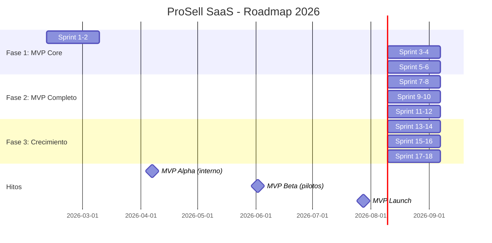
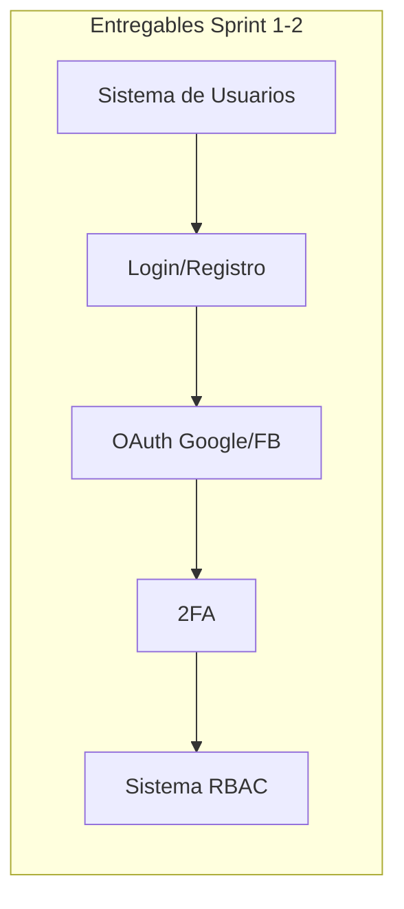
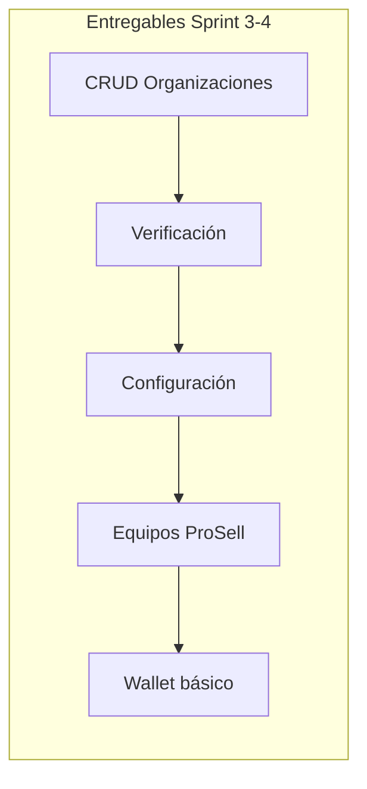
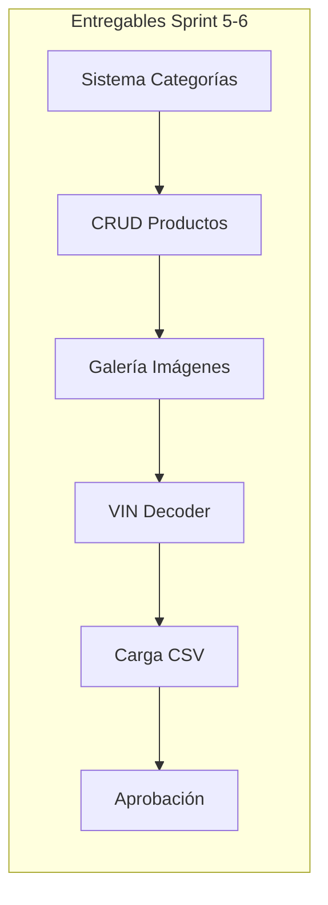

# 🗺️ ROADMAP DE DESARROLLO - PROSELL SAAS v2.0

**Proyecto**: ProSell SaaS
**Versión**: 2.0
**Fecha**: Febrero 2026
**Horizonte**: 6 meses (MVP + Crecimiento)

---

## 📊 VISIÓN GENERAL DEL TIMELINE



---

## 🎯 FASE 1: MVP CORE (12 semanas)

**Objetivo**: Construir la base del sistema
**Fecha**: Febrero - Abril 2026
**Inversión estimada**: $45,000

### Sprint 1-2: Autenticación & Usuarios (Semanas 1-4)

**Fechas**: Feb 10 - Mar 9, 2026



| Entregable | Prioridad | Estimación |
|------------|-----------|------------|
| Modelo de datos User/Role/Permission | P0 | 3 días |
| Registro + verificación email | P0 | 3 días |
| Login + refresh tokens | P0 | 2 días |
| OAuth2 (Google, Facebook) | P1 | 3 días |
| 2FA con TOTP | P1 | 2 días |
| Sistema RBAC completo | P0 | 5 días |
| Tests unitarios + E2E | P0 | 2 días |

**Criterios de éxito:**
- [ ] Usuario puede registrarse y verificar email
- [ ] Login funciona con email y OAuth
- [ ] 6 roles con permisos definidos
- [ ] 2FA funcional para admins
- [ ] Coverage > 80%

---

### Sprint 3-4: Gestión de Organizaciones (Semanas 5-8)

**Fechas**: Mar 10 - Abr 6, 2026



| Entregable | Prioridad | Estimación |
|------------|-----------|------------|
| CRUD Organizaciones completo | P0 | 4 días |
| Upload logo/banner (DO Spaces) | P0 | 2 días |
| Sistema de verificación | P0 | 2 días |
| Configuración por org | P1 | 2 días |
| CRUD Equipos ProSell | P0 | 3 días |
| Asignación Manager-Vendedores | P0 | 2 días |
| Wallet básico (balance) | P1 | 3 días |
| Tests | P0 | 2 días |

**Criterios de éxito:**
- [ ] CRUD completo de organizaciones
- [ ] Flujo de verificación funcional
- [ ] Equipos con manager y vendedores
- [ ] Wallet con balance básico

---

### Sprint 5-6: Gestión de Productos (Semanas 9-12)

**Fechas**: Abr 7 - May 4, 2026



| Entregable | Prioridad | Estimación |
|------------|-----------|------------|
| Sistema de categorías jerárquicas | P0 | 3 días |
| Campos dinámicos por categoría | P0 | 4 días |
| CRUD Productos genérico | P0 | 4 días |
| Galería de imágenes (hasta 20) | P0 | 3 días |
| Extensión Vehículos | P0 | 2 días |
| VIN Decoder (NHTSA) | P1 | 2 días |
| Carga masiva CSV | P1 | 3 días |
| Sistema de aprobación | P0 | 2 días |
| Tests | P0 | 2 días |

**Criterios de éxito:**
- [ ] Categorías con campos dinámicos
- [ ] CRUD productos con imágenes
- [ ] VIN decoder funcional
- [ ] Import CSV funcional
- [ ] Flujo de aprobación completo

---

## 🎯 FASE 2: MVP COMPLETO (12 semanas)

**Objetivo**: Funcionalidad completa para pilotos
**Fecha**: Mayo - Julio 2026
**Inversión estimada**: $45,000

### Sprint 7-8: Catálogo Público (Semanas 13-16)

**Fechas**: May 5 - Jun 1, 2026

| Entregable | Prioridad | Estimación |
|------------|-----------|------------|
| Landing page pública | P0 | 3 días |
| Listado de productos (grid/lista) | P0 | 4 días |
| Filtros y búsqueda | P0 | 4 días |
| Página de detalle | P0 | 3 días |
| Comparador (hasta 5) | P1 | 3 días |
| SEO básico | P1 | 2 días |
| Tests E2E | P0 | 2 días |

**Criterios de éxito:**
- [ ] Catálogo público funcional
- [ ] Búsqueda con filtros avanzados
- [ ] Detalle con análisis de precio
- [ ] Responsive en todos los dispositivos

---

### Sprint 9-10: Sistema de Ventas (Semanas 17-20)

**Fechas**: Jun 2 - Jun 29, 2026

| Entregable | Prioridad | Estimación |
|------------|-----------|------------|
| CRUD Citas | P0 | 3 días |
| Generación QR | P0 | 2 días |
| Estados de cita | P0 | 2 días |
| Registro de ventas | P0 | 3 días |
| Sistema de comisiones | P0 | 4 días |
| Dashboard vendedor | P0 | 3 días |
| Notificaciones email básicas | P0 | 2 días |
| Tests | P0 | 2 días |

**Criterios de éxito:**
- [ ] Flujo completo de citas
- [ ] Registro de ventas con comisiones
- [ ] Dashboard de vendedor con KPIs

---

### Sprint 11-12: Wallet & Tokens (Semanas 21-24)

**Fechas**: Jun 30 - Jul 27, 2026

| Entregable | Prioridad | Estimación |
|------------|-----------|------------|
| Integración Stripe | P0 | 4 días |
| Checkout de recarga | P0 | 2 días |
| Sistema de tokens | P0 | 4 días |
| Consumo de tokens | P0 | 3 días |
| Paquetes predefinidos | P1 | 2 días |
| Historial de transacciones | P0 | 2 días |
| Facturación básica | P1 | 2 días |
| Tests | P0 | 2 días |

**Criterios de éxito:**
- [ ] Recarga funcional con Stripe
- [ ] Tokens se consumen correctamente
- [ ] Historial completo de transacciones

---

## 🎯 FASE 3: CRECIMIENTO (12 semanas)

**Objetivo**: Funcionalidades avanzadas y escala
**Fecha**: Agosto - Octubre 2026
**Inversión estimada**: $60,000

### Sprint 13-14: Notificaciones Avanzadas (Semanas 25-28)

| Entregable | Prioridad | Estimación | Depende de |
|------------|-----------|------------|------------|
| WhatsApp Business API setup | P0 | 3 días | Meta approved |
| Plantillas de mensajes | P0 | 2 días | - |
| Messenger integration | P1 | 3 días | - |
| SMS (Twilio) | P2 | 2 días | - |
| Sistema de preferencias | P1 | 2 días | Sprint 1-2 |
| Recordatorios automáticos | P0 | 3 días | Sprint 9-10 |
| Notification queue worker | P0 | 3 días | - |
| Webhook handlers | P0 | 2 días | - |
| Tests | P0 | 2 días | - |

**Criterios de éxito:**
- [ ] WhatsApp messages envían exitosamente
- [ ] Recordatorios de citas funcionan
- [ ] Preferencias de usuario se respetan
- [ ] Queue workers manejan failover

**Riesgos:**
- Meta puede tardar en aprobar WhatsApp Business API
- Rate limits de WhatsApp (1000 mensajes/día iniciales)

---

### Sprint 15-16: Scraping & Análisis (Semanas 29-32)

| Entregable | Prioridad | Estimación | Depende de |
|------------|-----------|------------|------------|
| Scraper Facebook Marketplace | P0 | 5 días | Playwright setup |
| Anti-detección (proxies, delays) | P0 | 3 días | - |
| Pipeline de datos (ETL) | P0 | 3 días | - |
| Historial de precios | P0 | 2 días | Scraper |
| Scheduling automático | P0 | 2 días | Queue workers |
| Sincronización OpenSearch | P1 | 3 días | - |
| Price analyzer | P0 | 3 días | - |
| Tests | P0 | 2 días | - |

**Criterios de éxito:**
- [ ] Scraper extrae listings sin bloquearse
- [ ] Datos se procesan correctamente
- [ ] Historial de precios se actualiza
- [ ] Análisis de precios es funcional

**Riesgos:**
- Facebook/Meta puede bloquear scrapers
- Proxies residenciales costosos
- Estructura HTML puede cambiar sin aviso

---

### Sprint 17-18: Analytics & IA (Semanas 33-36)

| Entregable | Prioridad | Estimación | Depende de |
|------------|-----------|------------|------------|
| Dashboard Master | P0 | 4 días | Sprints anteriores |
| Dashboard Manager | P0 | 3 días | Sprint 3-4 |
| Dashboard Organización | P0 | 3 días | Sprint 3-4 |
| KPIs dinámicos | P0 | 3 días | Todos |
| Análisis de precios vs mercado | P0 | 3 días | Sprint 15-16 |
| Agente IA básico (chat) | P1 | 4 días | Claude API key |
| Integración Claude API | P1 | 2 días | - |
| Price predictor AI | P1 | 3 días | Sprint 15-16 |
| Tests | P0 | 2 días | - |

**Criterios de éxito:**
- [ ] Dashboards cargan < 3 segundos
- [ ] KPIs son precisos y actualizados
- [ ] Chat IA responde contextualmente
- [ ] Price predictor da sugerencias útiles

**Riesgos:**
- Claude API costs pueden escalarse rápidamente
- Dashboards complejos pueden ser lentos sin optimización

---

## 📅 MILESTONES

| Milestone | Fecha | Descripción |
|-----------|-------|-------------|
| **M1: Alpha** | Abr 7, 2026 | Backend core funcional |
| **M2: Beta Interna** | May 5, 2026 | Frontend MVP |
| **M3: Beta Pilotos** | Jun 2, 2026 | 5 orgs piloto |
| **M4: MVP Launch** | Jul 28, 2026 | Lanzamiento público |
| **M5: v1.0** | Oct 20, 2026 | Funcionalidad completa |

---

## 👥 EQUIPO REQUERIDO

### Fase 1-2 (MVP)

| Rol | Cantidad | Dedicación |
|-----|----------|------------|
| Backend Developer | 1 | 100% |
| Frontend Developer | 1 | 100% |
| Product Manager | 1 | 50% |
| QA | 1 | 50% |

### Fase 3 (Crecimiento)

| Rol | Cantidad | Dedicación |
|-----|----------|------------|
| Backend Developer | 2 | 100% |
| Frontend Developer | 1 | 100% |
| DevOps | 1 | 50% |
| Product Manager | 1 | 100% |
| QA | 1 | 100% |

---

## 💰 PRESUPUESTO ESTIMADO

| Fase | Desarrollo | Infraestructura | Marketing | Total |
|------|------------|-----------------|-----------|-------|
| Fase 1 | $30,000 | $1,500 | $0 | $31,500 |
| Fase 2 | $30,000 | $2,500 | $5,000 | $37,500 |
| Fase 3 | $45,000 | $5,000 | $15,000 | $65,000 |
| **Total** | **$105,000** | **$9,000** | **$20,000** | **$134,000** |

---

## 🎯 MÉTRICAS POR FASE

| Métrica | Fase 1 | Fase 2 | Fase 3 |
|---------|--------|--------|--------|
| Organizaciones | 0 | 5 pilot | 50 |
| Productos | 0 | 500 | 10,000 |
| Usuarios | 0 | 50 | 1,000 |
| Ingresos | $0 | $0 | $10,000 |

---

## ⚠️ DEPENDENCIAS CRÍTICAS

| Dependencia | Tipo | Lead Time | Due Date | Responsable |
|-------------|------|-----------|----------|-------------|
| **Meta Business Suite** | External | 14-30 días | Feb 24, 2026 | Tech Lead |
| **Stripe Account** | External | 3 días | Feb 17, 2026 | Tech Lead |
| **DigitalOcean Spaces** | External | 1 día | Feb 10, 2026 | DevOps |
| **Anthropic API Key** | External | 1 día | Ago 1, 2026 | Tech Lead |
| **Proxies residenciales** | External | 7 días | Ago 15, 2026 | DevOps |
| **Twilio SMS** | External | 3 días | Jul 15, 2026 | DevOps |

**Plan de Mitigación:**
- Iniciar trámites Meta Business INMEDIATAMENTE (Sprint 1)
- tener sandbox alternatives para todos los servicios externos
- Documentar proceso de onboarding para cada dependencia

---

## 🎨 HITOS Y VALIDACIONES

### Milestone M1: Alpha (Abr 7, 2026)

**Qué está listo:**
- ✅ Sistema completo de autenticación
- ✅ CRUD de organizaciones
- ✅ Sistema de productos básico
- ✅ Dashboard admin (mínimo viable)

**Criterios de éxito:**
```gherkin
Given el sistema está en estado Alpha
When un usuario se registra
Then puede crear una organización
And puede publicar productos
And el sistema es estable (sin crashes en 24h)
```

**Validaciones:**
- [ ] 5 usuarios internos usan el sistema por 1 semana
- [ ] 100 productos de prueba creados
- [ ] Performance: API < 500ms p95
- [ ] 0 bugs P0/P1

---

### Milestone M2: Beta Interna (May 5, 2026)

**Qué está listo:**
- ✅ Todo de Alpha +
- ✅ Catálogo público funcional
- ✅ Sistema de citas básico
- ✅ Sistema de comisiones

**Criterios de éxito:**
- [ ] Equipo interno (10 personas) usa sistema diariamente
- [ ] 20 organizaciones de prueba creadas
- [ ] 500 productos publicados
- [ ] 50 citas registradas
- [ ] Performance: API < 300ms p95

**Testing Plan:**
- Test suite completo ejecuta antes de cada deploy
- E2E tests cubren flujos críticos
- Load test: 100 usuarios concurrentes

---

### Milestone M3: Beta Pilotos (Jun 2, 2026)

**Qué está listo:**
- ✅ Todo de Beta Interna +
- ✅ Sistema de wallet funcional
- ✅ Notificaciones por email funcionando
- ✅ Landing page pública

**Criterios de éxito:**
- [ ] 5 organizaciones piloto reales
- [ ] 1000 productos publicados
- [ ] 200 citas registradas
- [ ] 10 ventas reales procesadas
- [ ] Uptime > 99%

**Onboarding Pilotos:**
- Llamada de entrenamiento (1h)
- Documentación de usuario
- Soporte directo (Slack/WhatsApp)
- Feedback semanal structured

---

### Milestone M4: MVP Launch (Jul 28, 2026)

**Qué está listo:**
- ✅ Todo MVP completo +
- ✅ Notificaciones WhatsApp funcionando
- [ ] Scraping Facebook Marketplace (beta)
- [ ] Dashboards de analytics

**Criterios de éxito:**
- [ ] 50 organizaciones activas
- [ ] 5,000 productos publicados
- [ ] 500 citas registradas
- [ ] 100 ventas procesadas
- [ ] $10,000 MRR
- [ ] Uptime > 99.5%

**Go-Live Checklist:**
- [ ] Production monitoring configurado
- [ ] Error tracking (Sentry) configurado
- [ ] Backups automatizados
- [ ] SSL certificates válidos
- [ ] CDN configurado
- [ ] Rate limiting activo
- [ ] DDoS protection activo
- [ ] Compliance checklist pasado

---

### Milestone M5: v1.0 (Oct 20, 2026)

**Qué está listo:**
- ✅ Todo MVP +
- [ ] Scraping multi-marketplace
- [ ] Agentes IA básicos
- [ ] Analytics avanzados
- [ ] Multi-idioma (español + inglés)

**Criterios de éxito:**
- [ ] 300 organizaciones objetivo
- [ ] 100,000 productos
- [ ] 50,000 MAU
- [ ] $100,000 MRR
- [ ] Churn < 5%
- [ ] Uptime > 99.9%

---

## 📊 PLAN DE MONITOREO Y MÉTRICAS

### Métricas de Desarrollo (Sprint over Sprint)

| Métrica | Sprint 1-2 | Sprint 3-4 | Sprint 5-6 | Objetivo |
|---------|------------|------------|------------|----------|
| **Velocity (SP)** | - | 20-25 | 25-30 | Estabilizar |
| **Sprint Burndown** | - | 90% | 95% | 100% |
| **Escape Rate** | < 20% | < 15% | < 10% | < 5% |
| **Bug Density** | - | < 10/KLOC | < 5/KLOC | < 2/KLOC |
| **Test Coverage** | - | > 70% | > 80% | > 90% |
| **Code Review Time** | < 48h | < 24h | < 12h | < 6h |
| **Build Success** | > 80% | > 90% | > 95% | > 98% |

### Dashboards de Proyecto

**Burndown Chart:**
- Actualizado diariamente
- Muestra trabajo restante vs ideal
- Alerta si trend line no converge a 0

**Velocity Chart:**
- Actualizado cada sprint
- Muestra story points completados
- Usado para predecir entregas futuras

**Cumulative Flow Diagram:**
- Muestra estado de cada user story
- Identifica cuellos de botella
- Ideal: flujo constante hacia "Done"

**Sprint Burnup Chart:**
- Muestra trabajo completado vs scope total
- Visualiza scope changes
- Alerta si scope crece descontrolado

---

## 🚨 PLAN DE CONTINGENCIA

### Escenario A: Sprint no se completa

**Trigger:** Menos del 80% de P0 completado a 3 días del fin de sprint

**Acciones:**
1. Emergency planning meeting (Día 1)
2. Re-priorizar remaining P0 → MUST have
3. Delegar P1 → siguiente sprint
4. Overtime controlado (máx 2 horas extra/día)
5. Comunicar a stakeholders delay esperado (1 semana)

---

### Escenario B: Dependencia externa se bloquea

**Trigger:** Meta/Stripe/etc. rechaza aplicación o demora > 30 días

**Acciones:**
1. **Meta WhatsApp blocked:**
   - Fallback: Email notifications
   - Use Twilio SMS alternativo
   - Queue mensajes para envío futuro

2. **Stripe blocked:**
   - Fallback: Zelle manual (ya planificado)
   - Integración PayPal Backup
   - Wire transfer manual

3. **NHTSA API down:**
   - No es crítico (solo VIN decoder)
   - Usar cache de datos ya decodificados
   - Permitir entrada manual de datos

---

### Escenario C: Performance no cumple objetivos

**Trigger:** API p95 > 500ms por 3 días consecutivos

**Acciones:**
1. **Día 1:** Profiling para identificar bottleneck
2. **Día 2-3:** Implementar quick wins
   - Agregar índices faltantes
   - Habilitar Redis cache
   - Optimizar N+1 queries
3. **Día 4-5:** Si no mejora, escalar
   - Database read replicas
   - CDN para assets estáticos
   - Horizontal scaling de API servers

---

### Escenario D: Burn rate alto y runway bajo

**Trigger:** Runway < 4 meses sin nuevo funding

**Acciones:**
1. Reducir scope a MUST-have features
2. Fase 3 (Scraping/IA) → post-MVP
3. Enfocar en revenue-generating features
4. Acelerar Timeline a Launch
5. Buscar funding mientras se construye

---

## 🎯 DEFINITION OF READY (DoR)

Antes de que una User Story entre al sprint:

```gherkin
Scenario: User Story está Ready
  Given una user story propuesta
  WHEN se evalúa para el sprint
  THEN debe cumplir:

  [ ] Título descriptivo (user story format)
  [ ] Criterios de aceptación claros
  [ ] Estimación de complejidad (S/M/L/XL)
  [ ] Dependencias identificadas
  [ ] Diseño UI/UX (si aplica)
  [ ] Casos de edge case considerados
  [ ] Tests requeridos definidos

  AND NO puede entrar al sprint si:
  [ ] Dependencias no están resueltas
  [ ] Diseño está pendiente
  [ ] Estimación es XL sin desglose
  [ ] Requiere investigación significativa
```

---

## 📚 RECURSOS Y REFERENCIAS

### Documentación de Stack

| Documentación | URL | Prioridad |
|---------------|-----|-----------|
| FastAPI | https://fastapi.tiangolo.com/ | P0 |
| SQLAlchemy 2.0 | https://docs.sqlalchemy.org/en/20/ | P0 |
| Next.js 16 | https://nextjs.org/docs | P0 |
| React 19 | https://react.dev/ | P0 |
| TailwindCSS 4 | https://tailwindcss.com/docs | P0 |
| Pydantic | https://docs.pydantic.dev/ | P0 |
| Anthropic Claude | https://docs.anthropic.com/ | P1 |
| Stripe API | https://stripe.com/docs/api | P0 |
| PostgreSQL 17 | https://www.postgresql.org/docs/17/ | P0 |
| Redis | https://redis.io/docs/ | P0 |

### Herramientas de Desarrollo

| Herramienta | Uso | Licencia |
|-------------|-----|----------|
| **IDE** | | |
| PyCharm / VS Code | Python/TS development | Commercial / Free |
| **API Testing** | | |
| Postman | API testing | Free |
| Bruno | API testing (open source) | Free |
| **Database** | | |
| TablePlus / DBeaver | Database GUI | Freemium |
| pgAdmin | PostgreSQL management | Free |
| **Monitoring** | | |
| Sentry | Error tracking | Freemium |
| Grafana | Dashboards | Open Source |
| Prometheus | Metrics | Open Source |
| **Design** | | |
| Figma | UI/UX design | Freemium |
| Excalidraw | Diagramas | Free |

---

## 🏁 CIERRE DEL ROADMAP

### Checklist de Finalización de Proyecto

**Técnico:**
- [ ] Todos los sprints completados según DoD
- [ ] Coverage de tests > 90%
- [ ] 0 bugs P0/P1 en producción
- [ ] Performance benchmarks cumplidos
- [ ] Security audit pasado
- [ ] Disaster recovery probado

**Negocio:**
- [ ] 300 organizaciones activas
- [ ] $100,000 MRR
- [ ] Churn < 5%
- [ ] NPS > 50

**Organizacional:**
- [ ] Equipo estable y capacitado
- [ ] Procesos documentados
- [ ] Onboarding de nuevos devs < 1 semana
- [ ] Documentación técnica completa

---

**Documentos relacionados:**
- [Arquitectura del Sistema](./01_ARQUITECTURA_PROSELL_SAAS_V2.md)
- [Requisitos PRD](./02_REQUISITOS_PRD_PROSELL_SAAS_V2.md)
- [Lista de Tareas](./05_TAREAS_SPRINT_PROSELL_SAAS_V2.md)
