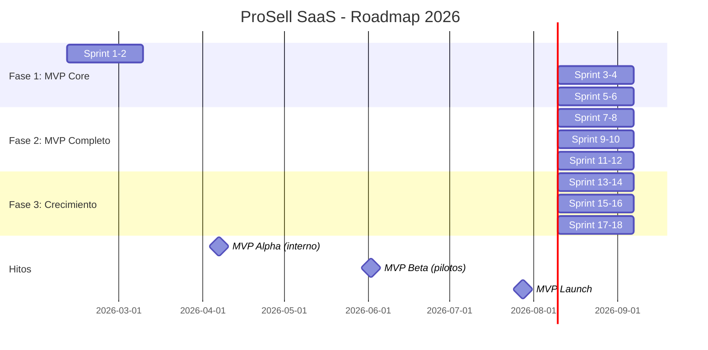
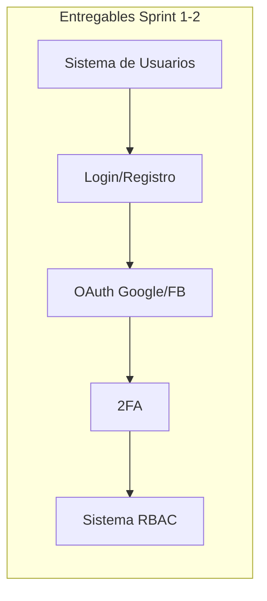
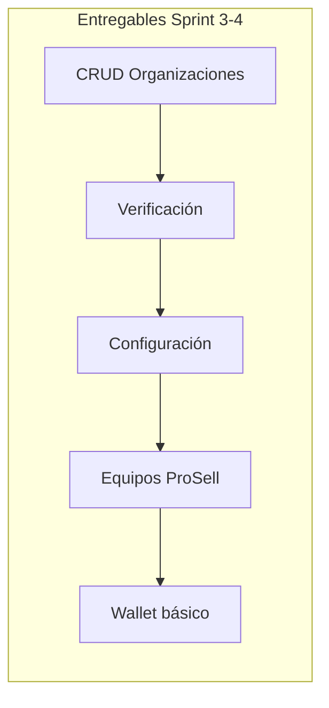
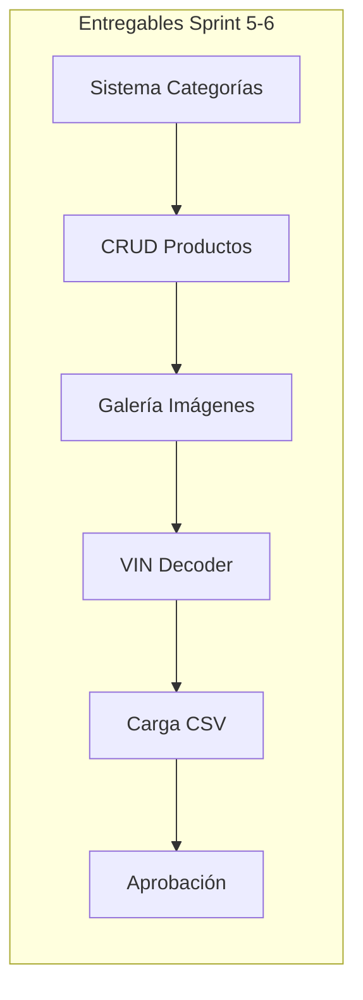
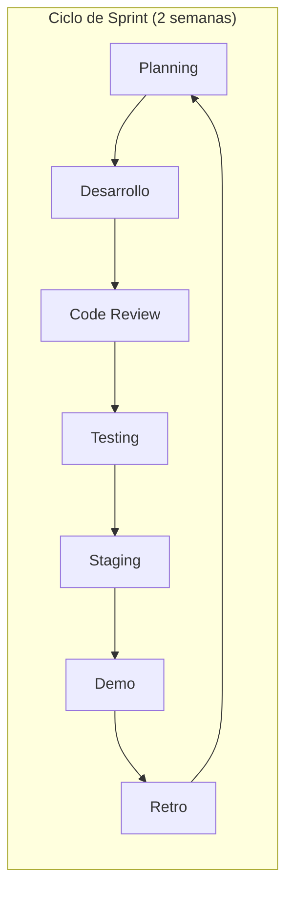

# 🗺️ ROADMAP DE DESARROLLO - PROSELL SAAS v2.0

**Proyecto**: ProSell SaaS
**Versión**: 2.0
**Fecha**: Febrero 2026
**Horizonte**: 6 meses (MVP + Crecimiento)

---

## 📊 VISIÓN GENERAL DEL TIMELINE

---

## 🎯 FASE 1: MVP CORE (12 semanas)

**Objetivo**: Construir la base del sistema
**Fecha**: Febrero - Abril 2026
**Inversión estimada**: $45,000

### Sprint 1-2: Autenticación & Usuarios (Semanas 1-4)

**Fechas**: Feb 10 - Mar 9, 2026

| Entregable | Prioridad | Estimación |
|------------|-----------|------------|
| Modelo de datos User/Role/Permission | P0 | 3 días |
| Registro + verificación email | P0 | 3 días |
| Login + refresh tokens | P0 | 2 días |
| OAuth2 (Google, Facebook) | P1 | 3 días |
| 2FA con TOTP | P1 | 2 días |
| Sistema RBAC completo | P0 | 5 días |
| Tests unitarios + E2E | P0 | 2 días |

**Criterios de éxito:**
- [ ] Usuario puede registrarse y verificar email
- [ ] Login funciona con email y OAuth
- [ ] 6 roles con permisos definidos
- [ ] 2FA funcional para admins
- [ ] Coverage > 80%

---

### Sprint 3-4: Gestión de Organizaciones (Semanas 5-8)

**Fechas**: Mar 10 - Abr 6, 2026

| Entregable | Prioridad | Estimación |
|------------|-----------|------------|
| CRUD Organizaciones completo | P0 | 4 días |
| Upload logo/banner (DO Spaces) | P0 | 2 días |
| Sistema de verificación | P0 | 2 días |
| Configuración por org | P1 | 2 días |
| CRUD Equipos ProSell | P0 | 3 días |
| Asignación Manager-Vendedores | P0 | 2 días |
| Wallet básico (balance) | P1 | 3 días |
| Tests | P0 | 2 días |

**Criterios de éxito:**
- [ ] CRUD completo de organizaciones
- [ ] Flujo de verificación funcional
- [ ] Equipos con manager y vendedores
- [ ] Wallet con balance básico

---

### Sprint 5-6: Gestión de Productos (Semanas 9-12)

**Fechas**: Abr 7 - May 4, 2026

| Entregable | Prioridad | Estimación |
|------------|-----------|------------|
| Sistema de categorías jerárquicas | P0 | 3 días |
| Campos dinámicos por categoría | P0 | 4 días |
| CRUD Productos genérico | P0 | 4 días |
| Galería de imágenes (hasta 20) | P0 | 3 días |
| Extensión Vehículos | P0 | 2 días |
| VIN Decoder (NHTSA) | P1 | 2 días |
| Carga masiva CSV | P1 | 3 días |
| Sistema de aprobación | P0 | 2 días |
| Tests | P0 | 2 días |

**Criterios de éxito:**
- [ ] Categorías con campos dinámicos
- [ ] CRUD productos con imágenes
- [ ] VIN decoder funcional
- [ ] Import CSV funcional
- [ ] Flujo de aprobación completo

---

## 🎯 FASE 2: MVP COMPLETO (12 semanas)

**Objetivo**: Funcionalidad completa para pilotos
**Fecha**: Mayo - Julio 2026
**Inversión estimada**: $45,000

### Sprint 7-8: Catálogo Público (Semanas 13-16)

**Fechas**: May 5 - Jun 1, 2026

| Entregable | Prioridad | Estimación |
|------------|-----------|------------|
| Landing page pública | P0 | 3 días |
| Listado de productos (grid/lista) | P0 | 4 días |
| Filtros y búsqueda | P0 | 4 días |
| Página de detalle | P0 | 3 días |
| Comparador (hasta 5) | P1 | 3 días |
| SEO básico | P1 | 2 días |
| Tests E2E | P0 | 2 días |

**Criterios de éxito:**
- [ ] Catálogo público funcional
- [ ] Búsqueda con filtros avanzados
- [ ] Detalle con análisis de precio
- [ ] Responsive en todos los dispositivos

---

### Sprint 9-10: Sistema de Ventas (Semanas 17-20)

**Fechas**: Jun 2 - Jun 29, 2026

| Entregable | Prioridad | Estimación |
|------------|-----------|------------|
| CRUD Citas | P0 | 3 días |
| Generación QR | P0 | 2 días |
| Estados de cita | P0 | 2 días |
| Registro de ventas | P0 | 3 días |
| Sistema de comisiones | P0 | 4 días |
| Dashboard vendedor | P0 | 3 días |
| Notificaciones email básicas | P0 | 2 días |
| Tests | P0 | 2 días |

**Criterios de éxito:**
- [ ] Flujo completo de citas
- [ ] Registro de ventas con comisiones
- [ ] Dashboard de vendedor con KPIs

---

### Sprint 11-12: Wallet & Tokens (Semanas 21-24)

**Fechas**: Jun 30 - Jul 27, 2026

| Entregable | Prioridad | Estimación |
|------------|-----------|------------|
| Integración Stripe | P0 | 4 días |
| Checkout de recarga | P0 | 2 días |
| Sistema de tokens | P0 | 4 días |
| Consumo de tokens | P0 | 3 días |
| Paquetes predefinidos | P1 | 2 días |
| Historial de transacciones | P0 | 2 días |
| Facturación básica | P1 | 2 días |
| Tests | P0 | 2 días |

**Criterios de éxito:**
- [ ] Recarga funcional con Stripe
- [ ] Tokens se consumen correctamente
- [ ] Historial completo de transacciones

---

## 🎯 FASE 3: CRECIMIENTO (12 semanas)

**Objetivo**: Funcionalidades avanzadas y escala
**Fecha**: Agosto - Octubre 2026
**Inversión estimada**: $60,000

### Sprint 13-14: Notificaciones Avanzadas (Semanas 25-28)

| Entregable | Prioridad | Estimación |
|------------|-----------|------------|
| WhatsApp Business API | P0 | 5 días |
| Plantillas de mensajes | P0 | 2 días |
| Messenger integration | P1 | 3 días |
| SMS (Twilio) | P2 | 2 días |
| Sistema de preferencias | P1 | 2 días |
| Recordatorios automáticos | P0 | 3 días |
| Tests | P0 | 2 días |

---

### Sprint 15-16: Scraping & Análisis (Semanas 29-32)

| Entregable | Prioridad | Estimación |
|------------|-----------|------------|
| Scraper Facebook Marketplace | P0 | 5 días |
| Anti-detección (proxies, delays) | P0 | 3 días |
| Pipeline de datos | P0 | 3 días |
| Historial de precios | P0 | 2 días |
| Scheduling automático | P0 | 2 días |
| Sincronización OpenSearch | P1 | 3 días |
| Tests | P0 | 2 días |

---

### Sprint 17-18: Analytics & IA (Semanas 33-36)

| Entregable | Prioridad | Estimación |
|------------|-----------|------------|
| Dashboard Master/Manager | P0 | 4 días |
| Dashboard Organización | P0 | 3 días |
| KPIs dinámicos | P0 | 3 días |
| Análisis de precios | P0 | 3 días |
| Agente IA básico | P1 | 4 días |
| Integración Claude API | P1 | 2 días |
| Tests | P0 | 2 días |

---

## 📅 MILESTONES

| Milestone | Fecha | Descripción |
|-----------|-------|-------------|
| **M1: Alpha** | Abr 7, 2026 | Backend core funcional |
| **M2: Beta Interna** | May 5, 2026 | Frontend MVP |
| **M3: Beta Pilotos** | Jun 2, 2026 | 5 orgs piloto |
| **M4: MVP Launch** | Jul 28, 2026 | Lanzamiento público |
| **M5: v1.0** | Oct 20, 2026 | Funcionalidad completa |

---

## 👥 EQUIPO REQUERIDO

### Fase 1-2 (MVP)

| Rol | Cantidad | Dedicación |
|-----|----------|------------|
| Backend Developer | 1 | 100% |
| Frontend Developer | 1 | 100% |
| Product Manager | 1 | 50% |
| QA | 1 | 50% |

### Fase 3 (Crecimiento)

| Rol | Cantidad | Dedicación |
|-----|----------|------------|
| Backend Developer | 2 | 100% |
| Frontend Developer | 1 | 100% |
| DevOps | 1 | 50% |
| Product Manager | 1 | 100% |
| QA | 1 | 100% |

---

## 💰 PRESUPUESTO ESTIMADO

| Fase | Desarrollo | Infraestructura | Marketing | Total |
|------|------------|-----------------|-----------|-------|
| Fase 1 | $30,000 | $1,500 | $0 | $31,500 |
| Fase 2 | $30,000 | $2,500 | $5,000 | $37,500 |
| Fase 3 | $45,000 | $5,000 | $15,000 | $65,000 |
| **Total** | **$105,000** | **$9,000** | **$20,000** | **$134,000** |

---

## 🎯 MÉTRICAS POR FASE

| Métrica | Fase 1 | Fase 2 | Fase 3 |
|---------|--------|--------|--------|
| Organizaciones | 0 | 5 pilot | 50 |
| Productos | 0 | 500 | 10,000 |
| Usuarios | 0 | 50 | 1,000 |
| Ingresos | $0 | $0 | $10,000 |

---

## ⚠️ DEPENDENCIAS CRÍTICAS

1. **Meta Business Suite** - Cuenta verificada para WhatsApp/Messenger
2. **Stripe** - Cuenta activa con webhooks
3. **DigitalOcean** - Infraestructura configurada
4. **NHTSA API** - Sin dependencia (pública)
5. **Anthropic** - API key activa

---

## 🔄 PROCESO DE DESARROLLO

**Ceremonias:**
- Sprint Planning: Lunes semana 1
- Daily Standup: Diario 15 min
- Sprint Review: Viernes semana 2
- Retrospectiva: Viernes semana 2

---

**Documentos relacionados:**
- [Arquitectura del Sistema](./01_ARQUITECTURA_PROSELL_SAAS_V2.md)
- [Requisitos PRD](./02_REQUISITOS_PRD_PROSELL_SAAS_V2.md)
- [Lista de Tareas](./05_TAREAS_SPRINT_PROSELL_SAAS_V2.md)
