# Modelo Entidad-Relación - ProSell SaaS

**Fecha**: 2026-03-05
**Versión**: 1.0
**Estado**: Sprint 5-6 completado

---

## 1. Diagrama ER (Mermaid)

```mermaid
erDiagram
    %% ==================== AUTH & IDENTITY ====================
    User ||--o{ Session : "has active sessions"
    User ||--o{ Role : "assigned to"
    User ||--o{ TeamMember : "member of"
    User }o--|| Organization : "belongs to (tenant)"

    Session }o--|| User : "belongs to"

    %% ==================== ORGANIZATION STRUCTURE ====================
    Organization ||--o| Team : "contains"
    Organization ||--o| Wallet : "has"

    Team ||--o{ TeamMember : "has members"
    Team }o--|| Organization : "belongs to"
    Team ||--o| Team : "parent (hierarchy)"

    TeamMember }o--|| Team : "belongs to"
    TeamMember }o--|| User : "user"

    %% ==================== PRODUCT CATALOG ====================
    Category ||--o{ Category : "parent (hierarchy)"
    Category ||--o{ Product : "categorizes"

    Organization ||--o{ Product : "owns"
    Product }o--|| Category : "belongs to"
    Product ||--o{ ProductImage : "has images"
    Product ||--o| Vehicle : "extends"

    Vehicle }o--|| Product : "extends"
    ProductImage }o--|| Product : "belongs to"

    %% ==================== WALLET ====================
    Wallet }o--|| Organization : "belongs to"
    Wallet ||--o{ WalletTransaction : "records"

    WalletTransaction }o--|| Wallet : "belongs to"

    %% ==================== ENTITY DEFINITIONS ====================
    User {
        UUID id PK
        string email UK
        string full_name
        string password_hash
        string avatar_url
        UserStatus status
        bool email_verified
        bool is_2fa_enabled
        string totp_secret
        list backup_codes
        datetime last_login_at
        string last_login_ip
        int failed_login_attempts
        datetime locked_until
        UUID tenant_id FK
        datetime created_at
        datetime updated_at
    }

    Session {
        UUID id PK
        UUID user_id FK
        string token_hash
        datetime expires_at
        string user_agent
        string ip_address
        datetime revoked_at
        datetime created_at
    }

    Role {
        UUID id PK
        RoleType role_type
        string name
        string description
        bool is_system_role
        UUID tenant_id FK
        datetime created_at
        datetime updated_at
    }

    Organization {
        UUID id PK
        string name
        UUID tenant_id FK
        string logo_url
        string banner_url
        string description
        string website
        string phone
        OrganizationStatus status
        datetime verified_at
        UUID verified_by FK
        UUID wallet_id FK
        json settings
        datetime created_at
        datetime updated_at
    }

    Team {
        UUID id PK
        string name
        UUID tenant_id FK
        UUID org_id FK
        string description
        UUID parent_team_id FK
        datetime created_at
        datetime updated_at
    }

    TeamMember {
        UUID id PK
        UUID team_id FK
        UUID user_id FK
        TeamMemberRole role
        UUID tenant_id FK
        float commission_rate
        datetime joined_at
        datetime updated_at
    }

    Wallet {
        UUID id PK
        UUID org_id FK
        UUID tenant_id FK
        int balance_cents
        string currency
        bool is_active
        datetime created_at
        datetime updated_at
    }

    WalletTransaction {
        UUID id PK
        UUID wallet_id FK
        TransactionType transaction_type
        int amount_cents
        int balance_after_cents
        string description
        UUID tenant_id FK
        json metadata
        datetime created_at
    }

    Category {
        UUID id PK
        UUID tenant_id FK
        string name
        string slug UK
        UUID parent_id FK
        int level
        string icon
        string description
        string image_url
        int sort_order
        bool is_active
        json field_config
        datetime created_at
        datetime updated_at
    }

    Product {
        UUID id PK
        UUID tenant_id FK
        UUID organization_id FK
        UUID category_id FK
        string title
        string slug
        string description
        int price_cents
        string currency
        ProductCondition condition
        ProductStatus status
        json attributes
        string location_city
        string location_state
        string location_zip
        bool is_featured
        int view_count
        int favorite_count
        datetime submitted_for_approval_at
        UUID submitted_by FK
        datetime approved_at
        UUID approved_by FK
        string rejection_reason
        datetime published_at
        datetime sold_at
        datetime archived_at
        datetime created_at
        datetime updated_at
    }

    ProductImage {
        UUID id PK
        UUID product_id FK
        string url
        string thumbnail_url
        int sort_order
        bool is_primary
        string alt_text
        int width
        int height
        int file_size_bytes
        string storage_key
        string content_type
        datetime created_at
        datetime updated_at
    }

    Vehicle {
        UUID id PK
        UUID product_id FK
        string vin UK
        int year
        string make
        string model
        string trim
        string body_type
        string body_style
        string drivetrain
        string transmission
        string engine
        string fuel_type
        int mpg_city
        int mpg_highway
        int mpg_combined
        int mileage
        string mileage_unit
        string exterior_color
        string interior_color
        bool has_sunroof
        bool has_navigation
        bool has_leather
        bool has_backup_camera
        bool has_bluetooth
        bool has_remote_start
        string seat_material
        json vin_decoded_data
        datetime vin_decoded_at
        string stock_number
        bool vin_verified
        datetime created_at
        datetime updated_at
    }
```



---

## 2. Descripción de Entidades

### 2.1. Auth & Identity

#### User

Entidad principal de usuarios del sistema. Soporta:

- Registro con email/password
- OAuth (Google) - sin password
- 2FA con TOTP
- Bloqueo por intentos fallidos
- Multi-tenant (tenant_id)

**Campos clave**:

- `id`: UUID único
- `email`: Email único (UK)
- `password_hash`: NULL para usuarios OAuth
- `status`: PENDING_VERIFICATION, ACTIVE, SUSPENDED
- `tenant_id`: Organización a la que pertenece (opcional)

#### Session

Sesiones activas de usuario para refresh tokens.

- Token hash almacenado para validar refresh tokens
- Expiración configurable (default 7 días)
- Revocación para logout

#### Role

Roles RBAC con permisos predefinidos.
**Sistema**: SUPER_ADMIN, ADMIN, MANAGER, SALES_AGENT, SALES_USER, VIEWER
**Custom**: Roles por organización (tenant_id)

### 2.2. Organization Structure

#### Organization

Organización (dealership) con multi-tenancy.

- `id == tenant_id` (auto-referencial para aislamiento)
- `status`: PENDING_VERIFICATION, ACTIVE, REJECTED, SUSPENDED
- `wallet_id`: Billetera de tokens

#### Team

Equipos de ventas dentro de una organización.

- Estructura jerárquica (parent_team_id)
- Puede tener managers y vendors

#### TeamMember

Miembros de un equipo con rol y comisión.

- `role`: MANAGER, VENDOR
- `commission_rate`: Porcentaje de comisión (0-100)

### 2.3. Wallet & Payments

#### Wallet

Billetera de tokens para prepago de servicios.

- `balance_cents`: Balance en centavos (evita floating point)
- Moneda USD (1 token = $1)

#### WalletTransaction

Historial de transacciones de la billetera.

- `transaction_type`: CREDIT (recarga), DEBIT (gasto)
- `balance_after_cents`: Balance post-transacción

### 2.4. Product Catalog

#### Category

Categorías jerárquicas de productos.

- `parent_id`: Categoría padre (NULL = root)
- `level`: Nivel de anidamiento (0 = root)
- `field_config`: Campos dinámicos para productos de esta categoría

**Ejemplo de jerarquía**:

```
Vehicles (level 0)
├── Cars (level 1)
│   ├── SUV (level 2)
│   └── Sedan (level 2)
└── Motorcycles (level 1)
```

#### Product

Producto genérico con workflow de aprobación.

- `status`: DRAFT → PENDING → PUBLISHED → SOLD/ARCHIVED
- `attributes`: Campos dinámicos según categoría
- `organization_id`: Dueño del producto
- `category_id`: Categoría

**Workflow de aprobación**:

```
DRAFT → (submit_for_approval) → PENDING → (approve) → PUBLISHED
                                      ↓ (reject)
                                    REJECTED → (submit) → PENDING
```

**Estados posibles**:

- `DRAFT`: Borrador editable
- `PENDING`: Esperando aprobación
- `PUBLISHED`: Publicado y visible
- `PAUSED`: Temporalmente oculto
- `RESERVED`: Reservado para comprador
- `SOLD`: Vendido
- `ARCHIVED`: Archivado (soft delete)

#### ProductImage

Imágenes de un producto con ordenamiento.

- `sort_order`: Orden de visualización
- `is_primary`: Imagen principal (solo una por producto)
- `thumbnail_url`: Miniatura optimizada

#### Vehicle

Extensión de Product para vehículos con VIN.

- `product_id`: Referencia al Product base
- `vin`: Número de identificación (17 caracteres, validado con checksum ISO 3779)
- Datos técnicos: year, make, model, trim, body_type, drivetrain, etc.
- `vin_decoded_data`: Cache de decode de NHTSA VPIC API
- `vin_verified`: Verificado contra base de datos

**Validación de VIN**:

- 17 caracteres alfanuméricos
- Sin I, O, Q (caracteres inválidos)
- Checksum ISO 3779

---

## 3. Enumeraciones

### UserStatus

```python
PENDING_VERIFICATION = "pending_verification"  # Nuevo usuario, debe verificar email
ACTIVE = "active"                              # Puede hacer login
SUSPENDED = "suspended"                        # Cuenta suspendida
```

### RoleType

```python
SUPER_ADMIN = "super_admin"   # Full acceso
ADMIN = "admin"                # Admin de organización
MANAGER = "manager"            # Manager de equipo
SALES_AGENT = "sales_agent"    # Agente de ventas
SALES_USER = "sales_user"      # Usuario de ventas (read-only)
VIEWER = "viewer"              # Solo lectura
```

### Permission

```python
# User management
USER_CREATE, USER_READ, USER_UPDATE, USER_DELETE
# Role management
ROLE_CREATE, ROLE_READ, ROLE_UPDATE, ROLE_DELETE
# Organization management
ORG_CREATE, ORG_READ, ORG_UPDATE, ORG_DELETE
# Vehicle listings
VEHICLE_CREATE, VEHICLE_READ, VEHICLE_UPDATE, VEHICLE_DELETE
# Analytics
ANALYTICS_VIEW, ANALYTICS_EXPORT
# Settings
SETTINGS_READ, SETTINGS_UPDATE
```

### OrganizationStatus

```python
PENDING_VERIFICATION = "pending_verification"  # Esperando verificación
ACTIVE = "active"                              # Verificada y activa
REJECTED = "rejected"                          # Rechazada
SUSPENDED = "suspended"                        # Suspendida temporalmente
```

### TeamMemberRole

```python
MANAGER = "manager"   # Gestiona equipo, gana comisión de vendors
VENDOR = "vendor"     # Vendedor directo
```

### TransactionType

```python
CREDIT = "credit"  # Agregar tokens (recarga, bonus)
DEBIT = "debit"    # Gastar tokens (listing fee, etc.)
```

### ProductCondition

```python
NEW = "new"
USED = "used"
CERTIFIED = "certified"
REFURBISHED = "refurbished"
SALVAGE = "salvage"
```

### ProductStatus

```python
DRAFT = "draft"              # Borrador editable
PENDING = "pending"          # Esperando aprobación
PUBLISHED = "published"      # Publicado
PAUSED = "paused"            # Pausado temporalmente
RESERVED = "reserved"        # Reservado
SOLD = "sold"                # Vendido
ARCHIVED = "archived"        # Archivado
REJECTED = "rejected"        # Rechazado (vuelve a draft)
```

---

## 4. Relaciones Clave

### 4.1. Multi-Tenancy

Todas las entidades tienen `tenant_id` para aislamiento por organización.

- **Organization**: `tenant_id == id` (self-referencial)
- **User**: `tenant_id` opcional (usuario sin organización)
- **Product, Category, Team, etc.**: `tenant_id` obligatorio

### 4.2. User ↔ Organization

- **User.organization_id**: FK a Organization
- **Un usuario puede pertenecer a una organización**
- **Usuarios OAuth pueden no tener organización**

### 4.3. Product ↔ Vehicle

- **Vehicle.product_id**: FK a Product
- **Vehicle extiende a Product** (herencia de tabla)
- **Un Product tiene 0 o 1 Vehicle**

### 4.4. Category Hierarchy

- **Category.parent_id**: FK a Category (self-reference)
- **Prevent circular references** en dominio

### 4.5. Team Hierarchy

- **Team.parent_team_id**: FK a Team (self-reference)
- **Estructura multi-level para equipos grandes**

### 4.6. Product Approval

- **Product.submitted_by**: User que envió a aprobación
- **Product.approved_by**: User que aprobó/rechazó

---

## 5. Índices Únicos (UK)

| Entidad  | Campo(s)             |
| -------- | -------------------- |
| User     | email                |
| Category | slug (por tenant_id) |
| Vehicle  | vin                  |
| Session  | token_hash           |

---

## 6. Estadísticas del Modelo

| Métrica       | Valor |
| ------------- | ----- |
| Entidades     | 13    |
| Enumeraciones | 7     |
| Relaciones    | 20+   |
| Tablas en DB  | 13    |

---

## 7. Pendientes (Sprint 4)

Entidades no implementadas aún:

### Marketplace & Listings

- **MarketplaceListing**: Publicación en Facebook Marketplace
- **ListingStatus**: ACTIVE, EXPIRED, SOLD, DELETED
- **ExternalListing**: Listado en plataformas externas (CarGurus, AutoTrader)

### Scraping

- **ScrapedVehicle**: Vehículo scrapeado de marketplace
- **ScrapeSource**: Fuente de scrape (FB, CG, AT)
- **ScrapeQueue**: Cola de URLs para scrape

### Analytics

- **ViewAnalytics**: Métricas de vista de productos
- **MarketPricing**: Datos de precios del mercado
- **PriceRecommendation**: Recomendación de precio por IA

### Notifications

- **Notification**: Notificaciones push/email
- **NotificationPreference**: Preferencias de usuario

---

## 8. Notas de Implementación

### 8.1. SQLAlchemy 2.0

- Usa `Mapped[]`, `mapped_column` (no más Column)
- `select()` en lugar de `query()`
- Async con `async_sessionmaker`

### 8.2. Pydantic 2.12+

- Todas las entidades extienden `DomainModel`
- Validadores con `@field_validator`
- Factory methods: `create()`, `create_oauth()`

### 8.3. Domain-Driven Design

- **Domain Layer**: Sin dependencias externas
- **Pure Python entities**: Lógica de negocio en entidades
- **Value Objects**: ProductCondition, ProductStatus, etc.
- **Aggregates**: Organization + Wallet + Teams, Product + Vehicle + Images

---

**Documento generado**: 2026-03-05
**Próxima actualización**: Post-Sprint 4 (Marketplace + Scraping)
