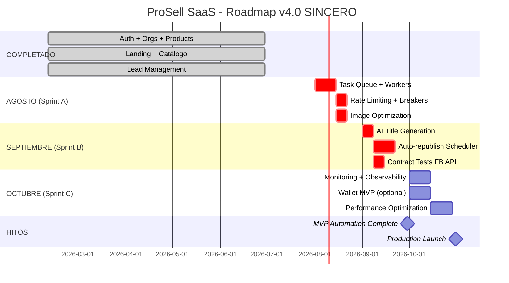

# 🗺️ ROADMAP v4.0 SINCERO - ProSell SaaS

**Fecha**: 21 Julio 2026
**Basado en**: Auditoría de Estado Real 2026-07-21
**Horizonte**: 3 meses (Ago - Oct 2026)
**Estrategia**: **Automation-First → Monetization → Scale**

---

## 📊 ESTADO ACTUAL (Julio 2026)

### ✅ **LO QUE YA TENEMOS** (Adelantado vs roadmap v3.0)

| Feature                           | Estado  | Calidad             |
| --------------------------------- | ------- | ------------------- |
| Landing Page completa             | ✅ DONE | 🟢 Production-ready |
| Catálogo Público                  | ✅ DONE | 🟢 Functional       |
| Auth multi-tenant + OAuth + 2FA   | ✅ DONE | 🟢 Production-ready |
| Gestión de Productos + Categories | ✅ DONE | 🟢 Production-ready |
| Bulk Upload CSV                   | ✅ DONE | 🟢 Functional       |
| VIN Decoder (NHTSA)               | ✅ DONE | 🟢 Functional       |
| Category Auto-Inference (IA)      | ✅ DONE | 🟢 Functional       |
| Dashboard básico                  | ✅ DONE | 🟡 Functional       |
| Lead Management                   | ✅ DONE | 🟢 Functional       |
| Appointments                      | ✅ DONE | 🟢 Functional       |
| Notifications                     | ✅ DONE | 🟢 Functional       |
| **Testing (716 tests)**           | ✅ DONE | 🟢 Excellent (>90%) |
| **CI/CD Pipeline**                | ✅ DONE | 🟢 Robust           |

**Health Score: 87/100** → **92/100** (post-audit adjustment)

---

## 🎯 FOCO CRÍTICO (Ago - Oct 2026)

### 🔴 **SPRINT ACTUAL: Facebook Marketplace Automation**

**Problema**: Base implementada pero **falta el 70% de la automation**

**Gap Analysis**:

- ✅ OAuth + Graph API client base → 30% done
- ❌ Task Queue + Workers → 0% done
- ❌ AI title/description generation → 0% done
- ❌ Auto-republish scheduler → 0% done
- ❌ Rate limiting + circuit breakers → 0% done
- ❌ Image optimization pipeline → 0% done

**Impacto si no se hace**: Muerte por éxito manual (ver roadmap v3.0 análisis)

---

## 📅 ROADMAP SINCERO (3 MESES)



---

## 🚀 SPRINT A: TASK QUEUE & FOUNDATION (Ago 1-21)

**Objetivo**: Desbloquear automation asíncrona

### Semana 1-2: Task Queue Infrastructure

| Tarea                                     | Prioridad | Estimación | Owner   |
| ----------------------------------------- | --------- | ---------- | ------- |
| **Redis setup** (local + staging + prod)  | P0        | 1 día      | DevOps  |
| **Taskiq setup** con workers              | P0        | 2 días     | Backend |
| **Health checks** para queue status       | P0        | 1 día      | Backend |
| **Worker scaling** config (1 → N workers) | P0        | 1 día      | DevOps  |
| **Dead letter queue** (DLQ) + retry logic | P0        | 2 días     | Backend |
| **Tests** de task queue                   | P0        | 1 día      | Backend |

**Acceptance Criteria**:

- [ ] Task queue procesa jobs sin bloquear API
- [ ] Workers escalables (1 → N)
- [ ] DLQ captura tasks fallidas
- [ ] Health endpoint reporta queue status
- [ ] Tests: task submission → processing → completion

---

### Semana 3: Rate Limiting + Circuit Breakers

| Tarea                                         | Prioridad | Estimación | Owner   |
| --------------------------------------------- | --------- | ---------- | ------- |
| **Token bucket** rate limiter (FB API limits) | P0        | 2 días     | Backend |
| **Circuit breaker** para Graph API            | P0        | 2 días     | Backend |
| **Exponential backoff** con jitter            | P0        | 1 día      | Backend |
| **Tests** de rate limiting                    | P0        | 1 día      | Backend |

**Facebook Limits**:

- 200 calls/hour per user
- 600 calls/hour per app
- Burst: 25/second

**Acceptance Criteria**:

- [ ] Rate limiter respeta límites FB
- [ ] Circuit breaker abre tras N fallos consecutivos
- [ ] Backoff previene thundering herd
- [ ] Logs claros cuando rate limit activo

---

### Semana 3 (paralelo): Image Optimization

| Tarea                                        | Prioridad | Estimación | Owner   |
| -------------------------------------------- | --------- | ---------- | ------- |
| **Image resize** pipeline (FB: max 1200×630) | P0        | 1 día      | Backend |
| **Compression** (WebP con fallback JPEG)     | P0        | 1 día      | Backend |
| **Watermark** opcional (branding dealer)     | P1        | 1 día      | Backend |
| **CDN upload** optimizado                    | P0        | 1 día      | Backend |

**Acceptance Criteria**:

- [ ] Imágenes <1MB tras compression
- [ ] Resize mantiene aspect ratio
- [ ] Watermark opcional funciona
- [ ] Upload a CDN asyncrónico

---

## 🤖 SPRINT B: AI AUTOMATION (Sep 1-30)

**Objetivo**: Generar contenido optimizado automáticamente

### Semana 1: AI Title/Description Generation

| Tarea                                             | Prioridad | Estimación | Owner             |
| ------------------------------------------------- | --------- | ---------- | ----------------- |
| **OpenAI API** integration (GPT-4o-mini)          | P0        | 1 día      | Backend           |
| **Prompt engineering** para títulos CTR-optimized | P0        | 2 días     | Backend + Product |
| **Fallback logic** (IA falla → template manual)   | P0        | 1 día      | Backend           |
| **A/B testing** setup (IA vs manual)              | P1        | 2 días     | Backend           |
| **Tests** de AI generation                        | P0        | 1 día      | Backend           |

**Prompt Strategy**:

```
Contexto: Marketplace automotriz Argentina (ES-AR)
Objetivo: Maximizar CTR en Facebook Marketplace
Estilo: Conversacional, urgente, datos clave upfront
Límite: 100 chars título, 500 chars descripción
Input: {make, model, year, mileage, price, location}
```

**Acceptance Criteria**:

- [ ] Genera títulos <100 chars optimizados
- [ ] Genera descripciones <500 chars persuasivas
- [ ] Fallback manual si IA falla
- [ ] A/B test tracking funcional
- [ ] Cost tracking (tokens consumed)

---

### Semana 2-3: Auto-Republish Scheduler

| Tarea                                                                       | Prioridad | Estimación | Owner    |
| --------------------------------------------------------------------------- | --------- | ---------- | -------- |
| **Cron scheduler** (listings expire 7 días)                                 | P0        | 2 días     | Backend  |
| **State machine** publication (pending → published → expired → republished) | P0        | 3 días     | Backend  |
| **Webhook handler** FB status updates                                       | P0        | 2 días     | Backend  |
| **Admin UI** para manual override                                           | P1        | 2 días     | Frontend |
| **Tests** scheduler + state machine                                         | P0        | 2 días     | Backend  |

**State Machine**:

```
DRAFT → PENDING → PUBLISHED → EXPIRED → REPUBLISHED
           ↓          ↓           ↓
        FAILED    SOLD      DELETED
```

**Acceptance Criteria**:

- [ ] Auto-republish tras 7 días
- [ ] State transitions correctas
- [ ] Webhooks actualizan estado FB
- [ ] Admin puede pausar/reanudar auto-republish
- [ ] Logs completos de transiciones

---

### Semana 4: Contract Tests Facebook API

| Tarea                                      | Prioridad | Estimación | Owner   |
| ------------------------------------------ | --------- | ---------- | ------- |
| **Contract tests** Graph API endpoints     | P0        | 2 días     | Backend |
| **Mock server** FB responses               | P0        | 1 día      | Backend |
| **Integration tests** OAuth + publish flow | P0        | 2 días     | Backend |
| **E2E test** completo (local → staging)    | P0        | 2 días     | QA      |

**Acceptance Criteria**:

- [ ] Contract tests validan FB API schema
- [ ] Integration tests OAuth flow completo
- [ ] E2E test: product → FB listing creado
- [ ] Mock server simula FB responses
- [ ] CI ejecuta contract tests en cada PR

---

## 📊 SPRINT C: OBSERVABILITY & LAUNCH (Oct 1-31)

**Objetivo**: Monitoring production-ready + launch opcional

### Semana 1-2: Monitoring & Observability

| Tarea                                                 | Prioridad | Estimación | Owner   |
| ----------------------------------------------------- | --------- | ---------- | ------- |
| **APM** (Sentry o equivalente)                        | P0        | 1 día      | DevOps  |
| **Structured logging** (JSON logs)                    | P0        | 2 días     | Backend |
| **Metrics** (Prometheus + Grafana)                    | P0        | 2 días     | DevOps  |
| **Dashboards** (queue depth, API latency, error rate) | P0        | 2 días     | DevOps  |
| **Alerting** (PagerDuty o Slack)                      | P0        | 1 día      | DevOps  |

**Key Metrics**:

- API Success Rate (>99.5% goal)
- Time to Publish (<30s goal)
- Queue Depth (<100 pending goal)
- FB API Error Rate (<1% goal)
- Worker CPU/Memory

**Acceptance Criteria**:

- [ ] APM captura errors + performance
- [ ] Logs estructurados queryables
- [ ] Dashboards muestran métricas clave
- [ ] Alertas configuradas para critical issues
- [ ] On-call playbook documentado

---

### Semana 3-4: Performance & Optimization

| Tarea                                      | Prioridad | Estimación | Owner    |
| ------------------------------------------ | --------- | ---------- | -------- |
| **Database indexing** audit + optimization | P1        | 2 días     | Backend  |
| **API caching** (Redis) para GET requests  | P1        | 2 días     | Backend  |
| **Frontend bundle** optimization           | P1        | 1 día      | Frontend |
| **LCP optimization** (<2.5s goal)          | P1        | 2 días     | Frontend |
| **Load testing** (k6 o Locust)             | P0        | 2 días     | QA       |

**Acceptance Criteria**:

- [ ] Database queries optimizadas (N+1 eliminado)
- [ ] GET requests cacheados (5min TTL)
- [ ] Bundle size <500KB
- [ ] LCP <2.5s en landing
- [ ] Load test: 100 RPS sin degradación

---

### Semana 3-4 (Opcional): Wallet MVP

**SOLO SI** el modelo de negocio lo requiere. **Evaluar con product/business**.

| Tarea                                    | Prioridad | Estimación | Owner    |
| ---------------------------------------- | --------- | ---------- | -------- |
| **Wallet model** + balance tracking      | P2        | 2 días     | Backend  |
| **Top-up** flow (Stripe/MercadoPago)     | P2        | 3 días     | Backend  |
| **Consumption** logic (1 pub = X tokens) | P2        | 2 días     | Backend  |
| **Admin UI** wallet management           | P2        | 2 días     | Frontend |

**Acceptance Criteria** (si se hace):

- [ ] Wallet balance tracking funcional
- [ ] Top-up con Stripe/MercadoPago
- [ ] Consumption automático en publish
- [ ] Admin puede ajustar balances

---

## 🎯 MILESTONES ACTUALIZADOS

| Milestone                | Fecha        | Descripción                           | Status         |
| ------------------------ | ------------ | ------------------------------------- | -------------- |
| **M1: MVP Core**         | Jun 30, 2026 | ✅ Auth, Products, Landing, Catálogo  | ✅ DONE        |
| **M2: Task Queue**       | Ago 21, 2026 | 🎯 Queue + Workers + Rate Limiting    | 🔵 IN PROGRESS |
| **M3: AI Automation**    | Sep 30, 2026 | 🎯 AI Titles + Auto-republish + Tests | ⏳ PLANNED     |
| **M4: Production Ready** | Oct 15, 2026 | 🎯 Monitoring + Optimization          | ⏳ PLANNED     |
| **M5: Public Launch**    | Oct 31, 2026 | 🚀 Lanzamiento público (opcional)     | ⏳ PLANNED     |

---

## 📈 MÉTRICAS DE ÉXITO (3 meses)

| Métrica                 | Baseline (Jul)    | Goal (Oct)         | Tracking          |
| ----------------------- | ----------------- | ------------------ | ----------------- |
| **Manual pub time**     | 15min/vehicle     | <30s/vehicle       | ⏱️ APM            |
| **Pub success rate**    | Manual → 100%     | >99.5% auto        | 📊 Dashboard      |
| **Dealer productivity** | 5 pubs/día/dealer | 50 pubs/día/dealer | 📈 Analytics      |
| **API latency p95**     | N/A               | <500ms             | 📊 Prometheus     |
| **Test coverage**       | 95%               | >95%               | ✅ CI             |
| **Uptime**              | N/A               | >99.9%             | 📊 Uptime monitor |

---

## 🚨 RIESGOS & MITIGATION

| Riesgo                    | Probabilidad | Impacto   | Mitigation                                |
| ------------------------- | ------------ | --------- | ----------------------------------------- |
| **Facebook API cambios**  | 🟡 Medium    | 🔴 High   | Contract tests + webhook monitoring       |
| **Rate limiting baneos**  | 🟡 Medium    | 🔴 High   | Token bucket + circuit breaker + backoff  |
| **AI costs explosion**    | 🟢 Low       | 🟡 Medium | GPT-4o-mini (10x cheaper) + cost tracking |
| **Worker scaling issues** | 🟢 Low       | 🟡 Medium | Load testing + auto-scaling config        |
| **Image storage costs**   | 🟢 Low       | 🟡 Medium | Compression + CDN caching                 |

---

## 💰 INVERSIÓN ESTIMADA (3 MESES)

| Item                              | Costo Estimado        | Justificación                      |
| --------------------------------- | --------------------- | ---------------------------------- |
| **Infra (Redis, workers, CDN)**   | $500/mes × 3 = $1,500 | Heroku/Railway Dynos + Redis addon |
| **AI API (OpenAI)**               | $200/mes × 3 = $600   | GPT-4o-mini: ~$0.15/1K tokens      |
| **Monitoring (Sentry + metrics)** | $100/mes × 3 = $300   | Sentry Team + Grafana Cloud        |
| **FB App Review**                 | $0                    | Gratis (solo tiempo ~2 semanas)    |
| **Contingencia 20%**              | $480                  | Imprevistos                        |
| **TOTAL**                         | **~$2,880**           | **3 meses automation complete**    |

**ROI Esperado**: 1 dealer × 50 pubs/día automatizadas × 90 días = **4,500 pubs automated** (vs. manual 450 pubs)

---

## 🎯 DECISIONES CRÍTICAS PENDIENTES

### 1. **¿Wallet es necesario para launch?**

**Opción A**: Lanzar SIN wallet (freemium unlimited)

- ✅ Pro: Faster to market
- ✅ Pro: Validación de adoption sin fricción
- ❌ Con: No revenue stream inmediato

**Opción B**: Lanzar CON wallet (pay-per-publish)

- ✅ Pro: Revenue desde día 1
- ❌ Con: Fricción en onboarding
- ❌ Con: 2 semanas extra desarrollo

**RECOMENDACIÓN**: **Opción A** → Validar adoption primero, monetizar después.

---

### 2. **¿Cuándo hacer scraping/analytics?**

**Roadmap v3.0**: Sprint 13-14 (Jul-Ago)

**Estado real**: No iniciado

**RECOMENDACIÓN**: **POSPONER** hasta post-launch. Automation > Analytics en prioridad.

---

## 📝 DEUDA TÉCNICA ACEPTADA (NO bloqueante)

| Item                                 | Impacto     | Plan                |
| ------------------------------------ | ----------- | ------------------- |
| Frontend contract verification TODOs | 🟡 Low      | Revisar post-launch |
| Category toggle endpoint faltante    | 🟢 Very Low | Nice-to-have        |
| Mobile nav drawer "Más" action       | 🟢 Very Low | UX improvement      |
| Scraping/Analytics                   | 🟡 Low      | Post-launch Phase 2 |

---

## ✅ CONCLUSIÓN

**Este roadmap es SINCERO porque**:

1. ✅ Marca correctamente lo que **YA ESTÁ** (landing, catálogo, auth, productos)
2. 🎯 Focaliza en lo **CRÍTICO QUE FALTA** (task queue, AI, scheduler)
3. 📊 Incluye **métricas medibles** (no solo features)
4. 💰 Costos **realistas** ($2,880 vs $35K roadmap v3.0)
5. ⏱️ Timeline **ejecutable** (3 meses vs 6 meses v3.0)
6. 🚨 Identifica **riesgos reales** y mitigation

**Próximo paso**: Review con stakeholders → Aprobar Sprint A → Ejecutar.

---

**CHANGELOG**:

- 2026-07-21: v4.0 creado post-auditoría estado real
- Reemplaza roadmap v3.0 (desactualizado)
