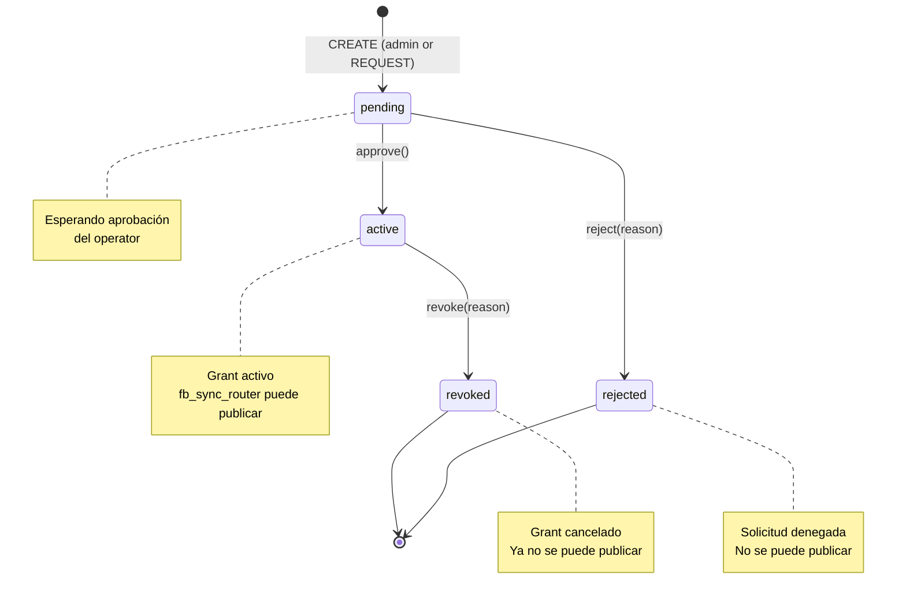

# Marketplace Access Authorization

**Status**: IMPLEMENTED (merged 2026-08-15)
**Created**: 2026-08-14
**Owner**: Backend Team + Frontend Team
**Priority**: High (Critical for multi-dealer inventory)

---

## Executive Summary

Sistema de autorización cross-organization que permite a ProSell (operator) publicar inventario de dealers externos (inventory owners) con grants explícitos, auditables y reversibles.

**Impacto**:

- ✅ ProSell puede administrar inventario de múltiples dealers SIN que tengan usuarios propios
- ✅ Grants con lifecycle completo: pending → active/rejected, active → revoked
- ✅ Audit trail completo (requested_by, approved_by, rejected_by, revoked_by con timestamps)
- ✅ fb_sync_router integrado - solo publica productos con grants activos

**Casos de uso**:

1. **Admin UI**: ProSell admin crea grants directamente (dealers sin usuarios)
2. **REQUEST flow**: Dealer con usuario solicita acceso (futuro, cuando dealers tengan usuarios)

---

## Context & Problem

### Problem Statement

ProSell necesita publicar inventario de múltiples dealers en Facebook Marketplace, pero:

- Dealers NO tienen usuarios propios (ProSell administra todo)
- Sin autorización explícita, no hay control sobre qué inventario se puede publicar
- Sin audit trail, no hay rastreabilidad de decisiones de acceso

### User Request

> "Necesito que ProSell pueda crear grants de marketplace access directamente para dealers que no tienen usuarios. Debe haber un UI admin para gestionar esto, con estados pending/active y capacidad de revocar."

### Business Value

- **Multi-tenant seguro**: Cada dealer mantiene ownership de su inventario
- **Compliance**: Audit trail completo para auditorías
- **Escalabilidad**: Soporta N dealers sin complejidad administrativa
- **Flexibilidad**: Admin UI para dealers sin usuarios + REQUEST flow para dealers con usuarios

---

## Architecture (Clean Architecture)

### Domain Layer (`domain/organization/`)

**Aggregate Root**: `MarketplaceAccessGrant`

```python
class MarketplaceAccessGrant:
    """
    Representa un grant de acceso cross-org para publicar inventario.

    Lifecycle:
    - pending → approve() → active
    - pending → reject() → rejected
    - active → revoke() → revoked
    """

    # Identity
    id: UUID
    inventory_owner_organization_id: UUID  # Dueño del inventario
    operator_organization_id: UUID         # Quien publica (ProSell)

    # Permissions
    can_publish_marketplace: bool          # Puede publicar en FB Marketplace
    can_manage_inventory: bool             # Puede crear/editar/eliminar productos

    # Lifecycle
    status: str  # "pending" | "active" | "rejected" | "revoked"
    requested_at: datetime
    requested_by_user_id: UUID | None
    approved_at: datetime | None
    approved_by_user_id: UUID | None
    rejected_at: datetime | None
    rejected_by_user_id: UUID | None
    revoked_at: datetime | None
    revoked_by_user_id: UUID | None
    rejection_reason: str | None
    revocation_reason: str | None

    # Domain Methods
    def approve(self, approver_id: UUID) -> None
    def reject(self, rejecter_id: UUID, reason: str) -> None
    def revoke(self, revoker_id: UUID, reason: str) -> None
```

**Repository Interface**: `IMarketplaceAccessRepository`

```python
class IMarketplaceAccessRepository(ABC):
    async def save(self, grant: MarketplaceAccessGrant) -> None
    async def find_by_id(self, grant_id: UUID) -> MarketplaceAccessGrant | None
    async def find_by_organizations(
        self, inventory_owner_id: UUID, operator_id: UUID
    ) -> MarketplaceAccessGrant | None
    async def list_all(self) -> list[MarketplaceAccessGrant]
```

### Application Layer (`application/use_cases/organization/`)

**Use Cases**:

1. **RequestMarketplaceAccess** - Inventory owner solicita acceso (futuro)
2. **CreateMarketplaceAccessAsAdmin** - Admin crea grant directamente (actual)
3. **ApproveMarketplaceAccess** - Operator aprueba solicitud
4. **RejectMarketplaceAccess** - Operator rechaza solicitud
5. **RevokeMarketplaceAccess** - Operator revoca grant activo

**DTOs**:

```python
# application/dto/marketplace_access.py
class CreateAccessAsAdminRequest(BaseModel):
    inventory_owner_organization_id: UUID
    operator_organization_id: UUID
    can_publish_marketplace: bool = True
    can_manage_inventory: bool = False
    initial_status: str = "pending"  # "pending" | "active"

class AccessGrantResponse(BaseModel):
    id: UUID
    inventory_owner_organization_id: UUID
    operator_organization_id: UUID
    can_publish_marketplace: bool
    can_manage_inventory: bool
    status: str
    requested_at: datetime
    # ... otros campos de audit trail
```

### Infrastructure Layer (`infrastructure/`)

**SQLAlchemy Model**: `OrganizationMarketplaceAccessModel`

```python
class OrganizationMarketplaceAccessModel(Base):
    __tablename__ = "organization_marketplace_access"

    id = Column(UUID(as_uuid=True), primary_key=True)
    inventory_owner_organization_id = Column(UUID(as_uuid=True), ForeignKey("organizations.id"))
    operator_organization_id = Column(UUID(as_uuid=True), ForeignKey("organizations.id"))
    can_publish_marketplace = Column(Boolean, default=True)
    can_manage_inventory = Column(Boolean, default=False)
    status = Column(String(20), default="pending")

    # Lifecycle audit fields
    requested_at = Column(DateTime(timezone=True))
    requested_by_user_id = Column(UUID(as_uuid=True), nullable=True)
    approved_at = Column(DateTime(timezone=True), nullable=True)
    approved_by_user_id = Column(UUID(as_uuid=True), nullable=True)
    rejected_at = Column(DateTime(timezone=True), nullable=True)
    rejected_by_user_id = Column(UUID(as_uuid=True), nullable=True)
    revoked_at = Column(DateTime(timezone=True), nullable=True)
    revoked_by_user_id = Column(UUID(as_uuid=True), nullable=True)
    rejection_reason = Column(Text, nullable=True)
    revocation_reason = Column(Text, nullable=True)
```

**Repository Implementation**: `SQLAlchemyMarketplaceAccessRepository`

**FastAPI Router**: `marketplace_access_router.py`

---

## State Diagram



**Invariantes**:

- Un grant NO puede pasar de `rejected` o `revoked` a `active` (inmutable)
- Solo grants con `status=active` AND `can_publish_marketplace=true` habilitan publicación
- Audit trail SIEMPRE debe tener timestamp + user_id para cada transición

---

## API Endpoints

**Base URL**: `/api/v1/marketplace-access`

### 1. Create Access as Admin

```http
POST /create-as-admin
Authorization: Bearer <admin_token>

Request:
{
  "inventory_owner_organization_id": "uuid",
  "operator_organization_id": "uuid",
  "can_publish_marketplace": true,
  "can_manage_inventory": false,
  "initial_status": "pending"  // "pending" | "active"
}

Response: 201 Created
{
  "id": "uuid",
  "status": "pending",
  "requested_at": "2026-08-15T10:00:00Z",
  "requested_by_user_id": "admin_user_id",
  ...
}
```

**Validación**:

- User debe ser admin de ProSell
- No puede haber grant duplicado (mismo inventory_owner + operator)
- Si `initial_status=active`, auto-aprueba el grant

### 2. Request Access (futuro)

```http
POST /request
Authorization: Bearer <inventory_owner_token>

Request:
{
  "operator_organization_id": "uuid",
  "can_publish_marketplace": true,
  "can_manage_inventory": false
}

Response: 201 Created
```

**Validación**:

- User debe pertenecer a inventory_owner organization
- Grant se crea con `status=pending`

### 3. Approve Access

```http
POST /{grant_id}/approve
Authorization: Bearer <operator_admin_token>

Response: 200 OK
{
  "id": "uuid",
  "status": "active",
  "approved_at": "2026-08-15T10:05:00Z",
  "approved_by_user_id": "operator_admin_id",
  ...
}
```

**Validación**:

- Grant debe estar en `status=pending`
- User debe ser admin del operator organization

### 4. Reject Access

```http
POST /{grant_id}/reject
Authorization: Bearer <operator_admin_token>

Request:
{
  "reason": "No cumple con políticas de calidad de datos"
}

Response: 200 OK
```

### 5. Revoke Access

```http
POST /{grant_id}/revoke
Authorization: Bearer <operator_admin_token>

Request:
{
  "reason": "Violación de términos de servicio"
}

Response: 200 OK
```

### 6. List Grants

```http
GET /
Authorization: Bearer <token>

Response: 200 OK
[
  {
    "id": "uuid",
    "status": "active",
    "inventory_owner_organization": {
      "id": "uuid",
      "name": "OXCars Dealer"
    },
    "operator_organization": {
      "id": "uuid",
      "name": "ProSell Main Org"
    },
    ...
  }
]
```

---

## Frontend Components

### 1. CreateMarketplaceAccessDialog

**Ubicación**: `apps/web/src/components/admin/CreateMarketplaceAccessDialog.tsx`

**Features**:

- Form con local state (NO react-hook-form)
- Select de organizaciones (filtra operator actual)
- Checkboxes: can_publish_marketplace, can_manage_inventory
- Select: initial_status ("pending" | "active")
- Validación manual: inventory_owner requerido

**Hook**: `useCreateMarketplaceAccessAsAdmin()`

```tsx
const createMutation = useCreateMarketplaceAccessAsAdmin();

await createMutation.mutateAsync({
  inventory_owner_organization_id: inventoryOwnerId,
  operator_organization_id: operatorOrganizationId,
  can_publish_marketplace: canPublish,
  can_manage_inventory: canManage,
  initial_status: initialStatus,
});
```

### 2. MarketplaceAccessManager

**Ubicación**: `apps/web/src/components/admin/MarketplaceAccessManager.tsx`

**Features**:

- Tabs de status: Pending, Active, Rejected, Revoked
- Búsqueda por nombre de organización
- Cards layout con audit trail visible
- Acciones contextuales: Approve, Reject (pending), Revoke (active)
- Loading skeletons + empty states

**Integración**:

- Detecta ProSell org automáticamente
- Botón "Create Access" en header
- Auto-refresh después de acciones

**Route**: `/admin/organizations/marketplace-access`

---

## Integration con fb_sync_router

**Ubicación**: `apps/api/src/prosell/infrastructure/api/routers/fb_sync_router.py`

### Product Eligibility Check

```python
async def get_products_for_fb_sync(
    db: AsyncSession,
    organization_id: UUID,
    filters: FBSyncFilters,
) -> list[Product]:
    """
    Retorna productos elegibles para publicar en FB Marketplace.

    Reglas:
    1. Productos del operator organization (ProSell)
    2. O productos con grant activo:
       - organization_marketplace_access.status = 'active'
       - can_publish_marketplace = true
       - inventory_owner_organization_id = product.organization_id
    """

    query = (
        select(ProductModel)
        .join(...)
        .outerjoin(
            OrganizationMarketplaceAccessModel,
            and_(
                OrganizationMarketplaceAccessModel.inventory_owner_organization_id == ProductModel.organization_id,
                OrganizationMarketplaceAccessModel.operator_organization_id == organization_id,
                OrganizationMarketplaceAccessModel.status == "active",
                OrganizationMarketplaceAccessModel.can_publish_marketplace == True,
            )
        )
        .where(
            or_(
                ProductModel.organization_id == organization_id,  # ProSell's own products
                OrganizationMarketplaceAccessModel.id.isnot(None),  # Or products with active grant
            )
        )
    )

    result = await db.execute(query)
    return result.scalars().all()
```

**Reglas de elegibilidad**:

1. Producto pertenece al operator (ProSell) → SIEMPRE elegible
2. Producto de dealer externo:
   - DEBE tener grant con `status=active`
   - Grant DEBE tener `can_publish_marketplace=true`
   - Grant conecta `inventory_owner_organization_id` (dealer) con `operator_organization_id` (ProSell)

---

## Testing Strategy

### Unit Tests

**Domain Layer** (`tests/unit/domain/organization/`):

- `test_marketplace_access_grant.py`:
  - ✅ approve() cambia status a "active" y setea approved_at/approved_by_user_id
  - ✅ reject() cambia status a "rejected" y requiere reason
  - ✅ revoke() solo funciona si status="active"
  - ✅ Invariantes: rejected/revoked no pueden volver a active

**Application Layer** (`tests/unit/use_cases/`):

- `test_create_marketplace_access_as_admin.py`:
  - ✅ Crea grant con initial_status="pending"
  - ✅ Crea grant con initial_status="active" (auto-aprueba)
  - ✅ Valida duplicados (mismo inventory_owner + operator)
  - ✅ Requiere permisos de admin

### Integration Tests

**API Endpoints** (`tests/integration/api/routers/`):

- `test_marketplace_access_router.py`:
  - ✅ POST /create-as-admin crea grant pending
  - ✅ POST /create-as-admin con initial_status="active" auto-aprueba
  - ✅ POST /{id}/approve cambia status a active
  - ✅ POST /{id}/reject rechaza con reason
  - ✅ POST /{id}/revoke cancela grant activo
  - ✅ GET / lista todos los grants

**fb_sync_router Integration** (`tests/integration/api/routers/`):

- `test_fb_sync_router.py`:
  - ✅ Solo muestra productos con grants activos
  - ✅ No muestra productos con grants pending/rejected/revoked
  - ✅ Verifica can_publish_marketplace=true

### E2E Tests (Manual)

**Staging Environment**:

1. Acceder `/admin/organizations/marketplace-access`
2. Crear grant PENDING para OXCars
3. Aprobar grant → verificar aparece en tab "Active"
4. Crear grant ACTIVE directo para Don José
5. Revocar grant → verificar audit trail completo

---

## Admin UI Flow vs REQUEST Flow

### Admin UI Flow (Actual)

**Caso de uso**: Dealers SIN usuarios propios

```
1. ProSell admin accede /admin/organizations/marketplace-access
2. Click "Create Access"
3. Selecciona:
   - Inventory Owner: OXCars Dealer
   - Initial Status: "active" (o "pending")
   - Permissions: can_publish_marketplace=true
4. Submit
5. Si initial_status="active" → grant activo inmediatamente
   Si initial_status="pending" → requiere approve manual
```

**Ventajas**:

- ProSell controla todo el flujo
- No requiere dealers con usuarios
- Rápido para onboarding

**Desventajas**:

- Manual (admin debe crear cada grant)
- No self-service para dealers

### REQUEST Flow (Futuro)

**Caso de uso**: Dealers CON usuarios propios

```
1. Dealer admin accede /settings/marketplace-access
2. Click "Request Access to ProSell"
3. Selecciona permisos deseados
4. Submit → grant creado con status="pending"
5. ProSell admin recibe notificación
6. ProSell admin aprueba/rechaza desde UI
```

**Ventajas**:

- Self-service para dealers
- Escalable (N dealers sin overhead de ProSell)
- Audit trail completo (requested_by visible)

**Desventajas**:

- Requiere dealers con usuarios y auth configurado
- Más complejo (notificaciones, aprobaciones)

**Migración**:

- Cuando dealer obtenga usuario, grants existentes PERMANECEN válidos
- Dealer puede solicitar NUEVOS grants vía REQUEST flow
- Ambos flows coexisten (admin UI para dealers legacy, REQUEST para dealers nuevos)

---

## Files Modified

### Backend (Python)

**Domain**:

- `apps/api/src/prosell/domain/organization/marketplace_access_grant.py` - Aggregate root
- `apps/api/src/prosell/domain/organization/repositories.py` - IMarketplaceAccessRepository

**Application**:

- `apps/api/src/prosell/application/use_cases/organization/create_marketplace_access_as_admin.py` - NEW
- `apps/api/src/prosell/application/use_cases/organization/approve_marketplace_access.py`
- `apps/api/src/prosell/application/use_cases/organization/reject_marketplace_access.py`
- `apps/api/src/prosell/application/use_cases/organization/revoke_marketplace_access.py`
- `apps/api/src/prosell/application/dto/marketplace_access.py` - DTOs

**Infrastructure**:

- `apps/api/src/prosell/infrastructure/persistence/models/organization_marketplace_access.py` - SQLAlchemy model
- `apps/api/src/prosell/infrastructure/persistence/repositories/marketplace_access_repository.py` - Implementation
- `apps/api/src/prosell/infrastructure/api/routers/marketplace_access_router.py` - FastAPI endpoints
- `apps/api/src/prosell/infrastructure/api/routers/fb_sync_router.py` - Integration con grants

**Migrations**:

- `apps/api/alembic/versions/20260814_0001_add_marketplace_access_lifecycle.py`

**Tests**:

- `apps/api/tests/unit/domain/organization/test_marketplace_access_grant.py`
- `apps/api/tests/unit/use_cases/test_create_marketplace_access_as_admin.py`
- `apps/api/tests/integration/api/routers/test_marketplace_access_router.py`
- `apps/api/tests/integration/api/routers/test_fb_sync_router.py`

### Frontend (TypeScript/React)

**Schemas**:

- `apps/web/src/lib/api/schemas/marketplace-access.ts` - Zod schemas

**Hooks**:

- `apps/web/src/lib/api/marketplace-access.ts` - TanStack Query hooks

**Components**:

- `apps/web/src/components/admin/CreateMarketplaceAccessDialog.tsx` - NEW
- `apps/web/src/components/admin/MarketplaceAccessManager.tsx` - Updated (add Create button)

**Routes**:

- `apps/web/src/app/(admin)/admin/organizations/marketplace-access/page.tsx` - Admin route

---

## Next Steps

### Immediate (Post-Implementation)

- [x] Backend use case + endpoint deployed
- [x] Frontend dialog + integration deployed
- [ ] Manual testing en staging (Task #3)
- [x] Documentation completa (este spec)

### Short-term (When Dealers Get Users)

1. **REQUEST Flow Implementation**:
   - Frontend: Dealer dashboard con "Request Access" button
   - Backend: `RequestMarketplaceAccess` use case
   - Notifications: Email/in-app cuando hay nuevas solicitudes

2. **Notifications System**:
   - Dealer solicita → ProSell admin recibe notificación
   - Grant aprobado → Dealer recibe notificación
   - Grant revocado → Dealer recibe notificación

3. **Dealer Self-Service**:
   - `/settings/marketplace-access` - Ver grants propios
   - Request nuevos grants
   - Ver audit trail de grants

### Long-term (Advanced Features)

1. **Granular Permissions**:
   - `can_publish_to_facebook`, `can_publish_to_instagram`, etc.
   - Permissions por categoria de producto
   - Time-bounded grants (expiran después de N días)

2. **Bulk Operations**:
   - Approve/reject múltiples grants
   - Bulk revoke para dealers que incumplen

3. **Analytics**:
   - Dashboard de grants por status
   - Métricas: tiempo de aprobación, tasa de rechazo
   - Alertas: grants cerca de expirar

---

## Learnings & Gotchas

### 1. tenant_id == organization_id

En ProSell SaaS, `tenant_id` y `organization_id` son **self-referential**. El `tenant_id` de una organización ES su propio `organization_id`.

**Error común**: Intentar acceder `current_user.organization_id` (no existe).
**Correcto**: Usar `current_user.tenant_id`.

### 2. Parameter Naming: approver_id

El método `approve()` del aggregate usa `approver_id`, NO `approved_by_user_id`.

```python
# ❌ INCORRECTO
grant.approve(approved_by_user_id=user_id)

# ✅ CORRECTO
grant.approve(approver_id=user_id)
```

### 3. Form Implementation: Local State vs react-hook-form

Para formularios simples (3-5 campos), usar **local state** es más ligero que react-hook-form.

**CreateMarketplaceAccessDialog** usa local state:

- Sin dependencias extra
- Validación manual simple
- Menos overhead de re-renders

**Cuándo usar react-hook-form**:

- Forms complejos (10+ campos)
- Validación con Zod schema elaborado
- Multi-step wizards

### 4. Initial Status: pending vs active

`initial_status` permite crear grants **directamente activos** (bypass approval).

**Uso**:

- `pending`: Para dealers con usuarios (REQUEST flow) - requiere aprobación manual
- `active`: Para dealers sin usuarios (admin UI) - ProSell confía en sí mismo

**Implementación**: Si `initial_status="active"`, use case auto-llama `grant.approve()`.

---

## References

- CLAUDE.md - Clean Architecture patterns
- `docs/01_ARQUITECTURA_PROSELL_SAAS_V2.md` - System architecture
- `apps/api/src/prosell/domain/organization/marketplace_access_grant.py` - Aggregate implementation
- `apps/web/src/components/admin/MarketplaceAccessManager.tsx` - UI implementation
